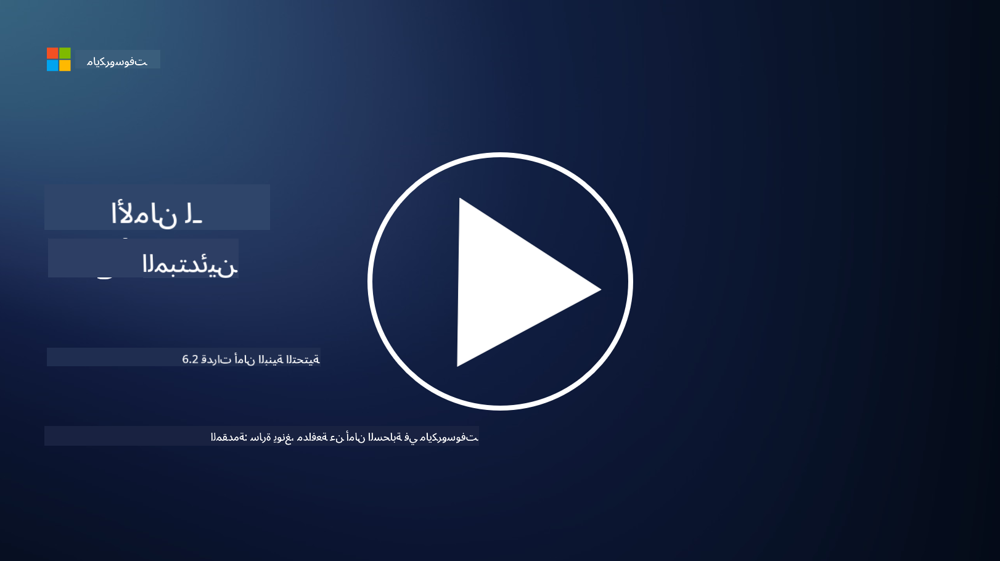

<!--
CO_OP_TRANSLATOR_METADATA:
{
  "original_hash": "7d79ba0e7668b3bdae1fba7aa047f6c0",
  "translation_date": "2025-09-03T20:50:13+00:00",
  "source_file": "6.2 Infrastructure security capabilities.md",
  "language_code": "ar"
}
-->
# قدرات أمان البنية التحتية

في هذا القسم، سنغطي المزيد من التفاصيل حول الأدوات والقدرات الأساسية المستخدمة في أمان البنية التحتية.

**المقدمة**

في هذه الدرس، سنغطي:

- ما هو إدارة الثغرات الأمنية؟

- ما هو CSPM؟

- ما هو CNAPP؟

## ما هو إدارة الثغرات الأمنية؟

إدارة الثغرات الأمنية هي عملية منهجية لتحديد وتقييم وترتيب الأولويات وتخفيف ومراقبة الثغرات الأمنية في أنظمة الكمبيوتر والبرمجيات والشبكات والبنية التحتية. الهدف الرئيسي من إدارة الثغرات الأمنية هو تقليل تعرض المؤسسة للمخاطر الأمنية من خلال معالجة الثغرات المعروفة بشكل استباقي قبل أن يتم استغلالها من قبل الجهات الخبيثة. إليك نظرة عامة على الخطوات الرئيسية المتضمنة:

التحديد: فحص واكتشاف الثغرات الأمنية في أصول المؤسسة، والتي يمكن أن تشمل الخوادم والتطبيقات وأجهزة الشبكة ونقاط النهاية.

التقييم: تقييم شدة وتأثير كل ثغرة بناءً على عوامل مثل درجة نظام تسجيل الثغرات الأمنية الشائعة (CVSS) وسياق العمل.

ترتيب الأولويات: تصنيف الثغرات بناءً على مستوى المخاطر والتأثير المحتمل على عمليات المؤسسة وبياناتها.

التخفيف: تطوير وتنفيذ استراتيجيات لمعالجة أو تخفيف الثغرات، والتي يمكن أن تشمل تطبيق التصحيحات، تكوين إعدادات الأمان، أو نشر ضوابط تعويضية.

التحقق: التأكد من أن إجراءات التخفيف كانت فعالة في معالجة الثغرات.

المراقبة المستمرة: تتبع مستمر للثغرات والتهديدات المحتملة، مع عمليات فحص وتقييم منتظمة للثغرات.

إدارة الثغرات الأمنية هي عنصر أساسي في الأمن السيبراني، حيث تساعد المؤسسات على الحفاظ على وضع أمني قوي وتقليل احتمالية حدوث اختراقات أمنية. أمثلة على أدوات إدارة الثغرات الأمنية تشمل Defender for Cloud و Nessus و Qualys.

## ما هو CSPM؟

إدارة وضع أمان السحابة (CSPM) هي مجموعة من الأدوات والعمليات والممارسات المصممة لتقييم ومراقبة وفرض تكوينات الأمان وأفضل الممارسات في البيئات السحابية. تساعد حلول CSPM المؤسسات على تحديد ومعالجة الأخطاء في التكوينات والفجوات الأمنية وانتهاكات الامتثال في بنيتها التحتية السحابية، مثل Amazon Web Services (AWS) و Microsoft Azure و Google Cloud Platform (GCP) ومزودي السحابة الآخرين.

الجوانب الرئيسية لـ CSPM تشمل:

- تقييم التكوين: فحص الموارد والخدمات السحابية لتحديد الأخطاء في التكوينات والإعدادات غير الآمنة والانحرافات عن أفضل ممارسات الأمان.

- فرض سياسات الأمان: فرض سياسات الأمان ومعايير الامتثال عبر البيئات السحابية من خلال معالجة الأخطاء تلقائيًا أو إنشاء تنبيهات.

- المراقبة المستمرة: توفير رؤية مستمرة لوضع أمان الأصول والموارد السحابية، مع تنبيهات في الوقت الفعلي للحوادث الأمنية.

- تقارير الامتثال: إنشاء تقارير ولوحات معلومات لإظهار الامتثال للمتطلبات التنظيمية والمعايير الصناعية.

يساعد CSPM المؤسسات على ضمان أن بنيتها التحتية السحابية آمنة ومتوافقة ومتماشية مع أفضل الممارسات، مما يقلل من مخاطر الحوادث الأمنية المتعلقة بالسحابة. أمثلة على أدوات CSPM تشمل Defender for Cloud و Snyk.

## ما هو CNAPP؟

CNAPP هو اختصار لمنصة حماية التطبيقات السحابية الأصلية. إنها منصة برمجية شاملة تسهل مراقبة واكتشاف والتعامل مع التهديدات الأمنية والثغرات المحتملة في السحابة. تجمع CNAPP بين أدوات وقدرات متعددة في حل برمجي واحد لتقليل التعقيد وتسهيل عمليات فرق DevOps و DevSecOps. تقدم CNAPP أمانًا شاملاً للسحابة والتطبيقات عبر دورة حياة تطبيق CI/CD بالكامل، من التطوير إلى الإنتاج. تلبي الحاجة الصناعية لأدوات حديثة لمراقبة أمان السحابة وإدارة الوضع ومنع الاختراق والتحكم. توفر حلول CNAPP للفرق الأمنية القدرة على قياس المخاطر والاستجابة لها في البيئة السحابية. بعض ميزات CNAPP تشمل الرؤية المحسنة، قياس المخاطر، تطوير البرمجيات الآمن، وحل أمني سحابي موحد. تجمع CNAPP بين أدوات أمان السحابة التي كانت تقليديًا منفصلة في واجهة مستخدم واحدة، مما يسهل على المؤسسات حماية جميع تطبيقاتها السحابية. تجمع CNAPP بين أدوات أمان السحابة الأصلية ومصادر البيانات، بما في ذلك فحص الحاويات، إدارة وضع أمان السحابة، فحص البنية التحتية ككود، إدارة صلاحيات البنية التحتية السحابية، ومنصات حماية عبء العمل السحابي أثناء التشغيل.

## قراءة إضافية
- [What is CSPM? | Microsoft Security](https://www.microsoft.com/security/business/security-101/what-is-cspm?WT.mc_id=academic-96948-sayoung)
- [What is Cloud Security Posture Management (CSPM)? | HackerOne](https://www.hackerone.com/knowledge-center/what-cloud-security-posture-management)
- [Function of cloud security posture management - Cloud Adoption Framework | Microsoft Learn](https://learn.microsoft.com/azure/cloud-adoption-framework/organize/cloud-security-posture-management?WT.mc_id=academic-96948-sayoung)
- [What Is a CNAPP? | Microsoft Security](https://www.microsoft.com/security/business/security-101/what-is-cnapp?WT.mc_id=academic-96948-sayoung)
- [Why Everyone Is Talking About CNAPP (forbes.com)](https://www.forbes.com/sites/forbestechcouncil/2021/12/10/why-everyone-is-talking-about-cnapp/?sh=567275ca1549)
- [Improving Your Multi-Cloud Security with a Cloud-Native Application Protection Platform (CNAPP)](https://www.youtube.com/watch?v=5w42kQ_QjZg&t=212s)

---

**إخلاء المسؤولية**:  
تم ترجمة هذا المستند باستخدام خدمة الترجمة بالذكاء الاصطناعي [Co-op Translator](https://github.com/Azure/co-op-translator). بينما نسعى لتحقيق الدقة، يرجى العلم أن الترجمات الآلية قد تحتوي على أخطاء أو معلومات غير دقيقة. يجب اعتبار المستند الأصلي بلغته الأصلية المصدر الموثوق. للحصول على معلومات حاسمة، يُوصى بالاستعانة بترجمة بشرية احترافية. نحن غير مسؤولين عن أي سوء فهم أو تفسيرات خاطئة تنشأ عن استخدام هذه الترجمة.