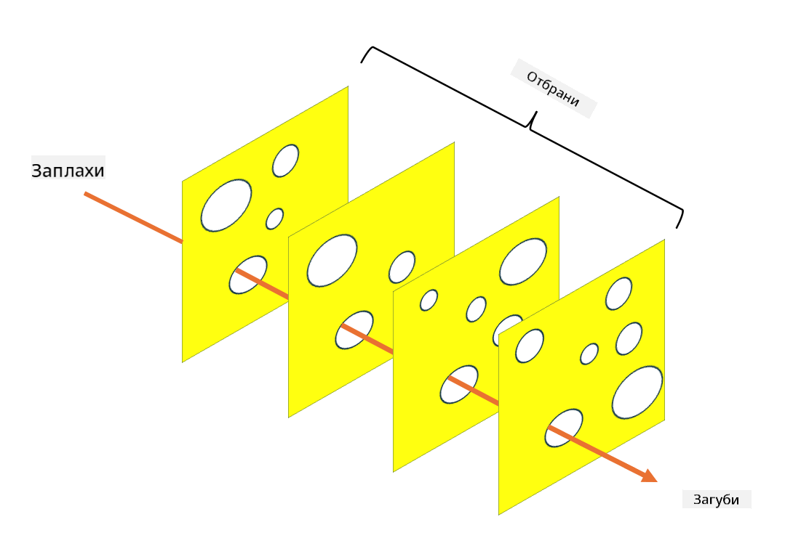

<!--
CO_OP_TRANSLATOR_METADATA:
{
  "original_hash": "75f77f972d2233c584f87c1eb96c983b",
  "translation_date": "2025-09-03T20:30:21+00:00",
  "source_file": "1.5 Zero trust.md",
  "language_code": "bg"
}
-->
# Zero Trust

„Zero trust“ е термин, който напоследък често се използва в сферата на киберсигурността. Но какво означава той? Дали е просто модна дума? В този урок ще разгледаме подробно какво представлява концепцията за zero trust.

## Въведение

 - В този урок ще разгледаме:
   
   
 - Какво е zero trust?

   
  

 - Как zero trust се различава от традиционните архитектури за сигурност?

   
   

 - Какво е защита в дълбочина?

## Zero Trust

Zero Trust е подход към киберсигурността, който оспорва традиционното разбиране „доверявай се, но проверявай“, като приема, че никой обект, независимо дали е вътре или извън мрежата на организацията, не трябва да бъде автоматично доверен. Вместо това, Zero Trust изисква проверка на всеки потребител, устройство и приложение, които се опитват да получат достъп до ресурси, независимо от тяхното местоположение. Основният принцип на Zero Trust е да минимизира „атакуемата повърхност“ и да намали потенциалното въздействие на пробиви в сигурността.

В модела Zero Trust се акцентира върху следните принципи:

1. **Проверка на идентичността**: Автентикацията и авторизацията се прилагат строго за всички потребители и устройства, независимо от тяхното местоположение. Идентичността не е задължително човешка – тя може да бъде устройство, приложение и др.

2. **Минимални привилегии**: На потребителите и устройствата се предоставя минималното ниво на достъп, необходимо за изпълнение на техните задачи, което намалява потенциалните щети при компрометиране.

3. **Микросегментация**: Ресурсите в мрежата се разделят на по-малки сегменти, за да се ограничи страничното движение в случай на пробив.

4. **Непрекъснато наблюдение**: Провежда се постоянно наблюдение и анализ на поведението на потребителите и устройствата, за да се откриват аномалии и потенциални заплахи. Съвременните техники за наблюдение използват машинно обучение, изкуствен интелект и информация за заплахи, за да предоставят допълнителни детайли и контекст.

5. **Шифроване на данни**: Данните се шифроват както при пренос, така и при съхранение, за да се предотврати неоторизиран достъп.

6. **Строг контрол на достъпа**: Контролът на достъпа се прилага въз основа на контекст, като роли на потребителите, здравословно състояние на устройствата и местоположение в мрежата.

Microsoft разделя Zero Trust на пет основни стълба, които ще разгледаме в следващ урок.

## Разлики с традиционните архитектури за сигурност

Zero Trust се различава от традиционните архитектури за сигурност, като например модели, базирани на периметър, по няколко начина:

1. **Периметър срещу идентичност**: Традиционните модели се фокусират върху защитата на периметъра на мрежата и приемат, че вътрешните потребители и устройства могат да бъдат доверени, след като са вътре. Zero Trust, от друга страна, приема, че заплахите могат да произхождат както отвътре, така и отвън, и прилага строги контроли, базирани на идентичност.

2. **Имплицитно срещу експлицитно доверие**: Традиционните модели имплицитно се доверяват на устройства и потребители в мрежата, докато не се докаже обратното. Zero Trust експлицитно проверява идентичностите и непрекъснато наблюдава за аномалии.

3. **Плоска срещу сегментирана мрежа**: Традиционните архитектури често включват плоски мрежи, където вътрешните потребители имат широк достъп. Zero Trust препоръчва сегментиране на мрежата на по-малки, изолирани зони, за да се ограничат потенциалните пробиви.

4. **Реактивен срещу проактивен подход**: Традиционната сигурност често разчита на реактивни мерки като защитни стени и системи за откриване на прониквания. Zero Trust възприема проактивен подход, като приема, че пробивите са вероятни и минимизира тяхното въздействие.

## Защита в дълбочина

Защитата в дълбочина, известна още като многослойна сигурност, е стратегия за киберсигурност, която включва внедряване на множество слоеве от мерки за защита, за да се защитят активите на организацията. Целта е да се създадат припокриващи се слоеве на защита, така че ако един слой бъде пробит, други да продължат да осигуряват защита. Всеки слой се фокусира върху различен аспект на сигурността и увеличава общата сигурност на организацията.

Защитата в дълбочина включва комбинация от технически, процедурни и физически мерки за сигурност. Те могат да включват защитни стени, системи за откриване на прониквания, контроли за достъп, шифроване, обучение на потребителите, политики за сигурност и други. Идеята е да се създадат множество бариери, които колективно затрудняват проникването в системите и мрежите на организацията. Това понякога се нарича и „модел на швейцарско сирене“, който се използва и в предотвратяването на инциденти в други индустрии (например транспорт).

## Допълнителна литература

[Какво е Zero Trust?](https://learn.microsoft.com/security/zero-trust/zero-trust-overview?WT.mc_id=academic-96948-sayoung)

[Еволюция на Zero Trust – позиционен документ на Microsoft](https://query.prod.cms.rt.microsoft.com/cms/api/am/binary/RWJJdT?WT.mc_id=academic-96948-sayoung)

[Zero Trust и BeyondCorp Google Cloud | Google Cloud Blog](https://cloud.google.com/blog/topics/developers-practitioners/zero-trust-and-beyondcorp-google-cloud)

---

**Отказ от отговорност**:  
Този документ е преведен с помощта на AI услуга за превод [Co-op Translator](https://github.com/Azure/co-op-translator). Въпреки че се стремим към точност, моля, имайте предвид, че автоматизираните преводи може да съдържат грешки или неточности. Оригиналният документ на неговия роден език трябва да се счита за авторитетен източник. За критична информация се препоръчва професионален човешки превод. Ние не носим отговорност за каквито и да е недоразумения или погрешни интерпретации, произтичащи от използването на този превод.