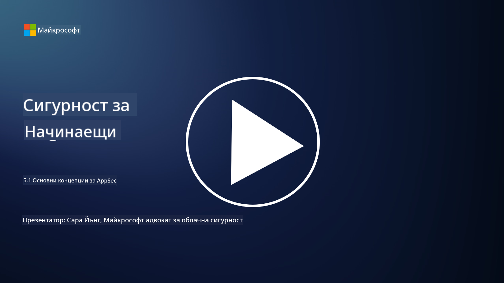

<!--
CO_OP_TRANSLATOR_METADATA:
{
  "original_hash": "e4b56bb23078d3ffb7ad407d280b0c36",
  "translation_date": "2025-09-03T21:08:12+00:00",
  "source_file": "5.1 AppSec key concepts.md",
  "language_code": "bg"
}
-->
# Основни концепции за AppSec

Сигурността на приложенията е специализация в областта на сигурността сама по себе си. В тази част от курса ще разгледаме по-подробно сигурността на приложенията.

## Въведение

В този урок ще разгледаме:

- Какво представлява сигурността на приложенията?

- Какви са основните концепции/принципи на сигурността на приложенията?

## Какво представлява сигурността на приложенията?

Сигурността на приложенията, често съкратено като "AppSec," се отнася до практиката за защита на софтуерните приложения от заплахи, уязвимости и атаки. Тя обхваща процесите, техниките и инструментите, използвани за идентифициране, смекчаване и предотвратяване на рискове за сигурността през целия жизнен цикъл на разработка, внедряване и поддръжка на приложението.

Сигурността на приложенията е критично важна, защото приложенията често са цел на кибератаки. Злонамерени актьори използват уязвимости и слабости в софтуера, за да получат неоторизиран достъп, да откраднат данни, да прекъснат услуги или да извършат други злонамерени дейности. Ефективната сигурност на приложенията помага да се гарантира конфиденциалността, целостта и наличността на приложението и свързаните с него данни.

## Какви са основните концепции/принципи на сигурността на приложенията?

Основните концепции и принципи, които стоят в основата на сигурността на приложенията, включват:

1. **Сигурност чрез дизайн**:

- Сигурността трябва да бъде интегрирана в дизайна и архитектурата на приложението от самото начало, а не добавена впоследствие.

2. **Валидация на входните данни**:

- Всички входни данни от потребителите трябва да бъдат валидирани, за да се гарантира, че отговарят на очакваните формати и са свободни от злонамерен код или данни.

3. **Кодиране на изходните данни**:

- Данните, изпратени към клиента, трябва да бъдат правилно кодирани, за да се предотвратят уязвимости като cross-site scripting (XSS).

4. **Автентикация и авторизация**:

- Автентикирайте потребителите и авторизирайте достъпа им до ресурси въз основа на техните роли и разрешения.

5. **Защита на данните**:

- Чувствителните данни трябва да бъдат криптирани при съхранение, предаване и обработка, за да се предотврати неоторизиран достъп.

6. **Управление на сесии**:

- Сигурното управление на сесии гарантира, че потребителските сесии са защитени от отвличане и неоторизиран достъп.

7. **Сигурни зависимости**:

- Поддържайте всички софтуерни зависимости актуални с последните пачове за сигурност, за да предотвратите уязвимости.

8. **Обработка на грешки и логване**:

- Прилагайте сигурна обработка на грешки, за да избегнете разкриването на чувствителна информация, и осигурете сигурни практики за логване.

9. **Тестване на сигурността**:

- Редовно тествайте приложенията за уязвимости, използвайки методи като пенетрационни тестове, прегледи на кода и автоматизирани инструменти за сканиране.

10. **Сигурен жизнен цикъл на разработка на софтуер (SDLC)**:

- Интегрирайте практики за сигурност във всяка фаза от жизнения цикъл на разработка на софтуера – от изискванията до внедряването и поддръжката.

## Допълнителна литература

- [SheHacksPurple: Какво представлява сигурността на приложенията? - YouTube](https://www.youtube.com/watch?v=eNmccQNzSSY)
- [Какво представлява сигурността на приложенията? - Cisco](https://www.cisco.com/c/en/us/solutions/security/application-first-security/what-is-application-security.html#~how-does-it-work)
- [Какво представлява сигурността на приложенията? Процес и инструменти за защита на софтуера | CSO Online](https://www.csoonline.com/article/566471/what-is-application-security-a-process-and-tools-for-securing-software.html)
- [OWASP Cheat Sheet Series | OWASP Foundation](https://owasp.org/www-project-cheat-sheets/)

---

**Отказ от отговорност**:  
Този документ е преведен с помощта на AI услуга за превод [Co-op Translator](https://github.com/Azure/co-op-translator). Въпреки че се стремим към точност, моля, имайте предвид, че автоматизираните преводи може да съдържат грешки или неточности. Оригиналният документ на неговия роден език трябва да се счита за авторитетен източник. За критична информация се препоръчва професионален човешки превод. Ние не носим отговорност за недоразумения или погрешни интерпретации, произтичащи от използването на този превод.