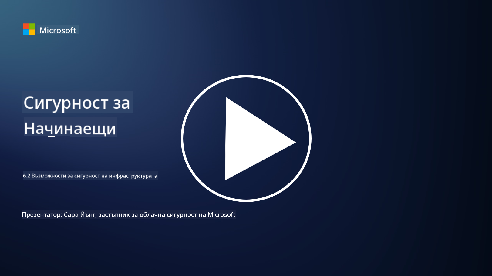

<!--
CO_OP_TRANSLATOR_METADATA:
{
  "original_hash": "7d79ba0e7668b3bdae1fba7aa047f6c0",
  "translation_date": "2025-09-03T20:51:09+00:00",
  "source_file": "6.2 Infrastructure security capabilities.md",
  "language_code": "bg"
}
-->
# Възможности за сигурност на инфраструктурата

В този раздел ще разгледаме по-подробно основните инструменти и възможности, използвани за сигурността на инфраструктурата.

**Въведение**

В този урок ще разгледаме:

- Какво представлява управлението на уязвимости?

- Какво е CSPM?

- Какво е CNAPP?

## Какво представлява управлението на уязвимости?

Управлението на уязвимости е систематичен процес за идентифициране, оценяване, приоритизиране, смекчаване и наблюдение на уязвимости в компютърни системи, софтуер, мрежи и инфраструктура. Основната цел на управлението на уязвимости е да намали излагането на организацията на рискове за сигурността, като проактивно адресира известни уязвимости, преди те да бъдат експлоатирани от злонамерени лица. Ето преглед на основните стъпки:

Идентифициране: Сканиране и откриване на уязвимости в активите на организацията, които могат да включват сървъри, приложения, мрежови устройства и крайни точки.

Оценка: Анализиране на сериозността и потенциалното въздействие на всяка уязвимост въз основа на фактори като оценката по Common Vulnerability Scoring System (CVSS) и бизнес контекста.

Приоритизиране: Класиране на уязвимостите според нивото на риск и потенциалното им въздействие върху операциите и данните на организацията.

Смекчаване: Разработване и прилагане на стратегии за отстраняване или смекчаване на уязвимостите, което може да включва инсталиране на актуализации, конфигуриране на настройки за сигурност или внедряване на компенсиращи мерки.

Потвърждение: Уверяване, че мерките за смекчаване са били ефективни при адресирането на уязвимостите.

Непрекъснато наблюдение: Постоянно проследяване на уязвимости и потенциални заплахи чрез редовни сканирания и оценки.

Управлението на уязвимости е критичен компонент на киберсигурността, който помага на организациите да поддържат силна защита и да намалят вероятността от пробиви в сигурността. Примери за инструменти за управление на уязвимости са Defender for Cloud, Nessus и Qualys.

## Какво е CSPM?

Cloud Security Posture Management (CSPM) представлява набор от инструменти, процеси и практики, предназначени за оценка, наблюдение и прилагане на конфигурации за сигурност и най-добри практики в облачни среди. CSPM решенията помагат на организациите да идентифицират и отстраняват грешни конфигурации, пропуски в сигурността и нарушения на съответствието в тяхната облачна инфраструктура, като например в Amazon Web Services (AWS), Microsoft Azure, Google Cloud Platform (GCP) и други доставчици на облачни услуги.

Основни аспекти на CSPM включват:

- Оценка на конфигурацията: Сканиране на облачни ресурси и услуги за идентифициране на грешни конфигурации, несигурни настройки и отклонения от най-добрите практики за сигурност.

- Прилагане на политики за сигурност: Прилагане на политики за сигурност и стандарти за съответствие в облачни среди чрез автоматично отстраняване на грешни конфигурации или генериране на предупреждения.

- Непрекъснато наблюдение: Осигуряване на постоянна видимост върху състоянието на сигурността на облачните активи и ресурси с предупреждения в реално време за инциденти със сигурността.

- Отчитане на съответствието: Генериране на отчети и табла за демонстриране на съответствие с регулаторни изисквания и индустриални стандарти.

CSPM помага на организациите да гарантират, че тяхната облачна инфраструктура е сигурна, съответстваща и съобразена с най-добрите практики, намалявайки риска от инциденти, свързани с облачната сигурност. Примери за инструменти за CSPM включват Defender for Cloud и Snyk.

## Какво е CNAPP?

CNAPP означава Cloud-Native Application Protection Platform. Това е цялостна облачно-ориентирана софтуерна платформа, която опростява наблюдението, откриването и реакцията на потенциални заплахи и уязвимости в облачната сигурност. Тя комбинира множество инструменти и възможности в едно софтуерно решение, за да минимизира сложността и да улесни операциите на екипите DevOps и DevSecOps. CNAPP предлага цялостна защита на облака и приложенията през целия жизнен цикъл на CI/CD приложенията – от разработката до продукцията. Тя адресира нуждата на индустрията от модерни инструменти за наблюдение на облачната сигурност, управление на състоянието, предотвратяване на пробиви и контрол.

CNAPP решенията предоставят на екипите за сигурност възможността да оценяват и реагират на рискове в облачната среда. Някои от функциите на CNAPP включват подобрена видимост, оценка на рисковете, сигурна разработка на софтуер и комбинирано решение за облачна сигурност. CNAPP интегрира множество решения за облачна сигурност, които традиционно са били разделени, в един потребителски интерфейс, което улеснява организациите да защитят целия си облачен отпечатък.

CNAPP обединява множество инструменти за облачно-ориентирана сигурност и източници на данни, включително сканиране на контейнери, управление на състоянието на облачната сигурност, сканиране на инфраструктура като код, управление на права в облачната инфраструктура и платформи за защита на работните натоварвания в облака.

## Допълнителна литература
- [What is CSPM? | Microsoft Security](https://www.microsoft.com/security/business/security-101/what-is-cspm?WT.mc_id=academic-96948-sayoung)
- [What is Cloud Security Posture Management (CSPM)? | HackerOne](https://www.hackerone.com/knowledge-center/what-cloud-security-posture-management)
- [Function of cloud security posture management - Cloud Adoption Framework | Microsoft Learn](https://learn.microsoft.com/azure/cloud-adoption-framework/organize/cloud-security-posture-management?WT.mc_id=academic-96948-sayoung)
- [What Is a CNAPP? | Microsoft Security](https://www.microsoft.com/security/business/security-101/what-is-cnapp?WT.mc_id=academic-96948-sayoung)
- [Why Everyone Is Talking About CNAPP (forbes.com)](https://www.forbes.com/sites/forbestechcouncil/2021/12/10/why-everyone-is-talking-about-cnapp/?sh=567275ca1549)
- [Improving Your Multi-Cloud Security with a Cloud-Native Application Protection Platform (CNAPP)](https://www.youtube.com/watch?v=5w42kQ_QjZg&t=212s)

---

**Отказ от отговорност**:  
Този документ е преведен с помощта на AI услуга за превод [Co-op Translator](https://github.com/Azure/co-op-translator). Въпреки че се стремим към точност, моля, имайте предвид, че автоматизираните преводи може да съдържат грешки или неточности. Оригиналният документ на неговия роден език трябва да се счита за авторитетен източник. За критична информация се препоръчва професионален човешки превод. Ние не носим отговорност за недоразумения или погрешни интерпретации, произтичащи от използването на този превод.