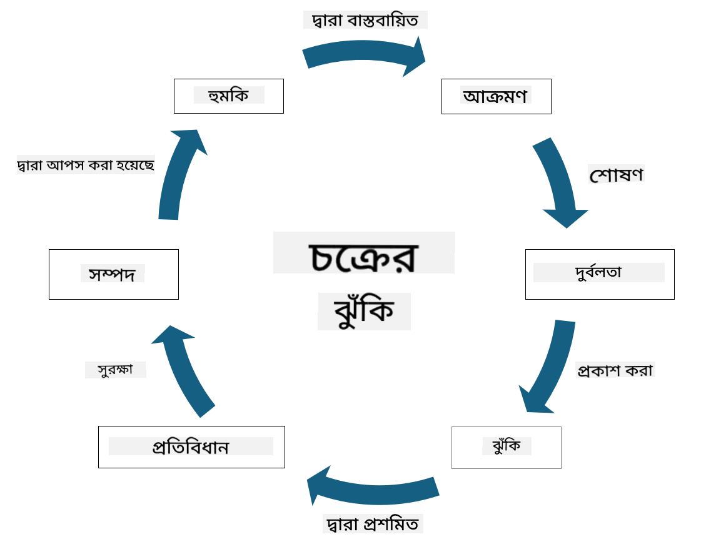

<!--
CO_OP_TRANSLATOR_METADATA:
{
  "original_hash": "fcca304f072cabf206388199e8e2e578",
  "translation_date": "2025-09-03T21:50:46+00:00",
  "source_file": "1.3 Understanding risk management.md",
  "language_code": "bn"
}
-->
# ঝুঁকি ব্যবস্থাপনা বোঝা

## ভূমিকা

এই পাঠে আমরা আলোচনা করব:

- সাধারণত ব্যবহৃত নিরাপত্তা পরিভাষার সংজ্ঞা

- নিরাপত্তা নিয়ন্ত্রণের ধরন

- নিরাপত্তা ঝুঁকি মূল্যায়ন

## সাধারণত ব্যবহৃত নিরাপত্তা পরিভাষার সংজ্ঞা

এই পরিভাষাগুলি সাইবার নিরাপত্তা এবং ঝুঁকি ব্যবস্থাপনার ক্ষেত্রে মৌলিক ধারণা। চলুন প্রতিটি পরিভাষা এবং তাদের পারস্পরিক সম্পর্ক ব্যাখ্যা করি:

1. **থ্রেট এজেন্ট**:

থ্রেট এজেন্ট হলো ব্যক্তি, দল, সংস্থা বা স্বয়ংক্রিয় সিস্টেম যা কোনো সিস্টেম বা নেটওয়ার্কের দুর্বলতাকে কাজে লাগিয়ে ক্ষতি বা ক্ষতিসাধন করতে পারে। থ্রেট এজেন্ট হতে পারে হ্যাকার, ম্যালওয়্যার লেখক, অসন্তুষ্ট কর্মচারী, বা যেকোনো সত্তা যা তথ্য এবং প্রযুক্তি সিস্টেমের জন্য ঝুঁকি সৃষ্টি করে।

2. **থ্রেট**:

থ্রেট হলো সম্ভাব্য ঘটনা বা কর্ম যা কোনো সিস্টেমের দুর্বলতাকে কাজে লাগিয়ে সম্পদের ক্ষতি করতে পারে। থ্রেটের মধ্যে হ্যাকিং, ডেটা লঙ্ঘন, ডিনায়াল-অফ-সার্ভিস আক্রমণ ইত্যাদি অন্তর্ভুক্ত হতে পারে। থ্রেট হলো সেই "কি" যা কোনো সংস্থার সম্পদের উপর সম্ভাব্য ক্ষতি ঘটাতে পারে।

3. **ভালনারেবিলিটি**:

ভালনারেবিলিটি হলো কোনো সিস্টেমের নকশা, বাস্তবায়ন বা কনফিগারেশনে থাকা দুর্বলতা বা ত্রুটি যা থ্রেট এজেন্ট দ্বারা কাজে লাগানো যেতে পারে। সফটওয়্যার, হার্ডওয়্যার, প্রক্রিয়া বা মানব আচরণে ভালনারেবিলিটি থাকতে পারে। সফল আক্রমণের ঝুঁকি কমানোর জন্য ভালনারেবিলিটি চিহ্নিত করা এবং সমাধান করা অত্যন্ত গুরুত্বপূর্ণ।

4. **ঝুঁকি**:

ঝুঁকি হলো ক্ষতি, ক্ষতিসাধন বা ক্ষতির সম্ভাবনা যা থ্রেট এবং ভালনারেবিলিটির মিথস্ক্রিয়ার ফলে ঘটে। এটি সেই সম্ভাবনা যে থ্রেট এজেন্ট কোনো ভালনারেবিলিটিকে কাজে লাগিয়ে নেতিবাচক প্রভাব ফেলবে। ঝুঁকি সাধারণত এর সম্ভাব্য প্রভাব এবং ঘটনার সম্ভাবনার ভিত্তিতে মূল্যায়ন করা হয়।

5. **সম্পদ**:

সম্পদ হলো যেকোনো মূল্যবান জিনিস যা কোনো সংস্থা রক্ষা করতে চায়। সম্পদের মধ্যে থাকতে পারে শারীরিক বস্তু (যেমন কম্পিউটার এবং সার্ভার), ডেটা (গ্রাহকের তথ্য, আর্থিক রেকর্ড), বৌদ্ধিক সম্পত্তি (ট্রেড সিক্রেট, পেটেন্ট), এবং মানব সম্পদ (কর্মচারীদের দক্ষতা এবং জ্ঞান)। সম্পদ রক্ষা করা সাইবার নিরাপত্তার একটি প্রধান লক্ষ্য।

6. **এক্সপোজার**:

এক্সপোজার হলো সম্ভাব্য থ্রেটের প্রতি দুর্বল থাকার অবস্থা। এটি ঘটে যখন কোনো ভালনারেবিলিটি থাকে যা থ্রেট এজেন্ট দ্বারা কাজে লাগানো যেতে পারে। এক্সপোজার সিস্টেম বা নেটওয়ার্কে থাকা ভালনারেবিলিটির কারণে ঝুঁকির বিষয়টি তুলে ধরে।

7. **কন্ট্রোল**:

কন্ট্রোল হলো এমন ব্যবস্থা যা ভালনারেবিলিটি এবং থ্রেটের সাথে সম্পর্কিত ঝুঁকি কমানোর জন্য স্থাপন করা হয়। কন্ট্রোল হতে পারে প্রযুক্তিগত, প্রক্রিয়াগত বা প্রশাসনিক। এগুলি থ্রেট এবং ভালনারেবিলিটির সম্ভাব্য প্রভাব প্রতিরোধ, সনাক্ত বা কমানোর জন্য ডিজাইন করা হয়। উদাহরণস্বরূপ, ফায়ারওয়াল, অ্যাক্সেস কন্ট্রোল, এনক্রিপশন, নিরাপত্তা নীতি এবং কর্মচারীদের প্রশিক্ষণ।

সংক্ষেপে, এই পরিভাষাগুলির সম্পর্ক হলো: থ্রেট এজেন্টরা ভালনারেবিলিটিকে কাজে লাগিয়ে থ্রেট ঘটায়, যা ঝুঁকি সৃষ্টি করে এবং মূল্যবান সম্পদের ক্ষতি করতে পারে। এক্সপোজার ঘটে যখন ভালনারেবিলিটি উপস্থিত থাকে, এবং কন্ট্রোল স্থাপন করা হয় ঝুঁকি কমানোর জন্য, থ্রেটের প্রভাব প্রতিরোধ বা কমানোর মাধ্যমে। এই কাঠামো সাইবার নিরাপত্তা ঝুঁকি ব্যবস্থাপনার ভিত্তি গঠন করে, যা সংস্থাগুলিকে তাদের তথ্য সিস্টেম এবং সম্পদের সম্ভাব্য ঝুঁকি চিহ্নিত, মূল্যায়ন এবং সমাধান করতে সাহায্য করে।

## নিরাপত্তা নিয়ন্ত্রণের ধরন

নিরাপত্তা নিয়ন্ত্রণ হলো এমন ব্যবস্থা বা সুরক্ষা যা বিভিন্ন থ্রেট এবং ভালনারেবিলিটি থেকে তথ্য সিস্টেম এবং সম্পদ রক্ষা করতে স্থাপন করা হয়। এগুলি তাদের লক্ষ্য এবং উদ্দেশ্যের ভিত্তিতে বিভিন্ন শ্রেণিতে বিভক্ত করা যেতে পারে। এখানে কিছু সাধারণ নিরাপত্তা নিয়ন্ত্রণের ধরন রয়েছে:

1. **প্রশাসনিক নিয়ন্ত্রণ**:

এই নিয়ন্ত্রণগুলি নীতি, প্রক্রিয়া এবং নির্দেশিকার সাথে সম্পর্কিত যা সংস্থার নিরাপত্তা অনুশীলন এবং ব্যবহারকারীর আচরণ পরিচালনা করে।

- নিরাপত্তা নীতি এবং প্রক্রিয়া: নথিভুক্ত নির্দেশিকা যা সংস্থার মধ্যে কীভাবে নিরাপত্তা বজায় রাখা হয় তা সংজ্ঞায়িত করে।

- নিরাপত্তা সচেতনতা এবং প্রশিক্ষণ: কর্মচারীদের নিরাপত্তার সেরা অনুশীলন এবং সম্ভাব্য থ্রেট সম্পর্কে শিক্ষিত করার প্রোগ্রাম।

- ঘটনা প্রতিক্রিয়া এবং ব্যবস্থাপনা: নিরাপত্তা ঘটনার প্রতিক্রিয়া এবং প্রশমনের পরিকল্পনা।

2. **প্রযুক্তিগত নিয়ন্ত্রণ**:

প্রযুক্তিগত নিয়ন্ত্রণ প্রযুক্তি ব্যবহার করে নিরাপত্তা ব্যবস্থা কার্যকর করে এবং সিস্টেম ও ডেটা রক্ষা করে। প্রযুক্তিগত নিয়ন্ত্রণের উদাহরণ:

- অ্যাক্সেস নিয়ন্ত্রণ: ব্যবহারকারীদের ভূমিকা এবং অনুমতির ভিত্তিতে সম্পদে প্রবেশ সীমিত করার ব্যবস্থা।

- এনক্রিপশন: ডেটাকে একটি নিরাপদ ফরম্যাটে রূপান্তর করা যাতে অননুমোদিত প্রবেশ প্রতিরোধ করা যায়।

- ফায়ারওয়াল: নেটওয়ার্ক নিরাপত্তা ডিভাইস যা আগত এবং বহির্গামী ট্রাফিক ফিল্টার এবং নিয়ন্ত্রণ করে।

- ইনট্রুশন ডিটেকশন এবং প্রিভেনশন সিস্টেম (IDPS): সন্দেহজনক কার্যকলাপের জন্য নেটওয়ার্ক ট্রাফিক পর্যবেক্ষণ করার সরঞ্জাম।

- অ্যান্টিভাইরাস এবং অ্যান্টি-ম্যালওয়্যার সফটওয়্যার: ক্ষতিকারক সফটওয়্যার সনাক্ত এবং অপসারণ করার প্রোগ্রাম।

- প্রমাণীকরণ পদ্ধতি: ব্যবহারকারীদের পরিচয় যাচাই করার পদ্ধতি, যেমন পাসওয়ার্ড, বায়োমেট্রিক্স এবং মাল্টি-ফ্যাক্টর প্রমাণীকরণ।

- প্যাচ ব্যবস্থাপনা: পরিচিত ভালনারেবিলিটি সমাধানের জন্য সফটওয়্যার নিয়মিত আপডেট করা।

3. **শারীরিক নিয়ন্ত্রণ**:

শারীরিক নিয়ন্ত্রণ হলো শারীরিক সম্পদ এবং সুবিধাগুলি রক্ষা করার ব্যবস্থা।

- নিরাপত্তা রক্ষী এবং প্রবেশ নিয়ন্ত্রণ কর্মী: শারীরিক স্থানে প্রবেশ পর্যবেক্ষণ এবং নিয়ন্ত্রণ করার কর্মী।

- নজরদারি ক্যামেরা: কার্যকলাপ পর্যবেক্ষণ এবং রেকর্ড করার ভিডিও সিস্টেম।

- তালা এবং শারীরিক বাধা: সংবেদনশীল এলাকায় প্রবেশ সীমিত করার শারীরিক ব্যবস্থা।

- পরিবেশগত নিয়ন্ত্রণ: তাপমাত্রা, আর্দ্রতা এবং অন্যান্য পরিবেশগত কারণ নিয়ন্ত্রণের ব্যবস্থা যা সরঞ্জাম এবং ডেটা সেন্টারকে প্রভাবিত করে।

4. **অপারেশনাল নিয়ন্ত্রণ**:

এই নিয়ন্ত্রণগুলি দৈনন্দিন কার্যক্রম এবং কার্যকলাপের সাথে সম্পর্কিত যা সিস্টেমের চলমান নিরাপত্তা নিশ্চিত করে।

- পরিবর্তন ব্যবস্থাপনা: সিস্টেম এবং কনফিগারেশনে পরিবর্তন ট্র্যাক এবং অনুমোদনের প্রক্রিয়া।

- ব্যাকআপ এবং দুর্যোগ পুনরুদ্ধার: সিস্টেম ব্যর্থতা বা দুর্যোগের ক্ষেত্রে ডেটা ব্যাকআপ এবং পুনরুদ্ধারের পরিকল্পনা।

- লগিং এবং অডিটিং: নিরাপত্তা এবং সম্মতির উদ্দেশ্যে সিস্টেম কার্যকলাপ পর্যবেক্ষণ এবং রেকর্ড করা।

- নিরাপদ কোডিং অনুশীলন: সফটওয়্যার লেখার নির্দেশিকা যা ভালনারেবিলিটি কমানোর জন্য ডিজাইন করা।

5. **আইনি এবং নিয়ন্ত্রক নিয়ন্ত্রণ**:

এই নিয়ন্ত্রণগুলি প্রাসঙ্গিক আইন, নিয়ম এবং শিল্প মানের সাথে সম্মতি নিশ্চিত করে। সংস্থার যে মানগুলি মেনে চলতে হবে তা নির্ভর করে বিচারব্যবস্থা, শিল্প খাত এবং অন্যান্য কারণের উপর।

- ডেটা সুরক্ষা নিয়ম: GDPR, HIPAA, এবং CCPA-এর মতো আইন মেনে চলা।

- শিল্প-নির্দিষ্ট মান: পেমেন্ট কার্ড ডেটা সুরক্ষার জন্য PCI DSS-এর মতো মান মেনে চলা।

এই নিরাপত্তা নিয়ন্ত্রণের বিভাগগুলি একসাথে কাজ করে সংস্থার জন্য একটি ব্যাপক নিরাপত্তা অবস্থান তৈরি করতে, তাদের সিস্টেম, ডেটা এবং সম্পদকে বিভিন্ন থ্রেট থেকে রক্ষা করতে সাহায্য করে।

## নিরাপত্তা ঝুঁকি মূল্যায়ন

কিছু নিরাপত্তা পেশাদার মনে করেন যে ঝুঁকি ব্যবস্থাপনা শুধুমাত্র ঝুঁকি পেশাদারদের কাজ, তবে নিরাপত্তা ঝুঁকি ব্যবস্থাপনার প্রক্রিয়া বোঝা গুরুত্বপূর্ণ যাতে নিরাপত্তা ঝুঁকিকে এমন ভাষায় প্রকাশ করা যায় যা সংস্থার অন্যান্য অংশ বুঝতে পারে এবং কার্যকর করতে পারে।

সংস্থাগুলিকে নিয়মিতভাবে নিরাপত্তা ঝুঁকি মূল্যায়ন করতে হয় এবং ব্যবসার ঝুঁকির বিরুদ্ধে কী পদক্ষেপ নেওয়া হবে (বা নেওয়া হবে না) তা সিদ্ধান্ত নিতে হয়। নিচে এই প্রক্রিয়ার একটি সংক্ষিপ্ত বিবরণ দেওয়া হলো। মনে রাখবেন, এই প্রক্রিয়া সাধারণত সংস্থার বিভিন্ন দল জুড়ে পরিচালিত হয়; একটি দল পুরো ঝুঁকি ব্যবস্থাপনার জন্য দায়ী হওয়া বিরল।

1. **সম্পদ এবং থ্রেট চিহ্নিত করা**:

সংস্থা সেই সম্পদগুলি চিহ্নিত করে যা তারা রক্ষা করতে চায়। এর মধ্যে ডেটা, সিস্টেম, হার্ডওয়্যার, সফটওয়্যার, বৌদ্ধিক সম্পত্তি এবং আরও অনেক কিছু অন্তর্ভুক্ত থাকতে পারে। এরপর তারা সম্ভাব্য থ্রেট চিহ্নিত করে যা এই সম্পদগুলিকে লক্ষ্য করতে পারে।

2. **ভালনারেবিলিটি মূল্যায়ন**:

সংস্থাগুলি এরপর সিস্টেম বা প্রক্রিয়ার দুর্বলতা বা ত্রুটি চিহ্নিত করে যা থ্রেট দ্বারা কাজে লাগানো যেতে পারে। এই ভালনারেবিলিটি সফটওয়্যার ত্রুটি, ভুল কনফিগারেশন, নিরাপত্তা নিয়ন্ত্রণের অভাব এবং মানব ত্রুটি থেকে উদ্ভূত হতে পারে।

3. **সম্ভাবনার মূল্যায়ন**:

সংস্থা এরপর প্রতিটি থ্রেট ঘটার সম্ভাবনা মূল্যায়ন করে। এর মধ্যে ঐতিহাসিক তথ্য, থ্রেট ইন্টেলিজেন্স, শিল্প প্রবণতা এবং অভ্যন্তরীণ কারণ বিবেচনা করা হয়। সম্ভাবনা সাধারণত কম, মাঝারি বা উচ্চ হিসাবে শ্রেণীবদ্ধ করা হয়।

4. **প্রভাব মূল্যায়ন**:

এরপর সংস্থা প্রতিটি থ্রেটের সম্ভাব্য প্রভাব নির্ধারণ করে যদি এটি কোনো ভালনারেবিলিটিকে কাজে লাগায়। প্রভাবের মধ্যে আর্থিক ক্ষতি, কার্যক্রম ব্যাহত হওয়া, সুনাম ক্ষতি, আইনি পরিণতি এবং আরও অনেক কিছু অন্তর্ভুক্ত থাকতে পারে। প্রভাব সাধারণত কম, মাঝারি বা উচ্চ হিসাবে শ্রেণীবদ্ধ করা হয়।

5. **ঝুঁকি গণনা**:

সম্ভাবনা এবং প্রভাব মূল্যায়ন একত্রিত করে প্রতিটি চিহ্নিত থ্রেটের সামগ্রিক ঝুঁকি স্তর গণনা করা হয়। এটি সাধারণত একটি ঝুঁকি ম্যাট্রিক্স ব্যবহার করে করা হয় যা সম্ভাবনা এবং প্রভাব স্তরের জন্য সংখ্যাগত মান বা গুণগত বর্ণনা বরাদ্দ করে। ফলাফল ঝুঁকি স্তরটি কোন ঝুঁকিগুলি অবিলম্বে মনোযোগ প্রয়োজন তা অগ্রাধিকার দিতে সাহায্য করে।

6. **অগ্রাধিকার এবং সিদ্ধান্ত গ্রহণ**:

সংস্থা এরপর ঝুঁকিগুলিকে অগ্রাধিকার দেয়, সবচেয়ে বেশি সম্ভাবনা এবং প্রভাব মান সহ ঝুঁকিগুলিতে মনোযোগ কেন্দ্রীভূত করে। এটি তাদের সম্পদ বরাদ্দ এবং নিয়ন্ত্রণ কার্যকরভাবে বাস্তবায়নে সাহায্য করে। উচ্চ-ঝুঁকির থ্রেট অবিলম্বে মনোযোগ প্রয়োজন, যখন নিম্ন-ঝুঁকির থ্রেট দীর্ঘ সময়ের মধ্যে সমাধান করা যেতে পারে।

7. **ঝুঁকি ব্যবস্থাপনা**:

ঝুঁকি মূল্যায়নের ভিত্তিতে সংস্থা প্রতিটি ঝুঁকি কীভাবে প্রশমিত বা পরিচালনা করবে তা নির্ধারণ করে। এর মধ্যে নিরাপত্তা নিয়ন্ত্রণ বাস্তবায়ন, বীমার মাধ্যমে ঝুঁকি স্থানান্তর, বা এমনকি কিছু অবশিষ্ট ঝুঁকি গ্রহণ করা অন্তর্ভুক্ত থাকতে পারে যদি সেগুলি পরিচালনাযোগ্য/খরচসাপেক্ষ মনে হয়।

8. **নিরবিচ্ছিন্ন পর্যবেক্ষণ এবং পর্যালোচনা**:

ঝুঁকি মূল্যায়ন একটি এককালীন প্রক্রিয়া নয়। এটি নিয়মিতভাবে বা সংস্থার পরিবেশে উল্লেখযোগ্য পরিবর্তন হলে পরিচালিত হওয়া উচিত। নিরবিচ্ছিন্ন পর্যবেক্ষণ নিশ্চিত করে যে নতুন থ্রেট, ভালনারেবিলিটি বা ব্যবসার পরিবর্তনগুলি বিবেচনায় নেওয়া হয়েছে।

এই কাঠামোগত পদ্ধতিতে নিরাপত্তা ঝুঁকি মূল্যায়ন করে, সংস্থাগুলি সম্পদ বরাদ্দ, নিরাপত্তা নিয়ন্ত্রণ এবং সামগ্রিক ঝুঁকি ব্যবস্থাপনা কৌশল সম্পর্কে তথ্যপূর্ণ সিদ্ধান্ত নিতে পারে। লক্ষ্য হলো সংস্থার সামগ্রিক ঝুঁকি এক্সপোজার কমানো এবং সংস্থার ব্যবসায়িক লক্ষ্য এবং উদ্দেশ্যের সাথে নিরাপত্তা প্রচেষ্টা সামঞ্জস্য করা।

---

**অস্বীকৃতি**:  
এই নথিটি AI অনুবাদ পরিষেবা [Co-op Translator](https://github.com/Azure/co-op-translator) ব্যবহার করে অনুবাদ করা হয়েছে। আমরা যথাসাধ্য সঠিকতা নিশ্চিত করার চেষ্টা করি, তবে অনুগ্রহ করে মনে রাখবেন যে স্বয়ংক্রিয় অনুবাদে ত্রুটি বা অসঙ্গতি থাকতে পারে। মূল ভাষায় থাকা নথিটিকে প্রামাণিক উৎস হিসেবে বিবেচনা করা উচিত। গুরুত্বপূর্ণ তথ্যের জন্য, পেশাদার মানব অনুবাদ সুপারিশ করা হয়। এই অনুবাদ ব্যবহারের ফলে কোনো ভুল বোঝাবুঝি বা ভুল ব্যাখ্যা হলে আমরা দায়বদ্ধ থাকব না।