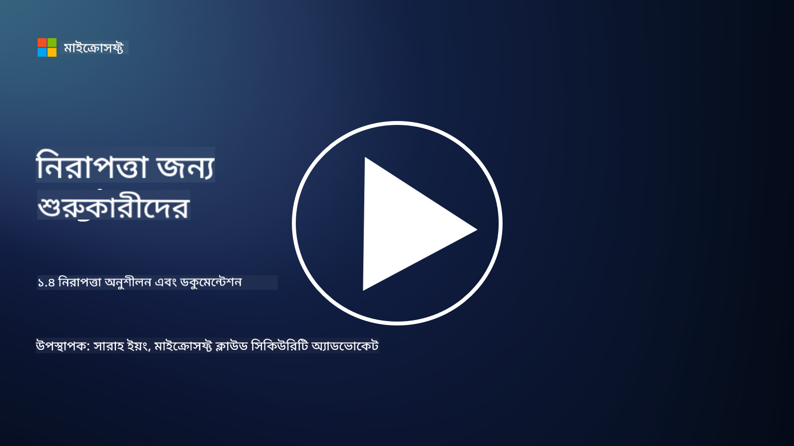

<!--
CO_OP_TRANSLATOR_METADATA:
{
  "original_hash": "d33500902124e52870935bdce4546fcc",
  "translation_date": "2025-09-03T20:57:59+00:00",
  "source_file": "1.4 Security practices and documentation.md",
  "language_code": "bn"
}
-->
# নিরাপত্তা অনুশীলন এবং ডকুমেন্টেশন

আপনি হয়তো আগে "নিরাপত্তা নীতি", "নিরাপত্তা মান" ইত্যাদি শব্দ শুনেছেন, কিন্তু বাস্তবতা হলো অনেক সাইবার নিরাপত্তা পেশাদার এগুলো সঠিকভাবে ব্যবহার করেন না। এই অংশে আমরা ব্যাখ্যা করব প্রতিটি শব্দের অর্থ এবং কেন একটি প্রতিষ্ঠান এগুলো ব্যবহার করবে।

## ভূমিকা

এই পাঠে আমরা আলোচনা করব:

 - নিরাপত্তা নীতি কী?
   
 - নিরাপত্তা মান কী?

   

 - নিরাপত্তা বেসলাইন কী?

   

 - নিরাপত্তা নির্দেশিকা কী?
 - নিরাপত্তা পদ্ধতি কী?

   

 - সাইবার নিরাপত্তার প্রেক্ষাপটে আইন এবং বিধিমালা কী?

এই শব্দগুলো সাধারণত সাইবার নিরাপত্তার প্রেক্ষাপটে ব্যবহৃত হয়, যা একটি প্রতিষ্ঠানের মধ্যে বিভিন্ন স্তরের নিরাপত্তা ডকুমেন্টেশন এবং অনুশীলনকে সংজ্ঞায়িত করে। চলুন প্রতিটি শব্দ পরিষ্কার করি:

## নিরাপত্তা নীতি কী?

নিরাপত্তা নীতি একটি উচ্চ-স্তরের ডকুমেন্ট যা একটি প্রতিষ্ঠানের সামগ্রিক নিরাপত্তা লক্ষ্য, নীতিমালা এবং নির্দেশিকা তুলে ধরে। এটি নিরাপত্তা-সম্পর্কিত সিদ্ধান্ত গ্রহণের জন্য একটি কাঠামো প্রদান করে এবং প্রতিষ্ঠানের নিরাপত্তা অবস্থান নির্ধারণ করে। নিরাপত্তা নীতিগুলো সাধারণত সম্পদ ব্যবহারের গ্রহণযোগ্যতা, ডেটা সুরক্ষা, অ্যাক্সেস নিয়ন্ত্রণ, ঘটনা প্রতিক্রিয়া ইত্যাদি বিষয়গুলো অন্তর্ভুক্ত করে। একটি নীতি সমাধান এবং প্রযুক্তি নিরপেক্ষ। একটি পরিচিত নিরাপত্তা নীতির উদাহরণ হতে পারে একটি প্রতিষ্ঠানের গ্রহণযোগ্য ব্যবহার নীতি।

## নিরাপত্তা মান কী?

নিরাপত্তা মান একটি আরও বিস্তারিত এবং নির্দিষ্ট ডকুমেন্ট যা একটি প্রতিষ্ঠানের মধ্যে নিরাপত্তা নিয়ন্ত্রণ এবং ব্যবস্থা বাস্তবায়নের জন্য নির্দেশিকা এবং প্রয়োজনীয়তা প্রদান করে। মানগুলো নীতির তুলনায় আরও স্পষ্ট এবং প্রযুক্তিগত, যা সিস্টেম, নেটওয়ার্ক এবং প্রক্রিয়াগুলোকে নিরাপত্তা লক্ষ্য পূরণের জন্য কনফিগার এবং রক্ষণাবেক্ষণের নির্দিষ্ট নির্দেশনা এবং সুপারিশ প্রদান করে। একটি নিরাপত্তা মানের উদাহরণ হতে পারে _“সমস্ত অভ্যন্তরীণ ডেটা অবশ্যই বিশ্রামে এবং পরিবহনে এনক্রিপ্টেড হতে হবে।”_

## নিরাপত্তা বেসলাইন কী?

নিরাপত্তা বেসলাইন একটি নির্দিষ্ট সিস্টেম, অ্যাপ্লিকেশন বা পরিবেশের জন্য একটি ন্যূনতম নিরাপত্তা কনফিগারেশন যা একটি নির্দিষ্ট সময়ে অপরিহার্য বলে বিবেচিত হয়। এটি নিরাপত্তার জন্য একটি প্রাথমিক বিন্দু সংজ্ঞায়িত করে যা সমস্ত প্রাসঙ্গিক ক্ষেত্রে বাস্তবায়িত হওয়া উচিত। নিরাপত্তা বেসলাইন একটি প্রতিষ্ঠানের আইটি অবকাঠামো জুড়ে সামঞ্জস্য এবং একটি নির্দিষ্ট স্তরের নিরাপত্তা নিশ্চিত করতে সাহায্য করে। একটি নিরাপত্তা বেসলাইনের উদাহরণ হতে পারে _“Azure VMs-এ সরাসরি ইন্টারনেট অ্যাক্সেস থাকা উচিত নয়।”_

## নিরাপত্তা নির্দেশিকা কী?

নিরাপত্তা নির্দেশিকা একটি ডকুমেন্ট যা সুপারিশ এবং নির্দেশনা প্রদান করে যখন একটি নির্দিষ্ট নিরাপত্তা মান প্রযোজ্য নয়। নির্দেশিকাগুলো সেই "ধূসর এলাকা" মোকাবিলা করার চেষ্টা করে যা একটি মান দ্বারা সম্পূর্ণভাবে বা আংশিকভাবে কভার করা হয় না।

## নিরাপত্তা পদ্ধতি কী?

নিরাপত্তা পদ্ধতি একটি বিস্তারিত ধাপে ধাপে গাইড যা একটি নিরাপত্তা-সম্পর্কিত প্রক্রিয়া বা কাজ সম্পাদনের জন্য নির্দিষ্ট পদক্ষেপ এবং কাজগুলো তুলে ধরে। পদ্ধতিগুলো ব্যবহারিক এবং কার্যকরী ডকুমেন্ট যা ঘটনা প্রতিক্রিয়া, সিস্টেম রক্ষণাবেক্ষণ, ব্যবহারকারী অনবোর্ডিং এবং অন্যান্য নিরাপত্তা-সম্পর্কিত কার্যক্রমের সময় অনুসরণ করার জন্য একটি স্পষ্ট ক্রম প্রদান করে। একটি নিরাপত্তা পদ্ধতির উদাহরণ হতে পারে _“যখন Microsoft Sentinel দ্বারা একটি P1 নিরাপত্তা ঘটনা তৈরি হয়, তখন নিরাপত্তা অপারেশন কেন্দ্র (SOC) অবিলম্বে অন-কল নিরাপত্তা ম্যানেজারকে জানাতে হবে এবং ঘটনাটির বিস্তারিত তাদের কাছে পাঠাতে হবে।”_

সংক্ষেপে, এই শব্দগুলো একটি প্রতিষ্ঠানের সাইবার নিরাপত্তা কাঠামোর মধ্যে বিভিন্ন স্তরের ডকুমেন্টেশন এবং নির্দেশিকা উপস্থাপন করে। নিরাপত্তা নীতিগুলো উচ্চ-স্তরের লক্ষ্য নির্ধারণ করে, মানগুলো বিস্তারিত প্রয়োজনীয়তা প্রদান করে, বেসলাইনগুলো ন্যূনতম নিরাপত্তা কনফিগারেশন স্থাপন করে, নির্দেশিকাগুলো সেরা অনুশীলন প্রদান করে, এবং পদ্ধতিগুলো নিরাপত্তা প্রক্রিয়ার জন্য কার্যকরী পদক্ষেপ প্রদান করে।

## সাইবার নিরাপত্তার প্রেক্ষাপটে আইন/বিধিমালা কী?

আইন এবং বিধিমালা হলো সরকার এবং নিয়ন্ত্রক সংস্থাগুলোর দ্বারা প্রতিষ্ঠিত আইনি কাঠামো যা ডিজিটাল সিস্টেম, ডেটা এবং তথ্য সুরক্ষার জন্য নিয়ম, মান এবং প্রয়োজনীয়তা সংজ্ঞায়িত এবং প্রয়োগ করে। এই আইন এবং বিধিমালাগুলো বিচারব্যবস্থার উপর নির্ভর করে পরিবর্তিত হয় এবং সাইবার নিরাপত্তার বিভিন্ন দিক যেমন ডেটা সুরক্ষা, গোপনীয়তা, ঘটনা রিপোর্টিং এবং গুরুত্বপূর্ণ অবকাঠামোর নিরাপত্তার উপর গুরুত্ব দেয়। সাইবার নিরাপত্তা-সম্পর্কিত আইন এবং বিধিমালার কিছু উদাহরণ হলো: যেমন General Data Protection Regulation (GDPR), Health Insurance Portability and Accountability Act (HIPAA), California Consumer Privacy Act (CCPA), Payment Card Industry Data Security Standard (PCI DSS)।

## আরও পড়ুন

[Information Security Policy Templates | SANS Institute](https://www.sans.org/information-security-policy/)

[Compliance with Cybersecurity and Privacy Laws and Regulations | NIST](https://www.nist.gov/mep/cybersecurity-resources-manufacturers/compliance-cybersecurity-and-privacy-laws-and-regulations)

---

**অস্বীকৃতি**:  
এই নথিটি AI অনুবাদ পরিষেবা [Co-op Translator](https://github.com/Azure/co-op-translator) ব্যবহার করে অনুবাদ করা হয়েছে। আমরা যথাসম্ভব সঠিক অনুবাদ প্রদানের চেষ্টা করি, তবে অনুগ্রহ করে মনে রাখবেন যে স্বয়ংক্রিয় অনুবাদে ত্রুটি বা অসঙ্গতি থাকতে পারে। মূল ভাষায় থাকা নথিটিকে প্রামাণিক উৎস হিসেবে বিবেচনা করা উচিত। গুরুত্বপূর্ণ তথ্যের জন্য, পেশাদার মানব অনুবাদ সুপারিশ করা হয়। এই অনুবাদ ব্যবহারের ফলে কোনো ভুল বোঝাবুঝি বা ভুল ব্যাখ্যা হলে আমরা তার জন্য দায়ী থাকব না।