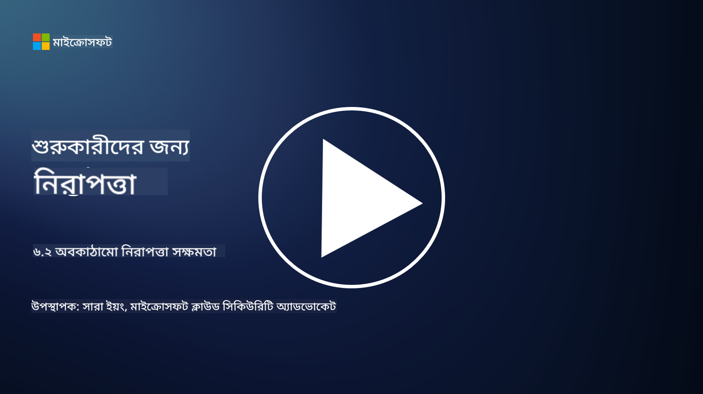

<!--
CO_OP_TRANSLATOR_METADATA:
{
  "original_hash": "7d79ba0e7668b3bdae1fba7aa047f6c0",
  "translation_date": "2025-09-03T20:50:29+00:00",
  "source_file": "6.2 Infrastructure security capabilities.md",
  "language_code": "bn"
}
-->
# অবকাঠামো নিরাপত্তা সক্ষমতা

এই অংশে, আমরা অবকাঠামো নিরাপত্তায় ব্যবহৃত মূল টুল এবং সক্ষমতা সম্পর্কে আরও বিস্তারিত আলোচনা করব।

**ভূমিকা**

এই পাঠে আমরা আলোচনা করব:

- দুর্বলতা ব্যবস্থাপনা কী?

- CSPM কী?

- CNAPP কী?

## দুর্বলতা ব্যবস্থাপনা কী?

দুর্বলতা ব্যবস্থাপনা হল একটি পদ্ধতিগত প্রক্রিয়া যা কম্পিউটার সিস্টেম, সফটওয়্যার, নেটওয়ার্ক এবং অবকাঠামোর দুর্বলতাগুলি সনাক্ত, মূল্যায়ন, অগ্রাধিকার নির্ধারণ, প্রশমন এবং পর্যবেক্ষণ করে। দুর্বলতা ব্যবস্থাপনার প্রধান লক্ষ্য হল একটি প্রতিষ্ঠানের নিরাপত্তা ঝুঁকি কমানো, যাতে পরিচিত দুর্বলতাগুলি ক্ষতিকারক কার্যকলাপের দ্বারা শোষিত হওয়ার আগেই সমাধান করা যায়। এর মূল ধাপগুলোর সংক্ষিপ্তসার নিচে দেওয়া হলো:

সনাক্তকরণ: সার্ভার, অ্যাপ্লিকেশন, নেটওয়ার্ক ডিভাইস এবং এন্ডপয়েন্টসহ প্রতিষ্ঠানের সম্পদে দুর্বলতাগুলি স্ক্যান এবং আবিষ্কার করা।

মূল্যায়ন: CVSS স্কোর এবং ব্যবসায়িক প্রেক্ষাপটের মতো বিষয়গুলোর উপর ভিত্তি করে প্রতিটি দুর্বলতার তীব্রতা এবং সম্ভাব্য প্রভাব মূল্যায়ন করা।

অগ্রাধিকার নির্ধারণ: দুর্বলতাগুলিকে তাদের ঝুঁকির স্তর এবং প্রতিষ্ঠানের কার্যক্রম ও ডেটার উপর সম্ভাব্য প্রভাবের ভিত্তিতে র‍্যাঙ্কিং করা।

প্রশমন: প্যাচ প্রয়োগ, নিরাপত্তা সেটিংস কনফিগার করা বা প্রতিরোধমূলক নিয়ন্ত্রণ স্থাপনসহ দুর্বলতাগুলি সমাধান বা প্রশমনের জন্য কৌশল তৈরি এবং বাস্তবায়ন করা।

যাচাই: নিশ্চিত করা যে প্রশমন ব্যবস্থা দুর্বলতাগুলি সমাধানে কার্যকর হয়েছে।

নিরবিচ্ছিন্ন পর্যবেক্ষণ: নিয়মিত দুর্বলতা স্ক্যান এবং মূল্যায়নের মাধ্যমে দুর্বলতা এবং সম্ভাব্য হুমকিগুলির চলমান ট্র্যাকিং।

দুর্বলতা ব্যবস্থাপনা সাইবার নিরাপত্তার একটি গুরুত্বপূর্ণ উপাদান, যা প্রতিষ্ঠানের শক্তিশালী নিরাপত্তা অবস্থান বজায় রাখতে এবং নিরাপত্তা লঙ্ঘনের সম্ভাবনা কমাতে সহায়তা করে। দুর্বলতা ব্যবস্থাপনার টুলগুলোর উদাহরণ হলো Defender for Cloud, Nessus এবং Qualys।

## CSPM কী?

Cloud Security Posture Management (CSPM) হল একটি টুল, প্রক্রিয়া এবং অনুশীলনের সেট যা ক্লাউড পরিবেশে নিরাপত্তা কনফিগারেশন এবং সেরা অনুশীলন মূল্যায়ন, পর্যবেক্ষণ এবং প্রয়োগ করতে ডিজাইন করা হয়েছে। CSPM সমাধানগুলি প্রতিষ্ঠানের ক্লাউড অবকাঠামোতে যেমন Amazon Web Services (AWS), Microsoft Azure, Google Cloud Platform (GCP) এবং অন্যান্য ক্লাউড প্রদানকারীদের মধ্যে ভুল কনফিগারেশন, নিরাপত্তা ফাঁক এবং সম্মতি লঙ্ঘন সনাক্ত এবং সমাধান করতে সহায়তা করে।

CSPM-এর মূল দিকগুলো হলো:

- কনফিগারেশন মূল্যায়ন: ক্লাউড সম্পদ এবং পরিষেবাগুলি স্ক্যান করে ভুল কনফিগারেশন, অনিরাপদ সেটিংস এবং নিরাপত্তার সেরা অনুশীলন থেকে বিচ্যুতি সনাক্ত করা।

- নিরাপত্তা নীতি প্রয়োগ: ক্লাউড পরিবেশে নিরাপত্তা নীতি এবং সম্মতি মান প্রয়োগ করা, যা ভুল কনফিগারেশন স্বয়ংক্রিয়ভাবে সমাধান করা বা সতর্কতা তৈরি করা।

- নিরবিচ্ছিন্ন পর্যবেক্ষণ: ক্লাউড সম্পদ এবং সম্পদের নিরাপত্তা অবস্থানের উপর নিরবিচ্ছিন্ন দৃশ্যমানতা প্রদান করা, নিরাপত্তা ঘটনার জন্য রিয়েল-টাইম সতর্কতা সহ।

- সম্মতি রিপোর্টিং: নিয়ন্ত্রক প্রয়োজনীয়তা এবং শিল্প মানগুলির সাথে সম্মতি প্রদর্শনের জন্য রিপোর্ট এবং ড্যাশবোর্ড তৈরি করা।

CSPM প্রতিষ্ঠানের ক্লাউড অবকাঠামোকে নিরাপদ, সম্মত এবং সেরা অনুশীলনের সাথে সামঞ্জস্যপূর্ণ রাখতে সহায়তা করে, ক্লাউড-সম্পর্কিত নিরাপত্তা ঘটনার ঝুঁকি কমায়। CSPM টুলগুলোর উদাহরণ হলো Defender for Cloud এবং Snyk।

## CNAPP কী?

CNAPP-এর পূর্ণরূপ হলো Cloud-Native Application Protection Platform। এটি একটি অল-ইন-ওয়ান ক্লাউড-নেটিভ সফটওয়্যার প্ল্যাটফর্ম যা ক্লাউড নিরাপত্তা হুমকি এবং দুর্বলতাগুলি পর্যবেক্ষণ, সনাক্ত এবং সমাধান করার প্রক্রিয়াকে সহজ করে। এটি একাধিক টুল এবং সক্ষমতাকে একটি একক সফটওয়্যার সমাধানে একত্রিত করে জটিলতা কমায় এবং DevOps এবং DevSecOps টিমের কার্যক্রমকে সহজতর করে। CNAPP পুরো CI/CD অ্যাপ্লিকেশন লাইফসাইকেল জুড়ে, উন্নয়ন থেকে উৎপাদন পর্যন্ত, ক্লাউড এবং অ্যাপ্লিকেশন নিরাপত্তার জন্য একটি প্রান্ত-থেকে-প্রান্ত সমাধান প্রদান করে। এটি আধুনিক ক্লাউড নিরাপত্তা পর্যবেক্ষণ, অবস্থান ব্যবস্থাপনা, লঙ্ঘন প্রতিরোধ এবং নিয়ন্ত্রণ টুলগুলির প্রয়োজনীয়তাকে সমাধান করে। CNAPP সমাধানগুলি নিরাপত্তা টিমকে ক্লাউড পরিবেশে ঝুঁকি পরিমাপ এবং প্রতিক্রিয়া জানাতে সক্ষম করে। CNAPP-এর কিছু বৈশিষ্ট্য হলো উন্নত দৃশ্যমানতা, ঝুঁকির পরিমাপ, নিরাপদ সফটওয়্যার উন্নয়ন এবং একটি সম্মিলিত ক্লাউড নিরাপত্তা সমাধান। CNAPP একাধিক ক্লাউড-নেটিভ নিরাপত্তা টুল এবং ডেটা উৎসকে একক ব্যবহারকারী ইন্টারফেসে একত্রিত করে, যা প্রতিষ্ঠানের পুরো ক্লাউড অ্যাপ্লিকেশন ফুটপ্রিন্ট সুরক্ষিত করা সহজ করে তোলে। CNAPPs ঐতিহ্যগতভাবে বিচ্ছিন্ন একাধিক ক্লাউড-নেটিভ নিরাপত্তা টুল এবং ডেটা উৎসকে একত্রিত করে, যার মধ্যে রয়েছে কন্টেইনার স্ক্যানিং, ক্লাউড নিরাপত্তা অবস্থান ব্যবস্থাপনা, ইনফ্রাস্ট্রাকচার অ্যাজ কোড স্ক্যানিং, ক্লাউড ইনফ্রাস্ট্রাকচার এন্টাইটেলমেন্ট ম্যানেজমেন্ট এবং রানটাইম ক্লাউড ওয়ার্কলোড প্রোটেকশন প্ল্যাটফর্ম।

## আরও পড়ুন
- [CSPM কী? | Microsoft Security](https://www.microsoft.com/security/business/security-101/what-is-cspm?WT.mc_id=academic-96948-sayoung)
- [Cloud Security Posture Management (CSPM) কী? | HackerOne](https://www.hackerone.com/knowledge-center/what-cloud-security-posture-management)
- [ক্লাউড নিরাপত্তা অবস্থান ব্যবস্থাপনার কার্যকারিতা - Cloud Adoption Framework | Microsoft Learn](https://learn.microsoft.com/azure/cloud-adoption-framework/organize/cloud-security-posture-management?WT.mc_id=academic-96948-sayoung)
- [CNAPP কী? | Microsoft Security](https://www.microsoft.com/security/business/security-101/what-is-cnapp?WT.mc_id=academic-96948-sayoung)
- [কেন সবাই CNAPP নিয়ে আলোচনা করছে (forbes.com)](https://www.forbes.com/sites/forbestechcouncil/2021/12/10/why-everyone-is-talking-about-cnapp/?sh=567275ca1549)
- [Cloud-Native Application Protection Platform (CNAPP) দিয়ে আপনার মাল্টি-ক্লাউড নিরাপত্তা উন্নত করা](https://www.youtube.com/watch?v=5w42kQ_QjZg&t=212s)

---

**অস্বীকৃতি**:  
এই নথিটি AI অনুবাদ পরিষেবা [Co-op Translator](https://github.com/Azure/co-op-translator) ব্যবহার করে অনুবাদ করা হয়েছে। আমরা যথাসম্ভব সঠিক অনুবাদ প্রদানের চেষ্টা করি, তবে অনুগ্রহ করে মনে রাখবেন যে স্বয়ংক্রিয় অনুবাদে ত্রুটি বা অসঙ্গতি থাকতে পারে। মূল ভাষায় থাকা নথিটিকে প্রামাণিক উৎস হিসেবে বিবেচনা করা উচিত। গুরুত্বপূর্ণ তথ্যের জন্য, পেশাদার মানব অনুবাদ সুপারিশ করা হয়। এই অনুবাদ ব্যবহারের ফলে কোনো ভুল বোঝাবুঝি বা ভুল ব্যাখ্যা হলে আমরা তার জন্য দায়ী থাকব না।