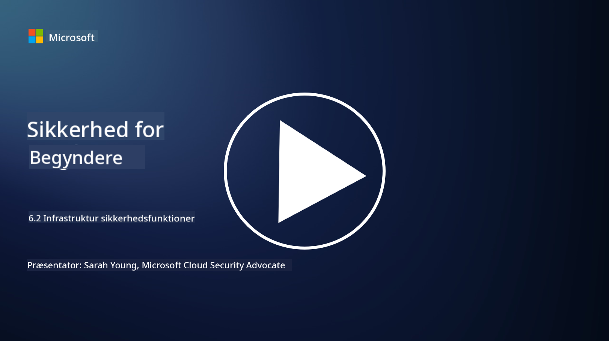

<!--
CO_OP_TRANSLATOR_METADATA:
{
  "original_hash": "7d79ba0e7668b3bdae1fba7aa047f6c0",
  "translation_date": "2025-09-03T20:52:09+00:00",
  "source_file": "6.2 Infrastructure security capabilities.md",
  "language_code": "da"
}
-->
# Infrastrukturens sikkerhedsfunktioner

I denne sektion vil vi dække flere detaljer om de centrale værktøjer og funktioner, der bruges til at sikre infrastrukturen.

**Introduktion**

I denne lektion vil vi gennemgå:

- Hvad er sårbarhedshåndtering?

- Hvad er CSPM?

- Hvad er CNAPP?

## Hvad er sårbarhedshåndtering?

Sårbarhedshåndtering er en systematisk proces til at identificere, evaluere, prioritere, afhjælpe og overvåge sårbarheder i computersystemer, software, netværk og infrastruktur. Det primære mål med sårbarhedshåndtering er at reducere en organisations eksponering for sikkerhedsrisici ved proaktivt at adressere kendte sårbarheder, før de kan udnyttes af ondsindede aktører. Her er en oversigt over de vigtigste trin:

Identifikation: Scanning og opdagelse af sårbarheder i organisationens aktiver, som kan omfatte servere, applikationer, netværksenheder og slutpunkter.

Vurdering: Evaluering af alvorligheden og den potentielle påvirkning af hver sårbarhed baseret på faktorer som Common Vulnerability Scoring System (CVSS)-score og forretningskontekst.

Prioritering: Rangering af sårbarheder baseret på deres risikoniveau og potentielle påvirkning af organisationens drift og data.

Afhjælpning: Udvikling og implementering af strategier til at afhjælpe eller mindske sårbarheder, hvilket kan omfatte at anvende patches, konfigurere sikkerhedsindstillinger eller implementere kompenserende kontroller.

Verifikation: Bekræftelse af, at afhjælpningsforanstaltningerne var effektive til at adressere sårbarhederne.

Løbende overvågning: Kontinuerlig sporing af sårbarheder og potentielle trusler med regelmæssige sårbarhedsscanninger og vurderinger.

Sårbarhedshåndtering er en kritisk komponent i cybersikkerhed, der hjælper organisationer med at opretholde en stærk sikkerhedsposition og reducere sandsynligheden for sikkerhedsbrud. Eksempler på værktøjer til sårbarhedshåndtering er Defender for Cloud, Nessus og Qualys.

## Hvad er CSPM?

Cloud Security Posture Management (CSPM) er et sæt værktøjer, processer og praksisser designet til at vurdere, overvåge og håndhæve sikkerhedskonfigurationer og bedste praksis i cloud-miljøer. CSPM-løsninger hjælper organisationer med at identificere og afhjælpe fejlkonfigurationer, sikkerhedshuller og overtrædelser af overholdelseskrav i deres cloud-infrastruktur, såsom i Amazon Web Services (AWS), Microsoft Azure, Google Cloud Platform (GCP) og andre cloud-udbydere.

Nøgleaspekter af CSPM inkluderer:

- Konfigurationsvurdering: Scanning af cloud-ressourcer og -tjenester for at identificere fejlkonfigurationer, usikre indstillinger og afvigelser fra sikkerhedsmæssige bedste praksisser.

- Håndhævelse af sikkerhedspolitikker: Håndhævelse af sikkerhedspolitikker og overholdelsesstandarder på tværs af cloud-miljøer ved automatisk at afhjælpe fejlkonfigurationer eller generere advarsler.

- Løbende overvågning: Tilvejebringelse af kontinuerlig synlighed i sikkerhedspositionen for cloud-aktiver og -ressourcer med realtidsadvarsler for sikkerhedshændelser.

- Overholdelsesrapportering: Generering af rapporter og dashboards for at demonstrere overholdelse af lovgivningsmæssige krav og industristandarder.

CSPM hjælper organisationer med at sikre, at deres cloud-infrastruktur er sikker, overholder reglerne og er i overensstemmelse med bedste praksis, hvilket reducerer risikoen for cloud-relaterede sikkerhedshændelser. Eksempler på CSPM-værktøjer inkluderer Defender for Cloud og Snyk.

## Hvad er CNAPP?

CNAPP står for Cloud-Native Application Protection Platform. Det er en alt-i-en cloud-native softwareplatform, der forenkler overvågning, detektion og håndtering af potentielle sikkerhedstrusler og sårbarheder i cloud-miljøer. Den kombinerer flere værktøjer og funktioner i en enkelt softwareløsning for at minimere kompleksitet og lette arbejdet for DevOps- og DevSecOps-teams. CNAPP tilbyder en end-to-end sikkerhedsløsning for cloud og applikationer gennem hele CI/CD-applikationslivscyklussen, fra udvikling til produktion. Den adresserer branchens behov for moderne cloud-sikkerhedsovervågning, stillingsstyring, forebyggelse af brud og kontrolværktøjer. CNAPP-løsninger giver sikkerhedsteams mulighed for at kvantificere og reagere på risici i cloud-miljøet. Nogle af funktionerne i CNAPP inkluderer forbedret synlighed, kvantificering af risici, sikker softwareudvikling og en samlet cloud-sikkerhedsløsning. CNAPP integrerer flere cloud-sikkerhedsløsninger, der traditionelt har været adskilt, i en enkelt brugergrænseflade, hvilket gør det lettere for organisationer at beskytte deres samlede cloud-applikationsfodaftryk. CNAPP'er konsoliderer flere cloud-native sikkerhedsværktøjer og datakilder, herunder container-scanning, cloud security posture management, scanning af infrastruktur som kode, cloud-infrastrukturrettighedsstyring og runtime cloud workload protection platforms.

## Yderligere læsning
- [What is CSPM? | Microsoft Security](https://www.microsoft.com/security/business/security-101/what-is-cspm?WT.mc_id=academic-96948-sayoung)
- [What is Cloud Security Posture Management (CSPM)? | HackerOne](https://www.hackerone.com/knowledge-center/what-cloud-security-posture-management)
- [Function of cloud security posture management - Cloud Adoption Framework | Microsoft Learn](https://learn.microsoft.com/azure/cloud-adoption-framework/organize/cloud-security-posture-management?WT.mc_id=academic-96948-sayoung)
- [What Is a CNAPP? | Microsoft Security](https://www.microsoft.com/security/business/security-101/what-is-cnapp?WT.mc_id=academic-96948-sayoung)
- [Why Everyone Is Talking About CNAPP (forbes.com)](https://www.forbes.com/sites/forbestechcouncil/2021/12/10/why-everyone-is-talking-about-cnapp/?sh=567275ca1549)
- [Improving Your Multi-Cloud Security with a Cloud-Native Application Protection Platform (CNAPP)](https://www.youtube.com/watch?v=5w42kQ_QjZg&t=212s)

---

**Ansvarsfraskrivelse**:  
Dette dokument er blevet oversat ved hjælp af AI-oversættelsestjenesten [Co-op Translator](https://github.com/Azure/co-op-translator). Selvom vi bestræber os på nøjagtighed, skal du være opmærksom på, at automatiserede oversættelser kan indeholde fejl eller unøjagtigheder. Det originale dokument på dets oprindelige sprog bør betragtes som den autoritative kilde. For kritisk information anbefales professionel menneskelig oversættelse. Vi påtager os intet ansvar for misforståelser eller fejltolkninger, der måtte opstå som følge af brugen af denne oversættelse.