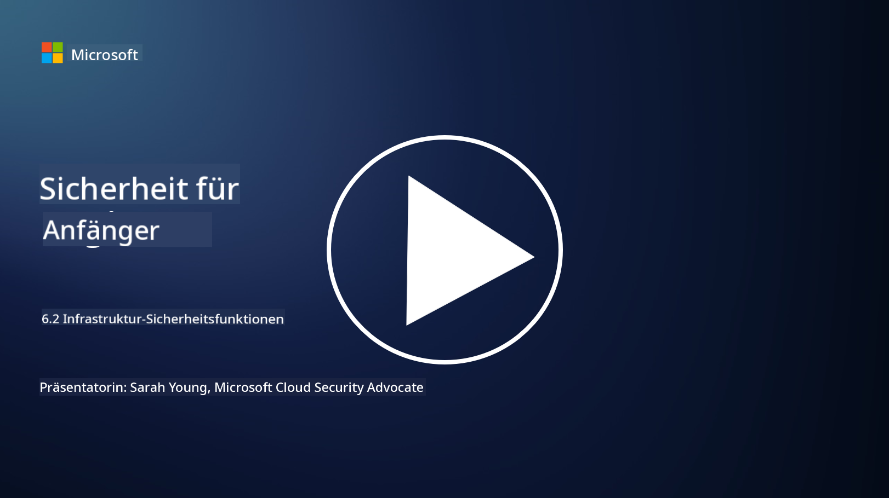

<!--
CO_OP_TRANSLATOR_METADATA:
{
  "original_hash": "7d79ba0e7668b3bdae1fba7aa047f6c0",
  "translation_date": "2025-09-03T18:30:29+00:00",
  "source_file": "6.2 Infrastructure security capabilities.md",
  "language_code": "de"
}
-->
# Sicherheitsfunktionen für Infrastruktur

In diesem Abschnitt behandeln wir detaillierter die zentralen Tools und Funktionen, die in der Sicherheit von Infrastrukturen eingesetzt werden.

**Einführung**

In dieser Lektion behandeln wir:

- Was ist Schwachstellenmanagement?

- Was ist CSPM?

- Was ist CNAPP?

## Was ist Schwachstellenmanagement?

Schwachstellenmanagement ist ein systematischer Prozess zur Identifizierung, Bewertung, Priorisierung, Minderung und Überwachung von Schwachstellen in Computersystemen, Software, Netzwerken und Infrastruktur. Das Hauptziel des Schwachstellenmanagements besteht darin, die Sicherheitsrisiken einer Organisation zu reduzieren, indem bekannte Schwachstellen proaktiv behoben werden, bevor sie von böswilligen Akteuren ausgenutzt werden können. Hier ist eine Übersicht der wichtigsten Schritte:

Identifizierung: Scannen und Auffinden von Schwachstellen in den Vermögenswerten der Organisation, einschließlich Servern, Anwendungen, Netzwerkgeräten und Endpunkten.

Bewertung: Einschätzung der Schwere und potenziellen Auswirkungen jeder Schwachstelle basierend auf Faktoren wie dem Common Vulnerability Scoring System (CVSS) und dem geschäftlichen Kontext.

Priorisierung: Einstufung von Schwachstellen basierend auf ihrem Risikograd und ihrer potenziellen Auswirkung auf die Betriebsabläufe und Daten der Organisation.

Minderung: Entwicklung und Umsetzung von Strategien zur Behebung oder Minderung von Schwachstellen, einschließlich der Anwendung von Patches, der Konfiguration von Sicherheitseinstellungen oder dem Einsatz von kompensierenden Maßnahmen.

Verifizierung: Bestätigung, dass die Maßnahmen zur Minderung der Schwachstellen wirksam waren.

Kontinuierliche Überwachung: Laufende Verfolgung von Schwachstellen und potenziellen Bedrohungen durch regelmäßige Schwachstellenscans und Bewertungen.

Schwachstellenmanagement ist ein wesentlicher Bestandteil der Cybersicherheit und hilft Organisationen, eine starke Sicherheitslage aufrechtzuerhalten und die Wahrscheinlichkeit von Sicherheitsverletzungen zu verringern. Beispiele für Tools zum Schwachstellenmanagement sind Defender for Cloud, Nessus und Qualys.

## Was ist CSPM?

Cloud Security Posture Management (CSPM) ist eine Sammlung von Tools, Prozessen und Praktiken, die darauf abzielen, Sicherheitskonfigurationen und Best Practices in Cloud-Umgebungen zu bewerten, zu überwachen und durchzusetzen. CSPM-Lösungen helfen Organisationen, Fehlkonfigurationen, Sicherheitslücken und Verstöße gegen Compliance-Vorgaben in ihrer Cloud-Infrastruktur zu identifizieren und zu beheben, beispielsweise in Amazon Web Services (AWS), Microsoft Azure, Google Cloud Platform (GCP) und anderen Cloud-Anbietern.

Wichtige Aspekte von CSPM umfassen:

- Konfigurationsbewertung: Scannen von Cloud-Ressourcen und -Diensten, um Fehlkonfigurationen, unsichere Einstellungen und Abweichungen von Sicherheitsbestimmungen zu identifizieren.

- Durchsetzung von Sicherheitsrichtlinien: Durchsetzung von Sicherheitsrichtlinien und Compliance-Standards in Cloud-Umgebungen durch automatische Behebung von Fehlkonfigurationen oder Generierung von Warnmeldungen.

- Kontinuierliche Überwachung: Bereitstellung einer kontinuierlichen Sichtbarkeit der Sicherheitslage von Cloud-Assets und -Ressourcen mit Echtzeit-Warnungen bei Sicherheitsvorfällen.

- Compliance-Berichterstattung: Erstellung von Berichten und Dashboards, um die Einhaltung von regulatorischen Anforderungen und Branchenstandards nachzuweisen.

CSPM hilft Organisationen sicherzustellen, dass ihre Cloud-Infrastruktur sicher, konform und an Best Practices ausgerichtet ist, wodurch das Risiko von cloudbezogenen Sicherheitsvorfällen reduziert wird. Beispiele für CSPM-Tools sind Defender for Cloud und Snyk.

## Was ist CNAPP?

CNAPP steht für Cloud-Native Application Protection Platform. Es handelt sich um eine umfassende cloud-native Softwareplattform, die die Überwachung, Erkennung und Reaktion auf potenzielle Sicherheitsbedrohungen und Schwachstellen in der Cloud vereinfacht. Sie kombiniert mehrere Tools und Funktionen in einer einzigen Softwarelösung, um die Komplexität zu minimieren und die Arbeitsabläufe von DevOps- und DevSecOps-Teams zu erleichtern. CNAPP bietet eine End-to-End-Sicherheit für Cloud- und Anwendungen über den gesamten CI/CD-Anwendungslebenszyklus hinweg, von der Entwicklung bis zur Produktion. Es adressiert den Bedarf der Branche an modernen Tools für Cloud-Sicherheitsüberwachung, Sicherheitslage-Management, Prävention von Sicherheitsverletzungen und Kontrollmaßnahmen. CNAPP-Lösungen ermöglichen Sicherheitsteams, Risiken in der Cloud-Umgebung zu quantifizieren und darauf zu reagieren. Zu den Funktionen von CNAPP gehören erweiterte Sichtbarkeit, Risikobewertung, sichere Softwareentwicklung und eine kombinierte Cloud-Sicherheitslösung. CNAPP integriert mehrere Cloud-Sicherheitslösungen, die traditionell isoliert waren, in einer einzigen Benutzeroberfläche, wodurch es Organisationen erleichtert wird, ihre gesamte Cloud-Anwendungslandschaft zu schützen. CNAPPs konsolidieren mehrere cloud-native Sicherheitstools und Datenquellen, einschließlich Container-Scans, Cloud-Sicherheitslage-Management, Infrastruktur-als-Code-Scans, Cloud-Infrastruktur-Berechtigungsmanagement und Laufzeit-Schutzplattformen für Cloud-Workloads.

## Weiterführende Literatur
- [Was ist CSPM? | Microsoft Security](https://www.microsoft.com/security/business/security-101/what-is-cspm?WT.mc_id=academic-96948-sayoung)
- [Was ist Cloud Security Posture Management (CSPM)? | HackerOne](https://www.hackerone.com/knowledge-center/what-cloud-security-posture-management)
- [Funktion des Cloud Security Posture Management - Cloud Adoption Framework | Microsoft Learn](https://learn.microsoft.com/azure/cloud-adoption-framework/organize/cloud-security-posture-management?WT.mc_id=academic-96948-sayoung)
- [Was ist ein CNAPP? | Microsoft Security](https://www.microsoft.com/security/business/security-101/what-is-cnapp?WT.mc_id=academic-96948-sayoung)
- [Warum alle über CNAPP sprechen (forbes.com)](https://www.forbes.com/sites/forbestechcouncil/2021/12/10/why-everyone-is-talking-about-cnapp/?sh=567275ca1549)
- [Verbesserung Ihrer Multi-Cloud-Sicherheit mit einer Cloud-Native Application Protection Platform (CNAPP)](https://www.youtube.com/watch?v=5w42kQ_QjZg&t=212s)

---

**Haftungsausschluss**:  
Dieses Dokument wurde mit dem KI-Übersetzungsdienst [Co-op Translator](https://github.com/Azure/co-op-translator) übersetzt. Obwohl wir uns um Genauigkeit bemühen, beachten Sie bitte, dass automatisierte Übersetzungen Fehler oder Ungenauigkeiten enthalten können. Das Originaldokument in seiner ursprünglichen Sprache sollte als maßgebliche Quelle betrachtet werden. Für kritische Informationen wird eine professionelle menschliche Übersetzung empfohlen. Wir übernehmen keine Haftung für Missverständnisse oder Fehlinterpretationen, die sich aus der Nutzung dieser Übersetzung ergeben.