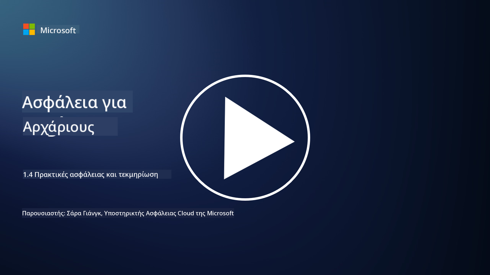

<!--
CO_OP_TRANSLATOR_METADATA:
{
  "original_hash": "d33500902124e52870935bdce4546fcc",
  "translation_date": "2025-09-03T20:59:23+00:00",
  "source_file": "1.4 Security practices and documentation.md",
  "language_code": "el"
}
-->
# Πρακτικές ασφάλειας και τεκμηρίωση

Ίσως έχετε ακούσει τις φράσεις «πολιτική ασφάλειας», «πρότυπο ασφάλειας» κ.λπ., αλλά η πραγματικότητα είναι ότι πολλοί επαγγελματίες της κυβερνοασφάλειας δεν τις χρησιμοποιούν σωστά. Σε αυτή την ενότητα θα εξηγήσουμε τι σημαίνει κάθε μία από αυτές τις φράσεις και γιατί μια οργανισμός θα τις χρησιμοποιούσε.

## Εισαγωγή

Σε αυτό το μάθημα, θα καλύψουμε:

 - Τι είναι μια πολιτική ασφάλειας;
   
 - Τι είναι ένα πρότυπο ασφάλειας;

   

 - Τι είναι μια βασική γραμμή ασφάλειας;

   

 - Τι είναι μια κατευθυντήρια οδηγία ασφάλειας;
 - Τι είναι μια διαδικασία ασφάλειας;

   

 - Τι είναι οι νόμοι και οι κανονισμοί στο πλαίσιο της κυβερνοασφάλειας;

Αυτοί οι όροι χρησιμοποιούνται συχνά στο πλαίσιο της κυβερνοασφάλειας για να ορίσουν διαφορετικά επίπεδα τεκμηρίωσης και πρακτικών ασφάλειας μέσα σε έναν οργανισμό. Ας διευκρινίσουμε κάθε όρο:

## Τι είναι μια πολιτική ασφάλειας;

Μια πολιτική ασφάλειας είναι ένα έγγραφο υψηλού επιπέδου που περιγράφει τους γενικούς στόχους, τις αρχές και τις κατευθυντήριες γραμμές ασφάλειας ενός οργανισμού. Παρέχει ένα πλαίσιο για τη λήψη αποφάσεων που σχετίζονται με την ασφάλεια και καθορίζει τον τόνο για τη στάση ασφάλειας του οργανισμού. Οι πολιτικές ασφάλειας καλύπτουν συνήθως θέματα όπως η αποδεκτή χρήση πόρων, η προστασία δεδομένων, ο έλεγχος πρόσβασης, η αντιμετώπιση περιστατικών και άλλα. Μια πολιτική είναι ανεξάρτητη από λύσεις και τεχνολογίες. Ένα παράδειγμα πολιτικής ασφάλειας που πολλοί θα ήταν εξοικειωμένοι είναι η πολιτική αποδεκτής χρήσης ενός οργανισμού.

## Τι είναι ένα πρότυπο ασφάλειας;

Ένα πρότυπο ασφάλειας είναι ένα πιο λεπτομερές και συγκεκριμένο έγγραφο που παρέχει κατευθυντήριες γραμμές και απαιτήσεις για την εφαρμογή ελέγχων και μέτρων ασφάλειας μέσα σε έναν οργανισμό. Τα πρότυπα είναι πιο συγκεκριμένα και τεχνικά από τις πολιτικές, προσφέροντας συγκεκριμένες οδηγίες και συστάσεις για τη διαμόρφωση και τη συντήρηση συστημάτων, δικτύων και διαδικασιών ώστε να επιτευχθούν οι στόχοι ασφάλειας. Ένα παράδειγμα προτύπου ασφάλειας θα ήταν _«Όλα τα εσωτερικά δεδομένα πρέπει να είναι κρυπτογραφημένα κατά την αποθήκευση και τη μεταφορά.»_

## Τι είναι μια βασική γραμμή ασφάλειας;

Μια βασική γραμμή ασφάλειας είναι ένα σύνολο ελάχιστων ρυθμίσεων ασφάλειας που θεωρούνται απαραίτητες για ένα συγκεκριμένο σύστημα, εφαρμογή ή περιβάλλον σε μια δεδομένη χρονική στιγμή. Ορίζει ένα σημείο εκκίνησης για την ασφάλεια που πρέπει να εφαρμόζεται σε όλες τις σχετικές περιπτώσεις. Οι βασικές γραμμές ασφάλειας βοηθούν στη διασφάλιση της συνέπειας και ενός συγκεκριμένου επιπέδου ασφάλειας σε όλη την υποδομή πληροφορικής ενός οργανισμού. Ένα παράδειγμα βασικής γραμμής ασφάλειας θα ήταν _«Οι εικονικές μηχανές Azure δεν πρέπει να έχουν άμεση πρόσβαση στο Διαδίκτυο.»_

## Τι είναι μια κατευθυντήρια οδηγία ασφάλειας;

Μια κατευθυντήρια οδηγία ασφάλειας είναι ένα έγγραφο που προσφέρει συστάσεις και καθοδήγηση όταν ένα συγκεκριμένο πρότυπο ασφάλειας δεν εφαρμόζεται. Οι οδηγίες προσπαθούν να αντιμετωπίσουν τις «γκρίζες ζώνες» που προκύπτουν όταν ένα πρότυπο δεν καλύπτει ή καλύπτει μόνο εν μέρει ένα θέμα.

## Τι είναι μια διαδικασία ασφάλειας;

Μια διαδικασία ασφάλειας είναι ένας λεπτομερής οδηγός βήμα προς βήμα που περιγράφει τις συγκεκριμένες ενέργειες και εργασίες που πρέπει να εκτελεστούν για την υλοποίηση μιας διαδικασίας ή εργασίας που σχετίζεται με την ασφάλεια. Οι διαδικασίες είναι πρακτικά και εφαρμόσιμα έγγραφα που παρέχουν μια σαφή ακολουθία ενεργειών για την αντιμετώπιση περιστατικών, τη συντήρηση συστημάτων, την ένταξη χρηστών και άλλες δραστηριότητες που σχετίζονται με την ασφάλεια. Ένα παράδειγμα διαδικασίας ασφάλειας θα ήταν _«Όταν δημιουργείται ένα περιστατικό ασφάλειας P1 από το Microsoft Sentinel, το κέντρο επιχειρήσεων ασφάλειας (SOC) πρέπει να ενημερώσει άμεσα τον υπεύθυνο ασφάλειας που είναι σε ετοιμότητα και να του στείλει τις λεπτομέρειες του περιστατικού.»_

Συνοψίζοντας, αυτοί οι όροι αντιπροσωπεύουν διαφορετικά επίπεδα τεκμηρίωσης και καθοδήγησης μέσα στο πλαίσιο κυβερνοασφάλειας ενός οργανισμού. Οι πολιτικές ασφάλειας θέτουν τους γενικούς στόχους, τα πρότυπα παρέχουν λεπτομερείς απαιτήσεις, οι βασικές γραμμές καθορίζουν ελάχιστες ρυθμίσεις ασφάλειας, οι οδηγίες προσφέρουν βέλτιστες πρακτικές και οι διαδικασίες παρέχουν εφαρμόσιμα βήματα για διαδικασίες ασφάλειας.

## Τι είναι οι νόμοι/κανονισμοί στο πλαίσιο της κυβερνοασφάλειας;

Οι νόμοι και οι κανονισμοί αναφέρονται σε νομικά πλαίσια που έχουν θεσπιστεί από κυβερνήσεις και ρυθμιστικούς φορείς για να ορίσουν και να επιβάλουν κανόνες, πρότυπα και απαιτήσεις για την ασφάλεια ψηφιακών συστημάτων, δεδομένων και πληροφοριών. Αυτοί οι νόμοι και κανονισμοί διαφέρουν ανάλογα με τη δικαιοδοσία και εστιάζουν σε διαφορετικές πτυχές της κυβερνοασφάλειας, όπως η προστασία δεδομένων, η ιδιωτικότητα, η αναφορά περιστατικών και η ασφάλεια κρίσιμων υποδομών. Εδώ είναι μερικά παραδείγματα νόμων και κανονισμών που σχετίζονται με την κυβερνοασφάλεια: π.χ. Γενικός Κανονισμός Προστασίας Δεδομένων (GDPR), Νόμος για τη Φορητότητα και Λογοδοσία Ασφάλισης Υγείας (HIPAA), Νόμος για την Προστασία Καταναλωτών της Καλιφόρνιας (CCPA), Πρότυπο Ασφάλειας Δεδομένων Βιομηχανίας Πληρωμών με Κάρτα (PCI DSS).

## Περαιτέρω ανάγνωση

[Πρότυπα Πολιτικής Ασφάλειας Πληροφοριών | SANS Institute](https://www.sans.org/information-security-policy/)

[Συμμόρφωση με Νόμους και Κανονισμούς Κυβερνοασφάλειας και Ιδιωτικότητας | NIST](https://www.nist.gov/mep/cybersecurity-resources-manufacturers/compliance-cybersecurity-and-privacy-laws-and-regulations)

---

**Αποποίηση ευθύνης**:  
Αυτό το έγγραφο έχει μεταφραστεί χρησιμοποιώντας την υπηρεσία αυτόματης μετάφρασης AI [Co-op Translator](https://github.com/Azure/co-op-translator). Παρόλο που καταβάλλουμε προσπάθειες για ακρίβεια, παρακαλούμε να έχετε υπόψη ότι οι αυτοματοποιημένες μεταφράσεις ενδέχεται να περιέχουν λάθη ή ανακρίβειες. Το πρωτότυπο έγγραφο στη μητρική του γλώσσα θα πρέπει να θεωρείται η αυθεντική πηγή. Για κρίσιμες πληροφορίες, συνιστάται επαγγελματική ανθρώπινη μετάφραση. Δεν φέρουμε ευθύνη για τυχόν παρεξηγήσεις ή εσφαλμένες ερμηνείες που προκύπτουν από τη χρήση αυτής της μετάφρασης.