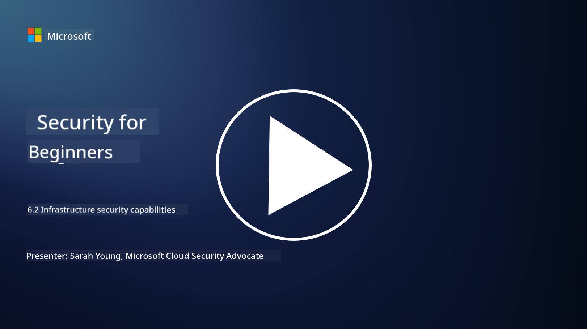

<!--
CO_OP_TRANSLATOR_METADATA:
{
  "original_hash": "7d79ba0e7668b3bdae1fba7aa047f6c0",
  "translation_date": "2025-09-04T00:09:51+00:00",
  "source_file": "6.2 Infrastructure security capabilities.md",
  "language_code": "en"
}
-->
# Infrastructure security capabilities

In this section, we’ll dive deeper into the core tools and capabilities used in infrastructure security.

**Introduction**

In this lesson, we’ll explore:

- What is vulnerability management?

- What is CSPM?

- What is CNAPP?

## What is vulnerability management?

Vulnerability management is a structured process for identifying, evaluating, prioritizing, mitigating, and monitoring vulnerabilities in computer systems, software, networks, and infrastructure. The main goal of vulnerability management is to minimize an organization's exposure to security risks by proactively addressing known vulnerabilities before they can be exploited by attackers. Here’s a breakdown of the key steps:

Identification: Scanning and detecting vulnerabilities in the organization’s assets, such as servers, applications, network devices, and endpoints.

Assessment: Analyzing the severity and potential impact of each vulnerability, considering factors like the Common Vulnerability Scoring System (CVSS) score and the business context.

Prioritization: Ranking vulnerabilities based on their risk level and the potential impact on the organization’s operations and data.

Mitigation: Developing and implementing strategies to address or reduce vulnerabilities, such as applying patches, adjusting security settings, or deploying compensating controls.

Verification: Ensuring that the mitigation measures effectively resolved the vulnerabilities.

Continuous Monitoring: Regularly tracking vulnerabilities and potential threats through ongoing scans and assessments.

Vulnerability management is a vital part of cybersecurity, enabling organizations to maintain a strong security posture and reduce the likelihood of security breaches. Examples of vulnerability management tools include Defender for Cloud, Nessus, and Qualys.

## What is CSPM?

Cloud Security Posture Management (CSPM) refers to a set of tools, processes, and practices designed to evaluate, monitor, and enforce security configurations and best practices in cloud environments. CSPM solutions help organizations detect and fix misconfigurations, security gaps, and compliance issues in their cloud infrastructure, whether it’s on Amazon Web Services (AWS), Microsoft Azure, Google Cloud Platform (GCP), or other cloud providers.

Key aspects of CSPM include:

- Configuration Assessment: Scanning cloud resources and services to identify misconfigurations, insecure settings, and deviations from security best practices.

- Security Policy Enforcement: Enforcing security policies and compliance standards across cloud environments by automatically fixing misconfigurations or generating alerts.

- Continuous Monitoring: Providing ongoing visibility into the security posture of cloud assets and resources, with real-time alerts for security incidents.

- Compliance Reporting: Creating reports and dashboards to demonstrate compliance with regulatory requirements and industry standards.

CSPM helps organizations ensure their cloud infrastructure is secure, compliant, and aligned with best practices, reducing the risk of cloud-related security incidents. Examples of CSPM tools include Defender for Cloud and Snyk.

## What is CNAPP?

CNAPP stands for Cloud-Native Application Protection Platform. It is an integrated cloud-native software platform that simplifies the process of monitoring, detecting, and responding to potential cloud security threats and vulnerabilities. By combining multiple tools and capabilities into a single solution, CNAPP reduces complexity and supports the operations of DevOps and DevSecOps teams. CNAPP provides end-to-end cloud and application security throughout the entire CI/CD application lifecycle, from development to production. It addresses the industry’s need for modern tools to monitor cloud security, manage posture, prevent breaches, and maintain control. CNAPP solutions enable security teams to assess and respond to risks in the cloud environment. Some of the key features of CNAPP include enhanced visibility, risk quantification, secure software development, and a unified cloud security solution. CNAPP integrates traditionally siloed cloud security solutions into a single user interface, making it easier for organizations to protect their entire cloud application footprint. CNAPPs consolidate multiple cloud-native security tools and data sources, such as container scanning, cloud security posture management, infrastructure as code scanning, cloud infrastructure entitlements management, and runtime cloud workload protection platforms.

## Further reading
- [What is CSPM? | Microsoft Security](https://www.microsoft.com/security/business/security-101/what-is-cspm?WT.mc_id=academic-96948-sayoung)
- [What is Cloud Security Posture Management (CSPM)? | HackerOne](https://www.hackerone.com/knowledge-center/what-cloud-security-posture-management)
- [Function of cloud security posture management - Cloud Adoption Framework | Microsoft Learn](https://learn.microsoft.com/azure/cloud-adoption-framework/organize/cloud-security-posture-management?WT.mc_id=academic-96948-sayoung)
- [What Is a CNAPP? | Microsoft Security](https://www.microsoft.com/security/business/security-101/what-is-cnapp?WT.mc_id=academic-96948-sayoung)
- [Why Everyone Is Talking About CNAPP (forbes.com)](https://www.forbes.com/sites/forbestechcouncil/2021/12/10/why-everyone-is-talking-about-cnapp/?sh=567275ca1549)
- [Improving Your Multi-Cloud Security with a Cloud-Native Application Protection Platform (CNAPP)](https://www.youtube.com/watch?v=5w42kQ_QjZg&t=212s)

---

**Disclaimer**:  
This document has been translated using the AI translation service [Co-op Translator](https://github.com/Azure/co-op-translator). While we strive for accuracy, please note that automated translations may contain errors or inaccuracies. The original document in its native language should be regarded as the authoritative source. For critical information, professional human translation is recommended. We are not responsible for any misunderstandings or misinterpretations resulting from the use of this translation.