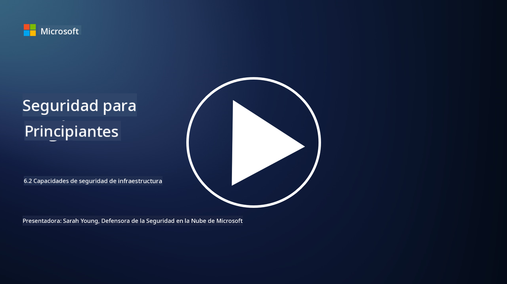

<!--
CO_OP_TRANSLATOR_METADATA:
{
  "original_hash": "7d79ba0e7668b3bdae1fba7aa047f6c0",
  "translation_date": "2025-09-03T18:30:49+00:00",
  "source_file": "6.2 Infrastructure security capabilities.md",
  "language_code": "es"
}
-->
# Capacidades de seguridad de infraestructura

En esta sección, cubriremos más detalles sobre las herramientas y capacidades principales que se utilizan en la seguridad de infraestructura.

**Introducción**

En esta lección, cubriremos:

- ¿Qué es la gestión de vulnerabilidades?

- ¿Qué es CSPM?

- ¿Qué es CNAPP?

## ¿Qué es la gestión de vulnerabilidades?

La gestión de vulnerabilidades es un proceso sistemático para identificar, evaluar, priorizar, mitigar y monitorear vulnerabilidades en sistemas informáticos, software, redes e infraestructura. El objetivo principal de la gestión de vulnerabilidades es reducir la exposición de una organización a riesgos de seguridad al abordar proactivamente las vulnerabilidades conocidas antes de que puedan ser explotadas por actores maliciosos. Aquí hay un resumen de los pasos clave involucrados:

Identificación: Escanear y descubrir vulnerabilidades en los activos de la organización, que pueden incluir servidores, aplicaciones, dispositivos de red y puntos finales.

Evaluación: Analizar la gravedad y el impacto potencial de cada vulnerabilidad basándose en factores como la puntuación del Sistema de Puntuación de Vulnerabilidades Comunes (CVSS) y el contexto empresarial.

Priorización: Clasificar las vulnerabilidades según su nivel de riesgo y el impacto potencial en las operaciones y datos de la organización.

Mitigación: Desarrollar e implementar estrategias para remediar o mitigar vulnerabilidades, lo que puede incluir aplicar parches, configurar ajustes de seguridad o implementar controles compensatorios.

Verificación: Confirmar que las medidas de mitigación fueron efectivas para abordar las vulnerabilidades.

Monitoreo Continuo: Seguimiento constante de vulnerabilidades y amenazas potenciales, con escaneos y evaluaciones regulares de vulnerabilidades.

La gestión de vulnerabilidades es un componente crítico de la ciberseguridad, ayudando a las organizaciones a mantener una postura de seguridad sólida y reducir la probabilidad de brechas de seguridad. Ejemplos de herramientas de gestión de vulnerabilidades incluyen Defender for Cloud, Nessus y Qualys.

## ¿Qué es CSPM?

La Gestión de Postura de Seguridad en la Nube (CSPM, por sus siglas en inglés) es un conjunto de herramientas, procesos y prácticas diseñadas para evaluar, monitorear y aplicar configuraciones de seguridad y mejores prácticas en entornos de nube. Las soluciones CSPM ayudan a las organizaciones a identificar y remediar configuraciones incorrectas, brechas de seguridad y violaciones de cumplimiento en su infraestructura de nube, como en Amazon Web Services (AWS), Microsoft Azure, Google Cloud Platform (GCP) y otros proveedores de nube.

Aspectos clave de CSPM incluyen:

- Evaluación de Configuración: Escanear recursos y servicios en la nube para identificar configuraciones incorrectas, ajustes inseguros y desviaciones de las mejores prácticas de seguridad.

- Aplicación de Políticas de Seguridad: Aplicar políticas de seguridad y estándares de cumplimiento en entornos de nube mediante la remediación automática de configuraciones incorrectas o la generación de alertas.

- Monitoreo Continuo: Proporcionar visibilidad continua sobre la postura de seguridad de los activos y recursos en la nube, con alertas en tiempo real para incidentes de seguridad.

- Informes de Cumplimiento: Generar informes y paneles para demostrar el cumplimiento con requisitos regulatorios y estándares de la industria.

CSPM ayuda a las organizaciones a garantizar que su infraestructura en la nube sea segura, cumpla con las normativas y esté alineada con las mejores prácticas, reduciendo el riesgo de incidentes de seguridad relacionados con la nube. Ejemplos de herramientas CSPM incluyen Defender for Cloud y Snyk.

## ¿Qué es CNAPP?

CNAPP significa Plataforma de Protección de Aplicaciones Nativas de la Nube. Es una plataforma de software todo-en-uno diseñada para simplificar el monitoreo, la detección y la acción frente a posibles amenazas y vulnerabilidades de seguridad en la nube. Combina múltiples herramientas y capacidades en una solución de software única para minimizar la complejidad y facilitar las operaciones de los equipos de DevOps y DevSecOps. CNAPP ofrece seguridad integral para la nube y las aplicaciones a lo largo de todo el ciclo de vida de CI/CD, desde el desarrollo hasta la producción. Aborda la necesidad de la industria de herramientas modernas de monitoreo de seguridad en la nube, gestión de postura, prevención de brechas y control. Las soluciones CNAPP proporcionan a los equipos de seguridad la capacidad de cuantificar y responder a riesgos en el entorno de la nube. Algunas de las características de CNAPP incluyen visibilidad mejorada, cuantificación de riesgos, desarrollo de software seguro y una solución de seguridad en la nube combinada. CNAPP integra múltiples soluciones de seguridad en la nube que tradicionalmente han estado aisladas en una única interfaz de usuario, facilitando a las organizaciones la protección de toda su huella de aplicaciones en la nube. Los CNAPP consolidan múltiples herramientas de seguridad nativas de la nube y fuentes de datos, incluyendo escaneo de contenedores, gestión de postura de seguridad en la nube, escaneo de infraestructura como código, gestión de permisos de infraestructura en la nube y plataformas de protección de cargas de trabajo en tiempo de ejecución en la nube.

## Lecturas adicionales
- [What is CSPM? | Microsoft Security](https://www.microsoft.com/security/business/security-101/what-is-cspm?WT.mc_id=academic-96948-sayoung)
- [What is Cloud Security Posture Management (CSPM)? | HackerOne](https://www.hackerone.com/knowledge-center/what-cloud-security-posture-management)
- [Function of cloud security posture management - Cloud Adoption Framework | Microsoft Learn](https://learn.microsoft.com/azure/cloud-adoption-framework/organize/cloud-security-posture-management?WT.mc_id=academic-96948-sayoung)
- [What Is a CNAPP? | Microsoft Security](https://www.microsoft.com/security/business/security-101/what-is-cnapp?WT.mc_id=academic-96948-sayoung)
- [Why Everyone Is Talking About CNAPP (forbes.com)](https://www.forbes.com/sites/forbestechcouncil/2021/12/10/why-everyone-is-talking-about-cnapp/?sh=567275ca1549)
- [Improving Your Multi-Cloud Security with a Cloud-Native Application Protection Platform (CNAPP)](https://www.youtube.com/watch?v=5w42kQ_QjZg&t=212s)

---

**Descargo de responsabilidad**:  
Este documento ha sido traducido utilizando el servicio de traducción automática [Co-op Translator](https://github.com/Azure/co-op-translator). Aunque nos esforzamos por garantizar la precisión, tenga en cuenta que las traducciones automatizadas pueden contener errores o imprecisiones. El documento original en su idioma nativo debe considerarse como la fuente autorizada. Para información crítica, se recomienda una traducción profesional realizada por humanos. No nos hacemos responsables de malentendidos o interpretaciones erróneas que puedan surgir del uso de esta traducción.