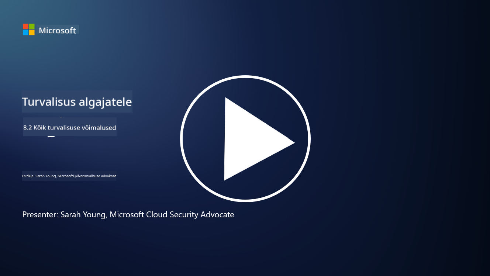

<!--
CO_OP_TRANSLATOR_METADATA:
{
  "original_hash": "b6bb7175672298d1e2f73ba7e0006f95",
  "translation_date": "2025-10-11T11:30:15+00:00",
  "source_file": "8.2 AI security capabilities.md",
  "language_code": "et"
}
-->
# AI turvalisuse võimalused

## Millised tööriistad ja võimalused on praegu olemas AI-süsteemide turvamiseks?

Praegu on saadaval mitmeid tööriistu ja võimalusi AI-süsteemide turvamiseks:

-   **Counterfit**: Avatud lähtekoodiga automatiseerimistööriist AI-süsteemide turvatestimiseks, mis on loodud aitama organisatsioonidel läbi viia AI turvariskide hindamist ja tagama nende algoritmide vastupidavust.
-   **Adversariaalse masinõppe tööriistad**: Need tööriistad hindavad masinõppemudelite vastupidavust ründavate rünnakute vastu, aidates tuvastada ja leevendada haavatavusi.
-   **AI turvalisuse tööriistakomplektid**: Saadaval on avatud lähtekoodiga tööriistakomplektid, mis pakuvad ressursse AI-süsteemide turvamiseks, sealhulgas teeke ja raamistikke turvameetmete rakendamiseks.
-   **Koostööplatvormid**: Ettevõtete ja AI kogukondade partnerlused, et arendada AI-spetsiifilisi turvaskannereid ja muid tööriistu AI tarneahela turvamiseks.

Need tööriistad ja võimalused on osa kasvavast valdkonnast, mis on pühendatud AI-süsteemide turvalisuse parandamisele erinevate ohtude vastu. Need esindavad kombinatsiooni teadusuuringutest, praktilistest tööriistadest ja tööstuslikust koostööst, mille eesmärk on lahendada AI-tehnoloogiate ainulaadseid väljakutseid.

## Mis on AI red teamimine? Kuidas see erineb traditsioonilisest turva-red teamimisest?

AI red teamimine erineb traditsioonilisest turva-red teamimisest mitmel olulisel viisil:

-   **Fookus AI-süsteemidele**: AI red teamimine keskendub spetsiaalselt AI-süsteemide, nagu masinõppemudelite ja andmetorustike, ainulaadsetele haavatavustele, mitte traditsioonilisele IT-infrastruktuurile.
-   **AI käitumise testimine**: See hõlmab AI-süsteemide reaktsioonide testimist ebatavalistele või ootamatutele sisenditele, mis võib paljastada haavatavusi, mida ründajad saaksid ära kasutada.
-   **AI rikete uurimine**: AI red teamimine uurib nii pahatahtlikke kui ka heatahtlikke rikkeid, võttes arvesse laiemat valikut isikuid ja võimalikke süsteemirikkeid, mis ulatuvad kaugemale pelgalt turvarikkumistest.
-   **Prompt injection ja sisu genereerimine**: AI red teamimine hõlmab ka rikete otsimist, nagu prompt injection, kus ründajad manipuleerivad AI-süsteeme, et need toodaksid kahjulikku või alusetut sisu.
-   **Eetiline ja vastutustundlik AI**: See on osa vastutustundliku AI tagamisest, veendudes, et AI-süsteemid on vastupidavad katsetele panna neid käituma soovimatul viisil.

Kokkuvõttes on AI red teamimine laiendatud praktika, mis hõlmab mitte ainult turvahaavatavuste uurimist, vaid ka muude AI-tehnoloogiatele spetsiifiliste süsteemirikete testimist. See on oluline osa turvalisemate AI-süsteemide arendamisel, et mõista ja leevendada uusi riske, mis kaasnevad AI kasutuselevõtuga.

## Lisalugemist

 - [Microsoft AI Red Team ehitab turvalisema AI tulevikku | Microsoft Security Blog](https://www.microsoft.com/en-us/security/blog/2023/08/07/microsoft-ai-red-team-building-future-of-safer-ai/?WT.mc_id=academic-96948-sayoung)
 - [Microsofti avatud automatiseerimisraamistiku tutvustus generatiivsete AI-süsteemide red teamimiseks | Microsoft Security Blog](https://www.microsoft.com/en-us/security/blog/2024/02/22/announcing-microsofts-open-automation-framework-to-red-team-generative-ai-systems/?WT.mc_id=academic-96948-sayoung)
 - [AI turvalisuse tööriistad: avatud lähtekoodiga tööriistakomplekt | Wiz](https://www.wiz.io/academy/ai-security-tools)

---

**Lahtiütlus**:  
See dokument on tõlgitud, kasutades AI tõlketeenust [Co-op Translator](https://github.com/Azure/co-op-translator). Kuigi püüame tagada täpsust, palume arvestada, et automaatsed tõlked võivad sisaldada vigu või ebatäpsusi. Algne dokument selle algses keeles tuleks lugeda autoriteetseks allikaks. Olulise teabe puhul soovitame kasutada professionaalset inimtõlget. Me ei vastuta selle tõlke kasutamisest tulenevate arusaamatuste või valesti tõlgenduste eest.