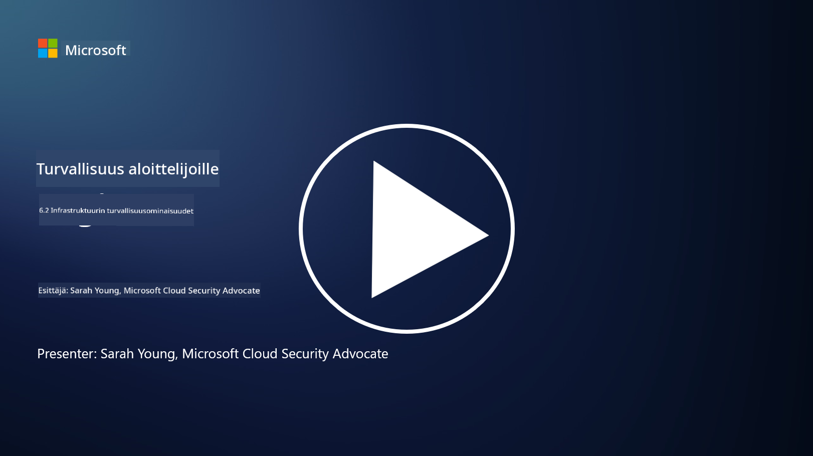

<!--
CO_OP_TRANSLATOR_METADATA:
{
  "original_hash": "7d79ba0e7668b3bdae1fba7aa047f6c0",
  "translation_date": "2025-09-03T20:52:52+00:00",
  "source_file": "6.2 Infrastructure security capabilities.md",
  "language_code": "fi"
}
-->
# Infrastruktuurin turvallisuusominaisuudet

Tässä osiossa käsitellään tarkemmin infrastruktuurin turvallisuuteen liittyviä keskeisiä työkaluja ja ominaisuuksia.

**Johdanto**

Tässä oppitunnissa käsitellään:

- Mitä haavoittuvuuksien hallinta tarkoittaa?

- Mitä CSPM tarkoittaa?

- Mitä CNAPP tarkoittaa?

## Mitä haavoittuvuuksien hallinta tarkoittaa?

Haavoittuvuuksien hallinta on järjestelmällinen prosessi, jossa tunnistetaan, arvioidaan, priorisoidaan, lievennetään ja seurataan tietokonejärjestelmien, ohjelmistojen, verkkojen ja infrastruktuurin haavoittuvuuksia. Haavoittuvuuksien hallinnan päätavoitteena on vähentää organisaation altistumista turvallisuusriskeille käsittelemällä tunnettuja haavoittuvuuksia ennakoivasti ennen kuin haitalliset toimijat voivat hyödyntää niitä. Tässä on yleiskatsaus keskeisiin vaiheisiin:

Tunnistaminen: Organisaation omaisuuserien, kuten palvelimien, sovellusten, verkkolaitteiden ja päätelaitteiden haavoittuvuuksien skannaus ja löytäminen.

Arviointi: Haavoittuvuuksien vakavuuden ja mahdollisen vaikutuksen arviointi tekijöiden, kuten Common Vulnerability Scoring System (CVSS) -pisteytyksen ja liiketoimintayhteyden, perusteella.

Priorisointi: Haavoittuvuuksien luokittelu niiden riskitason ja mahdollisen vaikutuksen perusteella organisaation toimintaan ja tietoihin.

Lieventäminen: Strategioiden kehittäminen ja toteuttaminen haavoittuvuuksien korjaamiseksi tai lieventämiseksi, kuten päivitysten asentaminen, turvallisuusasetusten määrittäminen tai kompensoivien kontrollien käyttöönotto.

Vahvistaminen: Varmistaminen, että lieventämistoimenpiteet ovat tehokkaita haavoittuvuuksien käsittelyssä.

Jatkuva seuranta: Haavoittuvuuksien ja mahdollisten uhkien jatkuva seuranta säännöllisten haavoittuvuusskannausten ja arviointien avulla.

Haavoittuvuuksien hallinta on keskeinen osa kyberturvallisuutta, ja se auttaa organisaatioita ylläpitämään vahvaa turvallisuusasemaa ja vähentämään tietoturvaloukkausten todennäköisyyttä. Esimerkkejä haavoittuvuuksien hallintatyökaluista ovat Defender for Cloud, Nessus ja Qualys.

## Mitä CSPM tarkoittaa?

Cloud Security Posture Management (CSPM) on joukko työkaluja, prosesseja ja käytäntöjä, jotka on suunniteltu arvioimaan, seuraamaan ja valvomaan turvallisuusasetuksia ja parhaita käytäntöjä pilviympäristöissä. CSPM-ratkaisut auttavat organisaatioita tunnistamaan ja korjaamaan virheellisiä asetuksia, turvallisuuspuutteita ja vaatimustenmukaisuuden rikkomuksia pilvi-infrastruktuurissa, kuten Amazon Web Services (AWS), Microsoft Azure, Google Cloud Platform (GCP) ja muilla pilvipalveluntarjoajilla.

CSPM:n keskeiset osa-alueet:

- Konfiguraatioarviointi: Pilviresurssien ja -palveluiden skannaus virheellisten asetusten, turvattomien määritysten ja turvallisuusparhaiden käytäntöjen poikkeamien tunnistamiseksi.

- Turvallisuuspolitiikan valvonta: Turvallisuuspolitiikkojen ja vaatimustenmukaisuusstandardien valvonta pilviympäristöissä automaattisesti korjaamalla virheellisiä asetuksia tai luomalla hälytyksiä.

- Jatkuva seuranta: Pilviomaisuuden ja -resurssien turvallisuusaseman jatkuva näkyvyys reaaliaikaisilla hälytyksillä turvallisuuspoikkeamista.

- Vaatimustenmukaisuusraportointi: Raporttien ja koontinäyttöjen luominen, jotka osoittavat vaatimustenmukaisuuden sääntelyvaatimusten ja alan standardien kanssa.

CSPM auttaa organisaatioita varmistamaan, että heidän pilvi-infrastruktuurinsa on turvallinen, vaatimustenmukainen ja linjassa parhaiden käytäntöjen kanssa, mikä vähentää pilviin liittyvien tietoturvapoikkeamien riskiä. Esimerkkejä CSPM-työkaluista ovat Defender for Cloud ja Snyk.

## Mitä CNAPP tarkoittaa?

CNAPP tarkoittaa Cloud-Native Application Protection Platform. Se on kokonaisvaltainen pilvinatiivien sovellusten suojausalusta, joka yksinkertaistaa pilviturvallisuusuhkien ja haavoittuvuuksien seurantaa, havaitsemista ja niihin reagointia. Se yhdistää useita työkaluja ja ominaisuuksia yhdeksi ohjelmistoratkaisuksi, mikä vähentää monimutkaisuutta ja helpottaa DevOps- ja DevSecOps-tiimien toimintaa. CNAPP tarjoaa kokonaisvaltaisen pilvi- ja sovellusturvallisuuden koko CI/CD-sovelluskehityksen elinkaaren ajan, kehityksestä tuotantoon. Se vastaa alan tarpeeseen nykyaikaisille pilviturvallisuuden seurantatyökaluille, asennonhallinnalle, rikkomusten estämiselle ja kontrollityökaluille. CNAPP-ratkaisut antavat turvallisuustiimeille mahdollisuuden arvioida ja reagoida pilviympäristön riskeihin. Joitakin CNAPP:n ominaisuuksia ovat parannettu näkyvyys, riskien arviointi, turvallinen ohjelmistokehitys ja yhdistetty pilviturvallisuusratkaisu. CNAPP integroi useita perinteisesti erillisiä pilviturvallisuusratkaisuja yhteen käyttöliittymään, mikä helpottaa organisaatioiden koko pilvisovellusympäristön suojaamista. CNAPP:t yhdistävät useita pilvinatiiveja turvallisuustyökaluja ja tietolähteitä, kuten konttiskannaus, pilviturvallisuuden asennonhallinta, infrastruktuurin koodiskannaus, pilvi-infrastruktuurin käyttöoikeuksien hallinta ja pilvityökuormien suojausalustat.

## Lisälukemista
- [What is CSPM? | Microsoft Security](https://www.microsoft.com/security/business/security-101/what-is-cspm?WT.mc_id=academic-96948-sayoung)
- [What is Cloud Security Posture Management (CSPM)? | HackerOne](https://www.hackerone.com/knowledge-center/what-cloud-security-posture-management)
- [Function of cloud security posture management - Cloud Adoption Framework | Microsoft Learn](https://learn.microsoft.com/azure/cloud-adoption-framework/organize/cloud-security-posture-management?WT.mc_id=academic-96948-sayoung)
- [What Is a CNAPP? | Microsoft Security](https://www.microsoft.com/security/business/security-101/what-is-cnapp?WT.mc_id=academic-96948-sayoung)
- [Why Everyone Is Talking About CNAPP (forbes.com)](https://www.forbes.com/sites/forbestechcouncil/2021/12/10/why-everyone-is-talking-about-cnapp/?sh=567275ca1549)
- [Improving Your Multi-Cloud Security with a Cloud-Native Application Protection Platform (CNAPP)](https://www.youtube.com/watch?v=5w42kQ_QjZg&t=212s)

---

**Vastuuvapauslauseke**:  
Tämä asiakirja on käännetty käyttämällä tekoälypohjaista käännöspalvelua [Co-op Translator](https://github.com/Azure/co-op-translator). Vaikka pyrimme tarkkuuteen, huomioithan, että automaattiset käännökset voivat sisältää virheitä tai epätarkkuuksia. Alkuperäistä asiakirjaa sen alkuperäisellä kielellä tulisi pitää ensisijaisena lähteenä. Kriittisen tiedon osalta suositellaan ammattimaista ihmiskäännöstä. Emme ole vastuussa väärinkäsityksistä tai virhetulkinnoista, jotka johtuvat tämän käännöksen käytöstä.