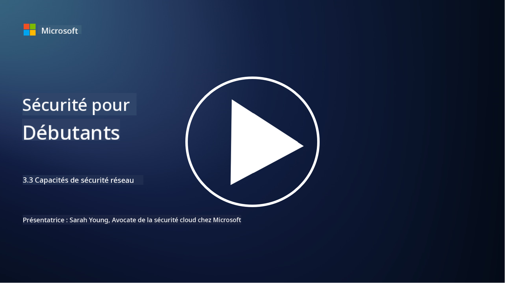

<!--
CO_OP_TRANSLATOR_METADATA:
{
  "original_hash": "c3aba077bb98eebc925dd58d870229ab",
  "translation_date": "2025-09-03T18:19:48+00:00",
  "source_file": "3.3 Network security capabilities.md",
  "language_code": "fr"
}
-->
# Capacités de sécurité réseau

Dans cette leçon, nous allons découvrir les capacités suivantes qui peuvent être utilisées pour sécuriser un réseau :

 - Pare-feu traditionnels
 - Pare-feu d'applications web
 - Groupes de sécurité cloud
 - CDN
 - Répartiteurs de charge
 - Hôtes bastion
 - VPN
 - Protection contre les attaques DDoS

## Pare-feu traditionnels

Les pare-feu traditionnels sont des dispositifs de sécurité qui contrôlent et surveillent le trafic réseau entrant et sortant en fonction de règles de sécurité prédéfinies. Ils agissent comme une barrière entre un réseau interne de confiance et des réseaux externes non fiables, filtrant le trafic pour empêcher les accès non autorisés et les menaces potentielles.

## Pare-feu d'applications web

Les pare-feu d'applications web (WAF) sont des pare-feu spécialisés conçus pour protéger les applications web contre diverses attaques, telles que les injections SQL, les scripts intersites et autres vulnérabilités. Ils analysent les requêtes et réponses HTTP pour identifier et bloquer le trafic malveillant ciblant les applications web.

## Groupes de sécurité cloud

Les groupes de sécurité sont une fonctionnalité de sécurité réseau fondamentale fournie par les fournisseurs de services cloud. Ils agissent comme des pare-feu virtuels qui contrôlent le trafic entrant et sortant vers et depuis les ressources cloud, telles que les machines virtuelles (VM) et les instances. Les groupes de sécurité permettent aux organisations de définir des règles déterminant les types de trafic autorisés et refusés, ajoutant une couche de défense supplémentaire aux déploiements cloud.

## Réseau de diffusion de contenu (CDN)

Un réseau de diffusion de contenu est un réseau distribué de serveurs situés dans divers endroits géographiques. Les CDN améliorent les performances et la disponibilité des sites web en mettant en cache le contenu et en le servant depuis des serveurs plus proches de l'utilisateur. Ils offrent également un certain niveau de protection contre les attaques DDoS en répartissant le trafic sur plusieurs emplacements de serveurs.

## Répartiteurs de charge

Les répartiteurs de charge distribuent le trafic réseau entrant entre plusieurs serveurs pour optimiser l'utilisation des ressources, garantir une haute disponibilité et améliorer les performances des applications. Ils aident à prévenir la surcharge des serveurs et à maintenir des temps de réponse efficaces, renforçant ainsi la résilience du réseau.

## Hôtes bastion

Les hôtes bastion sont des serveurs hautement sécurisés et isolés qui offrent un accès contrôlé à un réseau depuis un réseau externe non fiable (comme Internet). Ils servent de points d'entrée pour les administrateurs afin d'accéder aux systèmes internes de manière sécurisée. Les hôtes bastion sont généralement configurés avec des mesures de sécurité renforcées pour minimiser la surface d'attaque.

## Réseaux privés virtuels (VPN)

Les VPN créent des tunnels cryptés entre l'appareil d'un utilisateur et un serveur distant, garantissant une communication sécurisée et privée sur des réseaux potentiellement non sécurisés comme Internet. Les VPN sont couramment utilisés pour fournir un accès à distance aux réseaux internes, permettant aux utilisateurs d'accéder aux ressources comme s'ils étaient physiquement sur le même réseau.

## Outils de protection contre les attaques DDoS

Les outils et services de protection contre les attaques DDoS (Déni de service distribué) sont conçus pour atténuer l'impact des attaques DDoS, où plusieurs appareils compromis inondent un réseau ou un service pour le submerger. Les solutions de protection DDoS identifient et filtrent le trafic malveillant, garantissant que le trafic légitime peut toujours atteindre sa destination prévue.

## Lectures complémentaires

- [Qu'est-ce qu'un pare-feu ? - Cisco](https://www.cisco.com/c/en/us/products/security/firewalls/what-is-a-firewall.html#~types-of-firewalls)
- [Que fait réellement un pare-feu ? (howtogeek.com)](https://www.howtogeek.com/144269/htg-explains-what-firewalls-actually-do/)
- [Qu'est-ce qu'un pare-feu ? Fonctionnement et types de pare-feu (kaspersky.com)](https://www.kaspersky.com/resource-center/definitions/firewall)
- [Groupe de sécurité réseau - fonctionnement | Microsoft Learn](https://learn.microsoft.com/azure/virtual-network/network-security-group-how-it-works)
- [Introduction au réseau de diffusion de contenu Azure (CDN) - Formation | Microsoft Learn](https://learn.microsoft.com/training/modules/intro-to-azure-content-delivery-network/?WT.mc_id=academic-96948-sayoung)
- [Qu'est-ce qu'un réseau de diffusion de contenu (CDN) ? - Azure | Microsoft Learn](https://learn.microsoft.com/azure/cdn/cdn-overview?WT.mc_id=academic-96948-sayoung)
- [Qu'est-ce que l'équilibrage de charge ? Fonctionnement des répartiteurs de charge (nginx.com)](https://www.nginx.com/resources/glossary/load-balancing/)
- [Hôtes bastion vs. VPN · Tailscale](https://tailscale.com/learn/bastion-hosts-vs-vpns/)
- [Qu'est-ce qu'un VPN ? Fonctionnement et types de VPN (kaspersky.com)](https://www.kaspersky.com/resource-center/definitions/what-is-a-vpn)
- [Introduction à la protection Azure contre les attaques DDoS - Formation | Microsoft Learn](https://learn.microsoft.com/training/modules/introduction-azure-ddos-protection/?WT.mc_id=academic-96948-sayoung)
- [Qu'est-ce qu'une attaque DDoS ? | Microsoft Security](https://www.microsoft.com/security/business/security-101/what-is-a-ddos-attack?WT.mc_id=academic-96948-sayoung)

---

**Avertissement** :  
Ce document a été traduit à l'aide du service de traduction automatique [Co-op Translator](https://github.com/Azure/co-op-translator). Bien que nous nous efforcions d'assurer l'exactitude, veuillez noter que les traductions automatisées peuvent contenir des erreurs ou des inexactitudes. Le document original dans sa langue d'origine doit être considéré comme la source faisant autorité. Pour des informations critiques, il est recommandé de recourir à une traduction professionnelle réalisée par un humain. Nous déclinons toute responsabilité en cas de malentendus ou d'interprétations erronées résultant de l'utilisation de cette traduction.