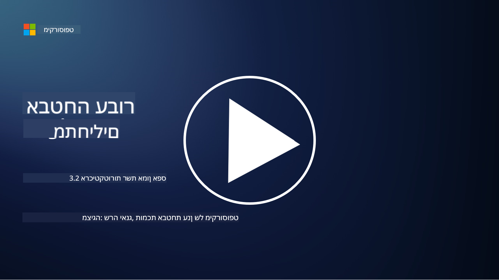

<!--
CO_OP_TRANSLATOR_METADATA:
{
  "original_hash": "680d6e14d9d33fc471c22f44679713f8",
  "translation_date": "2025-09-03T21:14:59+00:00",
  "source_file": "3.2 Networking zero trust architecture.md",
  "language_code": "he"
}
-->
# ארכיטקטורות אפס אמון ברשתות

הרשת מספקת שכבה קריטית בבקרות אפס אמון, בשיעור זה נלמד יותר על הנושאים הבאים:

- מהי חלוקת רשת (Network Segmentation)?
- כיצד חלוקת רשת מסייעת ליישם אפס אמון?
- מהי הצפנה מקצה לקצה?

## מהי חלוקת רשת?

חלוקת רשת היא פרקטיקה של חלוקת רשת למקטעים קטנים ומבודדים או תת-רשתות. כל מקטע מבודד מהאחרים, והגישה בין המקטעים נשלטת ומוגבלת על פי מדיניות אבטחה ספציפית. חלוקת רשת משמשת לשיפור האבטחה על ידי צמצום ההשפעה של פריצות פוטנציאליות והגבלת תנועה רוחבית של תוקפים בתוך הרשת.

באמצעות יישום חלוקת רשת, ארגון יכול ליצור "אזורים" שמפרידים בין סוגים שונים של משתמשים, יישומים ונתונים. הדבר מצמצם את שטח התקיפה וממזער את הנזק הפוטנציאלי שנגרם כתוצאה מאירוע אבטחה. חלוקת רשת יכולה להתבצע באמצעות טכנולוגיות כמו רשתות מקומיות וירטואליות (VLANs), חומות אש ובקרות גישה.

## כיצד חלוקת רשת מסייעת ליישם אפס אמון?

חלוקת רשת מתיישרת היטב עם עקרונות מודל אפס אמון. בארכיטקטורת אפס אמון, חלוקת רשת מסייעת לאכוף את עקרון "המינימום ההכרחי" על ידי הבטחת גישה של משתמשים ומכשירים רק למשאבים ולשירותים הספציפיים שהם צריכים כדי לבצע את משימותיהם. באמצעות חלוקת הרשת לאזורים קטנים יותר, ארגונים יכולים ליישם בקרות גישה מחמירות, לבודד נכסים קריטיים ולמנוע תנועה רוחבית של תוקפים.

חלוקת רשת גם מסייעת באכיפת בקרות גישה מבוססות זהות, שבהן משתמשים ומכשירים מאומתים ומורשים באופן יסודי לפני גישה למקטעים ספציפיים. הדבר מונע גישה לא מורשית למשאבים רגישים ומפחית את ההשפעה הפוטנציאלית של אישורי גישה שנפגעו.

## מהי הצפנה מקצה לקצה?

הצפנה מקצה לקצה (E2E) היא אמצעי אבטחה שמבטיח שהנתונים יישארו מוצפנים לאורך כל מסעם מהשולח ועד למקבל. בתהליך זה, הנתונים מוצפנים בצד השולח, ורק המקבל מחזיק במפתח הפענוח שמאפשר לפתוח ולקרוא את הנתונים. תהליכי ההצפנה והפענוח מתבצעים בנקודות הקצה, מה שהופך את הגישה לנתונים בצורתם הגולמית לקשה מאוד עבור גורמים לא מורשים, כולל ספקי שירותים ומתווכים.

הצפנה מקצה לקצה מספקת רמת סודיות ואבטחה גבוהה להעברת נתונים, גם אם הנתונים עוברים דרך מערכות או רשתות מתווכות שונות. היא משמשת בדרך כלל באפליקציות מסרים מאובטחות, שירותי דואר אלקטרוני ופלטפורמות תקשורת אחרות כדי להגן על מידע רגיש מפני יירוט וגישה לא מורשית.

שיטת הצפנה זו מבטיחה שגם אם תוקפים מצליחים לגשת לנתונים בזמן שהם מועברים, הם יראו רק תוכן מוצפן שאין לו משמעות ללא מפתח הפענוח. הצפנה מקצה לקצה משחקת תפקיד קריטי בשמירה על פרטיות המשתמשים והגנה על מידע רגיש מפני חשיפה לגורמים לא מורשים.

## מהו SASE?

SASE הוא ראשי תיבות של "Secure Access Service Edge", והוא מסגרת וארכיטקטורת אבטחת סייבר שמשלבת אבטחת רשת ויכולות רשת רחבת-טווח (WAN) לשירות מבוסס ענן אחד. SASE נועד לספק גישה מאובטחת ומדרגית למשאבי רשת, יישומים ונתונים עבור משתמשים מרוחקים וניידים, תוך פישוט ניהול הרשת והפחתת המורכבות של ארכיטקטורות רשת ואבטחה מסורתיות.

מאפיינים ורכיבים מרכזיים של SASE כוללים:

1. **מבוסס ענן:** SASE מסופק כשירות ענן, כלומר פונקציות האבטחה והרשת מסופקות מהענן במקום להסתמך על חומרה ומכשירים מקומיים מסורתיים.

2. **שילוב אבטחה ורשת:** SASE משלב שירותי אבטחה שונים כמו שערי אינטרנט מאובטחים (SWG), חומת אש כשירות (FWaaS), מניעת אובדן נתונים (DLP), גישה לרשת אפס אמון (ZTNA) ואופטימיזציית WAN עם יכולות רשת רחבת-טווח. שילוב זה מסייע לייעל את פעולות האבטחה והרשת.

3. **אפס אמון:** SASE פועל על פי עקרון אפס אמון, כלומר הוא אוכף בקרות גישה מחמירות ומדיניות גישה מינימלית הכרחית. משתמשים ומכשירים אינם נחשבים אמינים כברירת מחדל, והם חייבים להיות מאומתים ומורשים לפני גישה למשאבים.

4. **ממוקד זהות:** SASE מתמקד בזהויות משתמשים ומכשירים כבסיס לבקרת גישה. מדיניות מבוססת זהות והקשר משמשת לקביעת הרשאות גישה, והמדיניות מתאימה את עצמה באופן דינמי על בסיס התנהגות המשתמש וההקשר.

5. **מדרגיות וגמישות:** SASE יכול להתרחב בקלות כדי להתאים למספר גדול של משתמשים ומכשירים, מה שהופך אותו למתאים לארגונים עם צרכים מגוונים ומשתנים בתחום הרשת והאבטחה.

SASE רלוונטי במיוחד בעידן המודרני של עבודה מרחוק ואימוץ ענן, שכן הוא מספק גישה מקיפה וגמישה לאבטחת וניהול גישה לרשת. הוא מסייע לארגונים להסתגל לדרישות אבטחה ורשת משתנות תוך שמירה על דגש חזק על מודלים של אבטחה ממוקדת משתמש ואפס אמון.

## קריאה נוספת

- [What Is Network Segmentation? - Cisco](https://www.cisco.com/c/en/us/products/security/what-is-network-segmentation.html#~benefits)
- [What Is Micro-Segmentation? - Cisco](https://www.cisco.com/c/en/us/products/security/what-is-microsegmentation.html)
- [Implementing Network Segmentation and Segregation | Cyber.gov.au](https://www.cyber.gov.au/resources-business-and-government/maintaining-devices-and-systems/system-hardening-and-administration/network-hardening/implementing-network-segmentation-and-segregation)
- [What Is Network Segmentation and Why It Matters | CompTIA](https://www.comptia.org/blog/security-awareness-training-network-segmentation)
- [Network Segmentation: Concepts and Practices (cmu.edu)](https://insights.sei.cmu.edu/blog/network-segmentation-concepts-and-practices/)
- [Secure networks with Zero Trust | Microsoft Learn](https://learn.microsoft.com/security/zero-trust/deploy/networks?WT.mc_id=academic-96948-sayoung)
- [What is end-to-end encryption? | IBM](https://www.ibm.com/topics/end-to-end-encryption)
- [What Is End-to-End Encryption, and Why Does It Matter? (howtogeek.com)](https://www.howtogeek.com/711656/what-is-end-to-end-encryption-and-why-does-it-matter/)
- [Definition of Secure Access Service Edge (SASE) - Gartner Information Technology Glossary](https://www.gartner.com/en/information-technology/glossary/secure-access-service-edge-sase)
- [What Is Secure Access Service Edge (SASE)? | Microsoft Security](https://www.microsoft.com/security/business/security-101/what-is-sase?WT.mc_id=academic-96948-sayoung)

---

**כתב ויתור**:  
מסמך זה תורגם באמצעות שירות תרגום מבוסס בינה מלאכותית [Co-op Translator](https://github.com/Azure/co-op-translator). למרות שאנו שואפים לדיוק, יש לקחת בחשבון שתרגומים אוטומטיים עשויים להכיל שגיאות או אי דיוקים. המסמך המקורי בשפתו המקורית צריך להיחשב כמקור סמכותי. עבור מידע קריטי, מומלץ להשתמש בתרגום מקצועי על ידי אדם. איננו נושאים באחריות לאי הבנות או לפרשנויות שגויות הנובעות משימוש בתרגום זה.