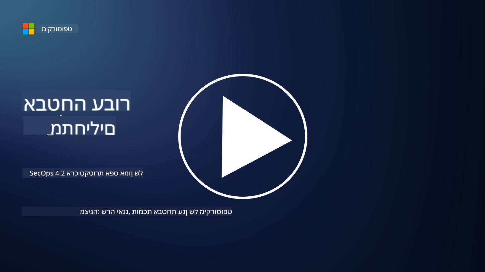

<!--
CO_OP_TRANSLATOR_METADATA:
{
  "original_hash": "45bbdc114e70936816b0b3e7c40189cf",
  "translation_date": "2025-09-03T21:20:16+00:00",
  "source_file": "4.2 SecOps zero trust architecture.md",
  "language_code": "he"
}
-->
# ארכיטקטורת אפס אמון של SecOps

פעולות אבטחה מהוות שני חלקים בארכיטקטורת אפס אמון, ובשיעור זה נלמד על שניהם:

- כיצד יש לבנות ארכיטקטורות IT כדי לאפשר איסוף לוגים מרכזי?

- מהן השיטות המומלצות לפעולות אבטחה בסביבות IT מודרניות?

## כיצד יש לבנות ארכיטקטורות IT כדי לאפשר איסוף לוגים מרכזי?

איסוף לוגים מרכזי הוא מרכיב קריטי בפעולות אבטחה מודרניות. הוא מאפשר לארגונים לאגד לוגים ונתונים ממקורות שונים, כגון שרתים, אפליקציות, התקני רשת וכלי אבטחה, למאגר מרכזי לצורך ניתוח, ניטור ותגובה לאירועים. להלן כמה שיטות מומלצות לבניית ארכיטקטורות IT שתומכות באיסוף לוגים מרכזי:

1. **אינטגרציה של מקורות לוגים**:

- ודאו שכל המכשירים והמערכות הרלוונטיים מוגדרים ליצירת לוגים. זה כולל שרתים, חומות אש, נתבים, מתגים, אפליקציות ומכשירי אבטחה.

- הגדירו את מקורות הלוגים כך שיעבירו את הלוגים למערכת איסוף לוגים מרכזית.

2. **בחירת הכלי SIEM המתאים**:

- בחרו פתרון SIEM (ניהול מידע ואירועים אבטחתיים) שמתאים לצרכים ולגודל הארגון שלכם.

- ודאו שהפתרון הנבחר תומך באיסוף, אגירה, ניתוח ודיווח של לוגים.

3. **יכולת הרחבה וגיבוי**:

- תכננו את הארכיטקטורה כך שתהיה ניתנת להרחבה כדי להתמודד עם מספר גדל של מקורות לוגים ונפח לוגים מוגבר.

- יישמו גיבוי לצורך זמינות גבוהה כדי למנוע שיבושים עקב תקלות חומרה או רשת.

4. **העברת לוגים בצורה מאובטחת**:

- השתמשו בפרוטוקולים מאובטחים כמו TLS/SSL או IPsec להעברת לוגים ממקורות למאגר המרכזי.

- יישמו אימות ובקרות גישה כדי להבטיח שרק מכשירים מורשים יוכלו לשלוח לוגים.

5. **נירמול**:

- תקננו פורמטים של לוגים ונרמלו נתונים כדי להבטיח עקביות ונוחות בניתוח.

6. **אחסון ושמירה**:

- קבעו את תקופת השמירה המתאימה ללוגים בהתאם לדרישות רגולציה ואבטחה.

- אחסנו את הלוגים בצורה מאובטחת, והגנו עליהם מפני גישה בלתי מורשית ושינויים.

## מהן השיטות המומלצות לפעולות אבטחה בסביבות IT מודרניות?

בנוסף לאיסוף לוגים מרכזי, להלן כמה שיטות מומלצות לפעולות אבטחה בסביבות IT מודרניות:

1. **ניטור מתמשך**: יישמו ניטור מתמשך של פעילויות רשת ומערכות כדי לזהות ולהגיב לאיומים בזמן אמת.

2. **מודיעין איומים**: הישארו מעודכנים לגבי איומים ופגיעויות מתפתחים באמצעות שימוש במקורות מודיעין איומים ושירותים.

3. **הדרכת משתמשים**: ערכו הדרכות מודעות לאבטחה באופן קבוע לעובדים כדי לצמצם סיכונים הקשורים להנדסה חברתית והתקפות פישינג.

4. **תוכנית תגובה לאירועים**: פתחו ובדקו תוכנית תגובה לאירועים כדי להבטיח תגובה מהירה ויעילה לאירועי אבטחה.

5. **אוטומציה של אבטחה**: השתמשו בכלי אוטומציה ותזמור אבטחה כדי לייעל תגובה לאירועים ומשימות חוזרות.

6. **גיבוי ושחזור**: יישמו פתרונות גיבוי והתאוששות מאסון חזקים כדי להבטיח זמינות נתונים במקרה של אובדן נתונים או התקפות כופר.

## קריאה נוספת

- [Microsoft Security Best Practices module: Security operations | Microsoft Learn](https://learn.microsoft.com/security/operations/security-operations-videos-and-decks?WT.mc_id=academic-96948-sayoung)
- [Security operations - Cloud Adoption Framework | Microsoft Learn](https://learn.microsoft.com/azure/cloud-adoption-framework/secure/security-operations?WT.mc_id=academic-96948-sayoung)
- [What is Security Operations and Analytics Platform Architecture? A Definition of SOAPA, How It Works, Benefits, and More (digitalguardian.com)](https://www.digitalguardian.com/blog/what-security-operations-and-analytics-platform-architecture-definition-soapa-how-it-works#:~:text=All%20in%20all%2C%20security%20operations%20and%20analytics%20platform,become%20more%20efficient%20and%20operative%20with%20your%20security.)

---

**כתב ויתור**:  
מסמך זה תורגם באמצעות שירות תרגום מבוסס בינה מלאכותית [Co-op Translator](https://github.com/Azure/co-op-translator). בעוד שאנו שואפים לדיוק, יש להיות מודעים לכך שתרגומים אוטומטיים עשויים להכיל שגיאות או אי דיוקים. המסמך המקורי בשפתו המקורית צריך להיחשב כמקור סמכותי. עבור מידע קריטי, מומלץ להשתמש בתרגום מקצועי על ידי אדם. איננו נושאים באחריות לאי הבנות או לפרשנויות שגויות הנובעות משימוש בתרגום זה.