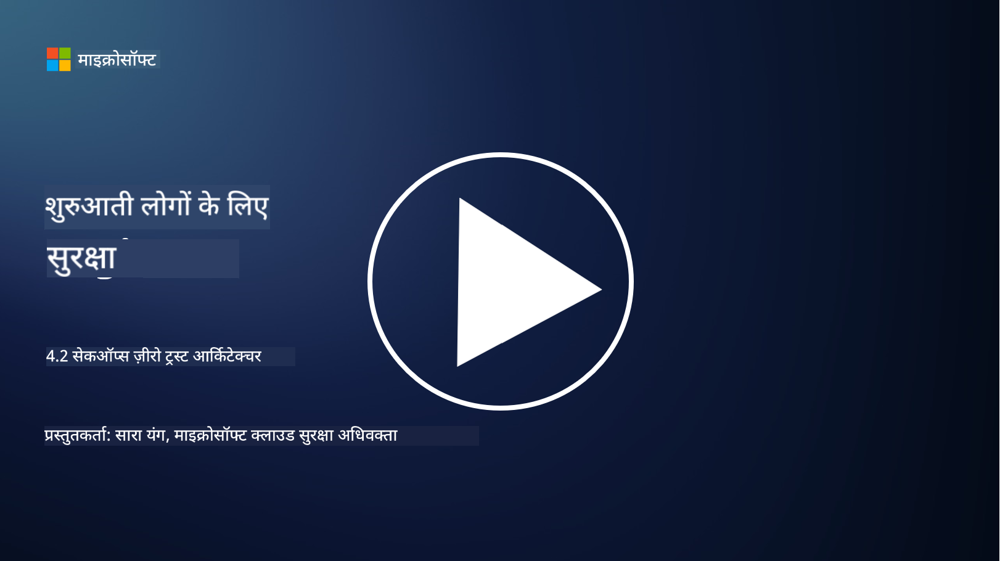

<!--
CO_OP_TRANSLATOR_METADATA:
{
  "original_hash": "45bbdc114e70936816b0b3e7c40189cf",
  "translation_date": "2025-09-03T18:40:35+00:00",
  "source_file": "4.2 SecOps zero trust architecture.md",
  "language_code": "hi"
}
-->
# SecOps ज़ीरो ट्रस्ट आर्किटेक्चर

सुरक्षा संचालन ज़ीरो ट्रस्ट आर्किटेक्चर के दो हिस्सों में बंटा होता है, और इस पाठ में हम दोनों के बारे में जानेंगे:

- आईटी आर्किटेक्चर को कैसे डिज़ाइन किया जाना चाहिए ताकि केंद्रीकृत लॉग संग्रह संभव हो सके?

- आधुनिक आईटी वातावरण में सुरक्षा संचालन के लिए सर्वोत्तम प्रथाएं क्या हैं?

## आईटी आर्किटेक्चर को कैसे डिज़ाइन किया जाना चाहिए ताकि केंद्रीकृत लॉग संग्रह संभव हो सके?

केंद्रीकृत लॉग संग्रह आधुनिक सुरक्षा संचालन का एक महत्वपूर्ण हिस्सा है। यह संगठनों को विभिन्न स्रोतों जैसे सर्वर, एप्लिकेशन, नेटवर्क डिवाइस, और सुरक्षा उपकरणों से लॉग और डेटा को एक केंद्रीय भंडार में एकत्रित करने की अनुमति देता है ताकि उनका विश्लेषण, निगरानी, और घटना प्रतिक्रिया की जा सके। केंद्रीकृत लॉग संग्रह को समर्थन देने के लिए आईटी आर्किटेक्चर बनाने के कुछ सर्वोत्तम प्रथाएं निम्नलिखित हैं:

1. **लॉग स्रोत एकीकरण**:

- सुनिश्चित करें कि सभी संबंधित डिवाइस और सिस्टम लॉग उत्पन्न करने के लिए कॉन्फ़िगर किए गए हैं। इसमें सर्वर, फायरवॉल, राउटर, स्विच, एप्लिकेशन, और सुरक्षा उपकरण शामिल हैं।

- लॉग स्रोतों को केंद्रीकृत लॉग कलेक्टर या प्रबंधन प्रणाली को लॉग भेजने के लिए कॉन्फ़िगर करें।

2. **सही SIEM (Security Information and Event Management) टूल का चयन करें**:

- ऐसा SIEM समाधान चुनें जो आपके संगठन की आवश्यकताओं और पैमाने के अनुरूप हो।

- सुनिश्चित करें कि चुना गया समाधान लॉग संग्रह, एकत्रीकरण, विश्लेषण, और रिपोर्टिंग का समर्थन करता है।

3. **स्केलेबिलिटी और रेडंडेंसी**:

- आर्किटेक्चर को इस तरह डिज़ाइन करें कि यह बढ़ते लॉग स्रोतों और बढ़ते लॉग वॉल्यूम को संभाल सके।

- हार्डवेयर या नेटवर्क विफलताओं के कारण रुकावटों को रोकने के लिए उच्च उपलब्धता के लिए रेडंडेंसी लागू करें।

4. **लॉग को सुरक्षित रूप से ट्रांसपोर्ट करें**:

- लॉग को स्रोतों से केंद्रीय भंडार तक ले जाने के लिए TLS/SSL या IPsec जैसे सुरक्षित प्रोटोकॉल का उपयोग करें।

- सुनिश्चित करें कि केवल अधिकृत डिवाइस ही लॉग भेज सकते हैं, इसके लिए प्रमाणीकरण और एक्सेस नियंत्रण लागू करें।

5. **नॉर्मलाइज़ेशन**:

- लॉग प्रारूपों को मानकीकृत करें और डेटा को सामान्य करें ताकि विश्लेषण में आसानी हो।

6. **स्टोरेज और रिटेंशन**:

- अनुपालन और सुरक्षा आवश्यकताओं के आधार पर लॉग के लिए उपयुक्त रिटेंशन अवधि निर्धारित करें।

- लॉग को सुरक्षित रूप से स्टोर करें, उन्हें अनधिकृत पहुंच और छेड़छाड़ से बचाएं।

## आधुनिक आईटी वातावरण में सुरक्षा संचालन के लिए सर्वोत्तम प्रथाएं क्या हैं?

केंद्रीकृत लॉग संग्रह के अलावा, आधुनिक आईटी वातावरण में सुरक्षा संचालन के लिए कुछ सर्वोत्तम प्रथाएं निम्नलिखित हैं:

1. **निरंतर निगरानी**: नेटवर्क और सिस्टम गतिविधियों की निरंतर निगरानी करें ताकि खतरों का वास्तविक समय में पता लगाया जा सके और उनका जवाब दिया जा सके।

2. **थ्रेट इंटेलिजेंस**: उभरते खतरों और कमजोरियों के बारे में जानकारी प्राप्त करने के लिए थ्रेट इंटेलिजेंस फीड्स और सेवाओं का उपयोग करें।

3. **उपयोगकर्ता प्रशिक्षण**: कर्मचारियों के लिए नियमित सुरक्षा जागरूकता प्रशिक्षण आयोजित करें ताकि सोशल इंजीनियरिंग और फ़िशिंग हमलों से जुड़े जोखिमों को कम किया जा सके।

4. **इंसिडेंट रिस्पॉन्स प्लान**: एक घटना प्रतिक्रिया योजना विकसित करें और उसका परीक्षण करें ताकि सुरक्षा घटनाओं का तेज़ और प्रभावी तरीके से जवाब दिया जा सके।

5. **सुरक्षा ऑटोमेशन**: घटना प्रतिक्रिया और दोहराए जाने वाले कार्यों को सुव्यवस्थित करने के लिए सुरक्षा ऑटोमेशन और ऑर्केस्ट्रेशन टूल्स का उपयोग करें।

6. **बैकअप और रिकवरी**: डेटा हानि या रैंसमवेयर हमलों के मामले में डेटा उपलब्धता सुनिश्चित करने के लिए मजबूत बैकअप और डिजास्टर रिकवरी समाधान लागू करें।

## आगे पढ़ें

- [Microsoft Security Best Practices module: Security operations | Microsoft Learn](https://learn.microsoft.com/security/operations/security-operations-videos-and-decks?WT.mc_id=academic-96948-sayoung)
- [Security operations - Cloud Adoption Framework | Microsoft Learn](https://learn.microsoft.com/azure/cloud-adoption-framework/secure/security-operations?WT.mc_id=academic-96948-sayoung)
- [What is Security Operations and Analytics Platform Architecture? A Definition of SOAPA, How It Works, Benefits, and More (digitalguardian.com)](https://www.digitalguardian.com/blog/what-security-operations-and-analytics-platform-architecture-definition-soapa-how-it-works#:~:text=All%20in%20all%2C%20security%20operations%20and%20analytics%20platform,become%20more%20efficient%20and%20operative%20with%20your%20security.)

---

**अस्वीकरण**:  
यह दस्तावेज़ AI अनुवाद सेवा [Co-op Translator](https://github.com/Azure/co-op-translator) का उपयोग करके अनुवादित किया गया है। जबकि हम सटीकता सुनिश्चित करने का प्रयास करते हैं, कृपया ध्यान दें कि स्वचालित अनुवाद में त्रुटियां या अशुद्धियां हो सकती हैं। मूल भाषा में उपलब्ध मूल दस्तावेज़ को प्रामाणिक स्रोत माना जाना चाहिए। महत्वपूर्ण जानकारी के लिए, पेशेवर मानव अनुवाद की सिफारिश की जाती है। इस अनुवाद के उपयोग से उत्पन्न किसी भी गलतफहमी या गलत व्याख्या के लिए हम जिम्मेदार नहीं हैं।