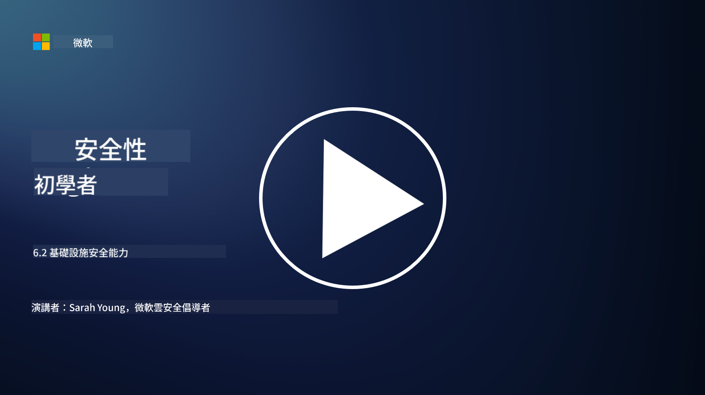

<!--
CO_OP_TRANSLATOR_METADATA:
{
  "original_hash": "7d79ba0e7668b3bdae1fba7aa047f6c0",
  "translation_date": "2025-09-03T17:24:47+00:00",
  "source_file": "6.2 Infrastructure security capabilities.md",
  "language_code": "hk"
}
-->
# 基礎設施安全功能

在本節中，我們將更詳細地介紹用於基礎設施安全的核心工具和功能。

**簡介**

在本課中，我們將探討：

- 什麼是漏洞管理？

- 什麼是CSPM？

- 什麼是CNAPP？

## 什麼是漏洞管理？

漏洞管理是一個系統化的過程，用於識別、評估、優先排序、減輕和監控計算機系統、軟件、網絡和基礎設施中的漏洞。漏洞管理的主要目標是通過主動處理已知漏洞，在惡意攻擊者利用之前減少組織的安全風險暴露。以下是主要步驟的概述：

識別：掃描並發現組織資產中的漏洞，這些資產可能包括伺服器、應用程式、網絡設備和終端。

評估：根據例如通用漏洞評分系統（CVSS）分數和業務背景等因素，評估每個漏洞的嚴重性和潛在影響。

優先排序：根據漏洞的風險級別及其對組織運營和數據的潛在影響進行排序。

減輕：制定並實施策略來修復或減輕漏洞，這可能包括應用補丁、配置安全設置或部署補償控制措施。

驗證：確認減輕措施是否有效地解決了漏洞。

持續監控：持續跟蹤漏洞和潛在威脅，並定期進行漏洞掃描和評估。

漏洞管理是網絡安全的重要組成部分，有助於組織維持強大的安全態勢並降低安全漏洞的可能性。漏洞管理工具的例子包括Defender for Cloud、Nessus和Qualys。

## 什麼是CSPM？

雲安全態勢管理（Cloud Security Posture Management，CSPM）是一組工具、流程和實踐，用於評估、監控和強制執行雲環境中的安全配置和最佳實踐。CSPM解決方案幫助組織識別並修復雲基礎設施中的配置錯誤、安全漏洞和合規性違規行為，例如在Amazon Web Services（AWS）、Microsoft Azure、Google Cloud Platform（GCP）和其他雲提供商中。

CSPM的主要方面包括：

- 配置評估：掃描雲資源和服務以識別配置錯誤、不安全設置以及偏離安全最佳實踐的情況。

- 安全政策執行：通過自動修復配置錯誤或生成警報，在雲環境中強制執行安全政策和合規標準。

- 持續監控：提供對雲資產和資源安全態勢的持續可見性，並對安全事件發出實時警報。

- 合規報告：生成報告和儀表板，以展示對法規要求和行業標準的合規性。

CSPM幫助組織確保其雲基礎設施安全、合規並符合最佳實踐，從而降低與雲相關的安全事件風險。CSPM工具的例子包括Defender for Cloud和Snyk。

## 什麼是CNAPP？

CNAPP代表雲原生應用保護平台（Cloud-Native Application Protection Platform）。這是一個一體化的雲原生軟件平台，簡化了對潛在雲安全威脅和漏洞的監控、檢測和應對。它將多種工具和功能整合到單一軟件解決方案中，以減少複雜性並促進DevOps和DevSecOps團隊的運營。CNAPP在整個CI/CD應用程式生命周期中，從開發到生產，提供端到端的雲和應用安全。它滿足了行業對現代雲安全監控、態勢管理、防範和控制工具的需求。CNAPP解決方案為安全團隊提供了量化和應對雲環境風險的能力。CNAPP的一些功能包括增強的可見性、風險量化、安全軟件開發以及綜合的雲安全解決方案。CNAPP將傳統上分散的多個雲安全解決方案和數據來源整合到單一用戶界面中，使組織更容易保護其整個雲應用程序範圍。CNAPP整合了多個雲原生安全工具和數據來源，包括容器掃描、雲安全態勢管理、基礎設施即代碼掃描、雲基礎設施權限管理以及運行時雲工作負載保護平台。

## 延伸閱讀
- [What is CSPM? | Microsoft Security](https://www.microsoft.com/security/business/security-101/what-is-cspm?WT.mc_id=academic-96948-sayoung)
- [What is Cloud Security Posture Management (CSPM)? | HackerOne](https://www.hackerone.com/knowledge-center/what-cloud-security-posture-management)
- [Function of cloud security posture management - Cloud Adoption Framework | Microsoft Learn](https://learn.microsoft.com/azure/cloud-adoption-framework/organize/cloud-security-posture-management?WT.mc_id=academic-96948-sayoung)
- [What Is a CNAPP? | Microsoft Security](https://www.microsoft.com/security/business/security-101/what-is-cnapp?WT.mc_id=academic-96948-sayoung)
- [Why Everyone Is Talking About CNAPP (forbes.com)](https://www.forbes.com/sites/forbestechcouncil/2021/12/10/why-everyone-is-talking-about-cnapp/?sh=567275ca1549)
- [Improving Your Multi-Cloud Security with a Cloud-Native Application Protection Platform (CNAPP)](https://www.youtube.com/watch?v=5w42kQ_QjZg&t=212s)

---

**免責聲明**：  
本文件已使用人工智能翻譯服務 [Co-op Translator](https://github.com/Azure/co-op-translator) 進行翻譯。儘管我們致力於提供準確的翻譯，請注意自動翻譯可能包含錯誤或不準確之處。原始語言的文件應被視為權威來源。對於重要資訊，建議使用專業人工翻譯。我們對因使用此翻譯而引起的任何誤解或錯誤解釋概不負責。