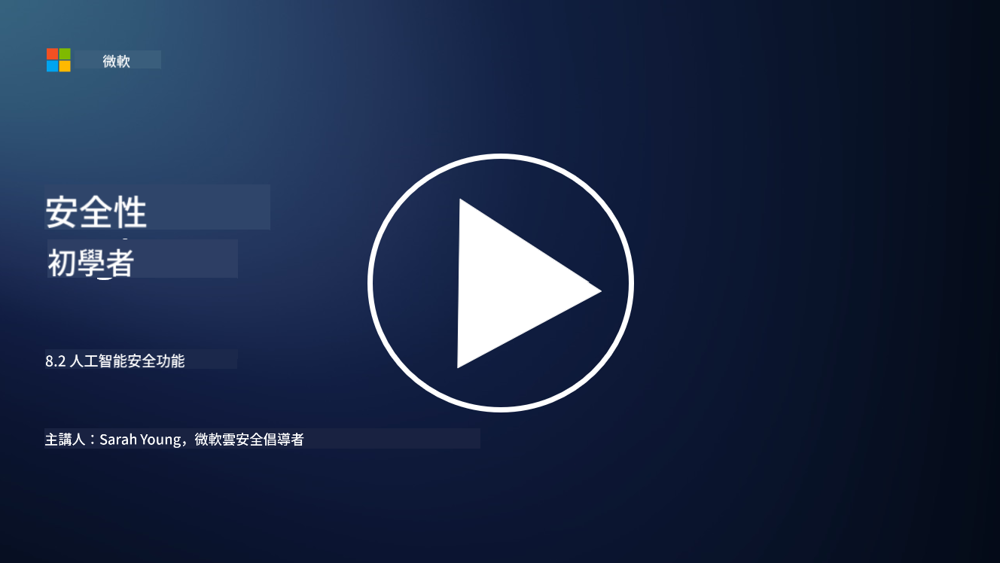

<!--
CO_OP_TRANSLATOR_METADATA:
{
  "original_hash": "b6bb7175672298d1e2f73ba7e0006f95",
  "translation_date": "2025-09-03T17:38:54+00:00",
  "source_file": "8.2 AI security capabilities.md",
  "language_code": "hk"
}
-->
# AI 安全功能

## 我們目前有哪些工具和功能可以用來保護 AI 系統？

目前，有多種工具和功能可用於保護 AI 系統：

-   **Counterfit**：一個開源的自動化工具，用於 AI 系統的安全測試，旨在幫助組織進行 AI 安全風險評估並確保其算法的穩健性。
-   **對抗性機器學習工具**：這些工具評估機器學習模型在面對對抗性攻擊時的穩健性，幫助識別並減輕漏洞。
-   **AI 安全工具包**：有一些開源工具包提供資源來保護 AI 系統，包括實施安全措施的庫和框架。
-   **協作平台**：公司與 AI 社群合作，開發專門針對 AI 的安全掃描器及其他工具，以保護 AI 供應鏈。

這些工具和功能是致力於增強 AI 系統安全性的一個不斷發展的領域，旨在應對各種威脅。它們結合了研究、實用工具和行業合作，目標是解決 AI 技術所帶來的獨特挑戰。

## 那麼 AI 紅隊測試呢？它與傳統的安全紅隊測試有何不同？

AI 紅隊測試與傳統的安全紅隊測試在幾個重要方面有所不同：

-   **專注於 AI 系統**：AI 紅隊測試專門針對 AI 系統的獨特漏洞，例如機器學習模型和數據管道，而非傳統的 IT 基礎設施。
-   **測試 AI 行為**：它涉及測試 AI 系統如何應對不尋常或意外的輸入，這可以揭示可能被攻擊者利用的漏洞。
-   **探索 AI 故障**：AI 紅隊測試不僅關注惡意故障，也關注良性故障，考慮更廣泛的角色和潛在系統故障，而不僅僅是安全漏洞。
-   **提示注入和內容生成**：AI 紅隊測試還包括探測故障，例如提示注入，攻擊者操控 AI 系統生成有害或不可靠的內容。
-   **道德與負責任的 AI**：這是確保設計上負責任 AI 的一部分，確保 AI 系統能夠抵禦試圖使其表現出非預期行為的攻擊。

總體而言，AI 紅隊測試是一種擴展的實踐，不僅涵蓋安全漏洞的探測，還包括測試 AI 技術特有的其他類型系統故障。這是開發更安全 AI 系統的重要部分，通過理解並減輕 AI 部署相關的新型風險。

## 延伸閱讀

 - [Microsoft AI Red Team building future of safer AI | Microsoft Security Blog](https://www.microsoft.com/en-us/security/blog/2023/08/07/microsoft-ai-red-team-building-future-of-safer-ai/?WT.mc_id=academic-96948-sayoung)
 - [Announcing Microsoft’s open automation framework to red team generative AI Systems | Microsoft Security Blog](https://www.microsoft.com/en-us/security/blog/2024/02/22/announcing-microsofts-open-automation-framework-to-red-team-generative-ai-systems/?WT.mc_id=academic-96948-sayoung)
 - [AI Security Tools: The Open-Source Toolkit | Wiz](https://www.wiz.io/academy/ai-security-tools)

---

**免責聲明**：  
本文件已使用人工智能翻譯服務 [Co-op Translator](https://github.com/Azure/co-op-translator) 進行翻譯。儘管我們致力於提供準確的翻譯，但請注意，自動翻譯可能包含錯誤或不準確之處。原始文件的母語版本應被視為權威來源。對於重要信息，建議使用專業人工翻譯。我們對因使用此翻譯而引起的任何誤解或錯誤解釋概不負責。