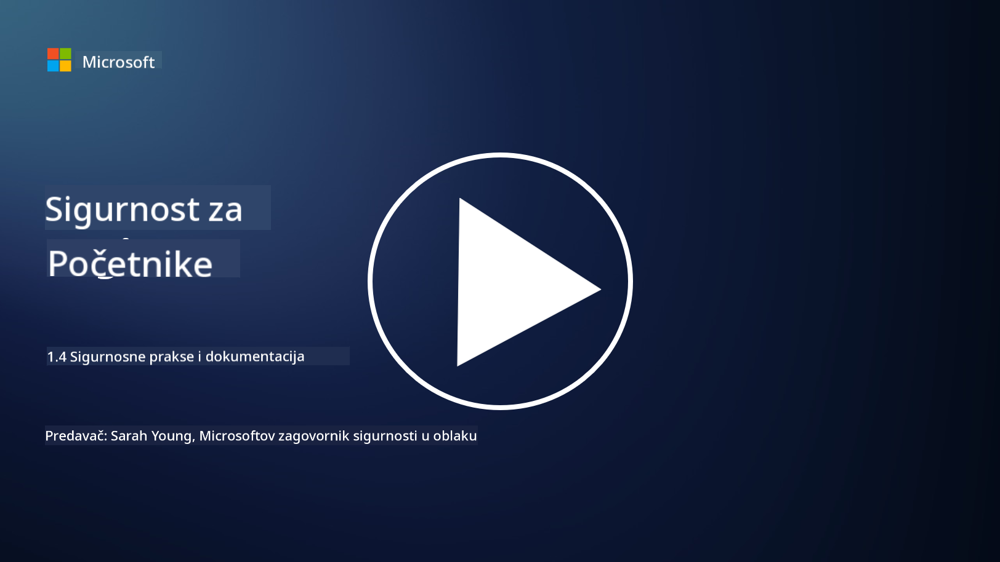

<!--
CO_OP_TRANSLATOR_METADATA:
{
  "original_hash": "d33500902124e52870935bdce4546fcc",
  "translation_date": "2025-09-03T21:00:19+00:00",
  "source_file": "1.4 Security practices and documentation.md",
  "language_code": "hr"
}
-->
# Sigurnosne prakse i dokumentacija

Možda ste već čuli izraze poput "sigurnosna politika", "sigurnosni standard" itd., ali stvarnost je da mnogi stručnjaci za kibernetičku sigurnost ne koriste te izraze pravilno. U ovom odjeljku objasnit ćemo što svaki od tih izraza znači i zašto bi ih organizacija koristila.

## Uvod

U ovoj lekciji obradit ćemo:

- Što je sigurnosna politika?

- Što je sigurnosni standard?

- Što je sigurnosna osnovica?

- Što je sigurnosna smjernica?

- Što je sigurnosni postupak?

- Što su zakoni i regulative u kontekstu kibernetičke sigurnosti?

Ovi izrazi često se koriste u kontekstu kibernetičke sigurnosti kako bi definirali različite razine dokumentacije i praksi unutar organizacije. Razjasnimo svaki od tih pojmova:

## Što je sigurnosna politika?

Sigurnosna politika je dokument na visokoj razini koji opisuje opće sigurnosne ciljeve, principe i smjernice organizacije. Ona pruža okvir za donošenje odluka vezanih uz sigurnost i postavlja ton za sigurnosni stav organizacije. Sigurnosne politike obično pokrivaju teme poput prihvatljive upotrebe resursa, zaštite podataka, kontrole pristupa, odgovora na incidente i slično. Politika je neovisna o rješenjima i tehnologijama. Primjer sigurnosne politike s kojom su mnogi upoznati bila bi politika prihvatljive upotrebe organizacije.

## Što je sigurnosni standard?

Sigurnosni standard je detaljniji i specifičniji dokument koji pruža smjernice i zahtjeve za implementaciju sigurnosnih kontrola i mjera unutar organizacije. Standardi su konkretniji i tehnički precizniji od politika, nudeći specifične upute i preporuke za konfiguraciju i održavanje sustava, mreža i procesa kako bi se postigli sigurnosni ciljevi. Primjer sigurnosnog standarda bio bi _"Svi interni podaci moraju biti šifrirani u mirovanju i tijekom prijenosa."_

## Što je sigurnosna osnovica?

Sigurnosna osnovica je skup minimalnih sigurnosnih konfiguracija koje se smatraju ključnima za određeni sustav, aplikaciju ili okruženje u određenom trenutku. Ona definira početnu točku za sigurnost koja bi trebala biti implementirana u svim relevantnim instancama. Sigurnosne osnovice pomažu osigurati dosljednost i određenu razinu sigurnosti kroz IT infrastrukturu organizacije. Primjer sigurnosne osnovice bio bi _"Azure VM-ovi ne smiju imati direktan pristup internetu."_

## Što je sigurnosna smjernica?

Sigurnosna smjernica je dokument koji nudi preporuke i savjete kada određeni sigurnosni standard nije primjenjiv. Smjernice pokušavaju riješiti "sive zone" koje nastaju kada standard ne pokriva ili samo djelomično pokriva određeno pitanje.

## Što je sigurnosni postupak?

Sigurnosni postupak je detaljan vodič korak po korak koji opisuje specifične radnje i zadatke koje treba izvršiti kako bi se provela sigurnosna aktivnost ili proces. Postupci su praktični i primjenjivi dokumenti koji pružaju jasan slijed radnji koje treba slijediti tijekom odgovora na incidente, održavanja sustava, uvođenja korisnika i drugih sigurnosnih aktivnosti. Primjer sigurnosnog postupka bio bi _"Kada Microsoft Sentinel generira sigurnosni incident P1, centar za sigurnosne operacije (SOC) mora odmah obavijestiti dežurnog sigurnosnog menadžera i poslati mu detalje o incidentu."_

Ukratko, ovi izrazi predstavljaju različite razine dokumentacije i smjernica unutar okvira kibernetičke sigurnosti organizacije. Sigurnosne politike postavljaju ciljeve na visokoj razini, standardi pružaju detaljne zahtjeve, osnovice definiraju minimalne sigurnosne konfiguracije, smjernice nude najbolje prakse, a postupci pružaju konkretne korake za sigurnosne procese.

## Što su zakoni/regulative u kontekstu kibernetičke sigurnosti?

Zakoni i regulative odnose se na pravne okvire koje uspostavljaju vlade i regulatorna tijela kako bi definirali i provodili pravila, standarde i zahtjeve za osiguranje digitalnih sustava, podataka i informacija. Ti zakoni i regulative razlikuju se ovisno o jurisdikciji i fokusiraju se na različite aspekte kibernetičke sigurnosti, uključujući zaštitu podataka, privatnost, prijavu incidenata i sigurnost kritične infrastrukture. Evo nekoliko primjera zakona i regulativa povezanih s kibernetičkom sigurnošću: npr. Opća uredba o zaštiti podataka (GDPR), Zakon o prenosivosti i odgovornosti zdravstvenog osiguranja (HIPAA), Kalifornijski zakon o zaštiti potrošača (CCPA), Standard sigurnosti podataka industrije platnih kartica (PCI DSS).

## Dodatno čitanje

[Predlošci sigurnosnih politika | SANS Institute](https://www.sans.org/information-security-policy/)

[Usklađenost s zakonima i regulativama o kibernetičkoj sigurnosti i privatnosti | NIST](https://www.nist.gov/mep/cybersecurity-resources-manufacturers/compliance-cybersecurity-and-privacy-laws-and-regulations)

---

**Odricanje od odgovornosti**:  
Ovaj dokument je preveden pomoću AI usluge za prevođenje [Co-op Translator](https://github.com/Azure/co-op-translator). Iako nastojimo osigurati točnost, imajte na umu da automatski prijevodi mogu sadržavati pogreške ili netočnosti. Izvorni dokument na izvornom jeziku treba smatrati autoritativnim izvorom. Za ključne informacije preporučuje se profesionalni prijevod od strane čovjeka. Ne preuzimamo odgovornost za nesporazume ili pogrešna tumačenja koja mogu proizaći iz korištenja ovog prijevoda.