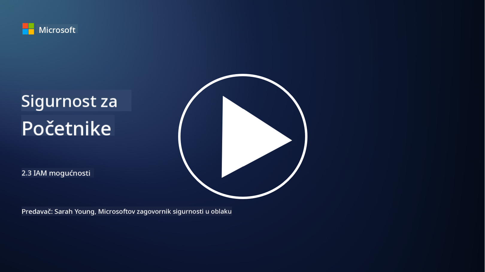

<!--
CO_OP_TRANSLATOR_METADATA:
{
  "original_hash": "bf0b8a54f2c69951744df5a94bc923f7",
  "translation_date": "2025-09-03T22:11:15+00:00",
  "source_file": "2.3 IAM capabilities.md",
  "language_code": "hr"
}
-->
# IAM mogućnosti

U ovom odjeljku pokrit ćemo više detalja o osnovnim alatima i mogućnostima koji se koriste za sigurnost identiteta.

## Uvod

U ovoj lekciji obradit ćemo:

 - Što je usluga direktorija?
      
     
    
 - Koje mogućnosti se mogu koristiti za osiguranje identiteta?
>
>        Višefaktorska autentifikacija (MFA)
> 
>        Jedinstvena prijava (SSO)
> 
>        Kontrola pristupa temeljena na ulogama (RBAC)
> 
>        Prilagodljiva autentifikacija
> 
>        Biometrijska autentifikacija
> 
>        Upravljanje privilegiranim pristupom (PAM)
> 
>        Upravljanje i administracija identiteta (IGA)
> 
>        Analitika ponašanja

## Što je usluga direktorija?

Usluga direktorija je specijalizirana baza podataka koja pohranjuje i upravlja informacijama o mrežnim resursima, uključujući korisnike, grupe, uređaje, aplikacije i druge objekte. Ona služi kao centralizirano spremište podataka povezanih s identitetom i pristupom, omogućujući organizacijama učinkovito upravljanje autentifikacijom korisnika, autorizacijom i drugim sigurnosnim zadacima.

Usluge direktorija igraju ključnu ulogu u modernim IT okruženjima pružajući temelj za rješenja za upravljanje identitetom i pristupom (IAM). One omogućuju siguran pristup resursima, provođenje pravila pristupa i pojednostavljuju administrativne zadatke. Jedna od najpoznatijih usluga direktorija je Microsoft Active Directory, ali postoje i druga rješenja poput LDAP (Lightweight Directory Access Protocol) direktorija koja služe sličnim svrhama.

Ključne funkcije i značajke usluge direktorija u kontekstu kibernetičke sigurnosti uključuju:

 - **Autentifikacija korisnika**: Usluge direktorija provjeravaju vjerodajnice korisnika (kao što su korisnička imena i lozinke) kako bi osigurale da samo ovlašteni korisnici mogu pristupiti mreži i njezinim resursima.
 - **Autorizacija korisnika**: One određuju razinu pristupa svakog korisnika na temelju njegove uloge, članstva u grupi i drugih atributa. Ovo osigurava da korisnici mogu pristupiti samo resursima za koje su ovlašteni.
 - **Upravljanje grupama**: Usluge direktorija omogućuju administratorima organiziranje korisnika u logičke grupe, čime se pojednostavljuje upravljanje kontrolom pristupa. Dozvole se mogu dodijeliti grupama umjesto pojedinačnim korisnicima.
 - **Pravila za lozinke**: One provode pravila složenosti i isteka lozinki, čime se povećava sigurnost korisničkih računa.
 - **Jedinstvena prijava (SSO)**: Neke usluge direktorija podržavaju SSO, omogućujući korisnicima pristup više aplikacija i usluga s jednim skupom vjerodajnica.
 - **Centralizirano upravljanje korisnicima**: Usluge direktorija centraliziraju informacije o korisnicima, olakšavajući upravljanje korisničkim računima, profilima i atributima s jedne lokacije.
 - **Revizija i zapisivanje**: One mogu bilježiti aktivnosti autentifikacije i pristupa korisnika, pomažući u sigurnosnim revizijama i naporima za usklađenost.

## Koje mogućnosti se mogu koristiti za osiguranje identiteta?

**Višefaktorska autentifikacija (MFA)**

MFA zahtijeva od korisnika da pruže više oblika provjere prije nego što im se odobri pristup. To obično uključuje nešto što korisnik zna (lozinka), nešto što korisnik ima (pametni telefon ili sigurnosni token) i nešto što korisnik jest (biometrijski podaci poput otiska prsta ili prepoznavanja lica).

**Jedinstvena prijava (SSO)**

SSO omogućuje korisnicima pristup više aplikacija i sustava s jednim skupom vjerodajnica. Ovo poboljšava korisničko iskustvo i smanjuje rizik povezan s upravljanjem više lozinki.

**Kontrola pristupa temeljena na ulogama (RBAC)**

RBAC dodjeljuje dozvole na temelju unaprijed definiranih uloga. Korisnicima se pristup odobrava na temelju njihovih uloga unutar organizacije.

**Prilagodljiva autentifikacija**

Prilagodljiva autentifikacija procjenjuje čimbenike rizika poput lokacije, uređaja, vremena pristupa i ponašanja korisnika kako bi dinamički prilagodila razinu potrebne autentifikacije. Ako se zahtjev čini sumnjivim, mogu se pokrenuti dodatni koraci autentifikacije.

**Biometrijska autentifikacija**

Biometrijska autentifikacija koristi jedinstvene biološke karakteristike poput otisaka prstiju, crta lica, glasovnih uzoraka, pa čak i ponašajnih osobina poput brzine tipkanja za provjeru identiteta.

**Upravljanje privilegiranim pristupom (PAM)**

PAM se fokusira na osiguranje pristupa kritičnim sustavima i podacima provođenjem strogih kontrola nad privilegiranim računima. To uključuje značajke poput pristupa "na vrijeme" i praćenja sesija.

**Upravljanje i administracija identiteta (IGA)**

IGA rješenja upravljaju identitetima korisnika i njihovim pristupom resursima tijekom cijelog životnog ciklusa. Ovo uključuje onboarding, provisioning, kontrolu pristupa temeljenu na ulogama i deprovisioning.

**Analitika ponašanja**

Analitika ponašanja prati ponašanje korisnika i uspostavlja osnovne obrasce. Odstupanja od norme mogu pokrenuti upozorenja za daljnju istragu.

# Dodatno čitanje
- [Osnove Azure Active Directory dokumentacije - Microsoft Entra | Microsoft Learn](https://learn.microsoft.com/azure/active-directory/fundamentals/?WT.mc_id=academic-96948-sayoung)
- [Što je Azure Active Directory? - Microsoft Entra | Microsoft Learn](https://learn.microsoft.com/azure/active-directory/fundamentals/whatis?WT.mc_id=academic-96948-sayoung)
- [Upravljajte svojom višestrukom cloud infrastrukturom identiteta uz Microsoft Entra - YouTube](https://www.youtube.com/watch?v=9qQiq3wTS2Y&list=PLXtHYVsvn_b_gtX1-NB62wNervQx1Fhp4&index=18)

---

**Odricanje od odgovornosti**:  
Ovaj dokument je preveden pomoću AI usluge za prevođenje [Co-op Translator](https://github.com/Azure/co-op-translator). Iako nastojimo osigurati točnost, imajte na umu da automatski prijevodi mogu sadržavati pogreške ili netočnosti. Izvorni dokument na izvornom jeziku treba smatrati autoritativnim izvorom. Za ključne informacije preporučuje se profesionalni prijevod od strane čovjeka. Ne preuzimamo odgovornost za bilo kakva nesporazuma ili pogrešna tumačenja koja proizlaze iz korištenja ovog prijevoda.