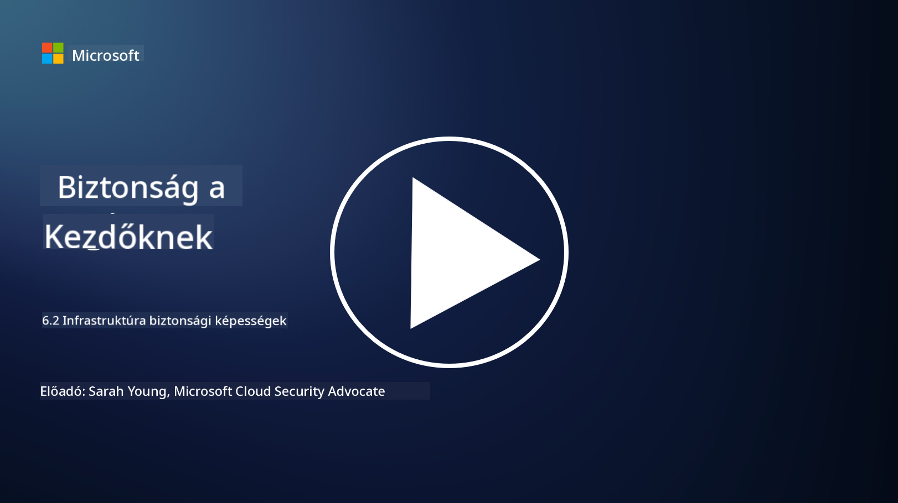

<!--
CO_OP_TRANSLATOR_METADATA:
{
  "original_hash": "7d79ba0e7668b3bdae1fba7aa047f6c0",
  "translation_date": "2025-09-03T20:54:36+00:00",
  "source_file": "6.2 Infrastructure security capabilities.md",
  "language_code": "hu"
}
-->
# Infrastruktúra biztonsági képességek

Ebben a részben az infrastruktúra biztonságában használt alapvető eszközökről és képességekről lesz szó.

**Bevezetés**

Ebben a leckében szó lesz:

- Mi az a sebezhetőség-kezelés?

- Mi az a CSPM?

- Mi az a CNAPP?

## Mi az a sebezhetőség-kezelés?

A sebezhetőség-kezelés egy szisztematikus folyamat, amely magában foglalja a számítógépes rendszerek, szoftverek, hálózatok és infrastruktúra sebezhetőségeinek azonosítását, értékelését, rangsorolását, enyhítését és nyomon követését. A sebezhetőség-kezelés elsődleges célja, hogy csökkentse a szervezet biztonsági kockázatoknak való kitettségét azáltal, hogy proaktívan kezeli a már ismert sebezhetőségeket, mielőtt azokat rosszindulatú szereplők kihasználhatnák. Az alábbiakban bemutatjuk a főbb lépéseket:

Azonosítás: A szervezet eszközeinek, például szerverek, alkalmazások, hálózati eszközök és végpontok sebezhetőségeinek feltérképezése és felderítése.

Értékelés: Az egyes sebezhetőségek súlyosságának és lehetséges hatásának értékelése olyan tényezők alapján, mint például a Common Vulnerability Scoring System (CVSS) pontszám és az üzleti kontextus.

Prioritás: A sebezhetőségek rangsorolása a kockázati szintjük és a szervezet működésére, valamint adataira gyakorolt lehetséges hatásuk alapján.

Enyhítés: Stratégiák kidolgozása és végrehajtása a sebezhetőségek kezelésére vagy enyhítésére, például javítások alkalmazása, biztonsági beállítások konfigurálása vagy kompenzáló kontrollok bevezetése.

Ellenőrzés: Annak megerősítése, hogy az enyhítő intézkedések hatékonyan kezelték a sebezhetőségeket.

Folyamatos nyomon követés: A sebezhetőségek és potenciális fenyegetések folyamatos figyelemmel kísérése rendszeres sebezhetőségi vizsgálatokkal és értékelésekkel.

A sebezhetőség-kezelés a kiberbiztonság kritikus eleme, amely segít a szervezeteknek erős biztonsági pozíciót fenntartani és csökkenteni a biztonsági incidensek valószínűségét. Példák sebezhetőség-kezelési eszközökre: Defender for Cloud, Nessus és Qualys.

## Mi az a CSPM?

A Cloud Security Posture Management (CSPM) olyan eszközök, folyamatok és gyakorlatok összessége, amelyek célja a felhőalapú környezetek biztonsági konfigurációinak és legjobb gyakorlatainak értékelése, figyelése és betartatása. A CSPM megoldások segítenek a szervezeteknek azonosítani és orvosolni a hibás konfigurációkat, biztonsági hiányosságokat és megfelelőségi szabálytalanságokat a felhőinfrastruktúrájukban, például az Amazon Web Services (AWS), a Microsoft Azure, a Google Cloud Platform (GCP) és más felhőszolgáltatók esetében.

A CSPM főbb aspektusai:

- Konfiguráció értékelése: Felhőalapú erőforrások és szolgáltatások vizsgálata a hibás konfigurációk, nem biztonságos beállítások és a biztonsági legjobb gyakorlatoktól való eltérések azonosítása érdekében.

- Biztonsági szabályok betartatása: Biztonsági szabályok és megfelelőségi szabványok betartatása a felhőalapú környezetekben automatikus hibajavítással vagy figyelmeztetések generálásával.

- Folyamatos nyomon követés: Folyamatos láthatóság biztosítása a felhőalapú eszközök és erőforrások biztonsági helyzetéről, valós idejű figyelmeztetésekkel a biztonsági incidensek esetén.

- Megfelelőségi jelentések: Jelentések és irányítópultok készítése a szabályozási követelményeknek és iparági szabványoknak való megfelelés bemutatására.

A CSPM segít a szervezeteknek biztosítani, hogy felhőinfrastruktúrájuk biztonságos, megfelelőségi szempontból megfelelő és a legjobb gyakorlatokkal összhangban legyen, csökkentve a felhővel kapcsolatos biztonsági incidensek kockázatát. Példák CSPM eszközökre: Defender for Cloud és Snyk.

## Mi az a CNAPP?

A CNAPP a Cloud-Native Application Protection Platform rövidítése. Ez egy mindent egyben felhőalapú szoftverplatform, amely egyszerűsíti a felhőbiztonsági fenyegetések és sebezhetőségek figyelését, észlelését és kezelését. Több eszközt és képességet egyesít egyetlen szoftvermegoldásban, hogy csökkentse a komplexitást és megkönnyítse a DevOps és DevSecOps csapatok működését. A CNAPP átfogó felhő- és alkalmazásbiztonságot kínál a teljes CI/CD alkalmazás-életciklus során, a fejlesztéstől a gyártásig. Az iparág igényeit elégíti ki modern felhőbiztonsági figyelő, helyzetkezelő, incidensmegelőző és kontroll eszközökkel. A CNAPP megoldások lehetővé teszik a biztonsági csapatok számára, hogy számszerűsítsék és reagáljanak a felhőkörnyezetben jelentkező kockázatokra. A CNAPP jellemzői közé tartozik a fokozott láthatóság, a kockázatok számszerűsítése, a biztonságos szoftverfejlesztés és az integrált felhőbiztonsági megoldás. A CNAPP egyesíti a hagyományosan elkülönült felhőbiztonsági megoldásokat egyetlen felhasználói felületen, megkönnyítve a szervezetek számára, hogy megvédjék teljes felhőalkalmazás-portfóliójukat. A CNAPP integrálja a különböző felhőalapú biztonsági eszközöket és adatforrásokat, például konténerellenőrzést, felhőbiztonsági helyzetkezelést, infrastruktúra-kód ellenőrzést, felhőinfrastruktúra jogosultságkezelést és futásidejű felhőmunkaterhelés-védelmi platformokat.

## További olvasnivaló
- [Mi az a CSPM? | Microsoft Security](https://www.microsoft.com/security/business/security-101/what-is-cspm?WT.mc_id=academic-96948-sayoung)
- [Mi az a Cloud Security Posture Management (CSPM)? | HackerOne](https://www.hackerone.com/knowledge-center/what-cloud-security-posture-management)
- [A felhőbiztonsági helyzetkezelés funkciói - Cloud Adoption Framework | Microsoft Learn](https://learn.microsoft.com/azure/cloud-adoption-framework/organize/cloud-security-posture-management?WT.mc_id=academic-96948-sayoung)
- [Mi az a CNAPP? | Microsoft Security](https://www.microsoft.com/security/business/security-101/what-is-cnapp?WT.mc_id=academic-96948-sayoung)
- [Miért beszél mindenki a CNAPP-ról (forbes.com)](https://www.forbes.com/sites/forbestechcouncil/2021/12/10/why-everyone-is-talking-about-cnapp/?sh=567275ca1549)
- [A többfelhős biztonság javítása egy Cloud-Native Application Protection Platform (CNAPP) segítségével](https://www.youtube.com/watch?v=5w42kQ_QjZg&t=212s)

---

**Felelősség kizárása**:  
Ez a dokumentum az AI fordítási szolgáltatás, a [Co-op Translator](https://github.com/Azure/co-op-translator) segítségével lett lefordítva. Bár törekszünk a pontosságra, kérjük, vegye figyelembe, hogy az automatikus fordítások hibákat vagy pontatlanságokat tartalmazhatnak. Az eredeti dokumentum az eredeti nyelvén tekintendő hiteles forrásnak. Kritikus információk esetén javasolt professzionális emberi fordítást igénybe venni. Nem vállalunk felelősséget semmilyen félreértésért vagy téves értelmezésért, amely a fordítás használatából eredhet.