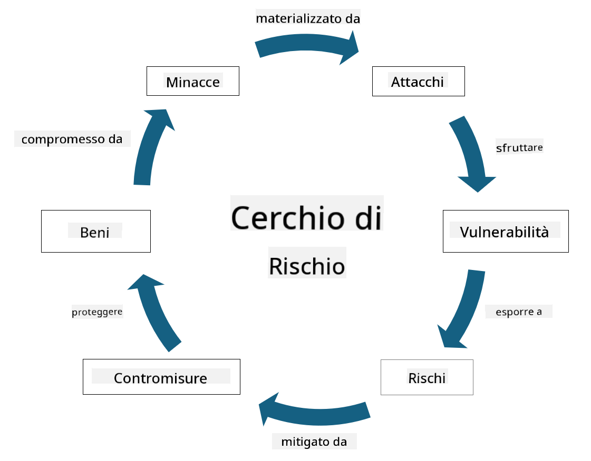

<!--
CO_OP_TRANSLATOR_METADATA:
{
  "original_hash": "fcca304f072cabf206388199e8e2e578",
  "translation_date": "2025-09-03T21:57:00+00:00",
  "source_file": "1.3 Understanding risk management.md",
  "language_code": "it"
}
-->
# Comprendere la gestione del rischio

## Introduzione

In questa lezione, tratteremo:

 - Definizioni di terminologia comune sulla sicurezza
   
 - Tipi di controlli di sicurezza

 - Valutazione dei rischi per la sicurezza

## Definizioni di terminologia comune sulla sicurezza

Questi termini rappresentano concetti fondamentali nel campo della cybersecurity e della gestione del rischio. Analizziamo ciascun termine e il loro rapporto reciproco:

1. **Agente di minaccia**:

Un agente di minaccia è un individuo, un gruppo, un'organizzazione o un sistema automatizzato che ha il potenziale di sfruttare le vulnerabilità di un sistema o di una rete per causare danni. Gli agenti di minaccia possono essere hacker, autori di malware, dipendenti scontenti o qualsiasi entità che rappresenti un rischio per i sistemi informativi e tecnologici.

2. **Minaccia**:

Una minaccia è un evento o un'azione potenziale che può sfruttare le vulnerabilità di un sistema e causare danni a un asset. Le minacce possono includere azioni come hacking, violazioni dei dati, attacchi denial-of-service e altro. Le minacce rappresentano il "cosa" in termini di potenziale danno che può essere inflitto agli asset di un'organizzazione.

3. **Vulnerabilità**:

Una vulnerabilità è una debolezza o un difetto nella progettazione, implementazione o configurazione di un sistema che può essere sfruttato da un agente di minaccia per compromettere la sicurezza del sistema. Le vulnerabilità possono esistere in software, hardware, processi o comportamenti umani. Identificare e affrontare le vulnerabilità è essenziale per ridurre al minimo il rischio di attacchi riusciti.

4. **Rischio**:

Il rischio è il potenziale di perdita, danno o compromissione derivante dall'interazione tra una minaccia e una vulnerabilità. È la probabilità che un agente di minaccia sfrutti una vulnerabilità per causare un impatto negativo. I rischi vengono spesso valutati in base al loro potenziale impatto e alla probabilità di accadimento.

5. **Asset**:

Un asset è qualsiasi cosa di valore che un'organizzazione desidera proteggere. Gli asset possono includere oggetti fisici (come computer e server), dati (informazioni sui clienti, registri finanziari), proprietà intellettuale (segreti commerciali, brevetti) e persino risorse umane (competenze e conoscenze dei dipendenti). Proteggere gli asset è un obiettivo chiave della cybersecurity.

6. **Esposizione**:

L'esposizione si riferisce allo stato di vulnerabilità a potenziali minacce. Si verifica quando esiste una vulnerabilità che potrebbe essere sfruttata da un agente di minaccia. L'esposizione evidenzia il rischio associato alla presenza di vulnerabilità in un sistema o in una rete.

7. **Controllo**:

Un controllo è una misura adottata per ridurre il rischio associato a vulnerabilità e minacce. I controlli possono essere di natura tecnica, procedurale o amministrativa. Sono progettati per prevenire, rilevare o mitigare potenziali minacce e vulnerabilità. Esempi includono firewall, controlli di accesso, crittografia, politiche di sicurezza e formazione dei dipendenti.

Per riassumere la relazione tra questi termini: gli agenti di minaccia sfruttano le vulnerabilità per attuare minacce, che possono portare a rischi con il potenziale di causare danni agli asset di valore. L'esposizione si verifica quando sono presenti vulnerabilità, e i controlli vengono implementati per ridurre il rischio prevenendo o mitigando l'impatto delle minacce sugli asset. Questo quadro costituisce la base della gestione del rischio informatico, guidando le organizzazioni nell'identificazione, valutazione e gestione dei potenziali rischi per i loro sistemi informativi e asset.

## Tipi di controlli di sicurezza

I controlli di sicurezza sono misure o salvaguardie implementate per proteggere i sistemi informativi e gli asset da varie minacce e vulnerabilità. Possono essere classificati in diverse categorie in base al loro obiettivo e scopo. Ecco alcuni tipi comuni di controlli di sicurezza:

1. **Controlli amministrativi**:

Questi controlli riguardano politiche, procedure e linee guida che regolano le pratiche di sicurezza e il comportamento degli utenti all'interno dell'organizzazione.

- Politiche e procedure di sicurezza: Linee guida documentate che definiscono come viene mantenuta la sicurezza all'interno di un'organizzazione.

- Sensibilizzazione e formazione sulla sicurezza: Programmi per educare i dipendenti sulle migliori pratiche di sicurezza e sulle potenziali minacce.

- Risposta e gestione degli incidenti: Piani per rispondere e mitigare gli incidenti di sicurezza.

2. **Controlli tecnici**:

I controlli tecnici implicano l'uso della tecnologia per applicare misure di sicurezza e proteggere sistemi e dati. Esempi di controlli tecnici includono:

- Controlli di accesso: Misure che limitano l'accesso degli utenti alle risorse in base ai loro ruoli e permessi.

- Crittografia: Conversione dei dati in un formato sicuro per prevenire accessi non autorizzati.

- Firewall: Dispositivi di sicurezza di rete che filtrano e controllano il traffico in entrata e in uscita.

- Sistemi di rilevamento e prevenzione delle intrusioni (IDPS): Strumenti che monitorano il traffico di rete per attività sospette.

- Software antivirus e anti-malware: Programmi che rilevano e rimuovono software dannosi.

- Meccanismi di autenticazione: Metodi per verificare l'identità degli utenti, come password, biometria e autenticazione a più fattori.

- Gestione delle patch: Aggiornamento regolare del software per affrontare vulnerabilità note.

3. **Controlli fisici**:

I controlli fisici sono misure per proteggere gli asset fisici e le strutture.

- Guardie di sicurezza e personale di controllo accessi: Personale che monitora e controlla l'accesso ai locali fisici.

- Telecamere di sorveglianza: Sistemi di monitoraggio video per osservare e registrare le attività.

- Serrature e barriere fisiche: Misure fisiche per limitare l'accesso ad aree sensibili.

- Controlli ambientali: Misure per regolare temperatura, umidità e altri fattori ambientali che influenzano le apparecchiature e i data center.

4. **Controlli operativi**:

Questi controlli riguardano le operazioni quotidiane e le attività che garantiscono la sicurezza continua dei sistemi.

- Gestione delle modifiche: Processi per tracciare e approvare modifiche ai sistemi e alle configurazioni.

- Backup e ripristino in caso di disastro: Piani per il backup e il ripristino dei dati in caso di guasti o disastri.

- Registrazione e auditing: Monitoraggio e registrazione delle attività di sistema per scopi di sicurezza e conformità.

- Pratiche di codifica sicura: Linee guida per scrivere software che minimizzino le vulnerabilità.

5. **Controlli legali e normativi**:

Questi controlli garantiscono la conformità alle leggi, regolamenti e standard di settore pertinenti. Gli standard a cui un'organizzazione deve conformarsi dipendono dalla giurisdizione, dal settore e da altri fattori.

- Regolamenti sulla protezione dei dati: Conformità a leggi come GDPR, HIPAA e CCPA.

- Standard specifici del settore: Adesione a standard come PCI DSS per la sicurezza dei dati delle carte di pagamento.

Queste categorie di controlli di sicurezza lavorano insieme per creare una postura di sicurezza completa per le organizzazioni, aiutandole a proteggere i loro sistemi, dati e asset da una vasta gamma di minacce.

## Valutazione dei rischi per la sicurezza

Alcuni professionisti della sicurezza ritengono che la gestione del rischio sia compito esclusivo degli specialisti del rischio, ma comprendere il processo di gestione del rischio per la sicurezza è importante per qualsiasi professionista della sicurezza, al fine di esprimere il rischio in un linguaggio comprensibile e attuabile per il resto dell'organizzazione.

Le organizzazioni devono valutare costantemente i rischi per la sicurezza e decidere quali azioni intraprendere (o meno) contro i rischi per il business. Di seguito è riportata una panoramica di come questo processo viene tipicamente svolto. Si noti che questo processo viene solitamente eseguito da diversi team all'interno di un'organizzazione; è raro che un solo team sia responsabile della gestione completa del rischio.

1. **Identificare asset e minacce**:

L'organizzazione identifica gli asset che desidera proteggere. Questi possono includere dati, sistemi, hardware, software, proprietà intellettuale e altro. Successivamente, identifica le potenziali minacce che potrebbero colpire questi asset.

2. **Valutare le vulnerabilità**:

Le organizzazioni identificano quindi le vulnerabilità o debolezze nei sistemi o nei processi che potrebbero essere sfruttate dalle minacce. Queste vulnerabilità possono derivare da difetti software, configurazioni errate, mancanza di controlli di sicurezza ed errori umani.

3. **Valutazione della probabilità**:

L'organizzazione valuta quindi la probabilità che ogni minaccia si verifichi. Questo implica considerare dati storici, intelligence sulle minacce, tendenze del settore e fattori interni. La probabilità può essere classificata come bassa, media o alta in base alla possibilità che la minaccia si concretizzi.

4. **Valutazione dell'impatto**:

Successivamente, l'organizzazione determina il potenziale impatto di ciascuna minaccia se dovesse sfruttare una vulnerabilità. L'impatto può includere perdite finanziarie, interruzioni operative, danni alla reputazione, conseguenze legali e altro. Anche l'impatto può essere classificato come basso, medio o alto in base alle potenziali conseguenze.

5. **Calcolo del rischio**:

Le valutazioni di probabilità e impatto vengono combinate per calcolare il livello complessivo di rischio per ciascuna minaccia identificata. Questo viene spesso fatto utilizzando una matrice di rischio che assegna valori numerici o descrittori qualitativi ai livelli di probabilità e impatto. Il livello di rischio risultante aiuta a stabilire quali rischi richiedono attenzione immediata.

6. **Prioritizzazione e decisioni**:

L'organizzazione dà priorità ai rischi concentrandosi su quelli con i valori più alti di probabilità e impatto combinati. Questo consente di allocare risorse e implementare controlli in modo più efficace. Le minacce ad alto rischio richiedono attenzione immediata, mentre quelle a basso rischio possono essere affrontate in un periodo di tempo più lungo.

7. **Trattamento del rischio**:

In base alla valutazione del rischio, l'organizzazione determina come mitigare o gestire ciascun rischio. Questo potrebbe comportare l'implementazione di controlli di sicurezza, il trasferimento del rischio tramite assicurazioni o persino l'accettazione di determinati livelli di rischio residuo se considerati gestibili/troppo costosi da risolvere/ecc.

8. **Monitoraggio e revisione continui**:

La valutazione del rischio non è un processo una tantum. Dovrebbe essere condotta periodicamente o ogni volta che ci sono cambiamenti significativi nell'ambiente dell'organizzazione. Il monitoraggio continuo garantisce che nuove minacce, vulnerabilità o cambiamenti nel panorama aziendale vengano presi in considerazione.

Valutando i rischi per la sicurezza in modo strutturato, le organizzazioni possono prendere decisioni informate sull'allocazione delle risorse, sui controlli di sicurezza e sulle strategie complessive di gestione del rischio. L'obiettivo è ridurre l'esposizione complessiva al rischio dell'organizzazione, allineando gli sforzi di sicurezza agli obiettivi e alle finalità aziendali.

---

**Disclaimer**:  
Questo documento è stato tradotto utilizzando il servizio di traduzione automatica [Co-op Translator](https://github.com/Azure/co-op-translator). Sebbene ci impegniamo per garantire l'accuratezza, si prega di notare che le traduzioni automatiche possono contenere errori o imprecisioni. Il documento originale nella sua lingua nativa dovrebbe essere considerato la fonte autorevole. Per informazioni critiche, si raccomanda una traduzione professionale effettuata da un traduttore umano. Non siamo responsabili per eventuali incomprensioni o interpretazioni errate derivanti dall'uso di questa traduzione.