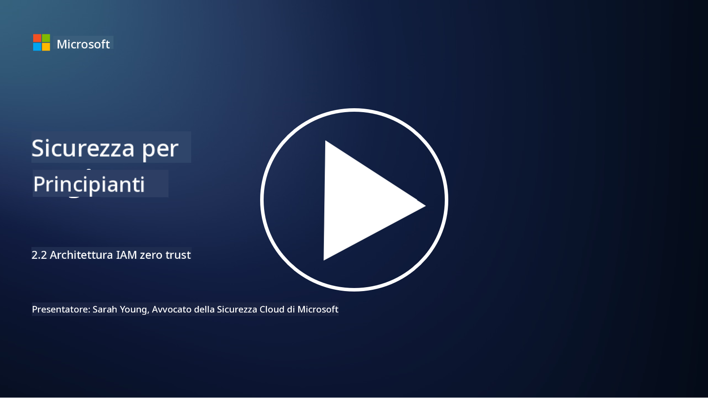

<!--
CO_OP_TRANSLATOR_METADATA:
{
  "original_hash": "4774a978af123f72ebb872199c4c4d4f",
  "translation_date": "2025-09-03T20:28:21+00:00",
  "source_file": "2.2 IAM zero trust architecture.md",
  "language_code": "it"
}
-->
# Architettura zero trust per IAM

L'identità è un elemento chiave per implementare un'architettura zero trust e costruire un perimetro per qualsiasi ambiente IT. In questa sezione esploreremo perché è importante utilizzare i controlli di identità per implementare il modello zero trust.

## Introduzione

In questa lezione, tratteremo:

 - Perché è necessario utilizzare l'identità come perimetro nei moderni ambienti IT?
   
 - In che modo questo approccio differisce dalle architetture IT tradizionali?
   
 - Come viene utilizzata l'identità per implementare un'architettura zero trust?

## Perché è necessario utilizzare l'identità come perimetro nei moderni ambienti IT?

Nei moderni ambienti IT, il concetto tradizionale di perimetro fisico (utilizzando strumenti come firewall e confini di rete) come principale linea di difesa contro le minacce informatiche sta diventando meno efficace a causa della crescente complessità tecnologica, dell'aumento del lavoro da remoto e dell'adozione di servizi cloud. Di conseguenza, le organizzazioni stanno passando all'uso dell'identità come nuovo perimetro. Questo significa che la sicurezza ruota attorno alla verifica e alla gestione dell'identità di utenti, dispositivi e applicazioni che tentano di accedere alle risorse, indipendentemente dalla loro posizione fisica.

Ecco perché l'uso dell'identità come perimetro è cruciale nei moderni ambienti IT:

**Forza lavoro remota**: Con il lavoro da remoto e i dispositivi mobili che diventano la norma, gli utenti possono accedere alle risorse da diverse posizioni e dispositivi. L'approccio tradizionale basato sul perimetro non funziona quando gli utenti non sono più confinati in un ufficio fisico.

**Ambienti cloud e ibridi**: Le organizzazioni stanno adottando sempre più servizi cloud e ambienti ibridi. I dati e le applicazioni non si trovano più esclusivamente nei locali dell'organizzazione, rendendo meno rilevanti le difese perimetrali tradizionali.

**Sicurezza zero trust**: Il concetto di sicurezza zero trust presuppone che nessuna entità, sia all'interno che all'esterno della rete, debba essere automaticamente considerata affidabile. L'identità diventa la base per verificare le richieste di accesso, indipendentemente dalla loro origine.

**Panorama delle minacce**: Le minacce informatiche stanno evolvendo e gli attaccanti trovano modi per aggirare le difese perimetrali tradizionali. Phishing, ingegneria sociale e minacce interne spesso sfruttano le vulnerabilità umane piuttosto che tentare di violare i perimetri di rete.

**Approccio incentrato sui dati**: Proteggere i dati sensibili è fondamentale. Concentrandosi sull'identità, le organizzazioni possono controllare chi accede a quali dati, riducendo il rischio di violazioni.

## In che modo questo approccio differisce dalle architetture IT tradizionali?

Le architetture IT tradizionali si basavano fortemente su modelli di sicurezza perimetrale, in cui firewall e confini di rete giocavano un ruolo significativo nel tenere fuori le minacce. Le principali differenze tra gli approcci tradizionali e quelli incentrati sull'identità sono:

|      Aspetto                |      Architetture IT Tradizionali                                                                |      Approccio Incentrato sull'Identità                                                                   |
|-----------------------------|--------------------------------------------------------------------------------------------------|------------------------------------------------------------------------------------------------------------|
|     Focus                   |     Focus sul Perimetro: Basato su difese perimetrali come firewall e   controllo degli accessi. |     Focus sulla Verifica dell'Identità: Passaggio dai confini di rete alla verifica   dell'identità di utenti/dispositivi. |
|     Posizione               |     Dipendenza dalla Posizione: Sicurezza legata a sedi fisiche e confini di rete.              |     Indipendenza dalla Posizione: Sicurezza non legata a posizioni specifiche; accesso   da qualsiasi luogo. |
|     Presunzione di Fiducia  |     Fiducia Presunta: Fiducia accordata agli utenti/dispositivi all'interno del perimetro.       |     Approccio Zero Trust: La fiducia non è mai presunta; l'accesso è verificato in   base all'identità e al contesto. |
|     Considerazione dei Dispositivi |     Diversità dei Dispositivi: Presupponeva che i dispositivi all'interno del perimetro fossero sicuri. |     Consapevolezza dei Dispositivi: Considera lo stato di salute e la sicurezza dei dispositivi, indipendentemente dalla posizione. |
|     Protezione dei Dati     |     Protezione dei Dati: Concentrata sulla sicurezza dei perimetri di rete.                     |     Protezione Incentrata sui Dati: Si concentra sul controllo dell'accesso ai dati in   base all'identità e alla sensibilità dei dati. |

## Come viene utilizzata l'identità per implementare un'architettura zero trust?

In un'architettura zero trust, il principio fondamentale è di non fidarsi mai automaticamente di alcuna entità, indipendentemente dal fatto che si trovi all'interno o all'esterno del perimetro di rete. L'identità gioca un ruolo centrale nell'implementazione di un approccio zero trust, consentendo una verifica continua delle entità che tentano di accedere alle risorse. I moderni controlli di sicurezza dell'identità garantiscono che ogni utente, dispositivo, applicazione e servizio che cerca di accedere alle risorse venga identificato e autenticato accuratamente prima che l'accesso venga concesso. Questo processo include la verifica della loro identità digitale attraverso metodi come combinazioni di nome utente/password, autenticazione a più fattori (MFA), biometria e altri meccanismi di autenticazione avanzati.

## Letture aggiuntive

- [Securing identity with Zero Trust | Microsoft Learn](https://learn.microsoft.com/security/zero-trust/deploy/identity?WT.mc_id=academic-96948-sayoung)
- [Zero Trust Principles and Guidance for Identity and Access | CSA (cloudsecurityalliance.org)](https://cloudsecurityalliance.org/artifacts/zero-trust-principles-and-guidance-for-iam/)
- [Zero Trust Identity Controls - Essentials Series - Episode 2 - YouTube](https://www.youtube.com/watch?v=fQZQznIKcGM&list=PLXtHYVsvn_b_gtX1-NB62wNervQx1Fhp4&index=13)

---

**Disclaimer**:  
Questo documento è stato tradotto utilizzando il servizio di traduzione automatica [Co-op Translator](https://github.com/Azure/co-op-translator). Sebbene ci impegniamo per garantire l'accuratezza, si prega di notare che le traduzioni automatiche potrebbero contenere errori o imprecisioni. Il documento originale nella sua lingua nativa dovrebbe essere considerato la fonte autorevole. Per informazioni critiche, si raccomanda una traduzione professionale eseguita da un traduttore umano. Non siamo responsabili per eventuali fraintendimenti o interpretazioni errate derivanti dall'uso di questa traduzione.