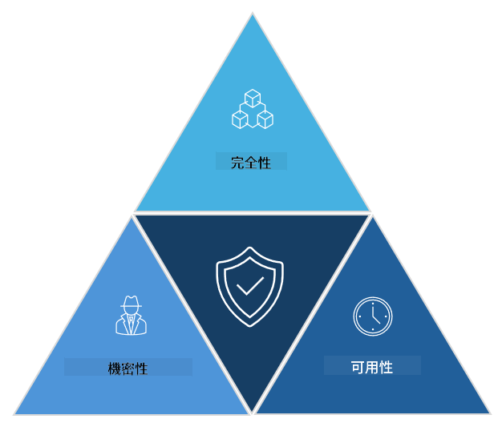

<!--
CO_OP_TRANSLATOR_METADATA:
{
  "original_hash": "16a76f9fa372fb63cffb6d76b855f023",
  "translation_date": "2025-09-03T21:41:25+00:00",
  "source_file": "1.1 The CIA triad and other key concepts.md",
  "language_code": "ja"
}
-->
# CIAの三要素とその他の重要な概念

## はじめに

このレッスンでは以下を学びます：

 - サイバーセキュリティとは何か？
   
 
 - サイバーセキュリティのCIA三要素とは何か？

   

 - サイバーセキュリティの文脈での真正性、否認防止、プライバシーとは何か？

## サイバーセキュリティとは？

サイバーセキュリティ（情報セキュリティとも呼ばれる）とは、コンピューターシステム、ネットワーク、デバイス、データをデジタル攻撃、不正アクセス、損害、盗難から保護するための実践です。サイバーセキュリティの主な目的は、デジタル資産と情報の機密性、完全性、可用性を確保することです。サイバーセキュリティの専門家は、資産、データ、情報を保護するためのセキュリティ対策を設計し実装します。私たちの生活がますますデジタル化しオンライン化する中で、サイバーセキュリティは個人や組織にとって最重要課題となっています。

## サイバーセキュリティのCIA三要素とは？

サイバーセキュリティの三要素は、サイバーセキュリティの作業やシステム/環境の設計において考慮すべき3つの主要な要素を含むモデルを指します：

### 機密性

これは「サイバーセキュリティ」と聞いて多くの人が思い浮かべる要素です。機密性とは、データや情報を不正アクセスから保護するプロセスを指します。つまり、情報を見る必要がある人だけがアクセスできるようにすることです。ただし、すべてのデータが同じ価値を持つわけではなく、データは誤った人にアクセスされた場合の損害の程度に基づいて分類され、保護されます。

### 完全性

これは、環境内のデータの正確性と信頼性を保護し、不正な個人によるデータの改ざんや変更を防ぐことを指します。例：学生が運転免許証の記録で生年月日を改ざんし、年齢を偽って免許証を再発行し、アルコールを購入するために生年月日を早める。

### 可用性

これは運用IT全般における重要な要素ですが、サイバーセキュリティにおいても重要です。可用性を標的とする特定の攻撃があり、セキュリティ専門家はこれらの攻撃（例：分散型サービス拒否攻撃 – DDoS攻撃）から保護する必要があります。

**サイバーセキュリティのCIA三要素**

## サイバーセキュリティの文脈での真正性、否認防止、プライバシーとは？

これらは、システムとデータのセキュリティと信頼性を確保するために関連する重要な概念です：

**真正性** - 情報、通信、または相手が本物であり、不正な第三者によって改ざんや変更されていないことを保証することを指します。

**否認防止** - ある当事者が取引や通信の関与やその正当性を否定できないようにする概念です。これにより、メッセージを送信したり特定の行動を取ったことを証明する証拠がある場合に、それを否定することを防ぎます。

**プライバシー** - 機密情報や個人を特定できる情報を不正アクセス、使用、開示、改ざんから保護することを指します。これには、個人データへのアクセス権を管理し、そのデータがどのように収集、保存、共有されるかを制御することが含まれます。

## 追加の読み物

[What Is Information Security (InfoSec)? | Microsoft Security](https://www.microsoft.com/security/business/security-101/what-is-information-security-infosec#:~:text=Three%20pillars%20of%20information%20security%3A%20the%20CIA%20triad,as%20guiding%20principles%20for%20implementing%20an%20InfoSec%20plan.)

---

**免責事項**:  
この文書はAI翻訳サービス[Co-op Translator](https://github.com/Azure/co-op-translator)を使用して翻訳されています。正確性を追求しておりますが、自動翻訳には誤りや不正確な部分が含まれる可能性があります。元の言語で記載された文書が正式な情報源とみなされるべきです。重要な情報については、専門の人間による翻訳を推奨します。この翻訳の使用に起因する誤解や誤解釈について、当社は責任を負いません。