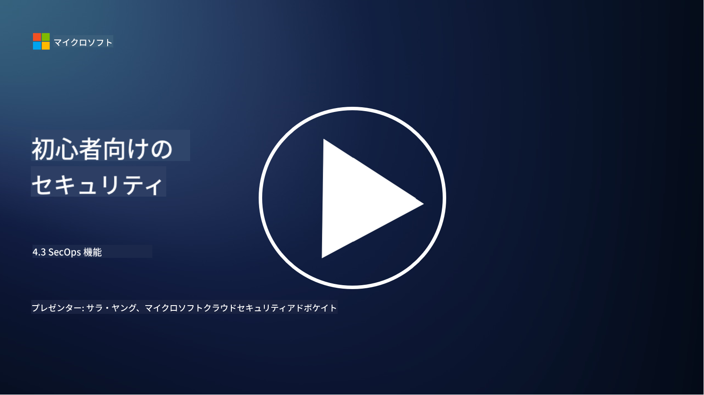

<!--
CO_OP_TRANSLATOR_METADATA:
{
  "original_hash": "553eb694c89f1caca0694e8d8ab89e0e",
  "translation_date": "2025-09-03T21:47:59+00:00",
  "source_file": "4.3 SecOps capabilities.md",
  "language_code": "ja"
}
-->
# SecOpsの機能

このセクションでは、セキュリティオペレーションで使用できる主要なツールと機能について詳しく説明します。

このレッスンで取り上げる内容:

- セキュリティ情報およびイベント管理 (SIEM) ツールとは何か？

- XDRとは何か？

- セキュリティオペレーションを強化するために使用できる機能とは？

## セキュリティ情報およびイベント管理 (SIEM) ツールとは？

セキュリティ情報およびイベント管理 (SIEM) ツールは、組織のIT環境全体で生成されるセキュリティアラートを分析するために使用されます。これらは、ネットワークデバイス、サーバー、アプリケーション、セキュリティシステムなど、さまざまなソースからログデータやセキュリティイベントを収集、集約、相関、分析します。

SIEMツールの主な機能と特徴:

1. **ログ収集**: SIEMツールは、ファイアウォール、侵入検知システム、アンチウイルスソフトウェアなど、幅広いデバイス、システム、アプリケーションからログやセキュリティイベントデータを収集します。

2. **データの正規化**: ログデータを共通のフォーマットに正規化し、分析や相関を容易にします。

3. **イベント相関**: SIEMツールはイベントを相関させ、セキュリティインシデントや脅威を示す可能性のあるパターンや異常を特定します。

4. **アラートと通知**: SIEMツールは、疑わしい活動やセキュリティ違反が検出された際にリアルタイムでアラートや通知を生成し、即時対応を可能にします。

5. **インシデント検出**: 不正アクセス、データ漏洩、マルウェア感染、内部脅威などのセキュリティインシデントの検出を支援します。

6. **ユーザーおよびエンティティ行動分析 (UEBA)**: 一部のSIEMツールはUEBA機能を組み込み、異常なユーザーやエンティティの行動を特定し、アカウントの侵害や内部脅威を検出します。

7. **脅威インテリジェンス統合**: SIEMツールは脅威インテリジェンスフィードと統合し、既知の侵害指標 (IOC) をネットワーク活動と比較することで脅威検出を強化します。

8. **自動化とオーケストレーション**: 自動化機能により、一般的なセキュリティインシデントへの対応を自動化し、対応時間と手動作業を削減します。

9. **ダッシュボードと可視化**: セキュリティデータの監視やカスタムレポートの作成を可能にするダッシュボードと可視化ツールを提供します。

10. **他のセキュリティツールとの統合**: SIEMツールは、エンドポイント検出と対応 (EDR) ソリューションなど、他のセキュリティツールや技術と統合し、組織のセキュリティ状況を包括的に把握します。

## XDRとは？

XDR (Extended Detection and Response) は、従来のエンドポイント検出と対応 (EDR) の機能を拡張し、さまざまなソースからのセキュリティテレメトリを統合することで、組織のセキュリティ状況をより包括的に把握する技術です。XDRは、EDRやSIEM、その他の個別のセキュリティツールに依存することの限界を克服し、脅威検出、インシデント対応、全体的なセキュリティを向上させることを目的としています。

XDRの主な特徴と構成要素:

1. **データ統合**: XDRは、エンドポイント、ネットワークトラフィック、クラウドサービス、メールなど、複数のソースからデータを統合します。この包括的なデータ集約により、脅威検出と分析のための広範なコンテキストが提供されます。

2. **高度な分析**: XDRは高度な分析、機械学習、行動分析を活用してセキュリティ脅威を特定し、優先順位を付けます。統合されたデータ内のパターンや異常を検出し、既知および未知の脅威を特定します。

3. **自動化された脅威検出**: XDRは、複数のソースからの情報を相関させることで、セキュリティ脅威や異常の検出を自動化します。複数のベクターにまたがる複雑な攻撃チェーンを特定することができます。

4. **インシデント調査と対応**: XDRはインシデント調査と対応のためのツールを提供し、セキュリティチームがインシデントの範囲と影響を迅速に評価し、適切な対策を講じることを支援します。

5. **脅威インテリジェンス統合**: 脅威インテリジェンスフィードやデータを統合し、既知の侵害指標 (IOC) を組織のネットワークやエンドポイント活動と比較することで脅威検出を強化します。

6. **統一コンソール**: XDRは通常、統一されたコンソールやダッシュボードを提供し、セキュリティチームが異なるソースからのセキュリティアラートやインシデントを集中管理できるようにします。

7. **クロスプラットフォーム対応**: XDRソリューションは、エンドポイント、サーバー、クラウド環境、モバイルデバイスなど、幅広いプラットフォームをカバーしており、現代のマルチプラットフォームIT環境に適しています。

## セキュリティオペレーションを強化するために使用できる機能とは？

セキュリティオペレーションを強化するために、組織はSIEMツールに加えて以下の機能を活用できます:

1. **機械学習と人工知能**: 高度な分析、機械学習、AIを導入して進化する脅威を検出し、脅威ハンティングを自動化します。

2. **ユーザーおよびエンティティ行動分析 (UEBA)**: ユーザーやエンティティの行動を分析し、異常や内部脅威を検出します。

3. **脅威インテリジェンスフィード**: 脅威インテリジェンスフィードを統合し、最新の脅威や侵害指標に関する情報を常に把握します。

4. **セキュリティオーケストレーション、オートメーション、レスポンス (SOAR)**: SOARプラットフォームを導入してインシデント対応を自動化し、セキュリティオペレーションのワークフローを効率化します。

5. **欺瞞技術**: ネットワーク内で攻撃者を欺き、検出するための欺瞞技術を展開します。

## 参考資料

- [What is SIEM? | Microsoft Security](https://www.microsoft.com/security/business/security-101/what-is-siem?WT.mc_id=academic-96948-sayoung)
- [What Is SIEM? - Security Information and Event Management - Cisco](https://www.cisco.com/c/en/us/products/security/what-is-siem.html)
- [Security information and event management - Wikipedia](https://en.wikipedia.org/wiki/Security_information_and_event_management)
- [What Is XDR? | Microsoft Security](https://www.microsoft.com/security/business/security-101/what-is-xdr?WT.mc_id=academic-96948-sayoung)
- [XDR & XDR Security (kaspersky.com.au)](https://www.kaspersky.com.au/resource-center/definitions/what-is-xdr)
- [The Power of SecOps: Redefining Core Security Capabilities - The New Stack](https://thenewstack.io/the-power-of-secops-redefining-core-security-capabilities/)
- [Seven Steps to Improve Your Security Operations and Response (securityintelligence.com)](https://securityintelligence.com/seven-steps-to-improve-your-security-operations-and-response/)

---

**免責事項**:  
この文書は、AI翻訳サービス [Co-op Translator](https://github.com/Azure/co-op-translator) を使用して翻訳されています。正確性を追求しておりますが、自動翻訳には誤りや不正確な部分が含まれる可能性があることをご承知ください。元の言語で記載された文書が正式な情報源とみなされるべきです。重要な情報については、専門の人間による翻訳を推奨します。この翻訳の使用に起因する誤解や誤解釈について、当方は責任を負いません。