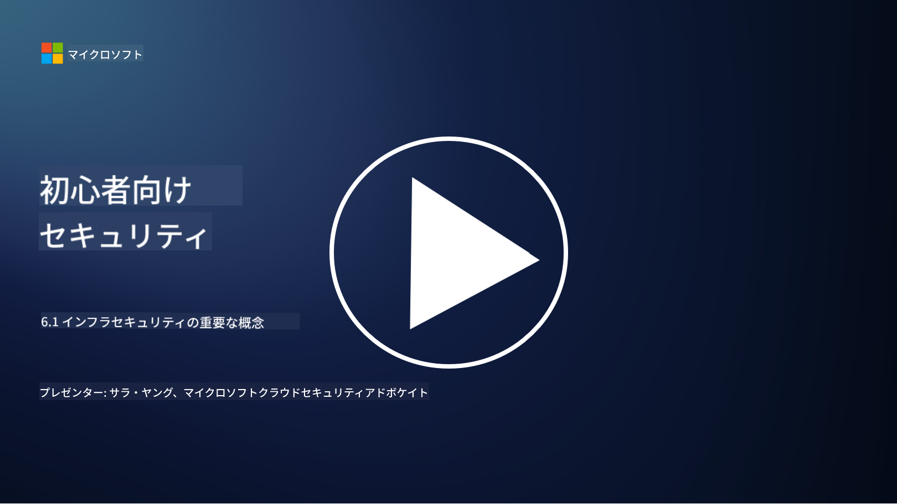

<!--
CO_OP_TRANSLATOR_METADATA:
{
  "original_hash": "882ebf66a648f419bcbf680ed6aefa00",
  "translation_date": "2025-09-03T20:07:22+00:00",
  "source_file": "6.1 Infrastructure security key concepts.md",
  "language_code": "ja"
}
-->
# インフラセキュリティの重要な概念

「インフラ」とは、サーバー、クラウドサービス、コンテナなど、IT環境の基盤となる構成要素を指します。これらは多岐にわたる技術を含んでいます。前のセクションで議論されたアプリケーションはインフラ上で動作しており、攻撃者のターゲットになる可能性もあります。

このレッスンでは以下を取り上げます：

- セキュリティハイジーンとは何か、そしてなぜ重要なのか？

- セキュリティポスチャーマネジメントとは何か？

- パッチ適用とは何か、そしてなぜ重要なのか？

- コンテナとは何か、そしてそのセキュリティの違いは何か？

## セキュリティハイジーンとは何か、そしてなぜ重要なのか？

**セキュリティハイジーン**とは、個人や組織が良好なサイバーセキュリティ習慣を維持するために従うべき一連の実践や行動を指します。これには、システム、データ、ネットワークを脅威や脆弱性から保護するための措置を講じることが含まれます。良好なセキュリティハイジーンが重要である理由は以下の通りです：

- **攻撃の防止**: ベストプラクティスを遵守することで、フィッシング、マルウェア感染、不正アクセスなどの一般的なサイバー攻撃を防ぐことができます。

- **データの保護**: 適切なセキュリティハイジーンは、機密性の高いデータを盗難や漏洩から守ります。

- **信頼の維持**: 良好なセキュリティハイジーンを実践する組織は、顧客やパートナーからの信頼を築きます。

- **コンプライアンス**: 多くの規制や基準では、セキュリティハイジーンの実践が求められています。

- **リスクの軽減**: 一貫したセキュリティハイジーンは、セキュリティインシデントや侵害のリスクを全体的に減少させます。

セキュリティハイジーンには、ソフトウェアの最新化、強力なパスワードと多要素認証の使用、定期的なバックアップ、従業員のトレーニング、不審な活動の監視などの実践が含まれます。これは強固なサイバーセキュリティ体制の基盤となります。

## セキュリティポスチャーマネジメントとは何か？

セキュリティポスチャーマネジメント（Security Posture Management）とは、組織の全体的なサイバーセキュリティ体制を評価、監視、管理する実践を指します。サイバーセキュリティ体制とは、組織が情報技術（IT）システム、ネットワーク、データ、資産をサイバー脅威や攻撃から保護するための全体的なアプローチと準備状況を指します。これには、戦略、ポリシー、実践、技術が含まれ、デジタル資産を保護し、情報の機密性、完全性、可用性を維持することを目的としています。

セキュリティポスチャーマネジメントは、システム、ネットワーク、アプリケーション、データのセキュリティを評価し、維持することで、セキュリティポリシー、ベストプラクティス、コンプライアンス要件に適合させることを目指します。SPMは、組織のセキュリティ状況を包括的に把握し、脆弱性や弱点を特定し、修正の優先順位をつけることを目的としています。

## パッチ適用とは何か、そしてなぜ重要なのか？

**パッチ適用**とは、ソフトウェア、オペレーティングシステム、アプリケーションに対して、パッチや修正と呼ばれるソフトウェア更新を適用するプロセスを指します。これらの更新は通常、セキュリティ脆弱性、バグ、その他の問題を修正するためのものです。ハードウェアデバイスもパッチ適用が必要であり、ファームウェアや組み込みOSが対象となります。ハードウェアのパッチ適用はソフトウェアよりも難しい場合があります。

パッチ適用が重要である理由は以下の通りです：

- **セキュリティ**: パッチは、攻撃者がシステムを侵害しデータを盗むために利用できる既知の脆弱性を修正します。

- **安定性**: パッチには、安定性やパフォーマンスの向上が含まれることがあり、クラッシュやシステム障害のリスクを軽減します。

- **コンプライアンス**: 多くの規制やコンプライアンス基準では、セキュリティパッチを迅速に適用することが求められています。

- **信頼の維持**: 定期的なパッチ適用は、セキュリティへの取り組みを示し、顧客や関係者の信頼を維持します。

- **リスクの軽減**: パッチ適用は攻撃対象領域を減少させ、サイバー攻撃の成功率を低下させます。

パッチを適時に適用しないと、既知の脆弱性に対してシステムが無防備になり、セキュリティ侵害やデータ損失のリスクが高まります。

## コンテナとは何か、そしてそのセキュリティの違いは何か？

コンテナは、軽量で独立した実行可能なソフトウェアパッケージの一形態であり、ソフトウェアを実行するために必要なコード、ランタイム、ライブラリ、システムツールをすべて含んでいます。コンテナはアプリケーションに一貫性のある隔離された環境を提供し、異なる環境やプラットフォーム間でソフトウェアを開発、パッケージ化、デプロイすることを容易にします。代表的なコンテナ技術にはDockerやKubernetesがあります。

コンテナセキュリティとは、コンテナとその中でホストされるアプリケーションをさまざまなセキュリティ脅威や脆弱性から保護するための実践や技術を指します。コンテナは移植性やスケーラビリティの面で多くの利点を提供しますが、同時に以下のようなセキュリティ課題をもたらします：

1. **イメージセキュリティ**: コンテナイメージには脆弱性が含まれる可能性があり、これらのイメージが定期的に更新されず、パッチ適用されない場合、攻撃者に悪用される可能性があります。コンテナセキュリティでは、既知の脆弱性をスキャンし、信頼できるイメージのみを使用することが重要です。

2. **ランタイムセキュリティ**: 実行中のコンテナは互いに、またホストシステムから隔離される必要があります。不正アクセスや潜在的な攻撃を防ぐために、名前空間やcgroupsなどのコンテナ隔離技術、コンテナの挙動を監視・監査するツールが使用されます。

3. **ネットワークセキュリティ**: コンテナはネットワークを介して互いに、また外部システムと通信します。ネットワークの分割やファイアウォールルールを適切に設定することで、コンテナ間の通信を制御し、不正アクセスを防ぐことが重要です。

4. **アクセス制御**: コンテナにアクセスし変更できるのは、認可されたユーザーやプロセスのみである必要があります。ロールベースのアクセス制御（RBAC）やアイデンティティ管理ツールがよく使用されます。

5. **ログと監視**: コンテナセキュリティでは、ログの収集と分析、監視データを活用して、セキュリティインシデントや異常をリアルタイムで検出し対応することが求められます。

6. **オーケストレーションセキュリティ**: Kubernetesなどのコンテナオーケストレーションプラットフォームを使用する場合、オーケストレーション層のセキュリティも重要です。これには、Kubernetes APIサーバーのセキュリティ確保、適切なRBACポリシーの設定、クラスタ活動の監査が含まれます。

7. **秘密情報管理**: コンテナ内でAPIキーやパスワードなどの機密情報を扱う際には、安全なストレージと管理ソリューションを使用して情報の漏洩を防ぐ必要があります。

コンテナセキュリティソリューションは、セキュリティのベストプラクティス、脆弱性スキャンツール、ランタイム保護機構、ネットワークセキュリティ設定、コンテナオーケストレーションセキュリティ機能を組み合わせて構成されます。コンテナ化されたアプリケーションが進化しスケールする中で、脅威を迅速に検出し対応するためには、継続的な監視と自動化が不可欠です。

## 参考資料

- [The importance of security hygiene | Security Magazine](https://www.securitymagazine.com/articles/99510-the-importance-of-security-hygiene)
- [What is CSPM? | Microsoft Security](https://www.microsoft.com/security/business/security-101/what-is-cspm?WT.mc_id=academic-96948-sayoung)
- [What is Cloud Security Posture Management (CSPM)? | HackerOne](https://www.hackerone.com/knowledge-center/what-cloud-security-posture-management)
- [Function of cloud security posture management - Cloud Adoption Framework | Microsoft Learn](https://learn.microsoft.com/azure/cloud-adoption-framework/organize/cloud-security-posture-management?WT.mc_id=academic-96948-sayoung)
- [What Is a CNAPP? | Microsoft Security](https://www.microsoft.com/security/business/security-101/what-is-cnapp)
- [Why Everyone Is Talking About CNAPP (forbes.com)](https://www.forbes.com/sites/forbestechcouncil/2021/12/10/why-everyone-is-talking-about-cnapp/?sh=567275ca1549)
- [Why is patching important to cybersecurity? - CyberSmart](https://cybersmart.co.uk/blog/why-is-patching-important-to-cybersecurity/)
- [What Is Container Security? Complete Guide [2023] (aquasec.com)](https://www.aquasec.com/cloud-native-academy/container-security/container-security/)

---

**免責事項**:  
この文書はAI翻訳サービス[Co-op Translator](https://github.com/Azure/co-op-translator)を使用して翻訳されています。正確性を追求しておりますが、自動翻訳には誤りや不正確な部分が含まれる可能性があります。元の言語で記載された文書が正式な情報源とみなされるべきです。重要な情報については、専門の人間による翻訳を推奨します。この翻訳の使用に起因する誤解や誤解について、当社は責任を負いません。