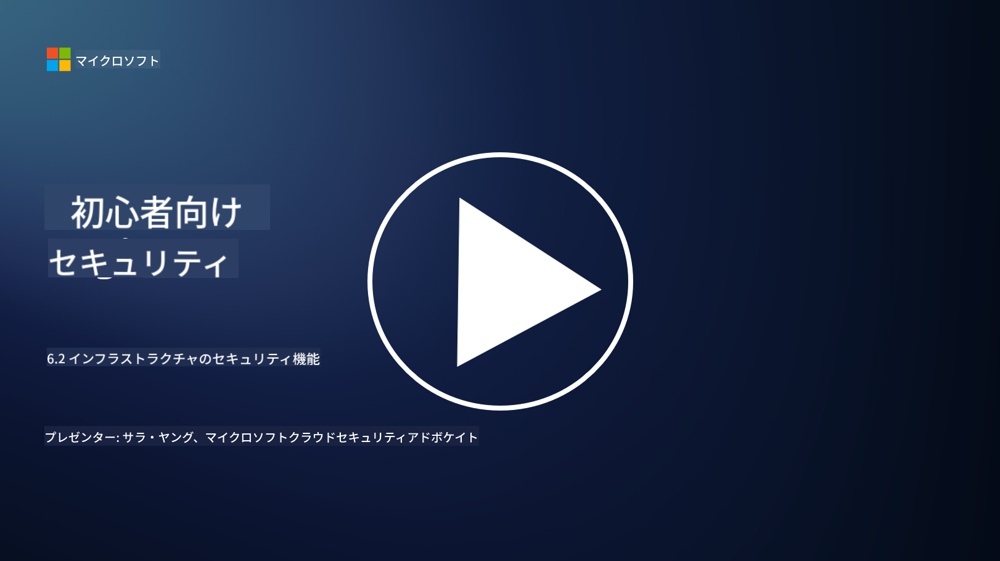

<!--
CO_OP_TRANSLATOR_METADATA:
{
  "original_hash": "7d79ba0e7668b3bdae1fba7aa047f6c0",
  "translation_date": "2025-09-03T20:56:13+00:00",
  "source_file": "6.2 Infrastructure security capabilities.md",
  "language_code": "ja"
}
-->
# インフラセキュリティの機能

このセクションでは、インフラセキュリティで使用される主要なツールと機能について詳しく説明します。

**イントロダクション**

このレッスンでは以下を学びます：

- 脆弱性管理とは何か？

- CSPMとは何か？

- CNAPPとは何か？

## 脆弱性管理とは何か？

脆弱性管理は、コンピューターシステム、ソフトウェア、ネットワーク、インフラにおける脆弱性を特定、評価、優先順位付け、軽減、監視する体系的なプロセスです。脆弱性管理の主な目的は、既知の脆弱性が悪意のある攻撃者に利用される前に積極的に対処することで、組織のセキュリティリスクへの露出を減らすことです。以下は主要なステップの概要です：

- **特定**: サーバー、アプリケーション、ネットワークデバイス、エンドポイントなど、組織の資産における脆弱性をスキャンして発見する。

- **評価**: 共通脆弱性評価システム（CVSS）スコアやビジネスの状況などの要因に基づいて、各脆弱性の深刻度と潜在的な影響を評価する。

- **優先順位付け**: リスクレベルや組織の運用やデータへの影響に基づいて脆弱性をランク付けする。

- **軽減**: パッチの適用、セキュリティ設定の構成、代替的なコントロールの導入など、脆弱性を修正または軽減するための戦略を策定し実施する。

- **検証**: 軽減策が脆弱性に対処する上で効果的であったことを確認する。

- **継続的監視**: 定期的な脆弱性スキャンと評価を通じて、脆弱性や潜在的な脅威を継続的に追跡する。

脆弱性管理はサイバーセキュリティの重要な要素であり、組織が強固なセキュリティ体制を維持し、セキュリティ侵害の可能性を減らすのに役立ちます。脆弱性管理ツールの例として、Defender for Cloud、Nessus、Qualysがあります。

## CSPMとは何か？

クラウドセキュリティポスチャ管理（CSPM）は、クラウド環境におけるセキュリティ設定やベストプラクティスを評価、監視、強制するためのツール、プロセス、実践のセットです。CSPMソリューションは、Amazon Web Services (AWS)、Microsoft Azure、Google Cloud Platform (GCP) などのクラウドプロバイダーにおける設定ミス、セキュリティギャップ、コンプライアンス違反を特定し、修正するのに役立ちます。

CSPMの主な側面は以下の通りです：

- **設定評価**: クラウドリソースやサービスをスキャンし、設定ミス、不安全な設定、セキュリティベストプラクティスからの逸脱を特定する。

- **セキュリティポリシーの強制**: 設定ミスを自動的に修正したり、アラートを生成することで、クラウド環境全体でセキュリティポリシーやコンプライアンス基準を強制する。

- **継続的監視**: クラウド資産やリソースのセキュリティポスチャをリアルタイムで監視し、セキュリティインシデントに対するアラートを提供する。

- **コンプライアンス報告**: 規制要件や業界基準への準拠を示すレポートやダッシュボードを生成する。

CSPMは、クラウドインフラが安全でコンプライアンスに準拠し、ベストプラクティスに沿っていることを保証し、クラウド関連のセキュリティインシデントのリスクを軽減します。CSPMツールの例として、Defender for CloudやSnykがあります。

## CNAPPとは何か？

CNAPPは、クラウドネイティブアプリケーション保護プラットフォーム（Cloud-Native Application Protection Platform）の略です。これは、クラウドセキュリティの脅威や脆弱性を監視、検出、対応するプロセスを簡素化するオールインワンのクラウドネイティブソフトウェアプラットフォームです。CNAPPは複数のツールや機能を単一のソフトウェアソリューションに統合し、複雑さを最小化し、DevOpsやDevSecOpsチームの運用を支援します。CNAPPは、開発から運用までのCI/CDアプリケーションライフサイクル全体を通じて、クラウドとアプリケーションのセキュリティを提供します。これは、クラウドセキュリティの監視、ポスチャ管理、侵害防止、制御ツールに対する業界のニーズに対応します。

CNAPPソリューションは、クラウド環境におけるリスクを定量化し対応する能力をセキュリティチームに提供します。CNAPPの特徴には、可視性の向上、リスクの定量化、安全なソフトウェア開発、統合されたクラウドセキュリティソリューションが含まれます。CNAPPは、従来は分断されていた複数のクラウドセキュリティソリューションを単一のユーザーインターフェースに統合し、組織がクラウドアプリケーション全体を保護しやすくします。

CNAPPは、コンテナスキャン、クラウドセキュリティポスチャ管理、インフラコードスキャン、クラウドインフラ権限管理、ランタイムクラウドワークロード保護プラットフォームなど、複数のクラウドネイティブセキュリティツールやデータソースを統合します。

## 参考資料
- [What is CSPM? | Microsoft Security](https://www.microsoft.com/security/business/security-101/what-is-cspm?WT.mc_id=academic-96948-sayoung)
- [What is Cloud Security Posture Management (CSPM)? | HackerOne](https://www.hackerone.com/knowledge-center/what-cloud-security-posture-management)
- [Function of cloud security posture management - Cloud Adoption Framework | Microsoft Learn](https://learn.microsoft.com/azure/cloud-adoption-framework/organize/cloud-security-posture-management?WT.mc_id=academic-96948-sayoung)
- [What Is a CNAPP? | Microsoft Security](https://www.microsoft.com/security/business/security-101/what-is-cnapp?WT.mc_id=academic-96948-sayoung)
- [Why Everyone Is Talking About CNAPP (forbes.com)](https://www.forbes.com/sites/forbestechcouncil/2021/12/10/why-everyone-is-talking-about-cnapp/?sh=567275ca1549)
- [Improving Your Multi-Cloud Security with a Cloud-Native Application Protection Platform (CNAPP)](https://www.youtube.com/watch?v=5w42kQ_QjZg&t=212s)

---

**免責事項**:  
この文書は、AI翻訳サービス [Co-op Translator](https://github.com/Azure/co-op-translator) を使用して翻訳されています。正確性を期すよう努めておりますが、自動翻訳には誤りや不正確な部分が含まれる可能性があります。元の言語で記載された原文が正式な情報源と見なされるべきです。重要な情報については、専門の人間による翻訳を推奨します。この翻訳の使用に起因する誤解や誤認について、当社は一切の責任を負いません。