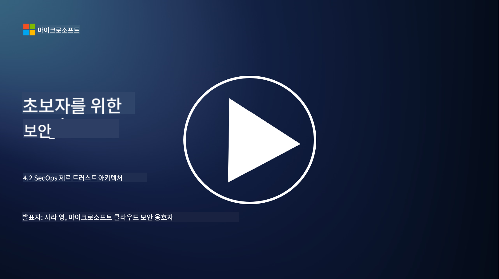

<!--
CO_OP_TRANSLATOR_METADATA:
{
  "original_hash": "45bbdc114e70936816b0b3e7c40189cf",
  "translation_date": "2025-09-03T18:40:51+00:00",
  "source_file": "4.2 SecOps zero trust architecture.md",
  "language_code": "ko"
}
-->
# SecOps 제로 트러스트 아키텍처

보안 운영(Security Operations)은 제로 트러스트 아키텍처의 두 가지 주요 요소 중 하나이며, 이번 강의에서는 다음 두 가지를 학습합니다:

- 중앙 집중식 로그 수집을 가능하게 하려면 IT 아키텍처를 어떻게 설계해야 할까요?

- 현대 IT 환경에서 보안 운영의 모범 사례는 무엇일까요?

## 중앙 집중식 로그 수집을 가능하게 하려면 IT 아키텍처를 어떻게 설계해야 할까요?

중앙 집중식 로그 수집은 현대 보안 운영의 핵심 요소입니다. 이를 통해 조직은 서버, 애플리케이션, 네트워크 장치, 보안 도구 등 다양한 소스에서 로그와 데이터를 중앙 저장소로 집계하여 분석, 모니터링, 사고 대응에 활용할 수 있습니다. 중앙 집중식 로그 수집을 지원하는 IT 아키텍처를 구축하기 위한 모범 사례는 다음과 같습니다:

1. **로그 소스 통합**:

- 모든 관련 장치와 시스템이 로그를 생성하도록 구성하세요. 여기에는 서버, 방화벽, 라우터, 스위치, 애플리케이션, 보안 장치 등이 포함됩니다.

- 로그 소스를 중앙 로그 수집기 또는 관리 시스템으로 전달하도록 설정하세요.

2. **적합한 SIEM 도구 선택**:

- 조직의 요구 사항과 규모에 맞는 SIEM(Secure Information and Event Management) 솔루션을 선택하세요.

- 선택한 솔루션이 로그 수집, 집계, 분석, 보고를 지원하는지 확인하세요.

3. **확장성과 중복성**:

- 증가하는 로그 소스와 로그 볼륨을 수용할 수 있도록 아키텍처를 확장 가능하게 설계하세요.

- 하드웨어 또는 네트워크 장애로 인한 중단을 방지하기 위해 고가용성을 위한 중복성을 구현하세요.

4. **로그의 안전한 전송**:

- TLS/SSL 또는 IPsec과 같은 안전한 프로토콜을 사용하여 로그를 소스에서 중앙 저장소로 전송하세요.

- 인증 및 접근 제어를 구현하여 승인된 장치만 로그를 전송할 수 있도록 하세요.

5. **정규화**:

- 로그 형식을 표준화하고 데이터를 정규화하여 분석의 일관성과 용이성을 보장하세요.

6. **저장 및 보존**:

- 규정 준수 및 보안 요구 사항에 따라 적절한 로그 보존 기간을 결정하세요.

- 로그를 안전하게 저장하여 무단 접근 및 변조로부터 보호하세요.

## 현대 IT 환경에서 보안 운영의 모범 사례는 무엇일까요?

중앙 집중식 로그 수집 외에도, 현대 IT 환경에서 보안 운영을 위한 모범 사례는 다음과 같습니다:

1. **지속적인 모니터링**: 네트워크 및 시스템 활동을 지속적으로 모니터링하여 실시간으로 위협을 감지하고 대응하세요.

2. **위협 인텔리전스**: 위협 인텔리전스 피드와 서비스를 활용하여 새로운 위협과 취약점에 대한 정보를 지속적으로 업데이트하세요.

3. **사용자 교육**: 정기적인 보안 인식 교육을 통해 소셜 엔지니어링 및 피싱 공격과 관련된 위험을 완화하세요.

4. **사고 대응 계획**: 신속하고 효과적인 사고 대응을 보장하기 위해 사고 대응 계획을 개발하고 테스트하세요.

5. **보안 자동화**: 보안 자동화 및 오케스트레이션 도구를 활용하여 사고 대응 및 반복 작업을 간소화하세요.

6. **백업 및 복구**: 데이터 손실 또는 랜섬웨어 공격에 대비하여 강력한 백업 및 재해 복구 솔루션을 구현하세요.

## 추가 자료

- [Microsoft Security Best Practices module: Security operations | Microsoft Learn](https://learn.microsoft.com/security/operations/security-operations-videos-and-decks?WT.mc_id=academic-96948-sayoung)
- [Security operations - Cloud Adoption Framework | Microsoft Learn](https://learn.microsoft.com/azure/cloud-adoption-framework/secure/security-operations?WT.mc_id=academic-96948-sayoung)
- [What is Security Operations and Analytics Platform Architecture? A Definition of SOAPA, How It Works, Benefits, and More (digitalguardian.com)](https://www.digitalguardian.com/blog/what-security-operations-and-analytics-platform-architecture-definition-soapa-how-it-works#:~:text=All%20in%20all%2C%20security%20operations%20and%20analytics%20platform,become%20more%20efficient%20and%20operative%20with%20your%20security.)

---

**면책 조항**:  
이 문서는 AI 번역 서비스 [Co-op Translator](https://github.com/Azure/co-op-translator)를 사용하여 번역되었습니다. 정확성을 위해 최선을 다하고 있으나, 자동 번역에는 오류나 부정확성이 포함될 수 있습니다. 원본 문서의 원어 버전을 신뢰할 수 있는 권위 있는 자료로 간주해야 합니다. 중요한 정보의 경우, 전문적인 인간 번역을 권장합니다. 이 번역 사용으로 인해 발생하는 오해나 잘못된 해석에 대해 당사는 책임을 지지 않습니다.