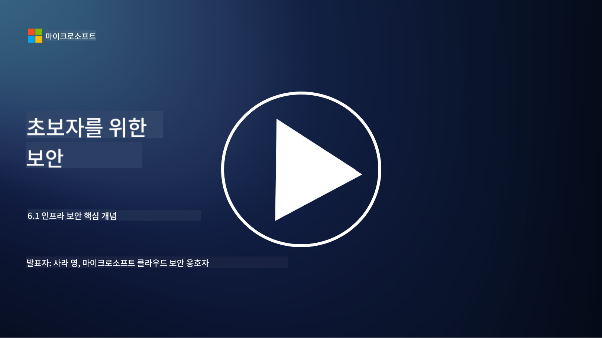

<!--
CO_OP_TRANSLATOR_METADATA:
{
  "original_hash": "882ebf66a648f419bcbf680ed6aefa00",
  "translation_date": "2025-09-03T18:15:10+00:00",
  "source_file": "6.1 Infrastructure security key concepts.md",
  "language_code": "ko"
}
-->
# 인프라 보안 핵심 개념

"인프라"는 서버, 클라우드 서비스, 컨테이너 등 IT 환경의 기본 구성 요소를 의미하며, 다양한 기술을 포함합니다. 이전 섹션에서 논의된 애플리케이션은 인프라에서 실행되므로 공격자들의 표적이 될 수 있습니다.

이 강의에서는 다음 내용을 다룹니다:

- 보안 위생이란 무엇이며 왜 중요한가?

- 보안 태세 관리란 무엇인가?

- 패치란 무엇이며 왜 중요한가?

- 컨테이너란 무엇이며 그 보안은 어떻게 다른가?

## 보안 위생이란 무엇이며 왜 중요한가?

**보안 위생**은 개인과 조직이 좋은 사이버 보안 습관을 유지하기 위해 따르는 관행과 행동을 의미합니다. 이는 시스템, 데이터, 네트워크를 위협과 취약점으로부터 보호하기 위한 조치를 포함합니다. 좋은 보안 위생은 여러 가지 이유로 중요합니다:

- **공격 예방**: 모범 사례를 따르면 피싱, 악성코드 감염, 무단 접근과 같은 일반적인 사이버 공격을 예방할 수 있습니다.

- **데이터 보호**: 적절한 보안 위생은 민감하고 기밀성이 높은 데이터를 도난이나 노출로부터 보호합니다.

- **신뢰 유지**: 좋은 보안 위생을 보여주는 조직은 고객과 파트너의 신뢰를 구축합니다.

- **규정 준수**: 많은 규정과 표준은 조직이 보안 위생 관행을 따를 것을 요구합니다.

- **위험 감소**: 일관된 보안 위생은 보안 사고와 침해의 전반적인 위험을 줄입니다.

보안 위생에는 소프트웨어를 최신 상태로 유지, 강력한 비밀번호와 다중 인증 사용, 정기적인 백업, 직원 교육, 의심스러운 활동 모니터링과 같은 관행이 포함됩니다. 이는 강력한 사이버 보안 태세의 기초입니다.

## 보안 태세 관리란 무엇인가?

보안 태세 관리는 조직의 전반적인 사이버 보안 태세를 평가, 모니터링, 관리하는 관행을 의미합니다. 사이버 보안 태세는 조직이 정보 기술(IT) 시스템, 네트워크, 데이터, 자산을 사이버 위협과 공격으로부터 보호하기 위한 전반적인 접근 방식과 준비 상태를 나타냅니다. 이는 조직이 디지털 자산을 보호하고 정보의 기밀성, 무결성, 가용성을 유지하기 위해 사용하는 전략, 정책, 관행, 기술을 포함합니다. 

보안 태세 관리는 시스템, 네트워크, 애플리케이션, 데이터의 보안을 평가하고 유지하여 보안 정책, 모범 사례, 규정 준수 요구 사항에 부합하도록 합니다. SPM은 조직의 보안 상태를 종합적으로 파악하고, 취약점과 약점을 식별하며, 수정 작업의 우선순위를 정하는 것을 목표로 합니다.

## 패치란 무엇이며 왜 중요한가?

**패치**는 소프트웨어, 운영 체제, 애플리케이션에 패치 또는 수정 사항으로 알려진 소프트웨어 업데이트를 적용하는 과정을 의미합니다. 이러한 업데이트는 일반적으로 보안 취약점, 버그, 기타 문제를 해결하며, 이는 공격자들이 악용할 수 있습니다. 하드웨어 장치도 패치가 필요하며, 이는 펌웨어나 내장된 운영 체제가 될 수 있습니다. 하드웨어 패치는 소프트웨어 패치보다 훨씬 어려울 수 있습니다.

패치가 중요한 이유는 다음과 같습니다:

- **보안**: 패치는 공격자가 시스템을 손상시키고 데이터를 훔칠 수 있는 알려진 취약점을 수정합니다.

- **안정성**: 패치는 종종 안정성과 성능 개선을 포함하여 시스템 충돌이나 장애 위험을 줄입니다.

- **규정 준수**: 많은 규정과 준수 표준은 조직이 보안 패치를 신속히 적용할 것을 요구합니다.

- **신뢰 유지**: 정기적인 패치는 고객과 이해관계자의 신뢰를 유지하며 보안에 대한 헌신을 보여줍니다.

- **위험 감소**: 패치는 공격 표면을 줄이고 성공적인 사이버 공격 가능성을 낮춥니다.

패치를 제때 적용하지 않으면 시스템이 알려진 취약점에 노출되어 보안 침해와 데이터 손실 위험이 증가할 수 있습니다.

## 컨테이너란 무엇이며 그 보안은 어떻게 다른가?

컨테이너는 소프트웨어를 실행하는 데 필요한 코드, 런타임, 라이브러리, 시스템 도구를 포함한 경량의 독립적이고 실행 가능한 소프트웨어 패키지입니다. 컨테이너는 애플리케이션에 일관되고 격리된 환경을 제공하여 다양한 환경과 플랫폼에서 소프트웨어를 개발, 패키징, 배포하기 쉽게 만듭니다. 대표적인 컨테이너 기술로는 Docker와 Kubernetes가 있습니다.

컨테이너 보안은 컨테이너와 그 안에서 호스팅되는 애플리케이션을 다양한 보안 위협과 취약점으로부터 보호하기 위한 관행과 기술을 의미합니다. 컨테이너는 이동성과 확장성 측면에서 많은 이점을 제공하지만, 동시에 잠재적인 보안 문제를 야기할 수 있습니다:

1. **이미지 보안**: 컨테이너 이미지는 취약점을 포함할 수 있으며, 이러한 이미지를 정기적으로 업데이트하고 패치하지 않으면 공격자에게 악용될 수 있습니다. 컨테이너 보안은 알려진 취약점을 스캔하고 신뢰할 수 있는 이미지만 사용하는 것을 포함합니다.

2. **런타임 보안**: 실행 중인 컨테이너는 서로 및 호스트 시스템으로부터 격리되어야 하며, 무단 접근과 잠재적 공격을 방지해야 합니다. 런타임 보안 메커니즘에는 네임스페이스와 cgroups 같은 컨테이너 격리 기술, 컨테이너 동작을 모니터링하고 감사하는 도구가 포함됩니다.

3. **네트워크 보안**: 컨테이너는 네트워크를 통해 서로 및 외부 시스템과 통신합니다. 컨테이너 간 트래픽을 제어하고 무단 접근을 방지하기 위해 적절한 네트워크 분리와 방화벽 규칙이 필요합니다.

4. **접근 제어**: 컨테이너에 접근하고 수정할 수 있는 권한을 가진 사용자와 프로세스를 제한하는 것이 중요합니다. 역할 기반 접근 제어(RBAC)와 신원 관리 도구가 자주 사용됩니다.

5. **로그 및 모니터링**: 컨테이너 보안은 로그 수집 및 분석, 실시간으로 보안 사고와 이상 징후를 탐지하고 대응하는 것을 포함합니다.

6. **오케스트레이션 보안**: Kubernetes와 같은 컨테이너 오케스트레이션 플랫폼을 사용할 때 오케스트레이션 계층의 보안도 중요합니다. 여기에는 Kubernetes API 서버 보안, 적절한 RBAC 정책 설정, 클러스터 활동 감사가 포함됩니다.

7. **비밀 관리**: 컨테이너에서 API 키와 비밀번호 같은 민감한 정보를 처리할 때는 안전한 저장 및 관리 솔루션이 필요합니다.

컨테이너 보안 솔루션은 보안 모범 사례, 취약점 스캔 도구, 런타임 보호 메커니즘, 네트워크 보안 구성, 컨테이너 오케스트레이션 보안 기능을 결합하여 이루어집니다. 컨테이너화된 애플리케이션이 진화하고 확장됨에 따라 위협을 신속히 탐지하고 대응하기 위해 지속적인 모니터링과 자동화가 필수적입니다.

## 추가 읽을거리

- [The importance of security hygiene | Security Magazine](https://www.securitymagazine.com/articles/99510-the-importance-of-security-hygiene)
- [What is CSPM? | Microsoft Security](https://www.microsoft.com/security/business/security-101/what-is-cspm?WT.mc_id=academic-96948-sayoung)
- [What is Cloud Security Posture Management (CSPM)? | HackerOne](https://www.hackerone.com/knowledge-center/what-cloud-security-posture-management)
- [Function of cloud security posture management - Cloud Adoption Framework | Microsoft Learn](https://learn.microsoft.com/azure/cloud-adoption-framework/organize/cloud-security-posture-management?WT.mc_id=academic-96948-sayoung)
- [What Is a CNAPP? | Microsoft Security](https://www.microsoft.com/security/business/security-101/what-is-cnapp)
- [Why Everyone Is Talking About CNAPP (forbes.com)](https://www.forbes.com/sites/forbestechcouncil/2021/12/10/why-everyone-is-talking-about-cnapp/?sh=567275ca1549)
- [Why is patching important to cybersecurity? - CyberSmart](https://cybersmart.co.uk/blog/why-is-patching-important-to-cybersecurity/)
- [What Is Container Security? Complete Guide [2023] (aquasec.com)](https://www.aquasec.com/cloud-native-academy/container-security/container-security/)

---

**면책 조항**:  
이 문서는 AI 번역 서비스 [Co-op Translator](https://github.com/Azure/co-op-translator)를 사용하여 번역되었습니다. 정확성을 위해 최선을 다하고 있지만, 자동 번역에는 오류나 부정확성이 포함될 수 있습니다. 원본 문서의 원어 버전이 권위 있는 출처로 간주되어야 합니다. 중요한 정보의 경우, 전문적인 인간 번역을 권장합니다. 이 번역 사용으로 인해 발생하는 오해나 잘못된 해석에 대해 책임을 지지 않습니다.