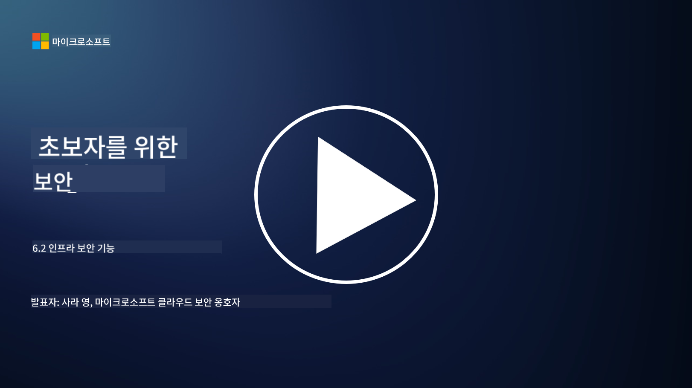

<!--
CO_OP_TRANSLATOR_METADATA:
{
  "original_hash": "7d79ba0e7668b3bdae1fba7aa047f6c0",
  "translation_date": "2025-09-03T18:32:20+00:00",
  "source_file": "6.2 Infrastructure security capabilities.md",
  "language_code": "ko"
}
-->
# 인프라 보안 기능

이 섹션에서는 인프라 보안에 사용되는 핵심 도구와 기능에 대해 자세히 알아보겠습니다.

**소개**

이 강의에서는 다음 내용을 다룹니다:

- 취약점 관리란 무엇인가?

- CSPM이란 무엇인가?

- CNAPP이란 무엇인가?

## 취약점 관리란 무엇인가?

취약점 관리는 컴퓨터 시스템, 소프트웨어, 네트워크 및 인프라에서 취약점을 식별, 평가, 우선순위 지정, 완화 및 모니터링하는 체계적인 프로세스입니다. 취약점 관리의 주요 목표는 악의적인 행위자가 취약점을 악용하기 전에 이를 사전에 해결하여 조직의 보안 위험 노출을 줄이는 것입니다. 주요 단계는 다음과 같습니다:

식별: 서버, 애플리케이션, 네트워크 장치 및 엔드포인트를 포함한 조직 자산에서 취약점을 스캔하고 발견합니다.

평가: Common Vulnerability Scoring System (CVSS) 점수와 비즈니스 맥락과 같은 요소를 기반으로 각 취약점의 심각성과 잠재적 영향을 평가합니다.

우선순위 지정: 조직의 운영 및 데이터에 미치는 위험 수준과 잠재적 영향을 기준으로 취약점을 순위화합니다.

완화: 패치 적용, 보안 설정 구성 또는 보완 통제 배포와 같은 취약점을 해결하거나 완화하기 위한 전략을 개발하고 실행합니다.

검증: 완화 조치가 취약점을 효과적으로 해결했는지 확인합니다.

지속적인 모니터링: 정기적인 취약점 스캔 및 평가를 통해 취약점과 잠재적 위협을 지속적으로 추적합니다.

취약점 관리는 사이버 보안의 중요한 구성 요소로, 조직이 강력한 보안 태세를 유지하고 보안 침해 가능성을 줄이는 데 도움을 줍니다. 취약점 관리 도구의 예로는 Defender for Cloud, Nessus, Qualys가 있습니다.

## CSPM이란 무엇인가?

Cloud Security Posture Management (CSPM)는 클라우드 환경에서 보안 구성 및 모범 사례를 평가, 모니터링 및 시행하기 위한 도구, 프로세스 및 관행의 집합입니다. CSPM 솔루션은 Amazon Web Services (AWS), Microsoft Azure, Google Cloud Platform (GCP) 및 기타 클라우드 제공업체의 클라우드 인프라에서 잘못된 구성, 보안 격차 및 규정 준수 위반을 식별하고 해결하는 데 도움을 줍니다.

CSPM의 주요 측면은 다음과 같습니다:

- 구성 평가: 클라우드 리소스와 서비스를 스캔하여 잘못된 구성, 안전하지 않은 설정 및 보안 모범 사례에서 벗어난 부분을 식별합니다.

- 보안 정책 시행: 잘못된 구성을 자동으로 수정하거나 경고를 생성하여 클라우드 환경 전반에 걸쳐 보안 정책과 규정 준수 표준을 시행합니다.

- 지속적인 모니터링: 클라우드 자산과 리소스의 보안 상태를 실시간 경고와 함께 지속적으로 가시화합니다.

- 규정 준수 보고: 규제 요구 사항 및 업계 표준에 대한 규정 준수를 입증하는 보고서와 대시보드를 생성합니다.

CSPM은 조직이 클라우드 인프라를 안전하고 규정을 준수하며 모범 사례에 맞게 유지하도록 도와 클라우드 관련 보안 사고의 위험을 줄입니다. CSPM 도구의 예로는 Defender for Cloud와 Snyk가 있습니다.

## CNAPP이란 무엇인가?

CNAPP는 Cloud-Native Application Protection Platform의 약자로, 클라우드 보안 위협과 취약점을 모니터링, 탐지 및 대응하는 과정을 간소화하는 올인원 클라우드 네이티브 소프트웨어 플랫폼입니다. CNAPP는 여러 도구와 기능을 단일 소프트웨어 솔루션으로 통합하여 복잡성을 최소화하고 DevOps 및 DevSecOps 팀의 운영을 지원합니다. CNAPP는 개발부터 운영까지 CI/CD 애플리케이션 라이프사이클 전반에 걸쳐 클라우드 및 애플리케이션 보안을 제공합니다. 이는 현대 클라우드 보안 모니터링, 상태 관리, 침해 예방 및 제어 도구에 대한 업계의 요구를 해결합니다. CNAPP 솔루션은 보안 팀이 클라우드 환경의 위험을 정량화하고 대응할 수 있는 능력을 제공합니다. CNAPP의 주요 기능은 다음과 같습니다:

- 향상된 가시성
- 위험 정량화
- 안전한 소프트웨어 개발
- 통합된 클라우드 보안 솔루션

CNAPP는 전통적으로 분리되어 있던 여러 클라우드 보안 솔루션을 단일 사용자 인터페이스로 통합하여 조직이 전체 클라우드 애플리케이션 범위를 보호하기 쉽게 만듭니다. CNAPP는 컨테이너 스캔, 클라우드 보안 상태 관리, 코드형 인프라 스캔, 클라우드 인프라 권한 관리 및 런타임 클라우드 워크로드 보호 플랫폼을 포함한 여러 클라우드 네이티브 보안 도구와 데이터 소스를 통합합니다.

## 추가 읽기
- [What is CSPM? | Microsoft Security](https://www.microsoft.com/security/business/security-101/what-is-cspm?WT.mc_id=academic-96948-sayoung)
- [What is Cloud Security Posture Management (CSPM)? | HackerOne](https://www.hackerone.com/knowledge-center/what-cloud-security-posture-management)
- [Function of cloud security posture management - Cloud Adoption Framework | Microsoft Learn](https://learn.microsoft.com/azure/cloud-adoption-framework/organize/cloud-security-posture-management?WT.mc_id=academic-96948-sayoung)
- [What Is a CNAPP? | Microsoft Security](https://www.microsoft.com/security/business/security-101/what-is-cnapp?WT.mc_id=academic-96948-sayoung)
- [Why Everyone Is Talking About CNAPP (forbes.com)](https://www.forbes.com/sites/forbestechcouncil/2021/12/10/why-everyone-is-talking-about-cnapp/?sh=567275ca1549)
- [Improving Your Multi-Cloud Security with a Cloud-Native Application Protection Platform (CNAPP)](https://www.youtube.com/watch?v=5w42kQ_QjZg&t=212s)

---

**면책 조항**:  
이 문서는 AI 번역 서비스 [Co-op Translator](https://github.com/Azure/co-op-translator)를 사용하여 번역되었습니다. 정확성을 위해 최선을 다하고 있지만, 자동 번역에는 오류나 부정확성이 포함될 수 있습니다. 원본 문서의 원어 버전을 권위 있는 출처로 간주해야 합니다. 중요한 정보의 경우, 전문적인 인간 번역을 권장합니다. 이 번역 사용으로 인해 발생하는 오해나 잘못된 해석에 대해 책임을 지지 않습니다.