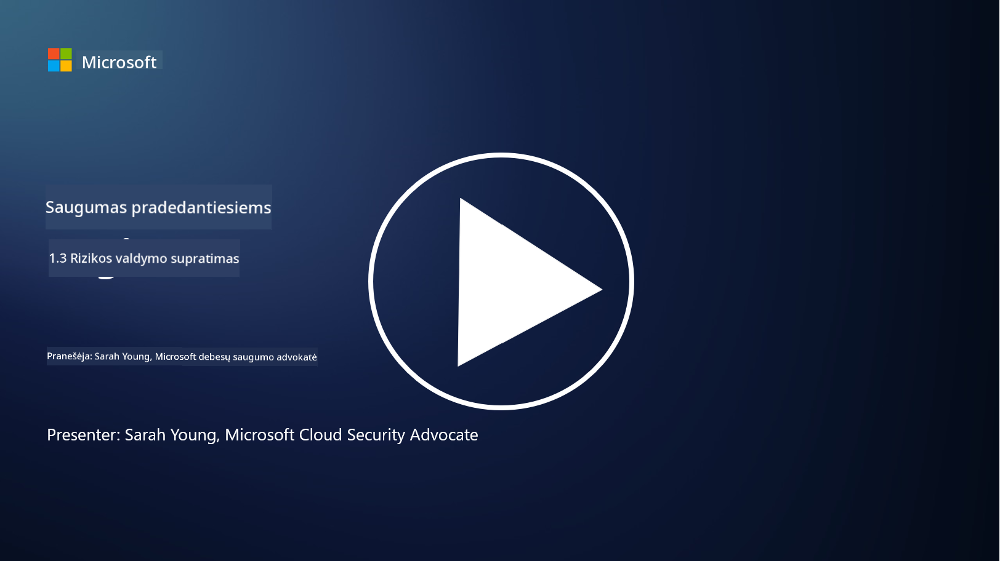
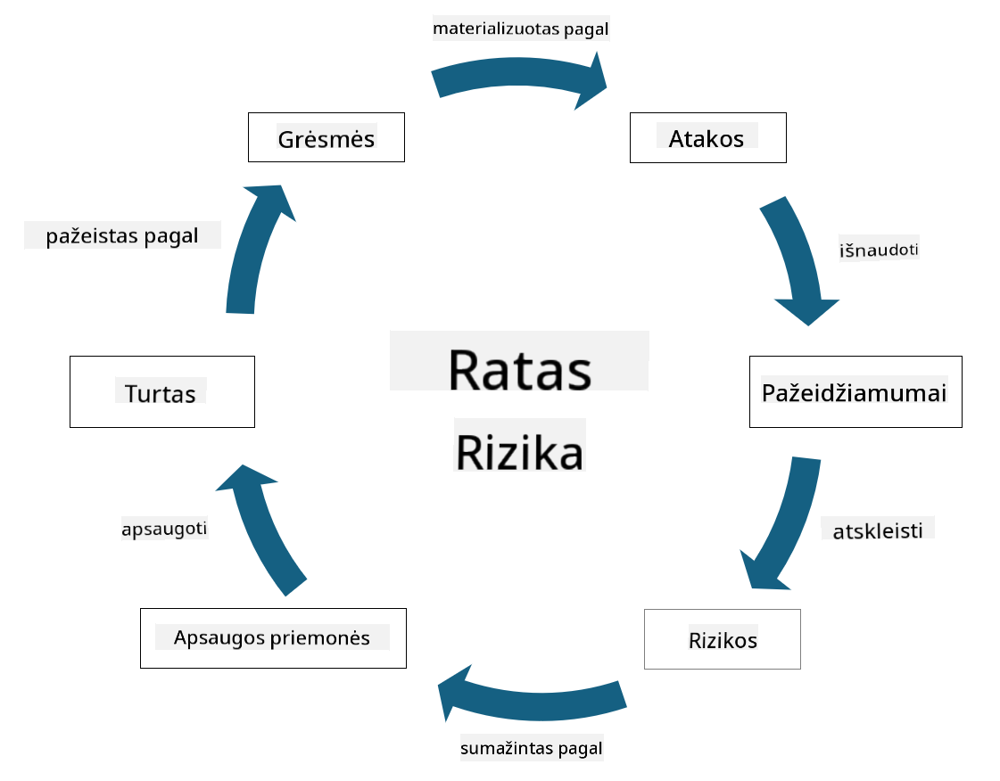

<!--
CO_OP_TRANSLATOR_METADATA:
{
  "original_hash": "fcca304f072cabf206388199e8e2e578",
  "translation_date": "2025-09-03T17:43:52+00:00",
  "source_file": "1.3 Understanding risk management.md",
  "language_code": "lt"
}
-->
# Suprasti rizikos valdymą

## Įvadas

Šioje pamokoje aptarsime:

- Dažniausiai naudojamų saugumo terminų apibrėžimus

- Saugumo kontrolės tipus

- Saugumo rizikų vertinimą

## Dažniausiai naudojamų saugumo terminų apibrėžimai

Šie terminai yra pagrindinės sąvokos kibernetinio saugumo ir rizikos valdymo srityje. Pažvelkime į kiekvieną terminą ir jų tarpusavio ryšį:

1. **Grėsmės agentas**:

Grėsmės agentas yra asmuo, grupė, organizacija ar automatizuota sistema, turinti potencialą išnaudoti sistemos ar tinklo pažeidžiamumus, kad sukeltų žalą ar nuostolius. Grėsmės agentai gali būti įsilaužėliai, kenkėjiškų programų kūrėjai, nepatenkinti darbuotojai ar bet kuris subjektas, keliantis riziką informacijos ir technologijų sistemoms.

2. **Grėsmė**:

Grėsmė yra potencialus įvykis ar veiksmas, galintis išnaudoti sistemos pažeidžiamumus ir sukelti žalą turtui. Grėsmės gali apimti tokius veiksmus kaip įsilaužimai, duomenų nutekėjimai, paslaugų trikdymo atakos ir kt. Grėsmės yra „kas“, kalbant apie potencialią žalą, kurią galima padaryti organizacijos turtui.

3. **Pažeidžiamumas**:

Pažeidžiamumas yra sistemos dizaino, įgyvendinimo ar konfigūracijos silpnumas ar trūkumas, kurį grėsmės agentas gali išnaudoti, kad pažeistų sistemos saugumą. Pažeidžiamumai gali būti programinėje įrangoje, techninėje įrangoje, procesuose ar žmonių elgesyje. Pažeidžiamumų identifikavimas ir šalinimas yra būtinas siekiant sumažinti sėkmingų atakų riziką.

4. **Rizika**:

Rizika yra potencialus nuostolis, žala ar žalingas poveikis, atsirandantis dėl grėsmės ir pažeidžiamumo sąveikos. Tai tikimybė, kad grėsmės agentas išnaudos pažeidžiamumą, sukeldamas neigiamą poveikį. Rizika dažnai vertinama pagal jos potencialų poveikį ir tikimybę.

5. **Turtas**:

Turtas yra bet kas vertingo, ką organizacija siekia apsaugoti. Turtas gali apimti fizinius objektus (pvz., kompiuterius ir serverius), duomenis (klientų informaciją, finansinius įrašus), intelektinę nuosavybę (komercines paslaptis, patentus) ir net žmogiškuosius išteklius (darbuotojų įgūdžius ir žinias). Turto apsauga yra pagrindinis kibernetinio saugumo tikslas.

6. **Ekspozicija**:

Ekspozicija reiškia būseną, kai yra pažeidžiamumas, kurį galėtų išnaudoti grėsmės agentas. Ekspozicija pabrėžia riziką, susijusią su pažeidžiamumų buvimu sistemoje ar tinkle.

7. **Kontrolė**:

Kontrolė yra priemonė, skirta sumažinti riziką, susijusią su pažeidžiamumais ir grėsmėmis. Kontrolės priemonės gali būti techninės, procedūrinės ar administracinės. Jos skirtos užkirsti kelią, aptikti ar sumažinti potencialias grėsmes ir pažeidžiamumus. Pavyzdžiai: ugniasienės, prieigos kontrolė, šifravimas, saugumo politikos ir darbuotojų mokymai.

Apibendrinant šių terminų tarpusavio ryšį: grėsmės agentai išnaudoja pažeidžiamumus, kad įgyvendintų grėsmes, kurios gali sukelti riziką ir pakenkti vertingam turtui. Ekspozicija atsiranda, kai yra pažeidžiamumų, o kontrolės priemonės įgyvendinamos siekiant sumažinti riziką, užkertant kelią ar mažinant grėsmių poveikį turtui. Ši sistema sudaro kibernetinio saugumo rizikos valdymo pagrindą, padedant organizacijoms identifikuoti, vertinti ir spręsti galimas rizikas jų informacinėms sistemoms ir turtui.

## Saugumo kontrolės tipai

Saugumo kontrolės priemonės yra veiksmai ar apsaugos priemonės, įgyvendinamos siekiant apsaugoti informacines sistemas ir turtą nuo įvairių grėsmių ir pažeidžiamumų. Jas galima suskirstyti į kelias kategorijas pagal jų tikslą ir paskirtį. Štai keletas dažniausiai pasitaikančių saugumo kontrolės tipų:

1. **Administracinės kontrolės**:

Šios kontrolės priemonės susijusios su politikomis, procedūromis ir gairėmis, kurios reguliuoja organizacijos saugumo praktiką ir vartotojų elgesį.

- Saugumo politikos ir procedūros: Dokumentuotos gairės, apibrėžiančios, kaip organizacijoje palaikomas saugumas.

- Saugumo sąmoningumas ir mokymai: Programos, skirtos šviesti darbuotojus apie saugumo gerąją praktiką ir galimas grėsmes.

- Incidentų valdymas ir reagavimas: Planai, skirti reaguoti į saugumo incidentus ir juos sušvelninti.

2. **Techninės kontrolės**:

Techninės kontrolės priemonės apima technologijų naudojimą saugumo priemonėms įgyvendinti ir sistemoms bei duomenims apsaugoti. Pavyzdžiai:

- Prieigos kontrolė: Priemonės, ribojančios vartotojų prieigą prie išteklių pagal jų vaidmenis ir leidimus.

- Šifravimas: Duomenų konvertavimas į saugų formatą, kad būtų išvengta neteisėtos prieigos.

- Ugniasienės: Tinklo saugumo įrenginiai, filtruojantys ir kontroliuojantys įeinantį ir išeinantį srautą.

- Įsilaužimų aptikimo ir prevencijos sistemos (IDPS): Įrankiai, stebintys tinklo srautą dėl įtartinos veiklos.

- Antivirusinė ir antikenkėjiška programinė įranga: Programos, aptinkančios ir šalinančios kenkėjišką programinę įrangą.

- Autentifikavimo mechanizmai: Vartotojų tapatybės patvirtinimo metodai, tokie kaip slaptažodžiai, biometriniai duomenys ir daugiafaktorinis autentifikavimas.

- Atnaujinimų valdymas: Reguliarus programinės įrangos atnaujinimas, siekiant pašalinti žinomus pažeidžiamumus.

3. **Fizinės kontrolės**:

Fizinės kontrolės priemonės skirtos apsaugoti fizinį turtą ir patalpas.

- Apsaugos darbuotojai ir prieigos kontrolės personalas: Darbuotojai, stebintys ir kontroliuojantys prieigą prie fizinių patalpų.

- Stebėjimo kameros: Vaizdo stebėjimo sistemos, skirtos stebėti ir įrašyti veiklą.

- Spynos ir fizinės kliūtys: Fizinės priemonės, ribojančios prieigą prie jautrių zonų.

- Aplinkos kontrolė: Priemonės, reguliuojančios temperatūrą, drėgmę ir kitus aplinkos veiksnius, turinčius įtakos įrangai ir duomenų centrams.

4. **Operacinės kontrolės**:

Šios kontrolės priemonės susijusios su kasdienėmis operacijomis ir veikla, užtikrinančia sistemų saugumą.

- Pakeitimų valdymas: Procesai, skirti stebėti ir patvirtinti sistemos bei konfigūracijų pakeitimus.

- Atsarginės kopijos ir atkūrimas po nelaimių: Planai, skirti duomenų atsarginėms kopijoms ir atkūrimui sistemos gedimų ar nelaimių atveju.

- Registravimas ir auditas: Sistemos veiklos stebėjimas ir įrašymas saugumo bei atitikties tikslais.

- Saugus kodavimas: Gairės, skirtos rašyti programinę įrangą, siekiant sumažinti pažeidžiamumus.

5. **Teisinės ir reguliavimo kontrolės**:

Šios kontrolės priemonės užtikrina atitiktį galiojančiams įstatymams, reglamentams ir pramonės standartams. Standartai, kurių organizacija turi laikytis, priklauso nuo jurisdikcijos, pramonės sektoriaus ir kitų veiksnių.

- Duomenų apsaugos reglamentai: Atitiktis tokiems įstatymams kaip GDPR, HIPAA ir CCPA.

- Pramonės specifiniai standartai: Laikymasis tokių standartų kaip PCI DSS, skirtų mokėjimo kortelių duomenų saugumui.

Šios saugumo kontrolės kategorijos veikia kartu, kad sukurtų visapusišką organizacijų saugumo strategiją, padedančią apsaugoti jų sistemas, duomenis ir turtą nuo įvairių grėsmių.

## Saugumo rizikų vertinimas

Kai kurie saugumo specialistai mano, kad rizikos valdymas yra paliktas rizikos specialistams, tačiau saugumo rizikos valdymo proceso supratimas yra svarbus bet kuriam saugumo specialistui, kad galėtų išreikšti saugumo riziką kalba, kurią likusi organizacija supras ir pagal ją veiks.

Organizacijos turi nuolat vertinti saugumo rizikas ir nuspręsti, kokių veiksmų (ar neveikimo) imtis prieš rizikas verslui. Žemiau pateikiama apžvalga, kaip tai paprastai daroma. Atkreipkite dėmesį, kad šis procesas paprastai vykdomas keliose skirtingose komandose organizacijoje, retai viena komanda yra atsakinga už rizikos valdymą nuo pradžios iki pabaigos.

1. **Turto ir grėsmių identifikavimas**:

Organizacija identifikuoja turtą, kurį nori apsaugoti. Tai gali apimti duomenis, sistemas, techninę įrangą, programinę įrangą, intelektinę nuosavybę ir kt. Tada identifikuojamos potencialios grėsmės, kurios galėtų taikytis į šį turtą.

2. **Pažeidžiamumų vertinimas**:

Organizacijos identifikuoja pažeidžiamumus ar silpnybes sistemose ar procesuose, kuriuos galėtų išnaudoti grėsmės. Šie pažeidžiamumai gali kilti dėl programinės įrangos trūkumų, neteisingų konfigūracijų, saugumo kontrolės trūkumo ir žmogiškų klaidų.

3. **Tikimybės vertinimas**:

Organizacija įvertina kiekvienos grėsmės tikimybę. Tai apima istorinių duomenų, grėsmių žvalgybos, pramonės tendencijų ir vidinių veiksnių analizę. Tikimybė gali būti klasifikuojama kaip maža, vidutinė arba didelė, atsižvelgiant į grėsmės materializavimosi tikimybę.

4. **Poveikio vertinimas**:

Tada organizacija nustato kiekvienos grėsmės potencialų poveikį, jei ji išnaudotų pažeidžiamumą. Poveikis gali apimti finansinius nuostolius, operacinius sutrikimus, reputacijos žalą, teisines pasekmes ir kt. Poveikis taip pat gali būti klasifikuojamas kaip mažas, vidutinis arba didelis, atsižvelgiant į galimas pasekmes.

5. **Rizikos skaičiavimas**:

Tikimybės ir poveikio vertinimai sujungiami, kad būtų apskaičiuotas bendras rizikos lygis kiekvienai identifikuotai grėsmei. Tai dažnai daroma naudojant rizikos matricą, kuri priskiria skaitines vertes arba kokybinius aprašymus tikimybės ir poveikio lygiams. Gautas rizikos lygis padeda nustatyti, kurioms rizikoms reikia skirti dėmesį nedelsiant.

6. **Prioritetų nustatymas ir sprendimų priėmimas**:

Organizacija nustato rizikų prioritetus, sutelkdama dėmesį į tas, kurios turi didžiausias tikimybės ir poveikio vertes. Tai leidžia efektyviau paskirstyti išteklius ir įgyvendinti kontrolės priemones. Didelės rizikos grėsmėms reikia nedelsiant skirti dėmesį, o mažesnės rizikos grėsmės gali būti sprendžiamos per ilgesnį laiką.

7. **Rizikos valdymas**:

Remdamasi rizikos vertinimu, organizacija nustato, kaip sumažinti ar valdyti kiekvieną riziką. Tai gali apimti saugumo kontrolės priemonių įgyvendinimą, rizikos perdavimą per draudimą arba net tam tikro likutinės rizikos lygio priėmimą, jei jis laikomas valdomu/per brangiu spręsti ir pan.

8. **Nuolatinis stebėjimas ir peržiūra**:

Rizikos vertinimas nėra vienkartinis procesas. Jis turėtų būti atliekamas periodiškai arba kai organizacijos aplinkoje įvyksta reikšmingų pokyčių. Nuolatinis stebėjimas užtikrina, kad naujos grėsmės, pažeidžiamumai ar pokyčiai verslo aplinkoje būtų įtraukti.

Vertindamos saugumo rizikas struktūrizuotu būdu, organizacijos gali priimti pagrįstus sprendimus dėl išteklių paskirstymo, saugumo kontrolės priemonių ir bendrų rizikos valdymo strategijų. Tikslas yra sumažinti organizacijos bendrą rizikos ekspoziciją, tuo pačiu suderinant saugumo pastangas su organizacijos verslo tikslais ir uždaviniais.

---

**Atsakomybės apribojimas**:  
Šis dokumentas buvo išverstas naudojant AI vertimo paslaugą [Co-op Translator](https://github.com/Azure/co-op-translator). Nors siekiame tikslumo, prašome atkreipti dėmesį, kad automatiniai vertimai gali turėti klaidų ar netikslumų. Originalus dokumentas jo gimtąja kalba turėtų būti laikomas autoritetingu šaltiniu. Kritinei informacijai rekomenduojama naudoti profesionalų žmogaus vertimą. Mes neprisiimame atsakomybės už nesusipratimus ar klaidingus interpretavimus, atsiradusius dėl šio vertimo naudojimo.