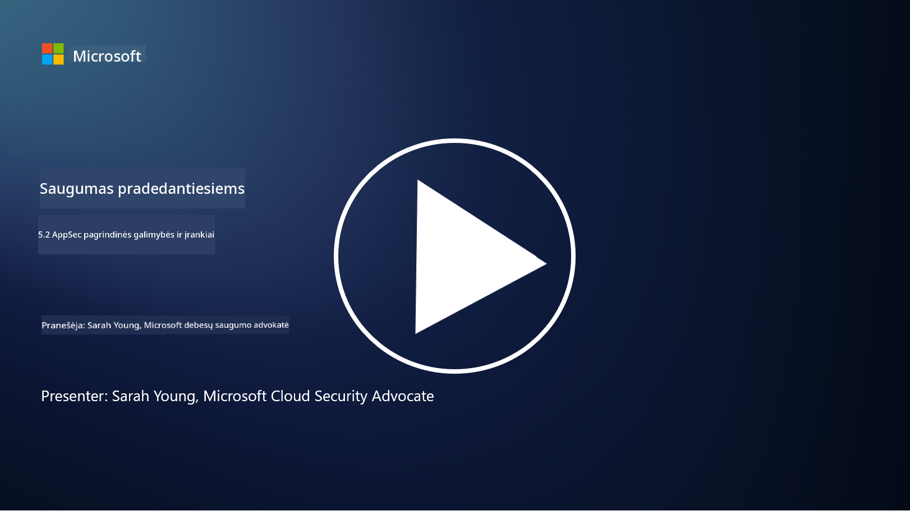

<!--
CO_OP_TRANSLATOR_METADATA:
{
  "original_hash": "790a3fa7e535ec60bb51bde13e759781",
  "translation_date": "2025-09-03T17:33:48+00:00",
  "source_file": "5.2 AppSec key capabilities.md",
  "language_code": "lt"
}
-->
## Įvadas

Šioje pamokoje aptarsime pagrindines galimybes ir įrankius, naudojamus programų saugumo srityje.

## Pagrindinės AppSec galimybės ir įrankiai

Pagrindinės galimybės ir įrankiai, naudojami programų saugumui užtikrinti, yra būtini siekiant identifikuoti, sumažinti ir užkirsti kelią saugumo pažeidžiamumams bei grėsmėms programinėje įrangoje. Štai keletas svarbiausių:

**1. Statinė programų saugumo testavimo (SAST)**:

- **Galimybės**: Analizuoja pirminį kodą, baitkodą ar binarinį kodą, kad identifikuotų saugumo pažeidžiamumus programos kode.

- **Įrankiai**: Pavyzdžiai: Fortify, Checkmarx, Veracode.

**2. Dinaminė programų saugumo testavimo (DAST)**:

- **Galimybės**: Tikrina veikiančią programą, siųsdama užklausas ir analizuodama atsakymus, kad identifikuotų pažeidžiamumus.

- **Įrankiai**: Pavyzdžiai: ZAP, Burp Suite, Qualys Web Application Scanning.

**3. Interaktyvi programų saugumo testavimo (IAST)**:

- **Galimybės**: Derina SAST ir DAST elementus, analizuodama kodą vykdymo metu, pateikdama tikslesnius rezultatus ir sumažindama klaidingus teigiamus rezultatus.

- **Įrankiai**: Pavyzdžiai: Contrast Security, HCL AppScan.

**4. Programų apsauga vykdymo metu (RASP)**:

- **Galimybės**: Stebi ir apsaugo programas realiuoju laiku, aptikdama ir reaguodama į saugumo grėsmes jų atsiradimo metu.

- **Įrankiai**: Pavyzdžiai: Veracode Runtime Protection, F5 Advanced WAF su RASP.

**5. Tinklo programų ugniasienės (WAFs)**:

- **Galimybės**: Suteikia apsauginį sluoksnį tarp programos ir interneto, filtruodama gaunamą srautą ir blokuodama kenksmingas užklausas.

- **Įrankiai**: Pavyzdžiai: ModSecurity, AWS WAF, Akamai Kona Site Defender.

**6. Priklausomybių skenavimas**:

- **Galimybės**: Identifikuoja pažeidžiamumus trečiųjų šalių bibliotekose ir komponentuose, naudojamuose programoje.

- **Įrankiai**: Pavyzdžiai: OWASP Dependency-Check, Snyk.

**7. Įsiskverbimo testavimas (Pen Testing)**:

- **Galimybės**: Simuliuoja realaus pasaulio atakas, siekiant atrasti pažeidžiamumus ir įvertinti programos saugumą.

- **Įrankiai**: Atliekama sertifikuotų etinių įsilaužėlių ir saugumo specialistų, naudojant įvairius įrankius, tokius kaip Metasploit ir Nmap.

**8. Saugumo skenavimas ir analizė**:

- **Galimybės**: Tikrina žinomus pažeidžiamumus, konfigūracijos klaidas ir saugumo netikslumus.

- **Įrankiai**: Pavyzdžiai: Nessus, Qualys Vulnerability Management, OpenVAS.

**9. Konteinerių saugumo įrankiai**:

- **Galimybės**: Orientuojasi į konteinerizuotų programų ir jų aplinkų saugumą.

- **Įrankiai**: Pavyzdžiai: Docker Security Scanning, Aqua Security.

**10. Saugios kūrimo praktikos mokymai**:

- **Galimybės**: Teikia mokymus ir informavimo programas kūrimo komandoms, skatinant saugaus kodavimo praktikas.

- **Įrankiai**: Pritaikyti mokymo programos ir platformos.

**11. Saugumo testavimo sistemos**:

- **Galimybės**: Suteikia išsamias testavimo sistemas įvairiems programų saugumo testavimo poreikiams.

- **Įrankiai**: OWASP Amass, OWASP OWTF, FrAppSec.

**12. Saugumo kodo peržiūros įrankiai**:

- **Galimybės**: Peržiūri pirminį kodą, ieškant saugumo pažeidžiamumų ir kodavimo geriausių praktikų.

- **Įrankiai**: Pavyzdžiai: SonarQube, Checkmarx.

**13. Saugios API ir mikroservisų įrankiai**:

- **Galimybės**: Orientuojasi į API ir mikroservisų saugumą, įskaitant autentifikaciją, autorizaciją ir duomenų apsaugą.

- **Įrankiai**: Pavyzdžiai: Apigee, AWS API Gateway, Istio.

## Papildoma literatūra

- [Kas yra programų saugumas? Sąvokos, įrankiai ir geriausios praktikos | HackerOne](https://www.hackerone.com/knowledge-center/what-application-security-concepts-tools-best-practices)
- [Kas yra IAST? (Interaktyvi programų saugumo testavimo) (comparitech.com)](https://www.comparitech.com/net-admin/what-is-iast/)
- [10 programų saugumo testavimo įrankių tipų: kada ir kaip juos naudoti (cmu.edu)](https://insights.sei.cmu.edu/blog/10-types-of-application-security-testing-tools-when-and-how-to-use-them/)
- [Kibernetinio saugumo rizikos balanso keitimas: saugumo pagal dizainą ir numatytąsias nuostatas principai ir metodai | Cyber.gov.au](https://www.cyber.gov.au/about-us/view-all-content/publications/principles-and-approaches-for-security-by-design-and-default)

---

**Atsakomybės apribojimas**:  
Šis dokumentas buvo išverstas naudojant AI vertimo paslaugą [Co-op Translator](https://github.com/Azure/co-op-translator). Nors siekiame tikslumo, prašome atkreipti dėmesį, kad automatiniai vertimai gali turėti klaidų ar netikslumų. Originalus dokumentas jo gimtąja kalba turėtų būti laikomas autoritetingu šaltiniu. Kritinei informacijai rekomenduojama profesionali žmogaus vertimo paslauga. Mes neprisiimame atsakomybės už nesusipratimus ar klaidingus interpretavimus, atsiradusius dėl šio vertimo naudojimo.