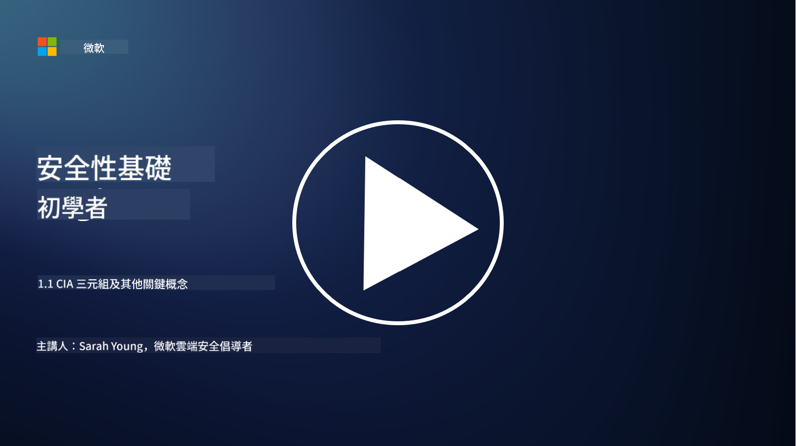
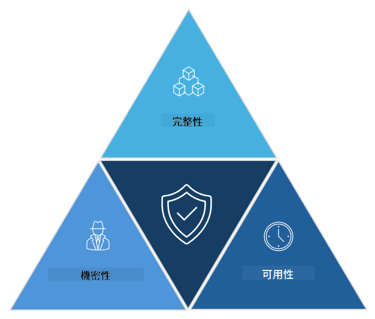

<!--
CO_OP_TRANSLATOR_METADATA:
{
  "original_hash": "16a76f9fa372fb63cffb6d76b855f023",
  "translation_date": "2025-09-04T01:08:41+00:00",
  "source_file": "1.1 The CIA triad and other key concepts.md",
  "language_code": "mo"
}
-->
# CIA 三元組及其他重要概念

## 簡介

在本課程中，我們將探討：

 - 什麼是網路安全？
   
 
 - 什麼是網路安全的 CIA 三元組？

   

 - 在網路安全的背景下，什麼是真實性、不可否認性和隱私？

## 什麼是網路安全？

網路安全，也稱為資訊安全，是保護電腦系統、網路、設備和數據免受數位攻擊、未授權存取、損害或竊取的實踐。網路安全的主要目標是確保數位資產和資訊的機密性、完整性和可用性。網路安全專業人士設計並實施安全控制措施以保護資產、數據和資訊。隨著我們的生活越來越數位化和在線化，網路安全已成為私人個人和組織的首要關注事項。

## 什麼是網路安全的 CIA 三元組？

網路安全三元組是指包含任何網路安全工作或設計系統/環境的三個主要考量的模型：

### 機密性

這是大多數人在想到「網路安全」時最熟悉的考量：機密性是保護數據和資訊免受未授權存取的過程，也就是說只有需要查看資訊的人才能存取它。然而，並非所有數據都是一樣的，數據通常根據如果被錯誤的人存取會造成的損害程度進行分類和保護。

### 完整性

指的是保護環境中數據的準確性和可信度，並防止未授權的人更改或修改數據。例如，一名學生在 DMV 修改其駕駛記錄中的出生日期，使自己看起來更年長，以便重新打印駕照並使用更早的出生日期購買酒精。

### 可用性

這是運營 IT 的一個重要考量，但可用性對網路安全也很重要。有些特定類型的攻擊專門針對可用性，安全專業人士必須防範這些攻擊（例如分散式阻斷服務攻擊 – DDoS 攻擊）。

**網路安全 CIA 三元組**

## 在網路安全背景下，什麼是真實性、不可否認性和隱私？

這些是與確保系統和數據的安全性及可信度相關的其他重要概念：

**真實性** - 指的是保證您所互動的資訊、通信或實體是真實的，並且未被未授權方篡改或修改。

**不可否認性** - 是指確保某一方無法否認其參與或某交易或通信的真實性。它防止某人聲稱他們未發送某消息或未執行某特定行動，而事實上有相反的證據。

**隱私** - 指的是保護敏感和個人可識別資訊免受未授權存取、使用、披露或操控。它涉及控制誰可以存取個人數據以及如何收集、存儲和共享這些數據。

## 延伸閱讀

[什麼是資訊安全（InfoSec）？ | Microsoft Security](https://www.microsoft.com/security/business/security-101/what-is-information-security-infosec#:~:text=Three%20pillars%20of%20information%20security%3A%20the%20CIA%20triad,as%20guiding%20principles%20for%20implementing%20an%20InfoSec%20plan.)

---

**免責聲明**：  
本文件使用 AI 翻譯服務 [Co-op Translator](https://github.com/Azure/co-op-translator) 進行翻譯。我們致力於提供準確的翻譯，但請注意，自動翻譯可能包含錯誤或不準確之處。應以原始語言的文件作為權威來源。對於關鍵資訊，建議尋求專業人工翻譯。我們對於因使用此翻譯而產生的任何誤解或錯誤解讀概不負責。