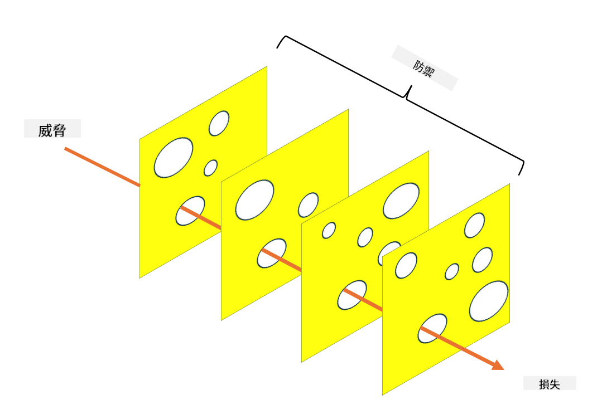

<!--
CO_OP_TRANSLATOR_METADATA:
{
  "original_hash": "75f77f972d2233c584f87c1eb96c983b",
  "translation_date": "2025-09-03T23:45:43+00:00",
  "source_file": "1.5 Zero trust.md",
  "language_code": "mo"
}
-->
# 零信任

「零信任」是當今安全領域中經常被提及的一個詞彙。但它究竟是什麼？是否只是流行語？在本課程中，我們將深入探討零信任的真正含義。

## 簡介

- 在本課程中，我們將涵蓋：

- 什麼是零信任？

- 零信任與傳統安全架構有何不同？

- 什麼是深度防禦？

## 零信任

零信任是一種網絡安全方法，它挑戰了傳統「信任但驗證」的理念，假設無論是組織內部還是外部的任何實體都不應被固有地信任。相反，零信任主張對每個試圖訪問資源的使用者、設備和應用程式進行驗證，而不論其位置如何。零信任的核心原則是最小化「攻擊面」，並減少安全漏洞的潛在影響。

在零信任模型中，以下原則被強調：

1. **驗證身份**：對所有使用者和設備進行嚴格的身份驗證和授權，不論其位置。請記住，身份不一定是人類，它也可以是設備、應用程式等。

2. **最小權限**：僅授予使用者和設備完成任務所需的最低訪問權限，以減少被攻擊後的潛在損害。

3. **微分段**：將網絡資源劃分為更小的區域，以限制在發生漏洞時的橫向移動。

4. **持續監控**：持續監控和分析使用者及設備行為，以檢測異常和潛在威脅。現代監控技術還使用機器學習、人工智能和威脅情報來提供更多細節和上下文。

5. **數據加密**：對數據進行傳輸和靜態加密，以防止未授權的訪問。

6. **嚴格的訪問控制**：根據上下文（如使用者角色、設備健康狀態和網絡位置）強制執行訪問控制。

微軟將零信任分為五個支柱，我們將在後續課程中進行討論。

## 與傳統安全架構的差異

零信任與傳統安全架構（如基於邊界的模型）在多方面有所不同：

1. **邊界 vs. 身份為中心**：傳統模型側重於保護網絡邊界，並假設內部使用者和設備在進入後可以被信任。而零信任假設威脅可能來自網絡內部和外部，並強制執行嚴格的基於身份的控制。

2. **隱式 vs. 明確信任**：傳統模型隱式信任網絡內的設備和使用者，直到證明其不可信為止。零信任則明確驗證身份並持續監控異常。

3. **平坦 vs. 分段網絡**：傳統架構通常涉及平坦的網絡，內部使用者擁有廣泛的訪問權限。零信任主張將網絡分割成更小的、隔離的區域，以遏制潛在的漏洞。

4. **被動 vs. 主動**：傳統安全通常依賴於被動措施，如邊界防火牆和入侵檢測。零信任採取主動方法，假設漏洞可能發生並最小化其影響。

## 深度防禦

深度防禦，也稱為分層安全，是一種網絡安全策略，通過部署多層安全控制和措施來保護組織的資產。其目標是創建重疊的防禦層，以便即使一層被突破，其他層仍能提供保護。每一層都專注於安全的不同方面，從而提高組織的整體安全態勢。

深度防禦結合了技術、程序和物理安全措施，包括防火牆、入侵檢測系統、訪問控制、加密、使用者培訓、安全政策等。其理念是創建多重屏障，使攻擊者難以滲透組織的系統和網絡。這有時也被稱為「瑞士奶酪」模型，該模型在其他行業（如交通）中的事故預防中也有應用。

## 延伸閱讀

[什麼是零信任？](https://learn.microsoft.com/security/zero-trust/zero-trust-overview?WT.mc_id=academic-96948-sayoung)

[零信任的演進 – 微軟立場文件](https://query.prod.cms.rt.microsoft.com/cms/api/am/binary/RWJJdT?WT.mc_id=academic-96948-sayoung)

[零信任與 BeyondCorp Google Cloud | Google Cloud Blog](https://cloud.google.com/blog/topics/developers-practitioners/zero-trust-and-beyondcorp-google-cloud)

---

**免責聲明**：  
本文件使用 AI 翻譯服務 [Co-op Translator](https://github.com/Azure/co-op-translator) 進行翻譯。我們致力於提供準確的翻譯，但請注意，自動翻譯可能包含錯誤或不準確之處。應以原始語言的文件作為權威來源。對於關鍵資訊，建議尋求專業人工翻譯。我們對於因使用此翻譯而產生的任何誤解或錯誤解讀概不負責。  