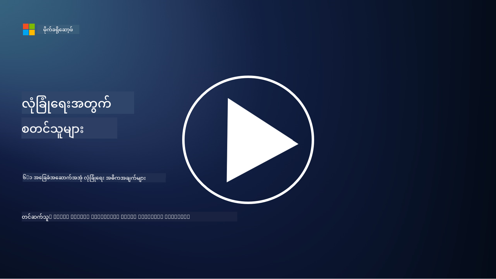

<!--
CO_OP_TRANSLATOR_METADATA:
{
  "original_hash": "882ebf66a648f419bcbf680ed6aefa00",
  "translation_date": "2025-09-03T23:19:58+00:00",
  "source_file": "6.1 Infrastructure security key concepts.md",
  "language_code": "my"
}
-->
# အခြေခံအချက်များ - အခြေခံအဆောက်အအုံလုံခြုံရေး

“အခြေခံအဆောက်အအုံ” ဆိုသည်မှာ IT ပတ်ဝန်းကျင်၏ အခြေခံအဆောက်အအုံများကို ရည်ညွှန်းပြီး၊ ၎င်းတွင် server များ၊ cloud services များနှင့် container များပါဝင်သည်။ အခြေခံအဆောက်အအုံသည် အမျိုးမျိုးသောနည်းပညာများကို အကျယ်အဝန်းဖြင့် ဖုံးလွှမ်းထားသည်။ ယခင်အပိုင်းတွင် ဆွေးနွေးခဲ့သော application များသည် အခြေခံအဆောက်အအုံပေါ်တွင် လည်ပတ်နေသောကြောင့်၊ ၎င်းကိုလည်း တိုက်ခိုက်မှုများ၏ ပစ်မှတ်ဖြစ်နိုင်သည်။

ဒီသင်ခန်းစာမှာ ကျွန်တော်တို့ ဆွေးနွေးမယ့်အကြောင်းအရာတွေကတော့ -

- လုံခြုံရေးအလေ့အကျင့်ဆိုတာဘာလဲ၊ ဘာကြောင့်အရေးကြီးတာလဲ?

- လုံခြုံရေးအနေအထားစီမံခန့်ခွဲမှုဆိုတာဘာလဲ?

- patching ဆိုတာဘာလဲ၊ ဘာကြောင့်အရေးကြီးတာလဲ?

- container များဆိုတာဘာလဲ၊ ၎င်းတို့၏ လုံခြုံရေးမှာ ဘာကွဲပြားမှုရှိသလဲ?

## လုံခြုံရေးအလေ့အကျင့်ဆိုတာဘာလဲ၊ ဘာကြောင့်အရေးကြီးတာလဲ?

**လုံခြုံရေးအလေ့အကျင့်** ဆိုသည်မှာ လူများနှင့် အဖွဲ့အစည်းများက ကောင်းမွန်သော cybersecurity အလေ့အကျင့်များကို ထိန်းသိမ်းရန် လိုက်နာသော လုပ်ဆောင်မှုများနှင့် အပြုအမူများကို ရည်ညွှန်းသည်။ ၎င်းသည် စနစ်များ၊ ဒေတာများနှင့် network များကို အန္တရာယ်များနှင့် အားနည်းချက်များမှ ကာကွယ်ရန် လိုအပ်သော လုပ်ဆောင်မှုများကို လုပ်ဆောင်ခြင်းဖြစ်သည်။ ကောင်းမွန်သော လုံခြုံရေးအလေ့အကျင့်သည် အောက်ပါအကြောင်းအရာများကြောင့် အရေးကြီးသည် -

- **တိုက်ခိုက်မှုများကို ကာကွယ်ခြင်း**: အကောင်းဆုံးအလေ့အကျင့်များကို လိုက်နာခြင်းဖြင့် phishing, malware infection, unauthorized access စသည့် အန္တရာယ်များကို ကာကွယ်နိုင်သည်။

- **ဒေတာကို ကာကွယ်ခြင်း**: အရေးကြီးသော ဒေတာများကို ခိုးယူမှုနှင့် ထိခိုက်မှုမှ ကာကွယ်ပေးသည်။

- **ယုံကြည်မှုကို ထိန်းသိမ်းခြင်း**: ကောင်းမွန်သော လုံခြုံရေးအလေ့အကျင့်ကို ပြသသော အဖွဲ့အစည်းများသည် customer များနှင့် အဖော်အချင်းများ၏ ယုံကြည်မှုကို ရရှိစေသည်။

- **လိုက်နာမှု**: စည်းမျဉ်းများနှင့် စံများသည် လုံခြုံရေးအလေ့အကျင့်များကို လိုက်နာရန် လိုအပ်သည်။

- **အန္တရာယ်လျော့ချခြင်း**: လုံခြုံရေးအလေ့အကျင့်များကို ဆက်လက်လုပ်ဆောင်ခြင်းဖြင့် လုံခြုံရေးအဖြစ်အပျက်များနှင့် breach များဖြစ်ပေါ်နိုင်မှုကို လျော့ချသည်။

လုံခြုံရေးအလေ့အကျင့်များတွင် software များကို update လုပ်ထားခြင်း၊ password များကို ခိုင်မာစွာ အသုံးပြုခြင်း၊ multi-factor authentication အသုံးပြုခြင်း၊ regular backup လုပ်ခြင်း၊ ဝန်ထမ်းများကို လေ့ကျင့်ပေးခြင်းနှင့် သံသယရှိသော လှုပ်ရှားမှုများကို စောင့်ကြည့်ခြင်းတို့ ပါဝင်သည်။ ၎င်းသည် ခိုင်မာသော cybersecurity အခြေခံအနေအထား၏ အခြေခံအဆောက်အအုံဖြစ်သည်။

## လုံခြုံရေးအနေအထားစီမံခန့်ခွဲမှုဆိုတာဘာလဲ?

လုံခြုံရေးအနေအထားစီမံခန့်ခွဲမှု (Security Posture Management) ဆိုသည်မှာ အဖွဲ့အစည်းတစ်ခု၏ စုစုပေါင်း cybersecurity အနေအထားကို အကဲဖြတ်ခြင်း၊ စောင့်ကြည့်ခြင်းနှင့် စီမံခန့်ခွဲခြင်းကို ရည်ညွှန်းသည်။ Cybersecurity အနေအထားဆိုသည်မှာ အဖွဲ့အစည်းတစ်ခု၏ IT စနစ်များ၊ network များ၊ ဒေတာများနှင့် asset များကို cyber အန္တရာယ်များနှင့် တိုက်ခိုက်မှုများမှ ကာကွယ်ရန် စီမံချက်များ၊ မူဝါဒများ၊ လုပ်ဆောင်မှုများနှင့် နည်းပညာများကို ရည်ညွှန်းသည်။ ၎င်းသည် အဖွဲ့အစည်း၏ digital asset များကို ကာကွယ်ရန်နှင့် ဒေတာ၏ confidentiality, integrity, availability ကို ထိန်းသိမ်းရန် လိုအပ်သော လုပ်ဆောင်မှုများကို အကျယ်အဝန်းဖော်ပြသည်။

SPM သည် အဖွဲ့အစည်းတစ်ခု၏ လုံခြုံရေးအခြေအနေကို စုစုပေါင်းကြည့်ရှုနိုင်စေပြီး၊ အားနည်းချက်များနှင့် အန္တရာယ်များကို ရှာဖွေသိရှိစေပြီး၊ ပြုပြင်ဆောင်ရွက်မှုများကို ဦးစားပေးစီမံခန့်ခွဲနိုင်စေသည်။

## patching ဆိုတာဘာလဲ၊ ဘာကြောင့်အရေးကြီးတာလဲ?

**Patching** ဆိုသည်မှာ software, operating system, application များကို update လုပ်ခြင်းဖြစ်ပြီး၊ ၎င်းသည် security vulnerability များ၊ bug များနှင့် အခြားသော အချက်များကို ပြုပြင်ရန် ရည်ရွယ်ထားသည်။ Hardware device များလည်း patch လုပ်ရန် လိုအပ်သည် - ၎င်းတို့၏ firmware သို့မဟုတ် built-in OS ဖြစ်နိုင်သည်။ Hardware patching သည် software patching ထက် ပိုမိုခက်ခဲနိုင်သည်။

Patching အရေးကြီးသောအကြောင်းအရာများ -

- **လုံခြုံရေး**: Patch များသည် အန္တရာယ်များကို ပြုပြင်ပေးပြီး၊ attacker များက စနစ်များကို ခိုးယူရန် အခွင့်အရေးမရစေပါ။

- **တည်ငြိမ်မှု**: Patch များသည် stability နှင့် performance ကို တိုးတက်စေပြီး၊ crash များနှင့် စနစ် fail ဖြစ်မှုများကို လျော့ချသည်။

- **လိုက်နာမှု**: စည်းမျဉ်းများနှင့် စံများသည် patch များကို အချိန်မီ လုပ်ဆောင်ရန် လိုအပ်သည်။

- **ယုံကြည်မှုကို ထိန်းသိမ်းခြင်း**: Regular patching လုပ်ခြင်းသည် customer များနှင့် stakeholder များ၏ ယုံကြည်မှုကို ထိန်းသိမ်းပေးသည်။

- **အန္တရာယ်လျော့ချခြင်း**: Patch များသည် attack surface ကို လျော့ချပြီး၊ cyber attack များအောင်မြင်နိုင်မှုကို လျော့ချသည်။

Patch များကို အချိန်မီ လုပ်ဆောင်ခြင်းမရှိပါက စနစ်များသည် အန္တရာယ်များနှင့် data loss ဖြစ်နိုင်မှုကို မြှင့်တင်စေသည်။

## container များဆိုတာဘာလဲ၊ ၎င်းတို့၏ လုံခြုံရေးမှာ ဘာကွဲပြားမှုရှိသလဲ?

Container များသည် lightweight, standalone, executable software package များဖြစ်ပြီး၊ software တစ်ခုကို လည်ပတ်ရန် လိုအပ်သော code, runtime, library, system tool များကို ပါဝင်သည်။ Container များသည် application များအတွက် consistent နှင့် isolated ပတ်ဝန်းကျင်ကို ပေးစွမ်းပြီး၊ environment များနှင့် platform များအကြား software ကို ဖွံ့ဖြိုး, package, deploy လုပ်ရန် လွယ်ကူစေသည်။ Docker နှင့် Kubernetes ကဲ့သို့သော နည်းပညာများသည် containerization အတွက် လူကြိုက်များသည်။

Container လုံခြုံရေးသည် container များနှင့် ၎င်းတို့ hosting application များကို အန္တရာယ်များနှင့် အားနည်းချက်များမှ ကာကွယ်ရန် လုပ်ဆောင်မှုများနှင့် နည်းပညာများကို ရည်ညွှန်းသည်။ Container များသည် portability နှင့် scalability အကျိုးကျေးဇူးများပေးစွမ်းသော်လည်း၊ လုံခြုံရေးအခက်အခဲများကိုလည်း ဖြစ်ပေါ်စေသည် -

1. **Image လုံခြုံရေး**: Container image များတွင် အန္တရာယ်များပါဝင်နိုင်ပြီး၊ image များကို regular update နှင့် patch မလုပ်ပါက attacker များက အခွင့်အရေးရနိုင်သည်။ Image များကို scan လုပ်ခြင်းနှင့် ယုံကြည်ရသော image များကိုသာ အသုံးပြုခြင်းသည် လိုအပ်သည်။

2. **Runtime လုံခြုံရေး**: Running container များကို host system နှင့် အခြား container များမှ isolation လုပ်ရန် လိုအပ်သည်။ Runtime လုံခြုံရေးတွင် namespace, cgroup ကဲ့သို့သော isolation နည်းပညာများနှင့် container behavior ကို စောင့်ကြည့်ခြင်းတို့ ပါဝင်သည်။

3. **Network လုံခြုံရေး**: Container များသည် network များမှတစ်ဆင့် ဆက်သွယ်မှုများ လုပ်ဆောင်သည်။ Network segmentation နှင့် firewall rule များကို သေချာစွာ ပြုလုပ်ရန် လိုအပ်သည်။

4. **Access Control**: Container များကို အသုံးပြုခြင်းနှင့် ပြုပြင်ခြင်းများကို authorized user များနှင့် process များသာ လုပ်ဆောင်နိုင်ရန် RBAC နှင့် identity management tool များကို အသုံးပြုသည်။

5. **Logging နှင့် Monitoring**: Container လုံခြုံရေးတွင် log များကို စုဆောင်းခြင်းနှင့် security incident များကို real-time တွေ့ရှိရန် monitoring tool များကို အသုံးပြုသည်။

6. **Orchestration လုံခြုံရေး**: Kubernetes ကဲ့သို့သော container orchestration platform များကို အသုံးပြုသောအခါ၊ orchestration layer ကိုလည်း လုံခြုံစေရန် လိုအပ်သည်။ API server ကို secure လုပ်ခြင်း၊ RBAC policy များကို သေချာစွာ ပြုလုပ်ခြင်းနှင့် cluster activity ကို audit လုပ်ခြင်းတို့ ပါဝင်သည်။

7. **Secrets Management**: Container များတွင် sensitive information (API key, password) များကို secure storage နှင့် management solution များဖြင့် ကာကွယ်ရန် လိုအပ်သည်။

Container လုံခြုံရေးသည် security best practice များ၊ vulnerability scanning tool များ၊ runtime protection mechanism များ၊ network security configuration များနှင့် container orchestration security feature များကို ပေါင်းစပ်အသုံးပြုသည်။ Continuous monitoring နှင့် automation များသည် containerized application များ၏ လုံခြုံရေးအတွက် အရေးကြီးသော အစိတ်အပိုင်းများဖြစ်သည်။

## ထပ်မံဖတ်ရှုရန်

- [The importance of security hygiene | Security Magazine](https://www.securitymagazine.com/articles/99510-the-importance-of-security-hygiene)
- [What is CSPM? | Microsoft Security](https://www.microsoft.com/security/business/security-101/what-is-cspm?WT.mc_id=academic-96948-sayoung)
- [What is Cloud Security Posture Management (CSPM)? | HackerOne](https://www.hackerone.com/knowledge-center/what-cloud-security-posture-management)
- [Function of cloud security posture management - Cloud Adoption Framework | Microsoft Learn](https://learn.microsoft.com/azure/cloud-adoption-framework/organize/cloud-security-posture-management?WT.mc_id=academic-96948-sayoung)
- [What Is a CNAPP? | Microsoft Security](https://www.microsoft.com/security/business/security-101/what-is-cnapp)
- [Why Everyone Is Talking About CNAPP (forbes.com)](https://www.forbes.com/sites/forbestechcouncil/2021/12/10/why-everyone-is-talking-about-cnapp/?sh=567275ca1549)
- [Why is patching important to cybersecurity? - CyberSmart](https://cybersmart.co.uk/blog/why-is-patching-important-to-cybersecurity/)
- [What Is Container Security? Complete Guide [2023] (aquasec.com)](https://www.aquasec.com/cloud-native-academy/container-security/container-security/)

---

**အကြောင်းကြားချက်**:  
ဤစာရွက်စာတမ်းကို AI ဘာသာပြန်ဝန်ဆောင်မှု [Co-op Translator](https://github.com/Azure/co-op-translator) ကို အသုံးပြု၍ ဘာသာပြန်ထားပါသည်။ ကျွန်ုပ်တို့သည် တိကျမှုအတွက် ကြိုးစားနေသော်လည်း၊ အလိုအလျောက် ဘာသာပြန်ခြင်းတွင် အမှားများ သို့မဟုတ် မတိကျမှုများ ပါရှိနိုင်သည်ကို သတိပြုပါ။ မူရင်းဘာသာစကားဖြင့် ရေးသားထားသော စာရွက်စာတမ်းကို အာဏာရှိသော ရင်းမြစ်အဖြစ် သတ်မှတ်သင့်ပါသည်။ အရေးကြီးသော အချက်အလက်များအတွက် လူ့ဘာသာပြန်ပညာရှင်များမှ ပရော်ဖက်ရှင်နယ် ဘာသာပြန်ခြင်းကို အကြံပြုပါသည်။ ဤဘာသာပြန်ကို အသုံးပြုခြင်းမှ ဖြစ်ပေါ်လာသော အလွဲသုံးစားမှု သို့မဟုတ် အနားလွဲမှုများအတွက် ကျွန်ုပ်တို့သည် တာဝန်မယူပါ။