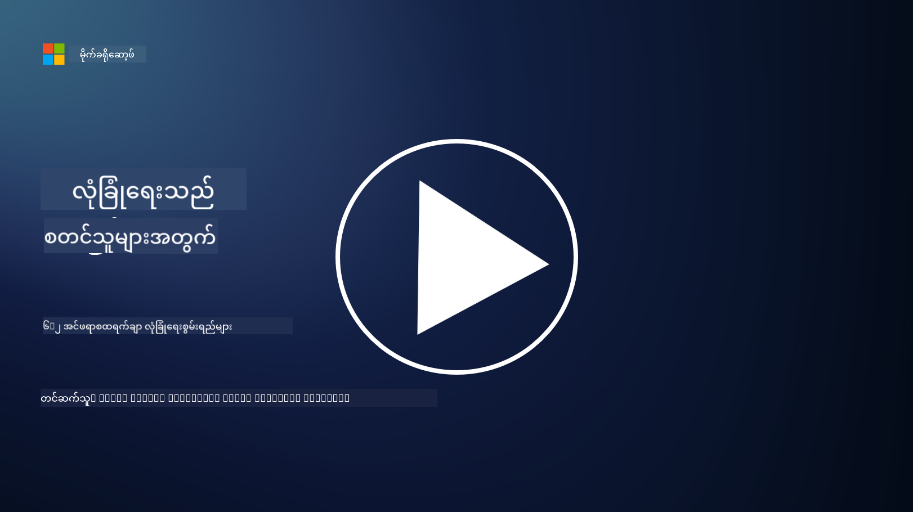

<!--
CO_OP_TRANSLATOR_METADATA:
{
  "original_hash": "7d79ba0e7668b3bdae1fba7aa047f6c0",
  "translation_date": "2025-09-04T00:17:32+00:00",
  "source_file": "6.2 Infrastructure security capabilities.md",
  "language_code": "my"
}
-->
# အခြေခံအဆောက်အအုံလုံခြုံရေးစွမ်းရည်များ

ဤအပိုင်းတွင် အခြေခံအဆောက်အအုံလုံခြုံရေးတွင် အသုံးပြုသော အဓိက tools နှင့် စွမ်းရည်များအကြောင်း အသေးစိတ်ကို ဖော်ပြပါမည်။

**မိတ်ဆက်**

ဤသင်ခန်းစာတွင် ကျွန်ုပ်တို့ ဖော်ပြမည့်အကြောင်းအရာများမှာ -

- အားနည်းချက်စီမံခန့်ခွဲမှု란 무엇인가?

- CSPM란 무엇인가?

- CNAPP란 무엇인가?

## အားနည်းချက်စီမံခန့်ခွဲမှု란 무엇인가?

အားနည်းချက်စီမံခန့်ခွဲမှုသည် ကွန်ပျူတာစနစ်များ၊ ဆော့ဖ်ဝဲများ၊ ကွန်ယက်များနှင့် အခြေခံအဆောက်အအုံများတွင် အားနည်းချက်များကို ရှာဖွေ၊ အကဲဖြတ်၊ အရေးပေါ်ဦးစားပေး၊ လျှော့ချနှင့် စောင့်ကြည့်ခြင်းတို့ကို စနစ်တကျလုပ်ဆောင်သည့် လုပ်ငန်းစဉ်တစ်ခုဖြစ်သည်။ အားနည်းချက်စီမံခန့်ခွဲမှု၏ အဓိကရည်ရွယ်ချက်မှာ မကောင်းသောလှုပ်ရှားမှုများမှ အဖွဲ့အစည်း၏လုံခြုံရေးအန္တရာယ်ကို လျှော့ချရန် အားနည်းချက်များကို ကြိုတင်ကာကွယ်ခြင်းဖြစ်သည်။ အဓိကအဆင့်များကို အောက်ပါအတိုင်းဖော်ပြနိုင်သည် -

- **ရှာဖွေခြင်း**: အဖွဲ့အစည်း၏ assets (server, application, network device, endpoint စသည်တို့) တွင် အားနည်းချက်များကို စစ်ဆေး၍ ရှာဖွေခြင်း။

- **အကဲဖြတ်ခြင်း**: Common Vulnerability Scoring System (CVSS) score နှင့် လုပ်ငန်းအခြေအနေတို့အပေါ် အခြေခံ၍ အားနည်းချက်တစ်ခုချင်းစီ၏ အရေးကြီးမှုနှင့် သက်ရောက်မှုကို အကဲဖြတ်ခြင်း။

- **ဦးစားပေးခြင်း**: အဖွဲ့အစည်း၏ လုပ်ငန်းစဉ်များနှင့် ဒေတာများအပေါ် သက်ရောက်မှုအပေါ် အခြေခံ၍ အားနည်းချက်များကို အန္တရာယ်အဆင့်အလိုက် အစီအစဉ်တစ်ခုအတိုင်း ဦးစားပေးခြင်း။

- **လျှော့ချခြင်း**: patch တင်ခြင်း၊ လုံခြုံရေး setting များကို ပြင်ဆင်ခြင်း၊ compensating controls များကို အသုံးပြုခြင်းစသည်ဖြင့် အားနည်းချက်များကို လျှော့ချရန် မဟာဗျူဟာများ ဖန်တီး၍ အကောင်အထည်ဖော်ခြင်း။

- **အတည်ပြုခြင်း**: အားနည်းချက်များကို ဖြေရှင်းရန် လုပ်ဆောင်မှုများအောင်မြင်မှုကို အတည်ပြုခြင်း။

- **ဆက်လက်စောင့်ကြည့်ခြင်း**: အားနည်းချက်များနှင့် အန္တရာယ်များကို ဆက်လက်စောင့်ကြည့်ခြင်း၊ အကြိမ်ကြိမ် vulnerability scan နှင့် အကဲဖြတ်မှုများလုပ်ဆောင်ခြင်း။

အားနည်းချက်စီမံခန့်ခွဲမှုသည် လုံခြုံရေး breach မဖြစ်ပေါ်စေရန် အဖွဲ့အစည်းများ၏ လုံခြုံရေးအနေအထားကို ခိုင်မာစေသည့် လုံခြုံရေး၏ အရေးကြီးသောအစိတ်အပိုင်းတစ်ခုဖြစ်သည်။ Defender for Cloud, Nessus နှင့် Qualys ကဲ့သို့သော tools များသည် အားနည်းချက်စီမံခန့်ခွဲမှုအတွက် နမူနာများဖြစ်သည်။

## CSPM란 무엇인가?

Cloud Security Posture Management (CSPM) သည် cloud အခြေခံအဆောက်အအုံများတွင် လုံခြုံရေး configuration များနှင့် အကောင်းဆုံးအလေ့အကျင့်များကို အကဲဖြတ်၊ စောင့်ကြည့်၊ အတည်ပြုရန် ရည်ရွယ်သော tools, လုပ်ငန်းစဉ်များနှင့် လေ့ကျင့်မှုများ၏ စုစည်းမှုဖြစ်သည်။ CSPM solution များသည် Amazon Web Services (AWS), Microsoft Azure, Google Cloud Platform (GCP) နှင့် အခြား cloud provider များတွင် misconfiguration, လုံခြုံရေး gap များနှင့် compliance ချိုးဖောက်မှုများကို ရှာဖွေပြီး ဖြေရှင်းရန် အဖွဲ့အစည်းများကို ကူညီပေးသည်။

CSPM ၏ အဓိကအချက်များမှာ -

- **Configuration Assessment**: Cloud resource နှင့် service များကို scan လုပ်၍ misconfiguration, insecure setting များနှင့် လုံခြုံရေးအကောင်းဆုံးအလေ့အကျင့်များမှ လွဲလျော်မှုများကို ရှာဖွေခြင်း။

- **Security Policy Enforcement**: Cloud environment များတွင် လုံခြုံရေး policy များနှင့် compliance စံသတ်မှတ်ချက်များကို အလိုအလျောက် ဖြေရှင်းခြင်း သို့မဟုတ် alert များထုတ်ပေးခြင်းဖြင့် အတည်ပြုခြင်း။

- **Continuous Monitoring**: Cloud asset နှင့် resource များ၏ လုံခြုံရေးအနေအထားကို အချိန်နှင့်တပြေးညီ စောင့်ကြည့်ခြင်း၊ လုံခြုံရေးဖြစ်ရပ်များအတွက် real-time alert များပေးခြင်း။

- **Compliance Reporting**: စည်းမျဉ်းများနှင့် စက်မှုစံသတ်မှတ်ချက်များနှင့် ကိုက်ညီမှုကို ပြသရန် report နှင့် dashboard များထုတ်ပေးခြင်း။

CSPM သည် cloud အခြေခံအဆောက်အအုံကို လုံခြုံစေပြီး စည်းမျဉ်းနှင့် ကိုက်ညီမှုရှိစေရန် အဖွဲ့အစည်းများကို ကူညီပေးသည်။ CSPM tools များအနက် Defender for Cloud နှင့် Snyk ကဲ့သို့သော tools များကို နမူနာအဖြစ်ဖော်ပြနိုင်သည်။

## CNAPP란 무엇인가?

CNAPP သည် Cloud-Native Application Protection Platform ကို ရည်ညွှန်းသည်။ ဤ platform သည် cloud security အန္တရာယ်များနှင့် အားနည်းချက်များကို စောင့်ကြည့်၊ ရှာဖွေ၊ လုပ်ဆောင်ရန် လွယ်ကူစေသည့် cloud-native software platform တစ်ခုဖြစ်သည်။ DevOps နှင့် DevSecOps အဖွဲ့များ၏ လုပ်ငန်းစဉ်များကို လွယ်ကူစေရန် tools များနှင့် စွမ်းရည်များကို တစ်ခုတည်းသော software solution အဖြစ် ပေါင်းစည်းထားသည်။ CNAPP သည် CI/CD application lifecycle တစ်လျှောက်လုံး (development မှ production အထိ) cloud နှင့် application security ကို end-to-end ပေးစွမ်းသည်။ 

CNAPP ၏ အဓိက features များမှာ -

- **မြင်နိုင်မှုတိုးမြှင့်ခြင်း**: Cloud environment တွင် security risk များကို ရှာဖွေပြီး အကဲဖြတ်နိုင်စွမ်းရှိခြင်း။

- **အန္တရာယ်များကို အတိုင်းအတာချမှတ်ခြင်း**: Cloud environment တွင် ဖြစ်နိုင်သော security risk များကို အတိုင်းအတာချမှတ်၍ အရေးပေါ်တုံ့ပြန်နိုင်ခြင်း။

- **လုံခြုံသော software ဖွံ့ဖြိုးမှု**: Development process တွင် security ကို ပေါင်းစည်းထားခြင်း။

- **Cloud security solution ပေါင်းစည်းထားခြင်း**: Container scanning, cloud security posture management, infrastructure as code scanning, cloud infrastructure entitlements management နှင့် runtime cloud workload protection platform များကို တစ်ခုတည်းသော user interface တွင် ပေါင်းစည်းထားခြင်း။

CNAPP သည် siloed ဖြစ်နေသော cloud security tools များကို တစ်ခုတည်းသော interface တွင် ပေါင်းစည်းထားပြီး cloud application footprint အားလုံးကို ကာကွယ်ရန် အဖွဲ့အစည်းများကို လွယ်ကူစေသည်။

## အပိုဆောင်းဖတ်ရှုရန်
- [What is CSPM? | Microsoft Security](https://www.microsoft.com/security/business/security-101/what-is-cspm?WT.mc_id=academic-96948-sayoung)
- [What is Cloud Security Posture Management (CSPM)? | HackerOne](https://www.hackerone.com/knowledge-center/what-cloud-security-posture-management)
- [Function of cloud security posture management - Cloud Adoption Framework | Microsoft Learn](https://learn.microsoft.com/azure/cloud-adoption-framework/organize/cloud-security-posture-management?WT.mc_id=academic-96948-sayoung)
- [What Is a CNAPP? | Microsoft Security](https://www.microsoft.com/security/business/security-101/what-is-cnapp?WT.mc_id=academic-96948-sayoung)
- [Why Everyone Is Talking About CNAPP (forbes.com)](https://www.forbes.com/sites/forbestechcouncil/2021/12/10/why-everyone-is-talking-about-cnapp/?sh=567275ca1549)
- [Improving Your Multi-Cloud Security with a Cloud-Native Application Protection Platform (CNAPP)](https://www.youtube.com/watch?v=5w42kQ_QjZg&t=212s)

---

**အကြောင်းကြားချက်**:  
ဤစာရွက်စာတမ်းကို AI ဘာသာပြန်ဝန်ဆောင်မှု [Co-op Translator](https://github.com/Azure/co-op-translator) ကို အသုံးပြု၍ ဘာသာပြန်ထားပါသည်။ ကျွန်ုပ်တို့သည် တိကျမှုအတွက် ကြိုးစားနေသော်လည်း၊ အလိုအလျောက် ဘာသာပြန်မှုများတွင် အမှားများ သို့မဟုတ် မတိကျမှုများ ပါဝင်နိုင်သည်ကို သတိပြုပါ။ မူရင်းစာရွက်စာတမ်းကို ၎င်း၏ မူရင်းဘာသာစကားဖြင့် အာဏာတရားရှိသော အရင်းအမြစ်အဖြစ် သတ်မှတ်သင့်ပါသည်။ အရေးကြီးသော အချက်အလက်များအတွက် လူက ဘာသာပြန်မှု ဝန်ဆောင်မှုကို အသုံးပြုရန် အကြံပြုပါသည်။ ဤဘာသာပြန်မှုကို အသုံးပြုခြင်းမှ ဖြစ်ပေါ်လာသော အလွဲအလွတ်များ သို့မဟုတ် အနားလွဲမှုများအတွက် ကျွန်ုပ်တို့သည် တာဝန်မယူပါ။