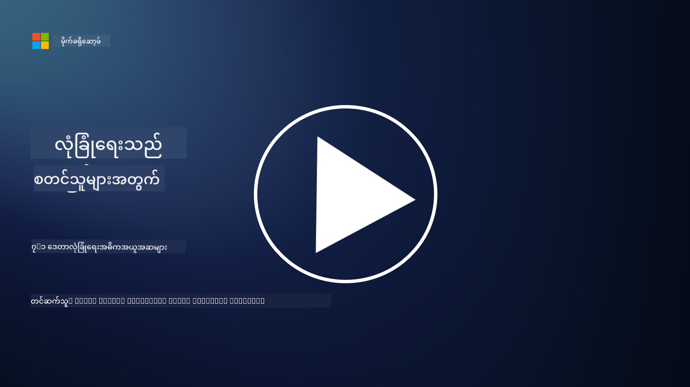

<!--
CO_OP_TRANSLATOR_METADATA:
{
  "original_hash": "9703868f41dcddd5a98dea9ea6fcd94d",
  "translation_date": "2025-09-04T00:00:57+00:00",
  "source_file": "7.1 Data security key concepts.md",
  "language_code": "my"
}
-->
# ဒေတာလုံခြုံရေးအဓိကအကြောင်းအရာများ

ဒီသင်ခန်းစာမှာ ဒေတာလုံခြုံရေးနဲ့ပတ်သက်ပြီး ကျွန်တော်တို့အကြောင်းပြောခဲ့ပြီး အနည်းငယ်ထိတွေ့ခဲ့ပါတယ်။ အခုတော့ ဒီအကြောင်းအရာကို ပိုမိုနက်နက်ရှိုင်းရှိုင်းလေ့လာကြမယ်။ ဒီသင်ခန်းစာမှာ သင်လေ့လာရမယ့်အရာတွေကတော့ -

- ဒေတာလုံခြုံရေးဆိုတာဘာလဲ?

- ဒေတာအမျိုးအစားခွဲခြားခြင်းဆိုတာဘာလဲ?

- ဒေတာအသက်တာစီမံခန့်ခွဲမှုဆိုတာဘာလဲ?

- ဒေတာဆုံးရှုံးမှုကာကွယ်ရေး (DLP) ဆိုတာဘာလဲ?

- အဖွဲ့အစည်းတစ်ခုအတွက် ဒေတာလုံခြုံရေးက ဘာကြောင့်အရေးကြီးတာလဲ?

## ဒေတာလုံခြုံရေးဆိုတာဘာလဲ?

**ဒေတာလုံခြုံရေး** ဆိုတာက ဒေတာများ (ဥပမာ- ဒေတာဘေ့စ်များ၊ ဖိုင်များ၊ အရေးကြီးသောအချက်အလက်များ) ကို မလိုလားအပ်သော ဝင်ရောက်မှု၊ ဖော်ထုတ်မှု၊ ပြောင်းလဲမှု၊ သို့မဟုတ် ဖျက်ဆီးမှုမှ ကာကွယ်ပေးတဲ့ လုပ်ဆောင်မှုများကို ဆိုလိုပါတယ်။ ဒေတာလုံခြုံရေးရဲ့ အဓိကရည်ရွယ်ချက်က ဒေတာရဲ့ လျှို့ဝှက်မှု၊ တိကျမှု၊ ရရှိနိုင်မှုကို အာမခံပေးဖို့ဖြစ်ပါတယ်။ ဒါဟာ နည်းပညာဆိုင်ရာ၊ အုပ်ချုပ်မှုဆိုင်ရာ၊ ရုပ်ပိုင်းဆိုင်ရာ လုံခြုံရေးအတိုင်းအတာတွေကို ပေါင်းစပ်အသုံးပြုပြီး ဒေတာကို အန္တရာယ်များနဲ့ အားနည်းချက်များ (ဥပမာ- ဆိုင်ဘာတိုက်ခိုက်မှုများ၊ အတွင်းသားအန္တရာယ်များ၊ ဒေတာပေါက်ကြားမှုများ) မှ ကာကွယ်ပေးပါတယ်။ ဒေတာလုံခြုံရေးအတိုင်းအတာတွေမှာ စကားဝှက်ပေးခြင်း၊ ဝင်ရောက်ခွင့်ထိန်းချုပ်မှုများ၊ အတည်ပြုမှုများ၊ စစ်ဆေးမှုလမ်းကြောင်းများ၊ လုံခြုံရေးမူဝါဒများ ပါဝင်နိုင်ပါတယ်။

## ဒေတာအမျိုးအစားခွဲခြားခြင်းဆိုတာဘာလဲ?

**ဒေတာအမျိုးအစားခွဲခြားခြင်း** ဆိုတာက ဒေတာကို အဖွဲ့အစည်းအတွက် အရေးကြီးမှု၊ တန်ဖိုးနဲ့ လျှို့ဝှက်မှုအဆင့်အတန်းအပေါ် မူတည်ပြီး အမျိုးအစားခွဲခြားခြင်းဖြစ်ပါတယ်။ ဒေတာအမျိုးအစားခွဲခြားခြင်းရဲ့ ရည်ရွယ်ချက်က အဖွဲ့အစည်းတွေကို ဒေတာအမျိုးအစားအလိုက် ကာကွယ်မှုနဲ့ ကိုင်တွယ်မှုကို ဦးစားပေးစီမံခန့်ခွဲနိုင်ဖို့ အကူအညီပေးတာဖြစ်ပါတယ်။ အများဆုံးတွေ့ရတဲ့ ဒေတာအမျိုးအစားခွဲခြားမှုအမျိုးအစားတွေက "အများပြည်သူအသုံးပြုနိုင်သော," "အတွင်းရေးရာ," "လျှို့ဝှက်," "ကန့်သတ်ထားသော" သို့မဟုတ် "အလွန်လျှို့ဝှက်" ဖြစ်ပါတယ်။ ဒေတာကို အမျိုးအစားခွဲပြီးတဲ့အခါ အဖွဲ့အစည်းတွေက လိုအပ်တဲ့ လုံခြုံရေးထိန်းချုပ်မှုနဲ့ ဝင်ရောက်ခွင့်ကန့်သတ်မှုတွေကို အသုံးပြုနိုင်ပြီး လျှို့ဝှက်ဒေတာကို လုံခြုံစွာကာကွယ်နိုင်သလို စည်းမျဉ်းများနဲ့အညီ လိုက်နာမှုကို အာမခံနိုင်ပါတယ်။

## ဒေတာအသက်တာစီမံခန့်ခွဲမှုဆိုတာဘာလဲ?

**ဒေတာအသက်တာစီမံခန့်ခွဲမှု** ဆိုတာက ဒေတာကို ဖန်တီးခြင်း သို့မဟုတ် ရရှိခြင်းမှ စ၍ သိမ်းဆည်းခြင်း၊ အလုပ်လုပ်ခြင်း၊ ပို့ဆောင်ခြင်း၊ သိမ်းဆည်းခြင်း၊ ဖျက်သိမ်းခြင်းအထိ ဒေတာရဲ့ အသက်တာတစ်လျှောက်လုံးကို စီမံခန့်ခွဲတဲ့ စနစ်တကျနည်းလမ်းဖြစ်ပါတယ်။ ဒေတာအသက်တာမှာ ဖန်တီးခြင်း၊ သိမ်းဆည်းခြင်း၊ အလုပ်လုပ်ခြင်း၊ ပို့ဆောင်ခြင်း၊ သိမ်းဆည်းခြင်း၊ ဖျက်သိမ်းခြင်း စတဲ့ အဆင့်တွေ ပါဝင်ပါတယ်။ ဒေတာအသက်တာစီမံခန့်ခွဲမှုက ဒေတာရဲ့ အသက်တာတစ်လျှောက်လုံးအဆင့်တိုင်းအတွက် မူဝါဒနဲ့ လုပ်ထုံးလုပ်နည်းတွေကို သတ်မှတ်ပေးပြီး ဒေတာသိမ်းဆည်းမှု၊ ဝင်ရောက်ခွင့်ထိန်းချုပ်မှု၊ မိတိန်းကူးယူမှု၊ ဒေတာသန့်စင်မှု စတဲ့ အချက်တွေကို စီမံခန့်ခွဲပါတယ်။ ထိရောက်တဲ့ ဒေတာအသက်တာစီမံခန့်ခွဲမှုက ဒေတာသိမ်းဆည်းမှုကို အကောင်းဆုံးဖြစ်စေပြီး ဒေတာအရည်အသွေးကို တိုးတက်စေသလို ဒေတာကာကွယ်မှုစည်းမျဉ်းများနဲ့အညီ လိုက်နာမှုကို အာမခံပေးပါတယ်။

## ဒေတာဆုံးရှုံးမှုကာကွယ်ရေး (DLP) ဆိုတာဘာလဲ?

**ဒေတာဆုံးရှုံးမှုကာကွယ်ရေး (DLP)** ဆိုတာက အရေးကြီးတဲ့ ဒေတာတွေကို မလိုလားအပ်သော ဝင်ရောက်မှု၊ မျှဝေမှု၊ သို့မဟုတ် ပေါက်ကြားမှုကို ကာကွယ်ပေးတဲ့ နည်းပညာများ၊ မူဝါဒများနဲ့ လုပ်ထုံးလုပ်နည်းများကို ဆိုလိုပါတယ်။ DLP ဖြေရှင်းနည်းတွေက ဒေတာလှုပ်ရှားမှု (ဥပမာ- အီးမေးလ်၊ ဝက်ဘ်ထိန်းချုပ်မှု), သိမ်းဆည်းထားသော ဒေတာ (ဥပမာ- ဖိုင်တွေ၊ ဒေတာဘေ့စ်တွေ), အသုံးပြုနေတဲ့ ဒေတာ (ဥပမာ- အသုံးပြုသူတွေက ဝင်ရောက်သုံးစွဲနေတဲ့ ဒေတာ) ကို စစ်ဆေးပြီး ထိန်းချုပ်ဖို့ အကြောင်းအရာစစ်ဆေးမှုနဲ့ အခြေအနေဆိုင်ရာခွဲခြားမှုကို အသုံးပြုပါတယ်။ DLP ရဲ့ ရည်ရွယ်ချက်က ဒေတာပေါက်ကြားမှုကို ကာကွယ်ပေးဖို့၊ ဒေတာကာကွယ်မှုစည်းမျဉ်းများနဲ့အညီ လိုက်နာမှုကို အာမခံပေးဖို့၊ အဖွဲ့အစည်းရဲ့ အမည်တံဆိပ်ကို ကာကွယ်ပေးဖို့ ဖြစ်ပါတယ်။

## အဖွဲ့အစည်းတစ်ခုအတွက် ဒေတာလုံခြုံရေးက ဘာကြောင့်အရေးကြီးတာလဲ?

ဒေတာလုံခြုံရေးက အဖွဲ့အစည်းတွေအတွက် အရေးကြီးတဲ့အကြောင်းအရာတွေကို အောက်ပါအတိုင်းဖော်ပြနိုင်ပါတယ် -

- **အရေးကြီးသောအချက်အလက်များကို ကာကွယ်ခြင်း**: အဖွဲ့အစည်းတွေက အများအားဖြင့် ဖောက်သည်မှတ်တမ်းများ၊ ဉာဏပညာပိုင်ဆိုင်မှုများ၊ ငွေကြေးဆိုင်ရာဒေတာများ၊ ဝန်ထမ်းအချက်အလက်များ စတဲ့ အရေးကြီးသော ဒေတာတွေကို သိမ်းဆည်းထားပါတယ်။ ဒေတာလုံခြုံရေးက ဒီအရေးကြီးသောအချက်အလက်တွေကို မလိုလားအပ်သော ဝင်ရောက်မှု သို့မဟုတ် ခိုးယူမှုမှ ကာကွယ်ပေးပါတယ်။

- **စည်းမျဉ်းများနဲ့အညီ လိုက်နာမှု**: စက်မှုလုပ်ငန်းများနဲ့ တိုင်းဒေသကြီးများမှာ ဒေတာကာကွယ်မှုနဲ့ လုံခြုံရေးစည်းမျဉ်းများကို တင်းကြပ်စွာလိုက်နာရပါတယ်။ ဒေတာလုံခြုံရေးက အဖွဲ့အစည်းတွေကို ဒီစည်းမျဉ်းများနဲ့အညီ လိုက်နာနိုင်စေပြီး တရားဥပဒေပြစ်ဒဏ်နဲ့ အမည်တံဆိပ်ပျက်စီးမှုကို ရှောင်ရှားနိုင်စေပါတယ်။

- **ဒေတာပေါက်ကြားမှုကို ကာကွယ်ခြင်း**: ဒေတာပေါက်ကြားမှုတွေက ငွေကြေးဆိုင်ရာဆုံးရှုံးမှု၊ အမည်တံဆိပ်ပျက်စီးမှု၊ တရားဥပဒေဆိုင်ရာအကျိုးဆက်တွေကို ဖြစ်စေနိုင်ပါတယ်။ ထိရောက်တဲ့ ဒေတာလုံခြုံရေးအတိုင်းအတာတွေက ဒေတာပေါက်ကြားမှုကို ကာကွယ်ပေးသို့မဟုတ် ၎င်းရဲ့ အကျိုးဆက်ကို ကန့်သတ်ပေးနိုင်ပါတယ်။

- **ယုံကြည်မှုကို ထိန်းသိမ်းခြင်း**: ဖောက်သည်တွေနဲ့ အကျိုးတူလုပ်ဖော်ကိုင်ဖက်တွေက အဖွဲ့အစည်းတွေကို သူတို့ရဲ့ ဒေတာနဲ့အတူ ယုံကြည်မှုရှိပါတယ်။ ဒေတာလုံခြုံရေးပေါက်ကြားမှုတွေက ယုံကြည်မှုကို ပျက်စီးစေပါတယ်။ အားကောင်းတဲ့ ဒေတာလုံခြုံရေးကို ထိန်းသိမ်းထားခြင်းက ယုံကြည်မှုနဲ့ ဖောက်သည်ယုံကြည်မှုကို ထိန်းသိမ်းပေးပါတယ်။

- **ယှဉ်ပြိုင်မှုအားသာချက်**: ဒေတာလုံခြုံရေးကို အရေးကြီးစွာယူဆောင်တဲ့ အဖွဲ့အစည်းတွေနဲ့ အလုပ်လုပ်ဖို့ ဖောက်သည်တွေနဲ့ အကျိုးတူလုပ်ဖော်ကိုင်ဖက်တွေက ပိုမိုစိတ်ချရပါတယ်။ ဒေတာလုံခြုံရေးကို အရေးကြီးစွာဆောင်ရွက်နေတဲ့ အဖွဲ့အစည်းတွေက ယှဉ်ပြိုင်မှုအားသာချက်ရရှိနိုင်ပါတယ်။

- **စီးပွားရေးဆက်လက်လုပ်ကိုင်နိုင်မှု**: ဒေတာလုံခြုံရေးအတိုင်းအတာတွေ (ဥပမာ- ဒေတာမိတိန်းကူးယူမှုနဲ့ အန္တရာယ်ကင်းရှင်းရေးအစီအစဉ်) က အရေးကြီးသော ဒေတာရရှိနိုင်မှုနဲ့ စီးပွားရေးဆက်လက်လုပ်ကိုင်နိုင်မှုကို အာမခံပေးပါတယ်။

- **အတွင်းသားအန္တရာယ်များကို ကာကွယ်ခြင်း**: ဒေတာလုံခြုံရေးအတိုင်းအတာတွေက ဝန်ထမ်းတွေက မတော်တဆ ဒေတာပေါက်ကြားမှုနဲ့ အတွင်းသားအန္တရာယ်များ (ဥပမာ- ဝန်ထမ်းတွေက အကြံပြုထားသော လှုပ်ရှားမှုများ) ကိုလည်း ကာကွယ်ပေးပါတယ်။

အကျဉ်းချုပ်အားဖြင့် ဒေတာလုံခြုံရေးက အရေးကြီးသောအချက်အလက်များကို ကာကွယ်ပေးခြင်း၊ စည်းမျဉ်းများနဲ့အညီ လိုက်နာမှုကို အာမခံပေးခြင်း၊ ဒေတာပေါက်ကြားမှုကို ကာကွယ်ပေးခြင်း၊ ယုံကြည်မှုကို ထိန်းသိမ်းပေးခြင်း၊ အဖွဲ့အစည်းရဲ့ အောင်မြင်မှုနဲ့ အမည်တံဆိပ်ကို ဆက်လက်ထိန်းသိမ်းနိုင်စေခြင်းအတွက် အရေးကြီးပါတယ်။

## ထပ်မံလေ့လာရန်

- [What Is Data Security? | Microsoft Security](https://www.microsoft.com/en-au/security/business/security-101/what-is-data-security?WT.mc_id=academic-96948-sayoung)
- [Automatically Classify & Protect Documents & Data | Microsoft Purview Information Protection](https://youtu.be/v8LqmzBUaOo)
- [Example data classification policy](https://www.cmu.edu/data/guidelines/data-classification.html)
- [What is Data Security? Data Security Definition and Overview | IBM](https://www.ibm.com/topics/data-security)
- [Data Lifecycle Management: A 2023 Guide for Your Business (cloudwards.net)](https://www.cloudwards.net/data-lifecycle-management/)
- [What is data loss prevention (DLP)? | Microsoft Security](https://www.microsoft.com/security/business/security-101/what-is-data-loss-prevention-dlp?WT.mc_id=academic-96948-sayoung)
- [What is DLP? How data loss prevention software works and why you need it | CSO Online](https://www.csoonline.com/article/569559/what-is-dlp-how-data-loss-prevention-software-works-and-why-you-need-it.html)

---

**ဝက်ဘ်ဆိုက်မှတ်ချက်**:  
ဤစာရွက်စာတမ်းကို AI ဘာသာပြန်ဝန်ဆောင်မှု [Co-op Translator](https://github.com/Azure/co-op-translator) ကို အသုံးပြု၍ ဘာသာပြန်ထားပါသည်။ ကျွန်ုပ်တို့သည် တိကျမှန်ကန်မှုအတွက် ကြိုးစားနေပါသော်လည်း၊ အလိုအလျောက်ဘာသာပြန်ဆိုမှုများတွင် အမှားများ သို့မဟုတ် မတိကျမှုများ ပါဝင်နိုင်သည်ကို ကျေးဇူးပြု၍ သတိပြုပါ။ မူရင်းဘာသာစကားဖြင့် ရေးသားထားသော စာရွက်စာတမ်းကို အာဏာတည်သော ရင်းမြစ်အဖြစ် သတ်မှတ်သင့်ပါသည်။ အရေးကြီးသော အချက်အလက်များအတွက် လူက ဘာသာပြန်ပညာရှင်များ၏ ဝန်ဆောင်မှုကို အကြံပြုပါသည်။ ဤဘာသာပြန်ကို အသုံးပြုခြင်းမှ ဖြစ်ပေါ်လာသော နားလည်မှုမှားများ သို့မဟုတ် အဓိပ္ပါယ်မှားများအတွက် ကျွန်ုပ်တို့သည် တာဝန်မယူပါ။