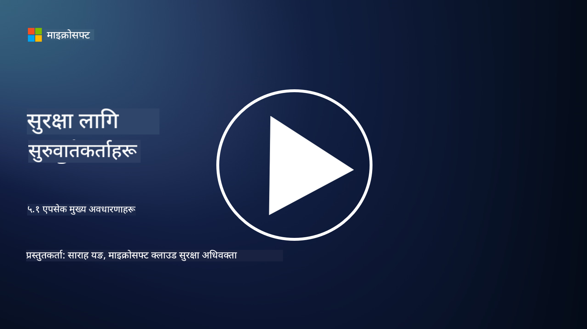

<!--
CO_OP_TRANSLATOR_METADATA:
{
  "original_hash": "e4b56bb23078d3ffb7ad407d280b0c36",
  "translation_date": "2025-09-04T00:31:03+00:00",
  "source_file": "5.1 AppSec key concepts.md",
  "language_code": "ne"
}
-->
# AppSec मुख्य अवधारणाहरू

एप्लिकेशन सुरक्षा आफैंमा एक विशेष सुरक्षा क्षेत्र हो। यस पाठक्रमको यस भागमा हामी एप्लिकेशन सुरक्षाको बारेमा थप जान्नेछौं।

## परिचय

यस पाठमा, हामीले निम्न विषयहरू समेट्नेछौं:

- एप्लिकेशन सुरक्षा के हो?

- एप्लिकेशन सुरक्षाका मुख्य अवधारणाहरू/सिद्धान्तहरू के हुन्?

## एप्लिकेशन सुरक्षा के हो?

एप्लिकेशन सुरक्षा, प्रायः "AppSec" भनेर छोटकरीमा चिनिन्छ, सफ्टवेयर एप्लिकेशनलाई सुरक्षा खतराहरू, कमजोरीहरू, र आक्रमणहरूबाट जोगाउने अभ्यासलाई जनाउँछ। यसले एप्लिकेशनको विकास, परिनियोजन, र मर्मतसम्भारको जीवनचक्रभरि सुरक्षा जोखिमहरू पहिचान, न्यूनीकरण, र रोकथाम गर्न प्रयोग गरिने प्रक्रिया, प्रविधि, र उपकरणहरू समेट्छ।

एप्लिकेशन सुरक्षा महत्त्वपूर्ण छ किनभने एप्लिकेशनहरू साइबर आक्रमणका सामान्य लक्ष्यहरू हुन्। दुर्भावनापूर्ण व्यक्तिहरू सफ्टवेयरमा रहेका कमजोरीहरू र त्रुटिहरूको फाइदा उठाएर अनधिकृत पहुँच प्राप्त गर्न, डेटा चोरी गर्न, सेवा अवरोध गर्न, वा अन्य दुर्भावनापूर्ण गतिविधिहरू सञ्चालन गर्न सक्छन्। प्रभावकारी एप्लिकेशन सुरक्षाले एप्लिकेशन र यससँग सम्बन्धित डेटा को गोपनीयता, अखण्डता, र उपलब्धता सुनिश्चित गर्न मद्दत गर्दछ।

## एप्लिकेशन सुरक्षाका मुख्य अवधारणाहरू/सिद्धान्तहरू के हुन्?

एप्लिकेशन सुरक्षाका आधारभूत अवधारणाहरू र सिद्धान्तहरूमा समावेश छन्:

1. **डिजाइनबाट सुरक्षित**:

- सुरक्षालाई एप्लिकेशनको डिजाइन र वास्तुकलामा सुरुबाटै समावेश गर्नुपर्छ, पछि थप्ने सोच राख्नु हुँदैन।

2. **इनपुट मान्यता**:

- सबै प्रयोगकर्ता इनपुटहरूलाई मान्यता दिनुपर्छ ताकि तिनीहरू अपेक्षित ढाँचामा मिल्छन् र दुर्भावनापूर्ण कोड वा डेटा मुक्त छन्।

3. **आउटपुट एन्कोडिङ**:

- क्लाइन्टलाई पठाइने डेटा उचित रूपमा एन्कोड गर्नुपर्छ ताकि क्रस-साइट स्क्रिप्टिङ (XSS) जस्ता कमजोरीहरू रोक्न सकियोस्।

4. **प्रमाणीकरण र अनुमति**:

- प्रयोगकर्ताहरूलाई प्रमाणीकरण गर्नुहोस् र तिनीहरूको भूमिका र अनुमति अनुसार स्रोतहरूमा पहुँच दिनुहोस्।

5. **डेटा सुरक्षा**:

- संवेदनशील डेटा भण्डारण गर्दा, प्रसारण गर्दा, र प्रशोधन गर्दा एन्क्रिप्ट गर्नुपर्छ ताकि अनधिकृत पहुँच रोक्न सकियोस्।

6. **सत्र व्यवस्थापन**:

- सुरक्षित सत्र व्यवस्थापनले प्रयोगकर्ता सत्रहरू अपहरण र अनधिकृत पहुँचबाट सुरक्षित राख्छ।

7. **सुरक्षित निर्भरता**:

- सफ्टवेयर निर्भरताहरूलाई सुरक्षा अपडेटहरूसँग अद्यावधिक राख्नुहोस् ताकि कमजोरीहरू रोक्न सकियोस्।

8. **त्रुटि व्यवस्थापन र लगिङ**:

- संवेदनशील जानकारी खुलासा नगर्ने सुरक्षित त्रुटि व्यवस्थापन लागू गर्नुहोस् र सुरक्षित लगिङ अभ्यास सुनिश्चित गर्नुहोस्।

9. **सुरक्षा परीक्षण**:

- एप्लिकेशनहरूलाई नियमित रूपमा कमजोरीहरूको लागि परीक्षण गर्नुहोस्, जस्तै पेनिट्रेशन परीक्षण, कोड समीक्षा, र स्वचालित स्क्यानिङ उपकरणहरूको प्रयोग।

10. **सुरक्षित सफ्टवेयर विकास जीवनचक्र (SDLC)**:

- सफ्टवेयर विकास जीवनचक्रको प्रत्येक चरणमा, आवश्यकतादेखि परिनियोजन र मर्मतसम्म, सुरक्षा अभ्यासहरू समावेश गर्नुहोस्।

## थप अध्ययन

- [SheHacksPurple: एप्लिकेशन सुरक्षा के हो? - YouTube](https://www.youtube.com/watch?v=eNmccQNzSSY)
- [एप्लिकेशन सुरक्षा के हो? - Cisco](https://www.cisco.com/c/en/us/solutions/security/application-first-security/what-is-application-security.html#~how-does-it-work)
- [एप्लिकेशन सुरक्षा के हो? सफ्टवेयर सुरक्षित गर्ने प्रक्रिया र उपकरणहरू | CSO Online](https://www.csoonline.com/article/566471/what-is-application-security-a-process-and-tools-for-securing-software.html)
- [OWASP Cheat Sheet Series | OWASP Foundation](https://owasp.org/www-project-cheat-sheets/)

---

**अस्वीकरण**:  
यो दस्तावेज़ AI अनुवाद सेवा [Co-op Translator](https://github.com/Azure/co-op-translator) प्रयोग गरी अनुवाद गरिएको हो। हामी यथासम्भव सटीकता सुनिश्चित गर्न प्रयास गर्छौं, तर कृपया ध्यान दिनुहोस् कि स्वचालित अनुवादहरूमा त्रुटि वा अशुद्धता हुन सक्छ। यसको मूल भाषामा रहेको मूल दस्तावेज़लाई आधिकारिक स्रोत मानिनुपर्छ। महत्त्वपूर्ण जानकारीका लागि, व्यावसायिक मानव अनुवाद सिफारिस गरिन्छ। यस अनुवादको प्रयोगबाट उत्पन्न हुने कुनै पनि गलतफहमी वा गलत व्याख्याको लागि हामी जिम्मेवार हुने छैनौं।