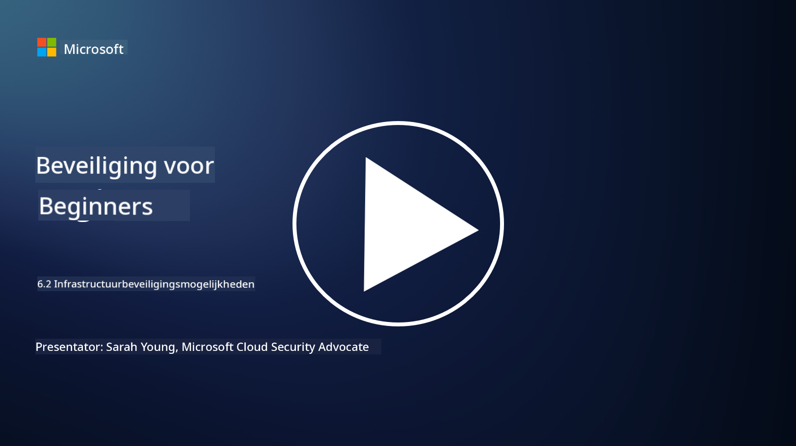

<!--
CO_OP_TRANSLATOR_METADATA:
{
  "original_hash": "7d79ba0e7668b3bdae1fba7aa047f6c0",
  "translation_date": "2025-09-04T00:13:36+00:00",
  "source_file": "6.2 Infrastructure security capabilities.md",
  "language_code": "nl"
}
-->
# Beveiligingsmogelijkheden voor infrastructuur

In deze sectie bespreken we meer details over de kernhulpmiddelen en mogelijkheden die worden gebruikt bij infrastructuurbeveiliging.

**Introductie**

In deze les behandelen we:

- Wat is kwetsbaarheidsbeheer?

- Wat is CSPM?

- Wat is CNAPP?

## Wat is kwetsbaarheidsbeheer?

Kwetsbaarheidsbeheer is een systematisch proces voor het identificeren, evalueren, prioriteren, mitigeren en monitoren van kwetsbaarheden in computersystemen, software, netwerken en infrastructuur. Het primaire doel van kwetsbaarheidsbeheer is om de blootstelling van een organisatie aan beveiligingsrisico's te verminderen door bekende kwetsbaarheden proactief aan te pakken voordat ze kunnen worden misbruikt door kwaadwillenden. Hier is een overzicht van de belangrijkste stappen:

Identificatie: Scannen en ontdekken van kwetsbaarheden in de activa van de organisatie, zoals servers, applicaties, netwerkapparaten en eindpunten.

Beoordeling: Evalueren van de ernst en potentiële impact van elke kwetsbaarheid op basis van factoren zoals de Common Vulnerability Scoring System (CVSS)-score en de zakelijke context.

Prioritering: Rangschikken van kwetsbaarheden op basis van hun risiconiveau en potentiële impact op de activiteiten en gegevens van de organisatie.

Mitigatie: Ontwikkelen en implementeren van strategieën om kwetsbaarheden te verhelpen of te beperken, zoals het toepassen van patches, configureren van beveiligingsinstellingen of inzetten van compenserende maatregelen.

Verificatie: Bevestigen dat de mitigerende maatregelen effectief waren in het aanpakken van de kwetsbaarheden.

Continue monitoring: Voortdurend volgen van kwetsbaarheden en potentiële bedreigingen, met regelmatige kwetsbaarheidsscans en beoordelingen.

Kwetsbaarheidsbeheer is een cruciaal onderdeel van cybersecurity en helpt organisaties een sterke beveiligingshouding te behouden en de kans op beveiligingsinbreuken te verkleinen. Voorbeelden van tools voor kwetsbaarheidsbeheer zijn Defender for Cloud, Nessus en Qualys.

## Wat is CSPM?

Cloud Security Posture Management (CSPM) is een verzameling tools, processen en praktijken die zijn ontworpen om beveiligingsconfiguraties en best practices in cloudomgevingen te beoordelen, te monitoren en af te dwingen. CSPM-oplossingen helpen organisaties bij het identificeren en verhelpen van verkeerde configuraties, beveiligingslacunes en nalevingsschendingen in hun cloudinfrastructuur, zoals in Amazon Web Services (AWS), Microsoft Azure, Google Cloud Platform (GCP) en andere cloudproviders.

Belangrijke aspecten van CSPM zijn onder andere:

- Configuratiebeoordeling: Scannen van cloudbronnen en -diensten om verkeerde configuraties, onveilige instellingen en afwijkingen van beveiligingsbest practices te identificeren.

- Handhaving van beveiligingsbeleid: Beveiligingsbeleid en nalevingsnormen afdwingen in cloudomgevingen door automatisch verkeerde configuraties te corrigeren of waarschuwingen te genereren.

- Continue monitoring: Voortdurende zichtbaarheid bieden in de beveiligingshouding van cloudactiva en -bronnen, met realtime waarschuwingen voor beveiligingsincidenten.

- Nalevingsrapportage: Rapporten en dashboards genereren om naleving van regelgeving en industrienormen aan te tonen.

CSPM helpt organisaties ervoor te zorgen dat hun cloudinfrastructuur veilig, compliant en afgestemd is op best practices, waardoor het risico op cloudgerelateerde beveiligingsincidenten wordt verminderd. Voorbeelden van CSPM-tools zijn Defender for Cloud en Snyk.

## Wat is CNAPP?

CNAPP staat voor Cloud-Native Application Protection Platform. Het is een alles-in-één cloud-native softwareplatform dat het monitoren, detecteren en aanpakken van potentiële cloudbeveiligingsbedreigingen en kwetsbaarheden vereenvoudigt. Het combineert meerdere tools en mogelijkheden in één softwareoplossing om complexiteit te minimaliseren en de werkzaamheden van DevOps- en DevSecOps-teams te vergemakkelijken. CNAPP biedt end-to-end beveiliging voor cloud en applicaties gedurende de hele CI/CD-applicatielevenscyclus, van ontwikkeling tot productie. Het speelt in op de behoefte van de industrie aan moderne cloudbeveiligingsmonitoring, houdingsbeheer, inbraakpreventie en controlemiddelen. CNAPP-oplossingen bieden beveiligingsteams de mogelijkheid om risico's in de cloudomgeving te kwantificeren en erop te reageren. Enkele kenmerken van CNAPP zijn verbeterde zichtbaarheid, kwantificatie van risico's, veilige softwareontwikkeling en een gecombineerde cloudbeveiligingsoplossing. CNAPP integreert meerdere cloudbeveiligingsoplossingen die traditioneel gescheiden waren in één gebruikersinterface, waardoor het voor organisaties eenvoudiger wordt om hun volledige cloudapplicatieomgeving te beschermen. CNAPP's consolideren meerdere cloud-native beveiligingstools en gegevensbronnen, waaronder containerscanning, cloud security posture management, infrastructuur als code-scanning, cloudinfrastructuurrechtenbeheer en runtime cloud workload protection platforms.

## Verdere informatie
- [What is CSPM? | Microsoft Security](https://www.microsoft.com/security/business/security-101/what-is-cspm?WT.mc_id=academic-96948-sayoung)
- [What is Cloud Security Posture Management (CSPM)? | HackerOne](https://www.hackerone.com/knowledge-center/what-cloud-security-posture-management)
- [Function of cloud security posture management - Cloud Adoption Framework | Microsoft Learn](https://learn.microsoft.com/azure/cloud-adoption-framework/organize/cloud-security-posture-management?WT.mc_id=academic-96948-sayoung)
- [What Is a CNAPP? | Microsoft Security](https://www.microsoft.com/security/business/security-101/what-is-cnapp?WT.mc_id=academic-96948-sayoung)
- [Why Everyone Is Talking About CNAPP (forbes.com)](https://www.forbes.com/sites/forbestechcouncil/2021/12/10/why-everyone-is-talking-about-cnapp/?sh=567275ca1549)
- [Improving Your Multi-Cloud Security with a Cloud-Native Application Protection Platform (CNAPP)](https://www.youtube.com/watch?v=5w42kQ_QjZg&t=212s)

---

**Disclaimer**:  
Dit document is vertaald met behulp van de AI-vertalingsservice [Co-op Translator](https://github.com/Azure/co-op-translator). Hoewel we streven naar nauwkeurigheid, dient u zich ervan bewust te zijn dat geautomatiseerde vertalingen fouten of onnauwkeurigheden kunnen bevatten. Het originele document in de oorspronkelijke taal moet worden beschouwd als de gezaghebbende bron. Voor kritieke informatie wordt professionele menselijke vertaling aanbevolen. Wij zijn niet aansprakelijk voor misverstanden of verkeerde interpretaties die voortvloeien uit het gebruik van deze vertaling.