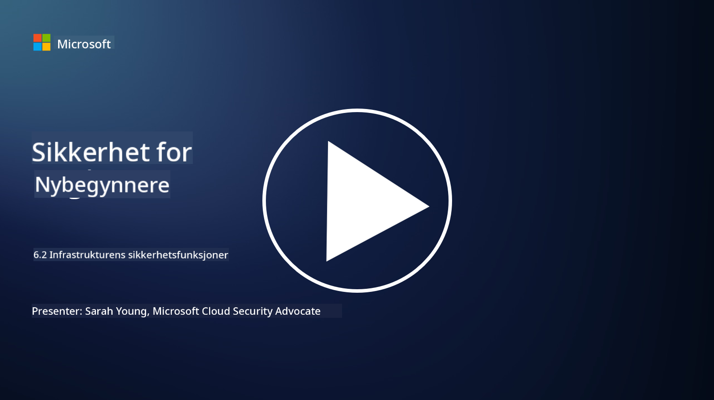

<!--
CO_OP_TRANSLATOR_METADATA:
{
  "original_hash": "7d79ba0e7668b3bdae1fba7aa047f6c0",
  "translation_date": "2025-09-04T00:13:19+00:00",
  "source_file": "6.2 Infrastructure security capabilities.md",
  "language_code": "no"
}
-->
# Infrastrukturens sikkerhetsfunksjoner

I denne delen skal vi gå nærmere inn på de viktigste verktøyene og funksjonene som brukes innen infrastrukturens sikkerhet.

**Introduksjon**

I denne leksjonen skal vi dekke:

- Hva er sårbarhetsstyring?

- Hva er CSPM?

- Hva er CNAPP?

## Hva er sårbarhetsstyring?

Sårbarhetsstyring er en systematisk prosess for å identifisere, evaluere, prioritere, redusere og overvåke sårbarheter i datasystemer, programvare, nettverk og infrastruktur. Hovedmålet med sårbarhetsstyring er å redusere en organisasjons eksponering for sikkerhetsrisikoer ved proaktivt å håndtere kjente sårbarheter før de kan utnyttes av ondsinnede aktører. Her er en oversikt over de viktigste trinnene:

Identifikasjon: Skanning og oppdagelse av sårbarheter i organisasjonens eiendeler, som kan inkludere servere, applikasjoner, nettverksenheter og endepunkter.

Vurdering: Evaluering av alvorlighetsgraden og den potensielle påvirkningen av hver sårbarhet basert på faktorer som Common Vulnerability Scoring System (CVSS)-score og forretningskontekst.

Prioritering: Rangering av sårbarheter basert på risikonivå og potensiell påvirkning på organisasjonens drift og data.

Reduksjon: Utvikling og implementering av strategier for å utbedre eller redusere sårbarheter, som kan inkludere å installere oppdateringer, konfigurere sikkerhetsinnstillinger eller implementere kompenserende tiltak.

Verifisering: Bekreftelse på at tiltakene har vært effektive for å håndtere sårbarhetene.

Kontinuerlig overvåking: Løpende sporing av sårbarheter og potensielle trusler, med regelmessige skanninger og vurderinger.

Sårbarhetsstyring er en kritisk del av cybersikkerhet og hjelper organisasjoner med å opprettholde en sterk sikkerhetsposisjon og redusere sannsynligheten for sikkerhetsbrudd. Eksempler på verktøy for sårbarhetsstyring er Defender for Cloud, Nessus og Qualys.

## Hva er CSPM?

Cloud Security Posture Management (CSPM) er et sett med verktøy, prosesser og praksiser som er designet for å vurdere, overvåke og håndheve sikkerhetskonfigurasjoner og beste praksis i skybaserte miljøer. CSPM-løsninger hjelper organisasjoner med å identifisere og utbedre feilkonfigurasjoner, sikkerhetsgap og brudd på samsvar i deres skyinfrastruktur, som i Amazon Web Services (AWS), Microsoft Azure, Google Cloud Platform (GCP) og andre skyleverandører.

Viktige aspekter ved CSPM inkluderer:

- Konfigurasjonsvurdering: Skanning av skyressurser og tjenester for å identifisere feilkonfigurasjoner, usikre innstillinger og avvik fra beste praksis innen sikkerhet.

- Håndheving av sikkerhetspolicyer: Håndheving av sikkerhetspolicyer og samsvarsstandarder på tvers av skybaserte miljøer ved automatisk å utbedre feilkonfigurasjoner eller generere varsler.

- Kontinuerlig overvåking: Tilby kontinuerlig innsikt i sikkerhetsstatusen til skyressurser og eiendeler, med sanntidsvarsler for sikkerhetshendelser.

- Samsvarsrapportering: Generere rapporter og dashbord for å demonstrere samsvar med regulatoriske krav og industristandarder.

CSPM hjelper organisasjoner med å sikre at deres skyinfrastruktur er sikker, i samsvar med regelverk og tilpasset beste praksis, og reduserer risikoen for skyrelaterte sikkerhetshendelser. Eksempler på CSPM-verktøy inkluderer Defender for Cloud og Snyk.

## Hva er CNAPP?

CNAPP står for Cloud-Native Application Protection Platform. Det er en alt-i-ett skybasert programvareplattform som forenkler overvåking, oppdagelse og håndtering av potensielle sikkerhetstrusler og sårbarheter i skyen. Den kombinerer flere verktøy og funksjoner i én programvareløsning for å redusere kompleksitet og lette operasjonene til DevOps- og DevSecOps-team. CNAPP tilbyr ende-til-ende sikkerhet for sky og applikasjoner gjennom hele CI/CD-applikasjonslivssyklusen, fra utvikling til produksjon. Den adresserer bransjens behov for moderne verktøy for skybasert sikkerhetsovervåking, statusstyring, forebygging av brudd og kontroll. CNAPP-løsninger gir sikkerhetsteam muligheten til å kvantifisere og reagere på risikoer i skybaserte miljøer. Noen av funksjonene til CNAPP inkluderer forbedret synlighet, kvantifisering av risiko, sikker programvareutvikling og en kombinert skybasert sikkerhetsløsning. CNAPP integrerer flere skybaserte sikkerhetsløsninger som tradisjonelt har vært isolert, i én brukergrensesnitt, noe som gjør det enklere for organisasjoner å beskytte hele sitt skyapplikasjonsfotavtrykk. CNAPP konsoliderer flere skybaserte sikkerhetsverktøy og datakilder, inkludert container-skanning, Cloud Security Posture Management, Infrastructure as Code-skanning, Cloud Infrastructure Entitlements Management og Runtime Cloud Workload Protection Platforms.

## Videre lesing
- [What is CSPM? | Microsoft Security](https://www.microsoft.com/security/business/security-101/what-is-cspm?WT.mc_id=academic-96948-sayoung)
- [What is Cloud Security Posture Management (CSPM)? | HackerOne](https://www.hackerone.com/knowledge-center/what-cloud-security-posture-management)
- [Function of cloud security posture management - Cloud Adoption Framework | Microsoft Learn](https://learn.microsoft.com/azure/cloud-adoption-framework/organize/cloud-security-posture-management?WT.mc_id=academic-96948-sayoung)
- [What Is a CNAPP? | Microsoft Security](https://www.microsoft.com/security/business/security-101/what-is-cnapp?WT.mc_id=academic-96948-sayoung)
- [Why Everyone Is Talking About CNAPP (forbes.com)](https://www.forbes.com/sites/forbestechcouncil/2021/12/10/why-everyone-is-talking-about-cnapp/?sh=567275ca1549)
- [Improving Your Multi-Cloud Security with a Cloud-Native Application Protection Platform (CNAPP)](https://www.youtube.com/watch?v=5w42kQ_QjZg&t=212s)

---

**Ansvarsfraskrivelse**:  
Dette dokumentet er oversatt ved hjelp av AI-oversettelsestjenesten [Co-op Translator](https://github.com/Azure/co-op-translator). Selv om vi tilstreber nøyaktighet, vennligst vær oppmerksom på at automatiske oversettelser kan inneholde feil eller unøyaktigheter. Det originale dokumentet på sitt opprinnelige språk bør anses som den autoritative kilden. For kritisk informasjon anbefales profesjonell menneskelig oversettelse. Vi er ikke ansvarlige for eventuelle misforståelser eller feiltolkninger som oppstår ved bruk av denne oversettelsen.