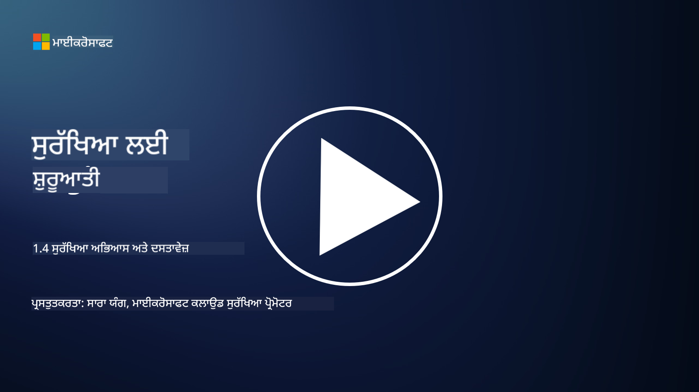

<!--
CO_OP_TRANSLATOR_METADATA:
{
  "original_hash": "d33500902124e52870935bdce4546fcc",
  "translation_date": "2025-09-04T00:19:12+00:00",
  "source_file": "1.4 Security practices and documentation.md",
  "language_code": "pa"
}
-->
# ਸੁਰੱਖਿਆ ਅਭਿਆਸ ਅਤੇ ਦਸਤਾਵੇਜ਼

ਤੁਹਾਨੂੰ ਪਹਿਲਾਂ "ਸੁਰੱਖਿਆ ਨੀਤੀ", "ਸੁਰੱਖਿਆ ਮਾਪਦੰਡ" ਆਦਿ ਸ਼ਬਦ ਸੁਣੇ ਹੋ ਸਕਦੇ ਹਨ, ਪਰ ਅਸਲ ਵਿੱਚ ਕਈ ਸਾਇਬਰਸੁਰੱਖਿਆ ਪੇਸ਼ੇਵਰ ਇਨ੍ਹਾਂ ਨੂੰ ਠੀਕ ਤਰੀਕੇ ਨਾਲ ਵਰਤਦੇ ਨਹੀਂ ਹਨ। ਇਸ ਭਾਗ ਵਿੱਚ ਅਸੀਂ ਵਿਆਖਿਆ ਕਰਾਂਗੇ ਕਿ ਇਹ ਸ਼ਬਦ ਕੀ ਮਤਲਬ ਰੱਖਦੇ ਹਨ ਅਤੇ ਇੱਕ ਸੰਗਠਨ ਕਿਉਂ ਇਨ੍ਹਾਂ ਦੀ ਵਰਤੋਂ ਕਰਦਾ ਹੈ।

## ਪਰਿਚਯ

ਇਸ ਪਾਠ ਵਿੱਚ, ਅਸੀਂ ਕਵਰ ਕਰਾਂਗੇ:

- ਸੁਰੱਖਿਆ ਨੀਤੀ ਕੀ ਹੈ?

- ਸੁਰੱਖਿਆ ਮਾਪਦੰਡ ਕੀ ਹੈ?

- ਸੁਰੱਖਿਆ ਬੇਸਲਾਈਨ ਕੀ ਹੈ?

- ਸੁਰੱਖਿਆ ਦਿਸ਼ਾ-ਨਿਰਦੇਸ਼ ਕੀ ਹੈ?

- ਸੁਰੱਖਿਆ ਪ੍ਰਕਿਰਿਆ ਕੀ ਹੈ?

- ਸਾਇਬਰਸੁਰੱਖਿਆ ਦੇ ਸੰਦਰਭ ਵਿੱਚ ਕਾਨੂੰਨ ਅਤੇ ਨਿਯਮ ਕੀ ਹਨ?

ਇਹ ਸ਼ਬਦ ਅਕਸਰ ਸਾਇਬਰਸੁਰੱਖਿਆ ਦੇ ਸੰਦਰਭ ਵਿੱਚ ਵਰਤੇ ਜਾਂਦੇ ਹਨ ਤਾਂ ਜੋ ਸੰਗਠਨ ਦੇ ਅੰਦਰ ਸੁਰੱਖਿਆ ਦਸਤਾਵੇਜ਼ ਅਤੇ ਅਭਿਆਸ ਦੇ ਵੱਖ-ਵੱਖ ਪੱਧਰਾਂ ਨੂੰ ਪਰਿਭਾਸ਼ਿਤ ਕੀਤਾ ਜਾ ਸਕੇ। ਆਓ ਹਰ ਸ਼ਬਦ ਨੂੰ ਸਪਸ਼ਟ ਕਰੀਏ:

## ਸੁਰੱਖਿਆ ਨੀਤੀ ਕੀ ਹੈ?

ਸੁਰੱਖਿਆ ਨੀਤੀ ਇੱਕ ਉੱਚ-ਪੱਧਰੀ ਦਸਤਾਵੇਜ਼ ਹੈ ਜੋ ਸੰਗਠਨ ਦੇ ਸਮੁੱਚੇ ਸੁਰੱਖਿਆ ਦੇ ਲਕਸ਼ਾਂ, ਸਿਧਾਂਤਾਂ ਅਤੇ ਦਿਸ਼ਾ-ਨਿਰਦੇਸ਼ਾਂ ਨੂੰ ਰੇਖਾਂਕਿਤ ਕਰਦਾ ਹੈ। ਇਹ ਸੁਰੱਖਿਆ ਨਾਲ ਸੰਬੰਧਿਤ ਫੈਸਲੇ ਕਰਨ ਲਈ ਇੱਕ ਢਾਂਚਾ ਪ੍ਰਦਾਨ ਕਰਦਾ ਹੈ ਅਤੇ ਸੰਗਠਨ ਦੇ ਸੁਰੱਖਿਆ ਰਵੱਈਏ ਲਈ ਮਾਹੌਲ ਸੈਟ ਕਰਦਾ ਹੈ। ਸੁਰੱਖਿਆ ਨੀਤੀਆਂ ਆਮ ਤੌਰ 'ਤੇ ਸਾਧਨਾਂ ਦੀ ਸਵੀਕਾਰਯੋਗ ਵਰਤੋਂ, ਡਾਟਾ ਸੁਰੱਖਿਆ, ਪਹੁੰਚ ਨਿਯੰਤਰਣ, ਘਟਨਾ ਪ੍ਰਤੀਕ੍ਰਿਆ ਆਦਿ ਵਰਗੇ ਵਿਸ਼ਿਆਂ ਨੂੰ ਕਵਰ ਕਰਦੀਆਂ ਹਨ। ਨੀਤੀ ਹੱਲ ਅਤੇ ਤਕਨਾਲੋਜੀ ਤੋਂ ਅਜ਼ਾਦ ਹੁੰਦੀ ਹੈ। ਇੱਕ ਸੁਰੱਖਿਆ ਨੀਤੀ ਦਾ ਉਦਾਹਰਨ ਜਿਸ ਨਾਲ ਕਈ ਲੋਕ ਜਾਣੂ ਹੋਣਗੇ, ਉਹ ਸੰਗਠਨ ਦੀ ਸਵੀਕਾਰਯੋਗ ਵਰਤੋਂ ਨੀਤੀ ਹੋ ਸਕਦੀ ਹੈ।

## ਸੁਰੱਖਿਆ ਮਾਪਦੰਡ ਕੀ ਹੈ?

ਸੁਰੱਖਿਆ ਮਾਪਦੰਡ ਇੱਕ ਹੋਰ ਵਿਸਤ੍ਰਿਤ ਅਤੇ ਵਿਸ਼ੇਸ਼ ਦਸਤਾਵੇਜ਼ ਹੈ ਜੋ ਸੰਗਠਨ ਦੇ ਅੰਦਰ ਸੁਰੱਖਿਆ ਨਿਯੰਤਰਣ ਅਤੇ ਉਪਾਅ ਲਾਗੂ ਕਰਨ ਲਈ ਦਿਸ਼ਾ-ਨਿਰਦੇਸ਼ ਅਤੇ ਜ਼ਰੂਰਤਾਂ ਪ੍ਰਦਾਨ ਕਰਦਾ ਹੈ। ਮਾਪਦੰਡ ਨੀਤੀਆਂ ਨਾਲੋਂ ਜ਼ਿਆਦਾ ਠੋਸ ਅਤੇ ਤਕਨੀਕੀ ਹੁੰਦੇ ਹਨ, ਜੋ ਸੁਰੱਖਿਆ ਦੇ ਲਕਸ਼ਾਂ ਨੂੰ ਪੂਰਾ ਕਰਨ ਲਈ ਸਿਸਟਮ, ਨੈਟਵਰਕ ਅਤੇ ਪ੍ਰਕਿਰਿਆਵਾਂ ਨੂੰ ਸੰਰਚਿਤ ਅਤੇ ਰੱਖ-ਰਖਾਵ ਕਰਨ ਲਈ ਵਿਸ਼ੇਸ਼ ਹਦਾਇਤਾਂ ਅਤੇ ਸਿਫਾਰਸ਼ਾਂ ਦਿੰਦੇ ਹਨ। ਸੁਰੱਖਿਆ ਮਾਪਦੰਡ ਦਾ ਇੱਕ ਉਦਾਹਰਨ ਹੋ ਸਕਦਾ ਹੈ _“ਸਾਰੇ ਅੰਦਰੂਨੀ ਡਾਟਾ ਨੂੰ ਰੈਸਟ ਅਤੇ ਟ੍ਰਾਂਜ਼ਿਟ ਵਿੱਚ ਇਨਕ੍ਰਿਪਟ ਕੀਤਾ ਜਾਣਾ ਚਾਹੀਦਾ ਹੈ।”_

## ਸੁਰੱਖਿਆ ਬੇਸਲਾਈਨ ਕੀ ਹੈ?

ਸੁਰੱਖਿਆ ਬੇਸਲਾਈਨ ਇੱਕ ਘੱਟੋ-ਘੱਟ ਸੁਰੱਖਿਆ ਸੰਰਚਨਾ ਦਾ ਸੈੱਟ ਹੈ ਜੋ ਕਿਸੇ ਵਿਸ਼ੇਸ਼ ਸਿਸਟਮ, ਐਪਲੀਕੇਸ਼ਨ ਜਾਂ ਵਾਤਾਵਰਣ ਲਈ ਇੱਕ ਨਿਰਧਾਰਿਤ ਸਮੇਂ 'ਤੇ ਜ਼ਰੂਰੀ ਮੰਨਿਆ ਜਾਂਦਾ ਹੈ। ਇਹ ਸੁਰੱਖਿਆ ਲਈ ਇੱਕ ਸ਼ੁਰੂਆਤੀ ਬਿੰਦੂ ਨੂੰ ਪਰਿਭਾਸ਼ਿਤ ਕਰਦਾ ਹੈ ਜੋ ਸੰਗਠਨ ਦੇ ਸਾਰੇ ਸੰਬੰਧਿਤ ਮਾਮਲਿਆਂ ਵਿੱਚ ਲਾਗੂ ਕੀਤਾ ਜਾਣਾ ਚਾਹੀਦਾ ਹੈ। ਸੁਰੱਖਿਆ ਬੇਸਲਾਈਨ ਸੰਗਠਨ ਦੇ ਆਈਟੀ ਢਾਂਚੇ ਵਿੱਚ ਸਥਿਰਤਾ ਅਤੇ ਇੱਕ ਨਿਰਧਾਰਿਤ ਪੱਧਰ ਦੀ ਸੁਰੱਖਿਆ ਨੂੰ ਯਕੀਨੀ ਬਣਾਉਣ ਵਿੱਚ ਮਦਦ ਕਰਦੇ ਹਨ। ਸੁਰੱਖਿਆ ਬੇਸਲਾਈਨ ਦਾ ਇੱਕ ਉਦਾਹਰਨ ਹੋ ਸਕਦਾ ਹੈ _“Azure VMs ਨੂੰ ਸਿੱਧੇ ਇੰਟਰਨੈਟ ਪਹੁੰਚ ਨਹੀਂ ਹੋਣੀ ਚਾਹੀਦੀ।”_

## ਸੁਰੱਖਿਆ ਦਿਸ਼ਾ-ਨਿਰਦੇਸ਼ ਕੀ ਹੈ?

ਸੁਰੱਖਿਆ ਦਿਸ਼ਾ-ਨਿਰਦੇਸ਼ ਇੱਕ ਦਸਤਾਵੇਜ਼ ਹੈ ਜੋ ਸਿਫਾਰਸ਼ਾਂ ਅਤੇ ਮਾਰਗਦਰਸ਼ਨ ਪ੍ਰਦਾਨ ਕਰਦਾ ਹੈ ਜਦੋਂ ਕੋਈ ਵਿਸ਼ੇਸ਼ ਸੁਰੱਖਿਆ ਮਾਪਦੰਡ ਲਾਗੂ ਨਹੀਂ ਹੁੰਦਾ। ਦਿਸ਼ਾ-ਨਿਰਦੇਸ਼ ਉਹ "ਗ੍ਰੇ ਇਲਾਕੇ" ਨੂੰ ਸੰਬੋਧਨ ਕਰਨ ਦੀ ਕੋਸ਼ਿਸ਼ ਕਰਦੇ ਹਨ ਜਦੋਂ ਕੋਈ ਮਾਪਦੰਡ ਕਿਸੇ ਮਾਮਲੇ ਨੂੰ ਕਵਰ ਨਹੀਂ ਕਰਦਾ ਜਾਂ ਸਿਰਫ਼ ਅੰਸ਼ਿਕ ਤੌਰ 'ਤੇ ਕਵਰ ਕਰਦਾ ਹੈ।

## ਸੁਰੱਖਿਆ ਪ੍ਰਕਿਰਿਆ ਕੀ ਹੈ?

ਸੁਰੱਖਿਆ ਪ੍ਰਕਿਰਿਆ ਇੱਕ ਵਿਸਤ੍ਰਿਤ ਕਦਮ-ਦਰ-ਕਦਮ ਗਾਈਡ ਹੈ ਜੋ ਸੁਰੱਖਿਆ-ਸੰਬੰਧੀ ਪ੍ਰਕਿਰਿਆ ਜਾਂ ਕੰਮ ਨੂੰ ਅੰਜਾਮ ਦੇਣ ਲਈ ਕੀਤੇ ਜਾਣ ਵਾਲੇ ਵਿਸ਼ੇਸ਼ ਕਾਰਵਾਈਆਂ ਅਤੇ ਕੰਮਾਂ ਨੂੰ ਰੇਖਾਂਕਿਤ ਕਰਦੀ ਹੈ। ਪ੍ਰਕਿਰਿਆਵਾਂ ਵਿਹੰਗਮ ਅਤੇ ਕਾਰਜਕਾਰੀ ਦਸਤਾਵੇਜ਼ ਹੁੰਦੀਆਂ ਹਨ ਜੋ ਘਟਨਾ ਪ੍ਰਤੀਕ੍ਰਿਆ, ਸਿਸਟਮ ਰੱਖ-ਰਖਾਵ, ਯੂਜ਼ਰ ਆਨਬੋਰਡਿੰਗ ਅਤੇ ਹੋਰ ਸੁਰੱਖਿਆ-ਸੰਬੰਧੀ ਗਤੀਵਿਧੀਆਂ ਦੌਰਾਨ ਪਾਲਣ ਕਰਨ ਲਈ ਸਪਸ਼ਟ ਕ੍ਰਮ ਪ੍ਰਦਾਨ ਕਰਦੀਆਂ ਹਨ। ਸੁਰੱਖਿਆ ਪ੍ਰਕਿਰਿਆ ਦਾ ਇੱਕ ਉਦਾਹਰਨ ਹੋ ਸਕਦਾ ਹੈ _“ਜਦੋਂ Microsoft Sentinel ਦੁਆਰਾ ਇੱਕ P1 ਸੁਰੱਖਿਆ ਘਟਨਾ ਜਨਰੇਟ ਕੀਤੀ ਜਾਂਦੀ ਹੈ, ਤਾਂ ਸੁਰੱਖਿਆ ਕਾਰਵਾਈ ਕੇਂਦਰ (SOC) ਨੂੰ ਤੁਰੰਤ ਡਿਊਟੀ 'ਤੇ ਮੌਜੂਦ ਸੁਰੱਖਿਆ ਮੈਨੇਜਰ ਨੂੰ ਸੂਚਿਤ ਕਰਨਾ ਚਾਹੀਦਾ ਹੈ ਅਤੇ ਘਟਨਾ ਦੇ ਵੇਰਵੇ ਉਨ੍ਹਾਂ ਨੂੰ ਭੇਜਣੇ ਚਾਹੀਦੇ ਹਨ।”_

ਸੰਖੇਪ ਵਿੱਚ, ਇਹ ਸ਼ਬਦ ਸੰਗਠਨ ਦੇ ਸਾਇਬਰਸੁਰੱਖਿਆ ਢਾਂਚੇ ਦੇ ਅੰਦਰ ਦਸਤਾਵੇਜ਼ ਅਤੇ ਮਾਰਗਦਰਸ਼ਨ ਦੇ ਵੱਖ-ਵੱਖ ਪੱਧਰਾਂ ਨੂੰ ਦਰਸਾਉਂਦੇ ਹਨ। ਸੁਰੱਖਿਆ ਨੀਤੀਆਂ ਉੱਚ-ਪੱਧਰੀ ਲਕਸ਼ਾਂ ਸੈਟ ਕਰਦੀਆਂ ਹਨ, ਮਾਪਦੰਡ ਵਿਸਤ੍ਰਿਤ ਜ਼ਰੂਰਤਾਂ ਪ੍ਰਦਾਨ ਕਰਦੇ ਹਨ, ਬੇਸਲਾਈਨ ਘੱਟੋ-ਘੱਟ ਸੁਰੱਖਿਆ ਸੰਰਚਨਾ ਸਥਾਪਿਤ ਕਰਦੇ ਹਨ, ਦਿਸ਼ਾ-ਨਿਰਦੇਸ਼ ਸੁਰੱਖਿਆ ਦੇ ਸ੍ਰੇਸ਼ਠ ਅਭਿਆਸ ਪ੍ਰਦਾਨ ਕਰਦੇ ਹਨ, ਅਤੇ ਪ੍ਰਕਿਰਿਆਵਾਂ ਸੁਰੱਖਿਆ ਪ੍ਰਕਿਰਿਆਵਾਂ ਲਈ ਕਾਰਜਕਾਰੀ ਕਦਮ ਪ੍ਰਦਾਨ ਕਰਦੀਆਂ ਹਨ।

## ਸਾਇਬਰਸੁਰੱਖਿਆ ਦੇ ਸੰਦਰਭ ਵਿੱਚ ਕਾਨੂੰਨ/ਨਿਯਮ ਕੀ ਹਨ?

ਕਾਨੂੰਨ ਅਤੇ ਨਿਯਮ ਉਹ ਕਾਨੂੰਨੀ ਢਾਂਚੇ ਹਨ ਜੋ ਸਰਕਾਰਾਂ ਅਤੇ ਨਿਯਮਕ ਸੰਗਠਨਾਂ ਦੁਆਰਾ ਡਿਜੀਟਲ ਸਿਸਟਮ, ਡਾਟਾ ਅਤੇ ਜਾਣਕਾਰੀ ਦੀ ਸੁਰੱਖਿਆ ਲਈ ਨਿਯਮ, ਮਾਪਦੰਡ ਅਤੇ ਜ਼ਰੂਰਤਾਂ ਨੂੰ ਪਰਿਭਾਸ਼ਿਤ ਅਤੇ ਲਾਗੂ ਕਰਨ ਲਈ ਸਥਾਪਿਤ ਕੀਤੇ ਜਾਂਦੇ ਹਨ। ਇਹ ਕਾਨੂੰਨ ਅਤੇ ਨਿਯਮ ਜ਼ਿਲ੍ਹਾ ਅਨੁਸਾਰ ਵੱਖ-ਵੱਖ ਹੁੰਦੇ ਹਨ ਅਤੇ ਸਾਇਬਰਸੁਰੱਖਿਆ ਦੇ ਵੱਖ-ਵੱਖ ਪੱਖਾਂ 'ਤੇ ਧਿਆਨ ਕੇਂਦਰਿਤ ਕਰਦੇ ਹਨ, ਜਿਵੇਂ ਕਿ ਡਾਟਾ ਸੁਰੱਖਿਆ, ਗੋਪਨੀਯਤਾ, ਘਟਨਾ ਰਿਪੋਰਟਿੰਗ, ਅਤੇ ਮਹੱਤਵਪੂਰਨ ਢਾਂਚੇ ਦੀ ਸੁਰੱਖਿਆ। ਸਾਇਬਰਸੁਰੱਖਿਆ-ਸੰਬੰਧੀ ਕਾਨੂੰਨ ਅਤੇ ਨਿਯਮਾਂ ਦੇ ਕੁਝ ਉਦਾਹਰਨ ਹਨ: ਜਿਵੇਂ ਕਿ General Data Protection Regulation (GDPR), Health Insurance Portability and Accountability Act (HIPAA), California Consumer Privacy Act (CCPA), Payment Card Industry Data Security Standard (PCI DSS)।

## ਹੋਰ ਪੜ੍ਹਾਈ

[Information Security Policy Templates | SANS Institute](https://www.sans.org/information-security-policy/)

[Compliance with Cybersecurity and Privacy Laws and Regulations | NIST](https://www.nist.gov/mep/cybersecurity-resources-manufacturers/compliance-cybersecurity-and-privacy-laws-and-regulations)

---

**ਅਸਵੀਕਰਤੀ**:  
ਇਹ ਦਸਤਾਵੇਜ਼ AI ਅਨੁਵਾਦ ਸੇਵਾ [Co-op Translator](https://github.com/Azure/co-op-translator) ਦੀ ਵਰਤੋਂ ਕਰਕੇ ਅਨੁਵਾਦ ਕੀਤਾ ਗਿਆ ਹੈ। ਜਦੋਂ ਕਿ ਅਸੀਂ ਸਹੀ ਹੋਣ ਦਾ ਯਤਨ ਕਰਦੇ ਹਾਂ, ਕਿਰਪਾ ਕਰਕੇ ਧਿਆਨ ਦਿਓ ਕਿ ਸਵੈਚਾਲਿਤ ਅਨੁਵਾਦਾਂ ਵਿੱਚ ਗਲਤੀਆਂ ਜਾਂ ਅਸੁੱਛਤਾਵਾਂ ਹੋ ਸਕਦੀਆਂ ਹਨ। ਇਸ ਦੀ ਮੂਲ ਭਾਸ਼ਾ ਵਿੱਚ ਮੌਜੂਦ ਮੂਲ ਦਸਤਾਵੇਜ਼ ਨੂੰ ਪ੍ਰਮਾਣਿਕ ਸਰੋਤ ਮੰਨਿਆ ਜਾਣਾ ਚਾਹੀਦਾ ਹੈ। ਮਹੱਤਵਪੂਰਨ ਜਾਣਕਾਰੀ ਲਈ, ਪੇਸ਼ੇਵਰ ਮਨੁੱਖੀ ਅਨੁਵਾਦ ਦੀ ਸਿਫਾਰਸ਼ ਕੀਤੀ ਜਾਂਦੀ ਹੈ। ਇਸ ਅਨੁਵਾਦ ਦੀ ਵਰਤੋਂ ਤੋਂ ਪੈਦਾ ਹੋਣ ਵਾਲੇ ਕਿਸੇ ਵੀ ਗਲਤਫਹਿਮੀ ਜਾਂ ਗਲਤ ਵਿਆਖਿਆ ਲਈ ਅਸੀਂ ਜ਼ਿੰਮੇਵਾਰ ਨਹੀਂ ਹਾਂ।