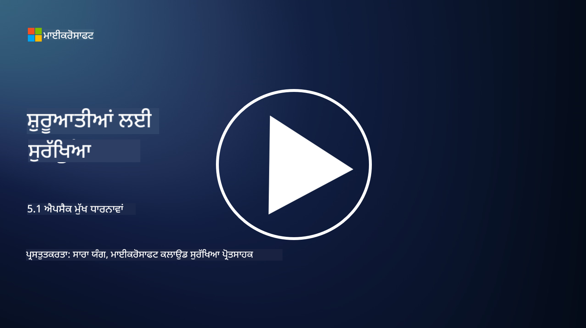

<!--
CO_OP_TRANSLATOR_METADATA:
{
  "original_hash": "e4b56bb23078d3ffb7ad407d280b0c36",
  "translation_date": "2025-09-04T00:31:17+00:00",
  "source_file": "5.1 AppSec key concepts.md",
  "language_code": "pa"
}
-->
# ਐਪਸੈਕ ਮੁੱਖ ਧਾਰਨਾਵਾਂ

ਐਪਲੀਕੇਸ਼ਨ ਸੁਰੱਖਿਆ ਆਪਣੇ ਆਪ ਵਿੱਚ ਇੱਕ ਸੁਰੱਖਿਆ ਵਿਸ਼ੇਸ਼ਤਾ ਹੈ। ਇਸ ਕੋਰਸ ਦੇ ਇਸ ਹਿੱਸੇ ਵਿੱਚ ਅਸੀਂ ਐਪਲੀਕੇਸ਼ਨ ਸੁਰੱਖਿਆ ਬਾਰੇ ਹੋਰ ਜਾਣਕਾਰੀ ਪ੍ਰਾਪਤ ਕਰਾਂਗੇ।

## ਪਰਿਚਯ

ਇਸ ਪਾਠ ਵਿੱਚ, ਅਸੀਂ ਕਵਰ ਕਰਾਂਗੇ:

- ਐਪਲੀਕੇਸ਼ਨ ਸੁਰੱਖਿਆ ਕੀ ਹੈ?

- ਐਪਲੀਕੇਸ਼ਨ ਸੁਰੱਖਿਆ ਦੇ ਮੁੱਖ ਧਾਰਨਾਵਾਂ/ਸਿਧਾਂਤ ਕੀ ਹਨ?

## ਐਪਲੀਕੇਸ਼ਨ ਸੁਰੱਖਿਆ ਕੀ ਹੈ?

ਐਪਲੀਕੇਸ਼ਨ ਸੁਰੱਖਿਆ, ਜਿਸਨੂੰ ਅਕਸਰ "ਐਪਸੈਕ" ਕਿਹਾ ਜਾਂਦਾ ਹੈ, ਸੌਫਟਵੇਅਰ ਐਪਲੀਕੇਸ਼ਨ ਨੂੰ ਸੁਰੱਖਿਆ ਖਤਰੇ, ਕਮਜ਼ੋਰੀਆਂ, ਅਤੇ ਹਮਲਿਆਂ ਤੋਂ ਬਚਾਉਣ ਦੀ ਪ੍ਰਕਿਰਿਆ ਹੈ। ਇਹ ਉਹ ਪ੍ਰਕਿਰਿਆਵਾਂ, ਤਕਨੀਕਾਂ, ਅਤੇ ਸੰਦਾਂ ਨੂੰ ਸ਼ਾਮਲ ਕਰਦਾ ਹੈ ਜੋ ਐਪਲੀਕੇਸ਼ਨ ਦੇ ਵਿਕਾਸ, ਤੈਨਾਤੀ, ਅਤੇ ਰੱਖ-ਰਖਾਅ ਦੇ ਜੀਵਨ ਚੱਕਰ ਦੌਰਾਨ ਸੁਰੱਖਿਆ ਖਤਰੇ ਦੀ ਪਛਾਣ, ਘਟਾਉਣ, ਅਤੇ ਰੋਕਥਾਮ ਲਈ ਵਰਤੇ ਜਾਂਦੇ ਹਨ।

ਐਪਲੀਕੇਸ਼ਨ ਸੁਰੱਖਿਆ ਮਹੱਤਵਪੂਰਨ ਹੈ ਕਿਉਂਕਿ ਐਪਲੀਕੇਸ਼ਨ ਸਾਇਬਰ ਹਮਲਿਆਂ ਲਈ ਆਮ ਨਿਸ਼ਾਨ ਹੁੰਦੇ ਹਨ। ਦੁਸ਼ਟ ਕਾਰਕ ਸੌਫਟਵੇਅਰ ਵਿੱਚ ਕਮਜ਼ੋਰੀਆਂ ਅਤੇ ਖਾਮੀਆਂ ਦਾ ਫਾਇਦਾ ਉਠਾ ਕੇ ਗੈਰ-ਅਧਿਕਾਰਤ ਪਹੁੰਚ ਪ੍ਰਾਪਤ ਕਰਦੇ ਹਨ, ਡਾਟਾ ਚੋਰੀ ਕਰਦੇ ਹਨ, ਸੇਵਾਵਾਂ ਵਿੱਚ ਰੁਕਾਵਟ ਪੈਦਾ ਕਰਦੇ ਹਨ, ਜਾਂ ਹੋਰ ਦੁਸ਼ਟ ਗਤੀਵਿਧੀਆਂ ਨੂੰ ਅੰਜਾਮ ਦਿੰਦੇ ਹਨ। ਪ੍ਰਭਾਵਸ਼ਾਲੀ ਐਪਲੀਕੇਸ਼ਨ ਸੁਰੱਖਿਆ ਐਪਲੀਕੇਸ਼ਨ ਅਤੇ ਇਸ ਨਾਲ ਜੁੜੇ ਡਾਟਾ ਦੀ ਗੁਪਤਤਾ, ਅਖੰਡਤਾ, ਅਤੇ ਉਪਲਬਧਤਾ ਨੂੰ ਯਕੀਨੀ ਬਣਾਉਣ ਵਿੱਚ ਮਦਦ ਕਰਦੀ ਹੈ।

## ਐਪਲੀਕੇਸ਼ਨ ਸੁਰੱਖਿਆ ਦੇ ਮੁੱਖ ਧਾਰਨਾਵਾਂ/ਸਿਧਾਂਤ ਕੀ ਹਨ?

ਐਪਲੀਕੇਸ਼ਨ ਸੁਰੱਖਿਆ ਦੇ ਮੁੱਖ ਧਾਰਨਾਵਾਂ ਅਤੇ ਸਿਧਾਂਤਾਂ ਵਿੱਚ ਸ਼ਾਮਲ ਹਨ:

1. **ਡਿਜ਼ਾਈਨ ਦੁਆਰਾ ਸੁਰੱਖਿਆ**:

- ਸੁਰੱਖਿਆ ਨੂੰ ਸ਼ੁਰੂ ਤੋਂ ਹੀ ਐਪਲੀਕੇਸ਼ਨ ਦੇ ਡਿਜ਼ਾਈਨ ਅਤੇ ਆਰਕੀਟੈਕਚਰ ਵਿੱਚ ਸ਼ਾਮਲ ਕੀਤਾ ਜਾਣਾ ਚਾਹੀਦਾ ਹੈ, ਨਾ ਕਿ ਬਾਅਦ ਵਿੱਚ ਜੋੜਿਆ ਜਾਵੇ।

2. **ਇਨਪੁਟ ਵੈਲੀਡੇਸ਼ਨ**:

- ਸਾਰੇ ਯੂਜ਼ਰ ਇਨਪੁਟ ਦੀ ਜਾਂਚ ਕੀਤੀ ਜਾਣੀ ਚਾਹੀਦੀ ਹੈ ਤਾਂ ਜੋ ਇਹ ਯਕੀਨੀ ਬਣਾਇਆ ਜਾ ਸਕੇ ਕਿ ਇਹ ਉਮੀਦ ਕੀਤੇ ਫਾਰਮੈਟਾਂ ਦੇ ਅਨੁਸਾਰ ਹੈ ਅਤੇ ਦੁਸ਼ਟ ਕੋਡ ਜਾਂ ਡਾਟਾ ਤੋਂ ਮੁਕਤ ਹੈ।

3. **ਆਉਟਪੁਟ ਐਨਕੋਡਿੰਗ**:

- ਕਲਾਇੰਟ ਨੂੰ ਭੇਜਿਆ ਜਾਣ ਵਾਲਾ ਡਾਟਾ ਠੀਕ ਤਰੀਕੇ ਨਾਲ ਐਨਕੋਡ ਕੀਤਾ ਜਾਣਾ ਚਾਹੀਦਾ ਹੈ ਤਾਂ ਜੋ ਕ੍ਰਾਸ-ਸਾਈਟ ਸਕ੍ਰਿਪਟਿੰਗ (XSS) ਵਰਗੀਆਂ ਕਮਜ਼ੋਰੀਆਂ ਤੋਂ ਬਚਿਆ ਜਾ ਸਕੇ।

4. **ਪਛਾਣ ਅਤੇ ਅਧਿਕਾਰ**:

- ਯੂਜ਼ਰਾਂ ਦੀ ਪਛਾਣ ਕਰੋ ਅਤੇ ਉਨ੍ਹਾਂ ਦੇ ਰੋਲ ਅਤੇ ਅਧਿਕਾਰਾਂ ਦੇ ਅਧਾਰ 'ਤੇ ਸਰੋਤਾਂ ਤੱਕ ਪਹੁੰਚ ਦੀ ਇਜਾਜ਼ਤ ਦਿਓ।

5. **ਡਾਟਾ ਸੁਰੱਖਿਆ**:

- ਸੰਵੇਦਨਸ਼ੀਲ ਡਾਟਾ ਨੂੰ ਸਟੋਰ, ਟ੍ਰਾਂਸਮਿਟ, ਅਤੇ ਪ੍ਰੋਸੈਸ ਕਰਨ ਸਮੇਂ ਇਨਕ੍ਰਿਪਟ ਕੀਤਾ ਜਾਣਾ ਚਾਹੀਦਾ ਹੈ ਤਾਂ ਜੋ ਗੈਰ-ਅਧਿਕਾਰਤ ਪਹੁੰਚ ਤੋਂ ਬਚਿਆ ਜਾ ਸਕੇ।

6. **ਸੈਸ਼ਨ ਪ੍ਰਬੰਧਨ**:

- ਸੁਰੱਖਿਅਤ ਸੈਸ਼ਨ ਪ੍ਰਬੰਧਨ ਯੂਜ਼ਰ ਸੈਸ਼ਨ ਨੂੰ ਹਾਈਜੈਕਿੰਗ ਅਤੇ ਗੈਰ-ਅਧਿਕਾਰਤ ਪਹੁੰਚ ਤੋਂ ਬਚਾਉਂਦਾ ਹੈ।

7. **ਸੁਰੱਖਿਅਤ ਡਿਪੈਂਡੈਂਸੀਜ਼**:

- ਸੌਫਟਵੇਅਰ ਡਿਪੈਂਡੈਂਸੀਜ਼ ਨੂੰ ਸੁਰੱਖਿਆ ਪੈਚਾਂ ਨਾਲ ਅਪਡੇਟ ਰੱਖੋ ਤਾਂ ਜੋ ਕਮਜ਼ੋਰੀਆਂ ਤੋਂ ਬਚਿਆ ਜਾ ਸਕੇ।

8. **ਗਲਤੀ ਸੰਭਾਲ ਅਤੇ ਲਾਗਿੰਗ**:

- ਸੰਵੇਦਨਸ਼ੀਲ ਜਾਣਕਾਰੀ ਨੂੰ ਪ੍ਰਗਟ ਕਰਨ ਤੋਂ ਬਚਾਉਣ ਲਈ ਸੁਰੱਖਿਅਤ ਗਲਤੀ ਸੰਭਾਲਨ ਲਾਗੂ ਕਰੋ ਅਤੇ ਸੁਰੱਖਿਅਤ ਲਾਗਿੰਗ ਅਭਿਆਸਾਂ ਨੂੰ ਯਕੀਨੀ ਬਣਾਓ।

9. **ਸੁਰੱਖਿਆ ਟੈਸਟਿੰਗ**:

- ਐਪਲੀਕੇਸ਼ਨ ਨੂੰ ਕਮਜ਼ੋਰੀਆਂ ਲਈ ਨਿਯਮਿਤ ਤੌਰ 'ਤੇ ਟੈਸਟ ਕਰੋ, ਜਿਵੇਂ ਕਿ ਪੈਨਟ੍ਰੇਸ਼ਨ ਟੈਸਟਿੰਗ, ਕੋਡ ਰਿਵਿਊਜ਼, ਅਤੇ ਆਟੋਮੈਟਿਕ ਸਕੈਨਿੰਗ ਸੰਦਾਂ ਦੀ ਵਰਤੋਂ।

10. **ਸੁਰੱਖਿਅਤ ਸੌਫਟਵੇਅਰ ਵਿਕਾਸ ਜੀਵਨ ਚੱਕਰ (SDLC)**:

- ਸੌਫਟਵੇਅਰ ਵਿਕਾਸ ਜੀਵਨ ਚੱਕਰ ਦੇ ਹਰ ਪੜਾਅ ਵਿੱਚ ਸੁਰੱਖਿਆ ਅਭਿਆਸਾਂ ਨੂੰ ਸ਼ਾਮਲ ਕਰੋ, ਜਿਵੇਂ ਕਿ ਜ਼ਰੂਰਤਾਂ ਤੋਂ ਲੈ ਕੇ ਤੈਨਾਤੀ ਅਤੇ ਰੱਖ-ਰਖਾਅ ਤੱਕ।

## ਹੋਰ ਪੜ੍ਹਾਈ

- [SheHacksPurple: What is Application Security? - YouTube](https://www.youtube.com/watch?v=eNmccQNzSSY)
- [What Is Application Security? - Cisco](https://www.cisco.com/c/en/us/solutions/security/application-first-security/what-is-application-security.html#~how-does-it-work)
- [What is application security? A process and tools for securing software | CSO Online](https://www.csoonline.com/article/566471/what-is-application-security-a-process-and-tools-for-securing-software.html)
- [OWASP Cheat Sheet Series | OWASP Foundation](https://owasp.org/www-project-cheat-sheets/)

---

**ਅਸਵੀਕਰਤੀ**:  
ਇਹ ਦਸਤਾਵੇਜ਼ AI ਅਨੁਵਾਦ ਸੇਵਾ [Co-op Translator](https://github.com/Azure/co-op-translator) ਦੀ ਵਰਤੋਂ ਕਰਕੇ ਅਨੁਵਾਦ ਕੀਤਾ ਗਿਆ ਹੈ। ਜਦੋਂ ਕਿ ਅਸੀਂ ਸਹੀ ਹੋਣ ਦਾ ਯਤਨ ਕਰਦੇ ਹਾਂ, ਕਿਰਪਾ ਕਰਕੇ ਧਿਆਨ ਦਿਓ ਕਿ ਸਵੈਚਾਲਿਤ ਅਨੁਵਾਦਾਂ ਵਿੱਚ ਗਲਤੀਆਂ ਜਾਂ ਅਸੁਣਤੀਆਂ ਹੋ ਸਕਦੀਆਂ ਹਨ। ਇਸ ਦੀ ਮੂਲ ਭਾਸ਼ਾ ਵਿੱਚ ਮੌਜੂਦ ਮੂਲ ਦਸਤਾਵੇਜ਼ ਨੂੰ ਪ੍ਰਮਾਣਿਕ ਸਰੋਤ ਮੰਨਿਆ ਜਾਣਾ ਚਾਹੀਦਾ ਹੈ। ਮਹੱਤਵਪੂਰਨ ਜਾਣਕਾਰੀ ਲਈ, ਪੇਸ਼ੇਵਰ ਮਨੁੱਖੀ ਅਨੁਵਾਦ ਦੀ ਸਿਫਾਰਸ਼ ਕੀਤੀ ਜਾਂਦੀ ਹੈ। ਇਸ ਅਨੁਵਾਦ ਦੇ ਪ੍ਰਯੋਗ ਤੋਂ ਪੈਦਾ ਹੋਣ ਵਾਲੇ ਕਿਸੇ ਵੀ ਗਲਤਫਹਮੀ ਜਾਂ ਗਲਤ ਵਿਆਖਿਆ ਲਈ ਅਸੀਂ ਜ਼ਿੰਮੇਵਾਰ ਨਹੀਂ ਹਾਂ।  