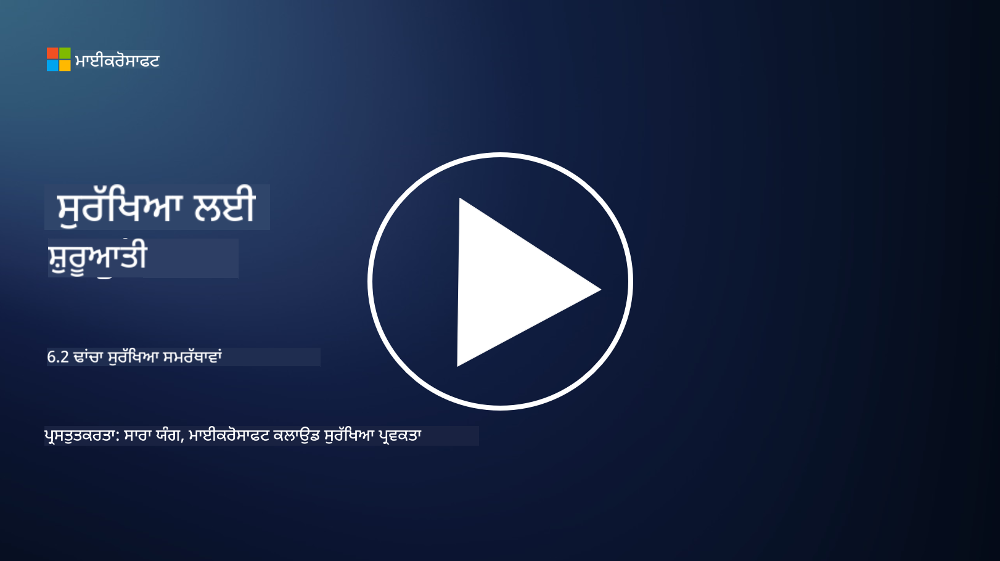

<!--
CO_OP_TRANSLATOR_METADATA:
{
  "original_hash": "7d79ba0e7668b3bdae1fba7aa047f6c0",
  "translation_date": "2025-09-04T00:11:17+00:00",
  "source_file": "6.2 Infrastructure security capabilities.md",
  "language_code": "pa"
}
-->
# ਇੰਫ੍ਰਾਸਟਰਕਚਰ ਸੁਰੱਖਿਆ ਸਮਰੱਥਾਵਾਂ

ਇਸ ਭਾਗ ਵਿੱਚ, ਅਸੀਂ ਇੰਫ੍ਰਾਸਟਰਕਚਰ ਸੁਰੱਖਿਆ ਵਿੱਚ ਵਰਤੇ ਜਾਣ ਵਾਲੇ ਮੁੱਖ ਟੂਲਾਂ ਅਤੇ ਸਮਰੱਥਾਵਾਂ ਬਾਰੇ ਹੋਰ ਵਿਸਥਾਰ ਨਾਲ ਗੱਲ ਕਰਾਂਗੇ।

**ਪ੍ਰਸਤਾਵਨਾ**

ਇਸ ਪਾਠ ਵਿੱਚ, ਅਸੀਂ ਕਵਰ ਕਰਾਂਗੇ:

- Vulnerability Management ਕੀ ਹੈ?

- CSPM ਕੀ ਹੈ?

- CNAPP ਕੀ ਹੈ?

## Vulnerability Management ਕੀ ਹੈ?

Vulnerability Management ਇੱਕ ਪ੍ਰਣਾਲੀਬੱਧ ਪ੍ਰਕਿਰਿਆ ਹੈ ਜੋ ਕੰਪਿਊਟਰ ਸਿਸਟਮਾਂ, ਸੌਫਟਵੇਅਰ, ਨੈੱਟਵਰਕ ਅਤੇ ਇੰਫ੍ਰਾਸਟਰਕਚਰ ਵਿੱਚ ਕਮਜ਼ੋਰੀਆਂ ਦੀ ਪਛਾਣ, ਮੁਲਾਂਕਣ, ਤਰਜੀਹ, ਨਿਪਟਾਰਾ ਅਤੇ ਨਿਗਰਾਨੀ ਕਰਨ ਲਈ ਵਰਤੀ ਜਾਂਦੀ ਹੈ। ਇਸਦਾ ਮੁੱਖ ਉਦੇਸ਼ ਸੁਰੱਖਿਆ ਖਤਰਿਆਂ ਤੋਂ ਸੰਗਠਨ ਦੀ ਸੰਭਾਵਨਾ ਨੂੰ ਘਟਾਉਣਾ ਹੈ, ਮਲਿਸ਼ਸ ਐਕਟਰਾਂ ਦੁਆਰਾ ਕਮਜ਼ੋਰੀਆਂ ਦਾ ਫਾਇਦਾ ਚੁੱਕਣ ਤੋਂ ਪਹਿਲਾਂ ਹੀ ਉਨ੍ਹਾਂ ਨੂੰ ਹੱਲ ਕਰਨਾ। ਇਹ ਰਹੀ ਮੁੱਖ ਕਦਮਾਂ ਦੀ ਇੱਕ ਝਲਕ:

ਪਛਾਣ: ਸੰਗਠਨ ਦੇ ਸਰੋਤਾਂ ਵਿੱਚ ਕਮਜ਼ੋਰੀਆਂ ਨੂੰ ਸਕੈਨ ਅਤੇ ਖੋਜਣਾ, ਜਿਸ ਵਿੱਚ ਸਰਵਰ, ਐਪਲੀਕੇਸ਼ਨ, ਨੈੱਟਵਰਕ ਡਿਵਾਈਸ ਅਤੇ ਐਂਡਪੋਇੰਟ ਸ਼ਾਮਲ ਹੋ ਸਕਦੇ ਹਨ।

ਮੁਲਾਂਕਣ: ਹਰ ਕਮਜ਼ੋਰੀ ਦੀ ਗੰਭੀਰਤਾ ਅਤੇ ਸੰਭਾਵਿਤ ਪ੍ਰਭਾਵ ਦਾ ਮੁਲਾਂਕਣ ਕਰਨਾ, ਜਿਵੇਂ ਕਿ Common Vulnerability Scoring System (CVSS) ਸਕੋਰ ਅਤੇ ਕਾਰੋਬਾਰੀ ਸੰਦਰਭ ਦੇ ਆਧਾਰ 'ਤੇ।

ਤਰਜੀਹ: ਕਮਜ਼ੋਰੀਆਂ ਨੂੰ ਉਨ੍ਹਾਂ ਦੇ ਖਤਰੇ ਦੇ ਪੱਧਰ ਅਤੇ ਸੰਗਠਨ ਦੇ ਕਾਰਜਾਂ ਅਤੇ ਡਾਟਾ 'ਤੇ ਸੰਭਾਵਿਤ ਪ੍ਰਭਾਵ ਦੇ ਆਧਾਰ 'ਤੇ ਰੈਂਕ ਕਰਨਾ।

ਨਿਪਟਾਰਾ: ਕਮਜ਼ੋਰੀਆਂ ਨੂੰ ਹੱਲ ਕਰਨ ਜਾਂ ਘਟਾਉਣ ਲਈ ਰਣਨੀਤੀਆਂ ਵਿਕਸਿਤ ਅਤੇ ਲਾਗੂ ਕਰਨਾ, ਜਿਸ ਵਿੱਚ ਪੈਚ ਲਗਾਉਣਾ, ਸੁਰੱਖਿਆ ਸੈਟਿੰਗਾਂ ਨੂੰ ਸੰਰਚਿਤ ਕਰਨਾ ਜਾਂ ਪੂਰਕ ਨਿਯੰਤਰਣ ਤੈਨਾਤ ਕਰਨਾ ਸ਼ਾਮਲ ਹੈ।

ਪ੍ਰਮਾਣਿਕਤਾ: ਇਹ ਯਕੀਨੀ ਬਣਾਉਣਾ ਕਿ ਨਿਪਟਾਰਾ ਉਪਾਅ ਕਮਜ਼ੋਰੀਆਂ ਨੂੰ ਹੱਲ ਕਰਨ ਵਿੱਚ ਪ੍ਰਭਾਵਸ਼ਾਲੀ ਸਨ।

ਲਗਾਤਾਰ ਨਿਗਰਾਨੀ: ਕਮਜ਼ੋਰੀਆਂ ਅਤੇ ਸੰਭਾਵਿਤ ਖਤਰਿਆਂ ਦੀ ਲਗਾਤਾਰ ਟ੍ਰੈਕਿੰਗ, ਨਿਯਮਿਤ ਕਮਜ਼ੋਰੀ ਸਕੈਨ ਅਤੇ ਮੁਲਾਂਕਣ ਦੇ ਨਾਲ।

Vulnerability Management ਸਾਇਬਰਸੁਰੱਖਿਆ ਦਾ ਇੱਕ ਮਹੱਤਵਪੂਰਨ ਹਿੱਸਾ ਹੈ, ਜੋ ਸੰਗਠਨਾਂ ਨੂੰ ਮਜ਼ਬੂਤ ਸੁਰੱਖਿਆ ਸਥਿਤੀ ਬਣਾਈ ਰੱਖਣ ਅਤੇ ਸੁਰੱਖਿਆ ਉਲੰਘਣ ਦੀ ਸੰਭਾਵਨਾ ਨੂੰ ਘਟਾਉਣ ਵਿੱਚ ਮਦਦ ਕਰਦਾ ਹੈ। Vulnerability Management ਟੂਲਾਂ ਦੇ ਉਦਾਹਰਨ ਹਨ Defender for Cloud, Nessus ਅਤੇ Qualys।

## CSPM ਕੀ ਹੈ?

Cloud Security Posture Management (CSPM) ਇੱਕ ਟੂਲਾਂ, ਪ੍ਰਕਿਰਿਆਵਾਂ ਅਤੇ ਅਭਿਆਸਾਂ ਦਾ ਸੈੱਟ ਹੈ ਜੋ ਕਲਾਉਡ ਵਾਤਾਵਰਣਾਂ ਵਿੱਚ ਸੁਰੱਖਿਆ ਸੰਰਚਨਾਵਾਂ ਅਤੇ ਸਰਬੋਤਮ ਅਭਿਆਸਾਂ ਦਾ ਮੁਲਾਂਕਣ, ਨਿਗਰਾਨੀ ਅਤੇ ਲਾਗੂ ਕਰਨ ਲਈ ਤਿਆਰ ਕੀਤਾ ਗਿਆ ਹੈ। CSPM ਹੱਲ ਸੰਗਠਨਾਂ ਨੂੰ ਉਨ੍ਹਾਂ ਦੀ ਕਲਾਉਡ ਇੰਫ੍ਰਾਸਟਰਕਚਰ ਵਿੱਚ ਗਲਤ ਸੰਰਚਨਾਵਾਂ, ਸੁਰੱਖਿਆ ਖਾਮੀਆਂ ਅਤੇ ਅਨੁਕੂਲਤਾ ਉਲੰਘਣਾਂ ਦੀ ਪਛਾਣ ਅਤੇ ਨਿਪਟਾਰਾ ਕਰਨ ਵਿੱਚ ਮਦਦ ਕਰਦੇ ਹਨ, ਜਿਵੇਂ ਕਿ Amazon Web Services (AWS), Microsoft Azure, Google Cloud Platform (GCP) ਅਤੇ ਹੋਰ ਕਲਾਉਡ ਪ੍ਰਦਾਤਾ।

CSPM ਦੇ ਮੁੱਖ ਪੱਖ ਸ਼ਾਮਲ ਹਨ:

- ਸੰਰਚਨਾ ਮੁਲਾਂਕਣ: ਕਲਾਉਡ ਸਰੋਤਾਂ ਅਤੇ ਸੇਵਾਵਾਂ ਨੂੰ ਸਕੈਨ ਕਰਨਾ ਤਾਂ ਜੋ ਗਲਤ ਸੰਰਚਨਾਵਾਂ, ਅਸੁਰੱਖਿਅਤ ਸੈਟਿੰਗਾਂ ਅਤੇ ਸੁਰੱਖਿਆ ਦੇ ਸਰਬੋਤਮ ਅਭਿਆਸਾਂ ਤੋਂ ਹਟਣ ਦੀ ਪਛਾਣ ਕੀਤੀ ਜਾ ਸਕੇ।

- ਸੁਰੱਖਿਆ ਨੀਤੀ ਲਾਗੂ ਕਰਨਾ: ਕਲਾਉਡ ਵਾਤਾਵਰਣਾਂ ਵਿੱਚ ਸੁਰੱਖਿਆ ਨੀਤੀਆਂ ਅਤੇ ਅਨੁਕੂਲਤਾ ਮਿਆਰਾਂ ਨੂੰ ਲਾਗੂ ਕਰਨਾ, ਗਲਤ ਸੰਰਚਨਾਵਾਂ ਨੂੰ ਸਵੈਚਾਲਿਤ ਤੌਰ 'ਤੇ ਠੀਕ ਕਰਨਾ ਜਾਂ ਚੇਤਾਵਨੀਆਂ ਪੈਦਾ ਕਰਨਾ।

- ਲਗਾਤਾਰ ਨਿਗਰਾਨੀ: ਕਲਾਉਡ ਸਰੋਤਾਂ ਅਤੇ ਸੰਸਾਧਨਾਂ ਦੀ ਸੁਰੱਖਿਆ ਸਥਿਤੀ ਵਿੱਚ ਲਗਾਤਾਰ ਦ੍ਰਿਸ਼ਟੀ ਪ੍ਰਦਾਨ ਕਰਨਾ, ਸੁਰੱਖਿਆ ਘਟਨਾਵਾਂ ਲਈ ਰੀਅਲ-ਟਾਈਮ ਚੇਤਾਵਨੀਆਂ ਦੇ ਨਾਲ।

- ਅਨੁਕੂਲਤਾ ਰਿਪੋਰਟਿੰਗ: ਨਿਯਮਕ ਮੰਗਾਂ ਅਤੇ ਉਦਯੋਗ ਮਿਆਰਾਂ ਨਾਲ ਅਨੁਕੂਲਤਾ ਦਿਖਾਉਣ ਲਈ ਰਿਪੋਰਟਾਂ ਅਤੇ ਡੈਸ਼ਬੋਰਡ ਤਿਆਰ ਕਰਨਾ।

CSPM ਸੰਗਠਨਾਂ ਨੂੰ ਇਹ ਯਕੀਨੀ ਬਣਾਉਣ ਵਿੱਚ ਮਦਦ ਕਰਦਾ ਹੈ ਕਿ ਉਨ੍ਹਾਂ ਦੀ ਕਲਾਉਡ ਇੰਫ੍ਰਾਸਟਰਕਚਰ ਸੁਰੱਖਿਅਤ, ਅਨੁਕੂਲ ਅਤੇ ਸਰਬੋਤਮ ਅਭਿਆਸਾਂ ਦੇ ਅਨੁਕੂਲ ਹੈ, ਕਲਾਉਡ-ਸੰਬੰਧੀ ਸੁਰੱਖਿਆ ਘਟਨਾਵਾਂ ਦੇ ਖਤਰੇ ਨੂੰ ਘਟਾਉਂਦਾ ਹੈ। CSPM ਟੂਲਾਂ ਦੇ ਉਦਾਹਰਨ ਹਨ Defender for Cloud ਅਤੇ Snyk।

## CNAPP ਕੀ ਹੈ?

CNAPP ਦਾ ਮਤਲਬ ਹੈ Cloud-Native Application Protection Platform। ਇਹ ਇੱਕ ਆਲ-ਇਨ-ਵਨ ਕਲਾਉਡ-ਨੇਟਿਵ ਸੌਫਟਵੇਅਰ ਪਲੇਟਫਾਰਮ ਹੈ ਜੋ ਕਲਾਉਡ ਸੁਰੱਖਿਆ ਖਤਰਿਆਂ ਅਤੇ ਕਮਜ਼ੋਰੀਆਂ ਦੀ ਨਿਗਰਾਨੀ, ਪਛਾਣ ਅਤੇ ਕਾਰਵਾਈ ਨੂੰ ਸਧਾਰਨ ਬਣਾਉਂਦਾ ਹੈ। ਇਹ ਕਈ ਟੂਲਾਂ ਅਤੇ ਸਮਰੱਥਾਵਾਂ ਨੂੰ ਇੱਕ ਸਿੰਗਲ ਸੌਫਟਵੇਅਰ ਹੱਲ ਵਿੱਚ ਜੋੜਦਾ ਹੈ ਤਾਂ ਜੋ ਜਟਿਲਤਾ ਨੂੰ ਘਟਾਇਆ ਜਾ ਸਕੇ ਅਤੇ DevOps ਅਤੇ DevSecOps ਟੀਮਾਂ ਦੇ ਕਾਰਜਾਂ ਨੂੰ ਆਸਾਨ ਬਣਾਇਆ ਜਾ ਸਕੇ। CNAPP ਪੂਰੇ CI/CD ਐਪਲੀਕੇਸ਼ਨ ਲਾਈਫਸਾਈਕਲ ਵਿੱਚ ਵਿਕਾਸ ਤੋਂ ਲੈ ਕੇ ਉਤਪਾਦਨ ਤੱਕ ਅੰਤ-ਤੱਕ ਕਲਾਉਡ ਅਤੇ ਐਪਲੀਕੇਸ਼ਨ ਸੁਰੱਖਿਆ ਪ੍ਰਦਾਨ ਕਰਦਾ ਹੈ। ਇਹ ਉਦਯੋਗ ਦੀ ਆਧੁਨਿਕ ਕਲਾਉਡ ਸੁਰੱਖਿਆ ਨਿਗਰਾਨੀ, ਸਥਿਤੀ ਪ੍ਰਬੰਧਨ, ਉਲੰਘਣ ਰੋਕਥਾਮ ਅਤੇ ਨਿਯੰਤਰਣ ਟੂਲਾਂ ਦੀ ਲੋੜ ਨੂੰ ਪੂਰਾ ਕਰਦਾ ਹੈ। CNAPP ਹੱਲ ਸੁਰੱਖਿਆ ਟੀਮਾਂ ਨੂੰ ਕਲਾਉਡ ਵਾਤਾਵਰਣ ਵਿੱਚ ਖਤਰਿਆਂ ਨੂੰ ਮਾਪਣ ਅਤੇ ਉਨ੍ਹਾਂ ਦਾ ਜਵਾਬ ਦੇਣ ਦੀ ਸਮਰੱਥਾ ਪ੍ਰਦਾਨ ਕਰਦੇ ਹਨ। CNAPP ਦੀਆਂ ਕੁਝ ਵਿਸ਼ੇਸ਼ਤਾਵਾਂ ਵਿੱਚ ਵਧੀਕ ਦ੍ਰਿਸ਼ਟੀ, ਖਤਰੇ ਦੀ ਮਾਪ, ਸੁਰੱਖਿਅਤ ਸੌਫਟਵੇਅਰ ਵਿਕਾਸ ਅਤੇ ਇੱਕ ਜੋੜਿਆ ਕਲਾਉਡ ਸੁਰੱਖਿਆ ਹੱਲ ਸ਼ਾਮਲ ਹਨ। CNAPP ਕਈ ਕਲਾਉਡ-ਨੇਟਿਵ ਸੁਰੱਖਿਆ ਟੂਲਾਂ ਅਤੇ ਡਾਟਾ ਸਰੋਤਾਂ ਨੂੰ ਇੱਕ ਸਿੰਗਲ ਯੂਜ਼ਰ ਇੰਟਰਫੇਸ ਵਿੱਚ ਇਕੱਠਾ ਕਰਦਾ ਹੈ, ਜਿਸ ਨਾਲ ਸੰਗਠਨਾਂ ਲਈ ਉਨ੍ਹਾਂ ਦੇ ਪੂਰੇ ਕਲਾਉਡ ਐਪਲੀਕੇਸ਼ਨ ਫੁਟਪ੍ਰਿੰਟ ਦੀ ਸੁਰੱਖਿਆ ਕਰਨਾ ਆਸਾਨ ਹੋ ਜਾਂਦਾ ਹੈ। CNAPP ਵਿੱਚ ਕਲਾਉਡ ਸੁਰੱਖਿਆ ਪੋਸਚਰ ਮੈਨੇਜਮੈਂਟ, ਇੰਫ੍ਰਾਸਟਰਕਚਰ ਐਜ਼ ਕੋਡ ਸਕੈਨਿੰਗ, ਕਲਾਉਡ ਇੰਫ੍ਰਾਸਟਰਕਚਰ ਇੰਟਾਈਟਲਮੈਂਟ ਮੈਨੇਜਮੈਂਟ ਅਤੇ ਰਨਟਾਈਮ ਕਲਾਉਡ ਵਰਕਲੋਡ ਪ੍ਰੋਟੈਕਸ਼ਨ ਪਲੇਟਫਾਰਮ ਸ਼ਾਮਲ ਹਨ।

## ਹੋਰ ਪੜ੍ਹਾਈ
- [What is CSPM? | Microsoft Security](https://www.microsoft.com/security/business/security-101/what-is-cspm?WT.mc_id=academic-96948-sayoung)
- [What is Cloud Security Posture Management (CSPM)? | HackerOne](https://www.hackerone.com/knowledge-center/what-cloud-security-posture-management)
- [Function of cloud security posture management - Cloud Adoption Framework | Microsoft Learn](https://learn.microsoft.com/azure/cloud-adoption-framework/organize/cloud-security-posture-management?WT.mc_id=academic-96948-sayoung)
- [What Is a CNAPP? | Microsoft Security](https://www.microsoft.com/security/business/security-101/what-is-cnapp?WT.mc_id=academic-96948-sayoung)
- [Why Everyone Is Talking About CNAPP (forbes.com)](https://www.forbes.com/sites/forbestechcouncil/2021/12/10/why-everyone-is-talking-about-cnapp/?sh=567275ca1549)
- [Improving Your Multi-Cloud Security with a Cloud-Native Application Protection Platform (CNAPP)](https://www.youtube.com/watch?v=5w42kQ_QjZg&t=212s)

---

**ਅਸਵੀਕਾਰਨਾ**:  
ਇਹ ਦਸਤਾਵੇਜ਼ AI ਅਨੁਵਾਦ ਸੇਵਾ [Co-op Translator](https://github.com/Azure/co-op-translator) ਦੀ ਵਰਤੋਂ ਕਰਕੇ ਅਨੁਵਾਦ ਕੀਤਾ ਗਿਆ ਹੈ। ਹਾਲਾਂਕਿ ਅਸੀਂ ਸਹੀਅਤਾ ਲਈ ਯਤਨਸ਼ੀਲ ਹਾਂ, ਕਿਰਪਾ ਕਰਕੇ ਧਿਆਨ ਦਿਓ ਕਿ ਸਵੈਚਾਲਿਤ ਅਨੁਵਾਦਾਂ ਵਿੱਚ ਗਲਤੀਆਂ ਜਾਂ ਅਸੁਚਨਾਵਾਂ ਹੋ ਸਕਦੀਆਂ ਹਨ। ਮੂਲ ਦਸਤਾਵੇਜ਼ ਨੂੰ ਇਸਦੀ ਮੂਲ ਭਾਸ਼ਾ ਵਿੱਚ ਅਧਿਕਾਰਤ ਸਰੋਤ ਮੰਨਿਆ ਜਾਣਾ ਚਾਹੀਦਾ ਹੈ। ਮਹੱਤਵਪੂਰਨ ਜਾਣਕਾਰੀ ਲਈ, ਪੇਸ਼ੇਵਰ ਮਨੁੱਖੀ ਅਨੁਵਾਦ ਦੀ ਸਿਫਾਰਸ਼ ਕੀਤੀ ਜਾਂਦੀ ਹੈ। ਇਸ ਅਨੁਵਾਦ ਦੀ ਵਰਤੋਂ ਤੋਂ ਪੈਦਾ ਹੋਣ ਵਾਲੇ ਕਿਸੇ ਵੀ ਗਲਤਫਹਿਮੀ ਜਾਂ ਗਲਤ ਵਿਆਖਿਆ ਲਈ ਅਸੀਂ ਜ਼ਿੰਮੇਵਾਰ ਨਹੀਂ ਹਾਂ।