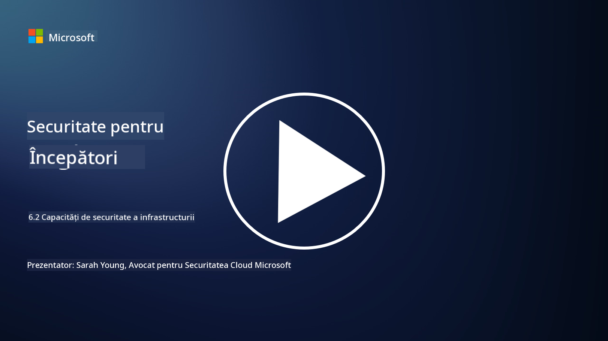

<!--
CO_OP_TRANSLATOR_METADATA:
{
  "original_hash": "7d79ba0e7668b3bdae1fba7aa047f6c0",
  "translation_date": "2025-09-04T00:16:05+00:00",
  "source_file": "6.2 Infrastructure security capabilities.md",
  "language_code": "ro"
}
-->
# Capacități de securitate a infrastructurii

În această secțiune, vom detalia mai multe despre instrumentele și capacitățile de bază utilizate în securitatea infrastructurii.

**Introducere**

În această lecție, vom aborda:

- Ce este managementul vulnerabilităților?

- Ce este CSPM?

- Ce este CNAPP?

## Ce este managementul vulnerabilităților?

Managementul vulnerabilităților este un proces sistematic de identificare, evaluare, prioritizare, atenuare și monitorizare a vulnerabilităților din sistemele informatice, software, rețele și infrastructură. Scopul principal al managementului vulnerabilităților este de a reduce expunerea unei organizații la riscurile de securitate, abordând proactiv vulnerabilitățile cunoscute înainte ca acestea să fie exploatate de actori rău intenționați. Iată o prezentare generală a pașilor cheie implicați:

Identificare: Scanarea și descoperirea vulnerabilităților în activele organizației, care pot include servere, aplicații, dispozitive de rețea și puncte finale.

Evaluare: Analizarea severității și a impactului potențial al fiecărei vulnerabilități pe baza unor factori precum scorul Common Vulnerability Scoring System (CVSS) și contextul de afaceri.

Prioritizare: Clasificarea vulnerabilităților în funcție de nivelul de risc și impactul potențial asupra operațiunilor și datelor organizației.

Atenuare: Dezvoltarea și implementarea strategiilor pentru remedierea sau atenuarea vulnerabilităților, care pot include aplicarea de patch-uri, configurarea setărilor de securitate sau implementarea controalelor compensatorii.

Verificare: Confirmarea faptului că măsurile de atenuare au fost eficiente în abordarea vulnerabilităților.

Monitorizare continuă: Urmărirea continuă a vulnerabilităților și a amenințărilor potențiale, cu scanări și evaluări regulate ale vulnerabilităților.

Managementul vulnerabilităților este o componentă critică a securității cibernetice, ajutând organizațiile să mențină o postură de securitate solidă și să reducă probabilitatea breșelor de securitate. Exemple de instrumente pentru managementul vulnerabilităților sunt Defender for Cloud, Nessus și Qualys.

## Ce este CSPM?

Cloud Security Posture Management (CSPM) reprezintă un set de instrumente, procese și practici concepute pentru a evalua, monitoriza și aplica configurațiile de securitate și bunele practici în mediile cloud. Soluțiile CSPM ajută organizațiile să identifice și să remedieze configurările greșite, lacunele de securitate și încălcările conformității în infrastructura lor cloud, cum ar fi Amazon Web Services (AWS), Microsoft Azure, Google Cloud Platform (GCP) și alți furnizori de cloud.

Aspectele cheie ale CSPM includ:

- Evaluarea configurației: Scanarea resurselor și serviciilor cloud pentru a identifica configurările greșite, setările nesigure și abaterile de la bunele practici de securitate.

- Aplicarea politicilor de securitate: Aplicarea politicilor de securitate și a standardelor de conformitate în mediile cloud prin remedierea automată a configurărilor greșite sau generarea de alerte.

- Monitorizare continuă: Oferirea unei vizibilități continue asupra posturii de securitate a activelor și resurselor cloud, cu alerte în timp real pentru incidentele de securitate.

- Raportare de conformitate: Generarea de rapoarte și tablouri de bord pentru a demonstra conformitatea cu cerințele de reglementare și standardele din industrie.

CSPM ajută organizațiile să se asigure că infrastructura lor cloud este sigură, conformă și aliniată cu bunele practici, reducând riscul incidentelor de securitate legate de cloud. Exemple de instrumente CSPM includ Defender for Cloud și Snyk.

## Ce este CNAPP?

CNAPP reprezintă Cloud-Native Application Protection Platform. Este o platformă software integrată, concepută pentru a simplifica monitorizarea, detectarea și acțiunea asupra amenințărilor și vulnerabilităților de securitate în cloud. Aceasta combină mai multe instrumente și capacități într-o singură soluție software pentru a minimiza complexitatea și a facilita operațiunile echipelor DevOps și DevSecOps. CNAPP oferă securitate completă pentru cloud și aplicații pe tot parcursul ciclului de viață CI/CD al aplicațiilor, de la dezvoltare până la producție. Abordează nevoia industriei de instrumente moderne de monitorizare a securității cloud, management al posturii, prevenire a breșelor și control. Soluțiile CNAPP oferă echipelor de securitate capacitatea de a cuantifica și răspunde riscurilor din mediul cloud. Unele dintre caracteristicile CNAPP includ vizibilitate îmbunătățită, cuantificarea riscurilor, dezvoltare software sigură și o soluție combinată de securitate cloud. CNAPP integrează multiple soluții de securitate cloud care au fost tradițional izolate într-o singură interfață de utilizator, facilitând protejarea întregii amprente a aplicațiilor cloud ale unei organizații. CNAPP-urile consolidează mai multe instrumente și surse de date de securitate cloud-native, inclusiv scanarea containerelor, managementul posturii de securitate cloud, scanarea infrastructurii ca cod, managementul drepturilor infrastructurii cloud și platformele de protecție a sarcinilor de lucru în cloud în timpul rulării.

## Lecturi suplimentare
- [What is CSPM? | Microsoft Security](https://www.microsoft.com/security/business/security-101/what-is-cspm?WT.mc_id=academic-96948-sayoung)
- [What is Cloud Security Posture Management (CSPM)? | HackerOne](https://www.hackerone.com/knowledge-center/what-cloud-security-posture-management)
- [Function of cloud security posture management - Cloud Adoption Framework | Microsoft Learn](https://learn.microsoft.com/azure/cloud-adoption-framework/organize/cloud-security-posture-management?WT.mc_id=academic-96948-sayoung)
- [What Is a CNAPP? | Microsoft Security](https://www.microsoft.com/security/business/security-101/what-is-cnapp?WT.mc_id=academic-96948-sayoung)
- [Why Everyone Is Talking About CNAPP (forbes.com)](https://www.forbes.com/sites/forbestechcouncil/2021/12/10/why-everyone-is-talking-about-cnapp/?sh=567275ca1549)
- [Improving Your Multi-Cloud Security with a Cloud-Native Application Protection Platform (CNAPP)](https://www.youtube.com/watch?v=5w42kQ_QjZg&t=212s)

---

**Declinarea responsabilității**:  
Acest document a fost tradus folosind serviciul de traducere AI [Co-op Translator](https://github.com/Azure/co-op-translator). Deși depunem eforturi pentru a asigura acuratețea, vă rugăm să aveți în vedere că traducerile automate pot conține erori sau inexactități. Documentul original în limba sa nativă ar trebui considerat sursa autoritară. Pentru informații critice, se recomandă traducerea profesională realizată de un specialist uman. Nu ne asumăm răspunderea pentru eventualele neînțelegeri sau interpretări greșite care pot apărea din utilizarea acestei traduceri.