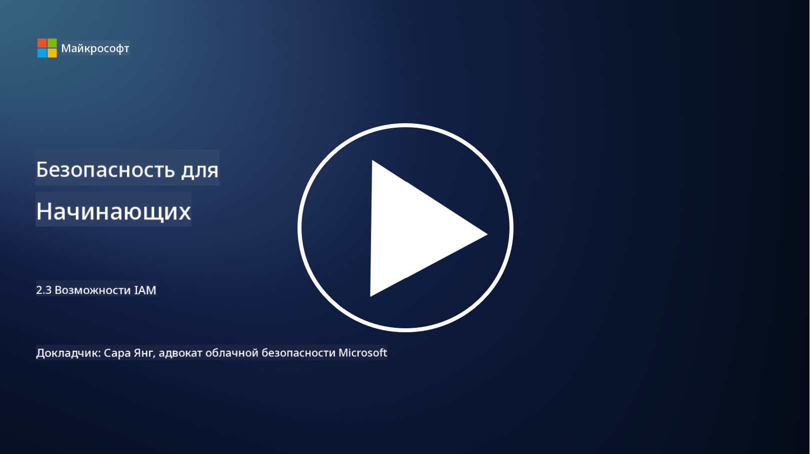

<!--
CO_OP_TRANSLATOR_METADATA:
{
  "original_hash": "bf0b8a54f2c69951744df5a94bc923f7",
  "translation_date": "2025-09-04T01:53:09+00:00",
  "source_file": "2.3 IAM capabilities.md",
  "language_code": "ru"
}
-->
# Возможности IAM

В этом разделе мы рассмотрим основные инструменты и возможности, которые используются для обеспечения безопасности идентификации.

## Введение

В этом уроке мы обсудим:

 - Что такое служба каталогов?
      
     
    
 - Какие возможности можно использовать для защиты идентификаций?
>
>        Многофакторная аутентификация (MFA)
> 
>        Единый вход (SSO)
> 
>        Ролевое управление доступом (RBAC)
> 
>        Адаптивная аутентификация
> 
>        Биометрическая аутентификация
> 
>        Управление привилегированным доступом (PAM)
> 
>        Управление и администрирование идентификаций (IGA)
> 
>        Поведенческая аналитика

## Что такое служба каталогов?

Служба каталогов — это специализированная база данных, которая хранит и управляет информацией о сетевых ресурсах, включая пользователей, группы, устройства, приложения и другие объекты. Она служит централизованным хранилищем данных, связанных с идентификацией и доступом, что позволяет организациям эффективно управлять аутентификацией, авторизацией и другими задачами безопасности.

Службы каталогов играют ключевую роль в современных IT-средах, обеспечивая основу для решений по управлению идентификацией и доступом (IAM). Они способствуют безопасному доступу к ресурсам, обеспечивают соблюдение политик доступа и упрощают административные задачи. Одной из самых известных служб каталогов является Microsoft Active Directory, но существуют и другие решения, такие как каталоги LDAP (Lightweight Directory Access Protocol), которые выполняют аналогичные функции.

Основные функции и особенности службы каталогов в контексте кибербезопасности включают:

 - **Аутентификация пользователей**: Службы каталогов проверяют учетные данные пользователей (например, имена пользователей и пароли), чтобы убедиться, что доступ к сети и ее ресурсам получают только авторизованные пользователи.
 - **Авторизация пользователей**: Они определяют уровень доступа каждого пользователя на основе его роли, членства в группах и других атрибутов. Это гарантирует, что пользователи получают доступ только к тем ресурсам, к которым они имеют право.
 - **Управление группами**: Службы каталогов позволяют администраторам организовывать пользователей в логические группы, упрощая управление доступом. Разрешения могут назначаться группам, а не отдельным пользователям.
 - **Политики паролей**: Они обеспечивают соблюдение правил сложности и срока действия паролей, повышая безопасность учетных записей пользователей.
 - **Единый вход (SSO)**: Некоторые службы каталогов поддерживают SSO, позволяя пользователям получать доступ к нескольким приложениям и сервисам с одним набором учетных данных.
 - **Централизованное управление пользователями**: Службы каталогов централизуют информацию о пользователях, упрощая управление учетными записями, профилями и атрибутами из одного места.
 - **Аудит и ведение журналов**: Они могут записывать действия по аутентификации и доступу пользователей, что помогает в проведении аудитов безопасности и соблюдении нормативных требований.

## Какие возможности можно использовать для защиты идентификаций?

**Многофакторная аутентификация (MFA)**

MFA требует от пользователей предоставления нескольких форм проверки перед предоставлением доступа. Обычно это включает то, что пользователь знает (пароль), то, что у него есть (смартфон или токен безопасности), и то, кем он является (биометрические данные, такие как отпечаток пальца или распознавание лица).

**Единый вход (SSO)**

SSO позволяет пользователям получать доступ к нескольким приложениям и системам с одним набором учетных данных. Это улучшает пользовательский опыт и снижает риски, связанные с управлением несколькими паролями.

**Ролевое управление доступом (RBAC)**

RBAC назначает разрешения на основе заранее определенных ролей. Пользователи получают доступ в зависимости от их ролей в организации.

**Адаптивная аутентификация**

Адаптивная аутентификация оценивает факторы риска, такие как местоположение, устройство, время доступа и поведение пользователя, чтобы динамически регулировать уровень требуемой аутентификации. Если запрос кажется подозрительным, могут быть запрошены дополнительные шаги аутентификации.

**Биометрическая аутентификация**

Биометрическая аутентификация использует уникальные биологические характеристики, такие как отпечатки пальцев, черты лица, голосовые данные и даже поведенческие особенности, такие как скорость набора текста, для проверки личности.

**Управление привилегированным доступом (PAM)**

PAM сосредоточено на защите доступа к критически важным системам и данным, обеспечивая строгий контроль над привилегированными учетными записями. Это включает такие функции, как доступ "по требованию" и мониторинг сеансов.

**Управление и администрирование идентификаций (IGA)**

IGA-решения управляют идентификациями пользователей и их доступом к ресурсам на протяжении всего жизненного цикла. Это включает в себя процесс адаптации, предоставление доступа, ролевое управление доступом и удаление доступа.

**Поведенческая аналитика**

Поведенческая аналитика отслеживает поведение пользователей и устанавливает базовые шаблоны. Отклонения от нормы могут вызывать оповещения для дальнейшего расследования.

# Дополнительные материалы
- [Основы Azure Active Directory - Microsoft Entra | Microsoft Learn](https://learn.microsoft.com/azure/active-directory/fundamentals/?WT.mc_id=academic-96948-sayoung)
- [Что такое Azure Active Directory? - Microsoft Entra | Microsoft Learn](https://learn.microsoft.com/azure/active-directory/fundamentals/whatis?WT.mc_id=academic-96948-sayoung)
- [Управление инфраструктурой идентификаций в мультиоблачной среде с Microsoft Entra - YouTube](https://www.youtube.com/watch?v=9qQiq3wTS2Y&list=PLXtHYVsvn_b_gtX1-NB62wNervQx1Fhp4&index=18)

---

**Отказ от ответственности**:  
Этот документ был переведен с помощью сервиса автоматического перевода [Co-op Translator](https://github.com/Azure/co-op-translator). Несмотря на наши усилия обеспечить точность, автоматические переводы могут содержать ошибки или неточности. Оригинальный документ на его исходном языке следует считать авторитетным источником. Для получения критически важной информации рекомендуется профессиональный перевод человеком. Мы не несем ответственности за любые недоразумения или неправильные интерпретации, возникшие в результате использования данного перевода.