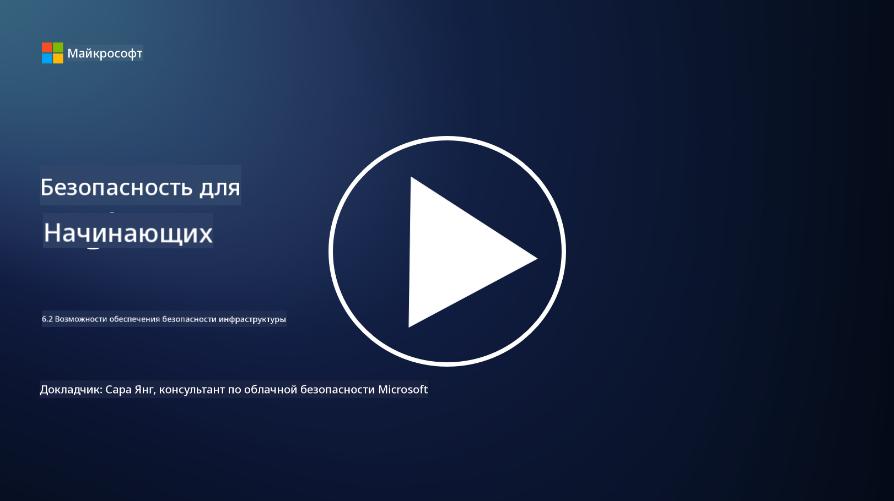

<!--
CO_OP_TRANSLATOR_METADATA:
{
  "original_hash": "7d79ba0e7668b3bdae1fba7aa047f6c0",
  "translation_date": "2025-09-04T00:10:04+00:00",
  "source_file": "6.2 Infrastructure security capabilities.md",
  "language_code": "ru"
}
-->
# Возможности обеспечения безопасности инфраструктуры

В этом разделе мы рассмотрим основные инструменты и возможности, используемые для обеспечения безопасности инфраструктуры.

**Введение**

В этом уроке мы рассмотрим:

- Что такое управление уязвимостями?

- Что такое CSPM?

- Что такое CNAPP?

## Что такое управление уязвимостями?

Управление уязвимостями — это систематический процесс выявления, оценки, приоритизации, устранения и мониторинга уязвимостей в компьютерных системах, программном обеспечении, сетях и инфраструктуре. Основная цель управления уязвимостями — снизить уровень риска для безопасности организации, проактивно устраняя известные уязвимости до того, как они могут быть использованы злоумышленниками. Вот основные этапы процесса:

Идентификация: Сканирование и обнаружение уязвимостей в активах организации, включая серверы, приложения, сетевые устройства и конечные точки.

Оценка: Анализ степени серьезности и потенциального воздействия каждой уязвимости с учетом таких факторов, как оценка по системе CVSS и бизнес-контекст.

Приоритизация: Ранжирование уязвимостей на основе уровня риска и потенциального влияния на операции и данные организации.

Устранение: Разработка и реализация стратегий для устранения или минимизации уязвимостей, включая установку патчей, настройку параметров безопасности или внедрение компенсирующих мер.

Проверка: Подтверждение эффективности мер по устранению уязвимостей.

Непрерывный мониторинг: Постоянное отслеживание уязвимостей и потенциальных угроз с регулярным проведением сканирования и оценки.

Управление уязвимостями является важным элементом кибербезопасности, помогая организациям поддерживать высокий уровень защиты и снижать вероятность нарушений безопасности. Примеры инструментов управления уязвимостями: Defender for Cloud, Nessus и Qualys.

## Что такое CSPM?

Cloud Security Posture Management (CSPM) — это набор инструментов, процессов и практик, предназначенных для оценки, мониторинга и обеспечения безопасности конфигураций и лучших практик в облачных средах. Решения CSPM помогают организациям выявлять и устранять ошибки конфигурации, пробелы в безопасности и нарушения требований соответствия в их облачной инфраструктуре, таких как Amazon Web Services (AWS), Microsoft Azure, Google Cloud Platform (GCP) и других облачных провайдеров.

Основные аспекты CSPM включают:

- Оценка конфигурации: Сканирование облачных ресурсов и сервисов для выявления ошибок конфигурации, небезопасных настроек и отклонений от лучших практик безопасности.

- Обеспечение соблюдения политики безопасности: Автоматическое устранение ошибок конфигурации или генерация предупреждений для обеспечения соблюдения политик безопасности и стандартов соответствия.

- Непрерывный мониторинг: Постоянное предоставление видимости состояния безопасности облачных активов и ресурсов с оповещениями в реальном времени о инцидентах безопасности.

- Отчетность по соответствию: Создание отчетов и панелей мониторинга для демонстрации соответствия нормативным требованиям и отраслевым стандартам.

CSPM помогает организациям обеспечивать безопасность, соответствие и соблюдение лучших практик в их облачной инфраструктуре, снижая риск инцидентов, связанных с облачной безопасностью. Примеры инструментов CSPM: Defender for Cloud и Snyk.

## Что такое CNAPP?

CNAPP расшифровывается как Cloud-Native Application Protection Platform. Это универсальная облачная платформа, которая упрощает мониторинг, обнаружение и реагирование на потенциальные угрозы и уязвимости в облачной безопасности. Она объединяет множество инструментов и возможностей в одном программном решении, чтобы минимизировать сложность и облегчить работу команд DevOps и DevSecOps. CNAPP обеспечивает комплексную защиту облака и приложений на протяжении всего жизненного цикла CI/CD, от разработки до эксплуатации. Она отвечает потребностям отрасли в современных инструментах мониторинга облачной безопасности, управления состоянием, предотвращения нарушений и контроля. Решения CNAPP предоставляют командам безопасности возможность количественно оценивать и реагировать на риски в облачной среде. Некоторые функции CNAPP включают улучшенную видимость, количественную оценку рисков, безопасную разработку программного обеспечения и объединенное решение для облачной безопасности. CNAPP интегрирует несколько облачных решений безопасности, которые ранее были изолированы, в единый пользовательский интерфейс, облегчая организациям защиту всей их облачной инфраструктуры приложений. CNAPP объединяет множество облачных инструментов безопасности и источников данных, включая сканирование контейнеров, управление состоянием облачной безопасности, сканирование инфраструктуры как кода, управление облачными правами и платформы защиты рабочих нагрузок в облаке.

## Дополнительные материалы
- [What is CSPM? | Microsoft Security](https://www.microsoft.com/security/business/security-101/what-is-cspm?WT.mc_id=academic-96948-sayoung)
- [What is Cloud Security Posture Management (CSPM)? | HackerOne](https://www.hackerone.com/knowledge-center/what-cloud-security-posture-management)
- [Function of cloud security posture management - Cloud Adoption Framework | Microsoft Learn](https://learn.microsoft.com/azure/cloud-adoption-framework/organize/cloud-security-posture-management?WT.mc_id=academic-96948-sayoung)
- [What Is a CNAPP? | Microsoft Security](https://www.microsoft.com/security/business/security-101/what-is-cnapp?WT.mc_id=academic-96948-sayoung)
- [Why Everyone Is Talking About CNAPP (forbes.com)](https://www.forbes.com/sites/forbestechcouncil/2021/12/10/why-everyone-is-talking-about-cnapp/?sh=567275ca1549)
- [Improving Your Multi-Cloud Security with a Cloud-Native Application Protection Platform (CNAPP)](https://www.youtube.com/watch?v=5w42kQ_QjZg&t=212s)

---

**Отказ от ответственности**:  
Этот документ был переведен с использованием сервиса автоматического перевода [Co-op Translator](https://github.com/Azure/co-op-translator). Несмотря на наши усилия обеспечить точность, имейте в виду, что автоматические переводы могут содержать ошибки или неточности. Оригинальный документ на его исходном языке следует считать авторитетным источником. Для получения критически важной информации рекомендуется профессиональный перевод человеком. Мы не несем ответственности за любые недоразумения или неправильные интерпретации, возникшие в результате использования данного перевода.