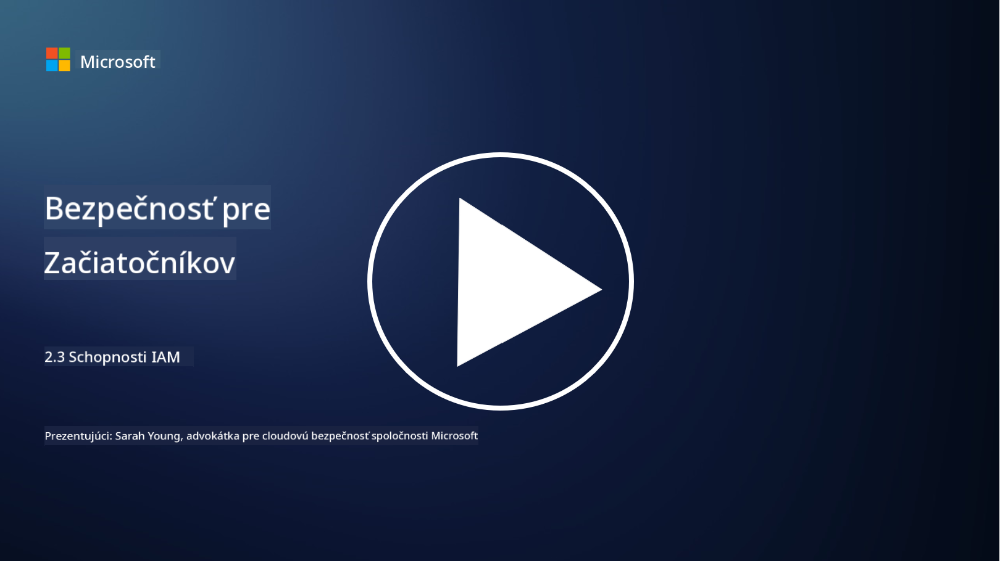

<!--
CO_OP_TRANSLATOR_METADATA:
{
  "original_hash": "bf0b8a54f2c69951744df5a94bc923f7",
  "translation_date": "2025-09-04T01:58:19+00:00",
  "source_file": "2.3 IAM capabilities.md",
  "language_code": "sk"
}
-->
# IAM Schopnosti

V tejto sekcii sa budeme venovať podrobnostiam o hlavných nástrojoch a schopnostiach, ktoré sa používajú na zabezpečenie identity.

## Úvod

V tejto lekcii sa dozviete:

 - Čo je to adresárová služba?
      
     
    
 - Aké schopnosti môžu byť použité na zabezpečenie identít?
>
>        Viacfaktorová autentifikácia (MFA)
> 
>        Jednotné prihlásenie (SSO)
> 
>        Riadenie prístupu na základe rolí (RBAC)
> 
>        Adaptívna autentifikácia
> 
>        Biometrická autentifikácia
> 
>        Riadenie privilegovaného prístupu (PAM)
> 
>        Správa a riadenie identít (IGA)
> 
>        Behaviorálna analytika

## Čo je to adresárová služba?

Adresárová služba je špecializovaná databáza, ktorá uchováva a spravuje informácie o sieťových zdrojoch, vrátane používateľov, skupín, zariadení, aplikácií a ďalších objektov. Slúži ako centralizované úložisko údajov súvisiacich s identitou a prístupom, čo organizáciám umožňuje efektívne spravovať a kontrolovať autentifikáciu používateľov, autorizáciu a ďalšie úlohy súvisiace s bezpečnosťou.

Adresárové služby zohrávajú kľúčovú úlohu v moderných IT prostrediach tým, že poskytujú základ pre riešenia správy identít a prístupu (IAM). Umožňujú bezpečný prístup k zdrojom, presadzujú prístupové politiky a zjednodušujú administratívne úlohy. Jednou z najznámejších adresárových služieb je Microsoft Active Directory, ale existujú aj iné riešenia, ako napríklad LDAP (Lightweight Directory Access Protocol) adresáre, ktoré slúžia podobným účelom.

Kľúčové funkcie a vlastnosti adresárovej služby v kontexte kybernetickej bezpečnosti zahŕňajú:

 - **Autentifikácia používateľov**: Adresárové služby overujú prihlasovacie údaje používateľov (napríklad používateľské mená a heslá), aby zabezpečili, že prístup k sieti a jej zdrojom majú iba autorizovaní používatelia.
 - **Autorizácia používateľov**: Určujú úroveň prístupu každého používateľa na základe jeho roly, členstva v skupine a ďalších atribútov. Tým sa zabezpečí, že používatelia majú prístup iba k zdrojom, na ktoré majú oprávnenie.
 - **Správa skupín**: Adresárové služby umožňujú administrátorom organizovať používateľov do logických skupín, čím sa zjednodušuje správa prístupových práv. Oprávnenia môžu byť priradené skupinám namiesto jednotlivých používateľov.
 - **Politiky hesiel**: Presadzujú pravidlá týkajúce sa zložitosti hesiel a ich expirácie, čím zvyšujú bezpečnosť používateľských účtov.
 - **Jednotné prihlásenie (SSO)**: Niektoré adresárové služby podporujú SSO, čo umožňuje používateľom prístup k viacerým aplikáciám a službám s jednou sadou prihlasovacích údajov.
 - **Centralizovaná správa používateľov**: Adresárové služby centralizujú informácie o používateľoch, čo uľahčuje správu používateľských účtov, profilov a atribútov z jedného miesta.
 - **Auditovanie a logovanie**: Môžu zaznamenávať aktivity autentifikácie a prístupu používateľov, čo pomáha pri bezpečnostných auditoch a dodržiavaní predpisov.

## Aké schopnosti môžu byť použité na zabezpečenie identít?

**Viacfaktorová autentifikácia (MFA)**

MFA vyžaduje, aby používatelia poskytli viacero foriem overenia pred udelením prístupu. Zvyčajne ide o kombináciu niečoho, čo používateľ vie (heslo), niečoho, čo používateľ má (smartfón alebo bezpečnostný token), a niečoho, čo používateľ je (biometrické údaje, ako odtlačok prsta alebo rozpoznanie tváre).

**Jednotné prihlásenie (SSO)**

SSO umožňuje používateľom prístup k viacerým aplikáciám a systémom s jednou sadou prihlasovacích údajov. Zlepšuje používateľskú skúsenosť a znižuje riziko spojené so správou viacerých hesiel.

**Riadenie prístupu na základe rolí (RBAC)**

RBAC priraďuje oprávnenia na základe preddefinovaných rolí. Používatelia získavajú prístup na základe svojich rolí v organizácii.

**Adaptívna autentifikácia**

Adaptívna autentifikácia hodnotí rizikové faktory, ako sú poloha, zariadenie, čas prístupu a správanie používateľa, aby dynamicky upravila úroveň požadovanej autentifikácie. Ak sa požiadavka zdá byť podozrivá, môžu byť spustené dodatočné kroky autentifikácie.

**Biometrická autentifikácia**

Biometrická autentifikácia využíva jedinečné biologické charakteristiky, ako sú odtlačky prstov, črty tváre, hlasové vzory a dokonca aj behaviorálne znaky, ako je rýchlosť písania, na overenie identity.

**Riadenie privilegovaného prístupu (PAM)**

PAM sa zameriava na zabezpečenie prístupu k kritickým systémom a údajom prostredníctvom prísnych kontrol privilegovaných účtov. Zahŕňa funkcie, ako je prístup "just-in-time" a monitorovanie relácií.

**Správa a riadenie identít (IGA)**

IGA riešenia spravujú identity používateľov a ich prístup k zdrojom počas celého životného cyklu. To zahŕňa onboarding, provisioning, riadenie prístupu na základe rolí a deprovisioning.

**Behaviorálna analytika**

Behaviorálna analytika monitoruje správanie používateľov a vytvára základné vzory. Odchýlky od normy môžu spustiť upozornenia na ďalšie vyšetrovanie.

# Ďalšie čítanie
- [Azure Active Directory fundamentals documentation - Microsoft Entra | Microsoft Learn](https://learn.microsoft.com/azure/active-directory/fundamentals/?WT.mc_id=academic-96948-sayoung)
- [What is Azure Active Directory? - Microsoft Entra | Microsoft Learn](https://learn.microsoft.com/azure/active-directory/fundamentals/whatis?WT.mc_id=academic-96948-sayoung)
- [Manage your multi-cloud identity infrastructure with Microsoft Entra - YouTube](https://www.youtube.com/watch?v=9qQiq3wTS2Y&list=PLXtHYVsvn_b_gtX1-NB62wNervQx1Fhp4&index=18)

---

**Upozornenie**:  
Tento dokument bol preložený pomocou služby AI prekladu [Co-op Translator](https://github.com/Azure/co-op-translator). Hoci sa snažíme o presnosť, prosím, berte na vedomie, že automatizované preklady môžu obsahovať chyby alebo nepresnosti. Pôvodný dokument v jeho rodnom jazyku by mal byť považovaný za autoritatívny zdroj. Pre kritické informácie sa odporúča profesionálny ľudský preklad. Nie sme zodpovední za akékoľvek nedorozumenia alebo nesprávne interpretácie vyplývajúce z použitia tohto prekladu.