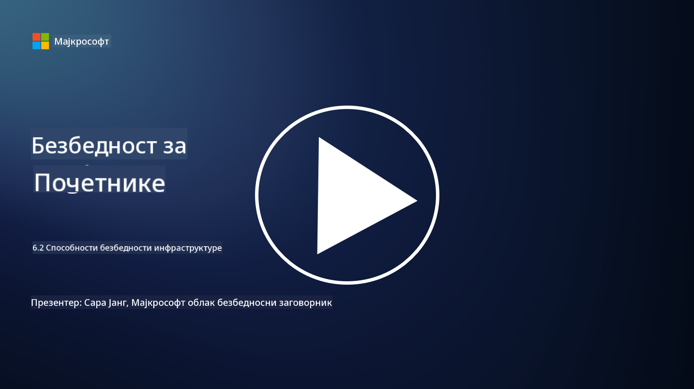

<!--
CO_OP_TRANSLATOR_METADATA:
{
  "original_hash": "7d79ba0e7668b3bdae1fba7aa047f6c0",
  "translation_date": "2025-09-04T00:16:24+00:00",
  "source_file": "6.2 Infrastructure security capabilities.md",
  "language_code": "sr"
}
-->
# Безбедносне могућности инфраструктуре

У овом одељку ћемо детаљније обрадити основне алате и могућности који се користе за безбедност инфраструктуре.

**Увод**

У овој лекцији ћемо обрадити:

- Шта је управљање рањивостима?

- Шта је CSPM?

- Шта је CNAPP?

## Шта је управљање рањивостима?

Управљање рањивостима је систематски процес идентификовања, процене, приоритизације, ублажавања и праћења рањивости у рачунарским системима, софтверу, мрежама и инфраструктури. Основни циљ управљања рањивостима је смањење изложености организације безбедносним ризицима кроз проактивно решавање познатих рањивости пре него што их злонамерни актери искористе. Ево прегледа кључних корака:

Идентификација: Скенирање и откривање рањивости у ресурсима организације, што може укључивати сервере, апликације, мрежне уређаје и крајње тачке.

Процена: Процена озбиљности и потенцијалног утицаја сваке рањивости на основу фактора као што су CVSS оцена и пословни контекст.

Приоритизација: Рангирање рањивости на основу њиховог нивоа ризика и потенцијалног утицаја на операције и податке организације.

Ублажавање: Развој и имплементација стратегија за решавање или ублажавање рањивости, што може укључивати примену закрпа, конфигурисање безбедносних подешавања или увођење компензационих мера.

Потврда: Потврђивање да су мере ублажавања биле ефикасне у решавању рањивости.

Континуирано праћење: Стално праћење рањивости и потенцијалних претњи, уз редовно скенирање и процене рањивости.

Управљање рањивостима је критичан део сајбер безбедности, помажући организацијама да одрже јаку безбедносну позицију и смање вероватноћу безбедносних инцидената. Примери алата за управљање рањивостима су Defender for Cloud, Nessus и Qualys.

## Шта је CSPM?

Cloud Security Posture Management (CSPM) је скуп алата, процеса и пракси осмишљених за процену, праћење и спровођење безбедносних конфигурација и најбољих пракси у облачним окружењима. CSPM решења помажу организацијама да идентификују и реше погрешне конфигурације, безбедносне празнине и кршења усклађености у њиховој облачној инфраструктури, као што су Amazon Web Services (AWS), Microsoft Azure, Google Cloud Platform (GCP) и други провајдери облака.

Кључни аспекти CSPM укључују:

- Процена конфигурације: Скенирање облачних ресурса и услуга ради идентификације погрешних конфигурација, несигурних подешавања и одступања од најбољих пракси у безбедности.

- Спровођење безбедносних политика: Спровођење безбедносних политика и стандарда усклађености у облачним окружењима кроз аутоматско решавање погрешних конфигурација или генерисање упозорења.

- Континуирано праћење: Обезбеђивање континуиране видљивости безбедносне позиције облачних ресурса, уз упозорења у реалном времену за безбедносне инциденте.

- Извештавање о усклађености: Генерисање извештаја и контролних табли за демонстрацију усклађености са регулаторним захтевима и индустријским стандардима.

CSPM помаже организацијама да осигурају да је њихова облачна инфраструктура безбедна, усклађена и у складу са најбољим праксама, смањујући ризик од безбедносних инцидената повезаних са облаком. Примери CSPM алата укључују Defender for Cloud и Snyk.

## Шта је CNAPP?

CNAPP означава Cloud-Native Application Protection Platform. То је све-у-једном софтверска платформа за облак која поједностављује праћење, откривање и реаговање на потенцијалне претње и рањивости у облаку. Она комбинује више алата и могућности у једно софтверско решење како би се смањила сложеност и олакшало функционисање тимова за DevOps и DevSecOps. CNAPP нуди свеобухватну безбедност облака и апликација кроз цео CI/CD животни циклус апликације, од развоја до продукције. Она одговара потребама индустрије за модерним алатима за праћење безбедности облака, управљање позицијом, превенцију кршења и контролу. CNAPP решења пружају тимовима за безбедност могућност да квантитативно процене и реагују на ризике у облачном окружењу. Неке од карактеристика CNAPP-а укључују побољшану видљивост, квантитативну процену ризика, безбедан развој софтвера и комбиновано решење за безбедност облака. CNAPP интегрише више решења за безбедност облака која су традиционално била раздвојена у један кориснички интерфејс, чинећи организацијама лакшим да заштите целокупан обим својих облачних апликација. CNAPP консолидује више алата за безбедност облака и извора података, укључујући скенирање контејнера, управљање безбедносном позицијом облака, скенирање инфраструктуре као кода, управљање правима облачне инфраструктуре и платформе за заштиту радних оптерећења у облаку.

## Додатно читање
- [What is CSPM? | Microsoft Security](https://www.microsoft.com/security/business/security-101/what-is-cspm?WT.mc_id=academic-96948-sayoung)
- [What is Cloud Security Posture Management (CSPM)? | HackerOne](https://www.hackerone.com/knowledge-center/what-cloud-security-posture-management)
- [Function of cloud security posture management - Cloud Adoption Framework | Microsoft Learn](https://learn.microsoft.com/azure/cloud-adoption-framework/organize/cloud-security-posture-management?WT.mc_id=academic-96948-sayoung)
- [What Is a CNAPP? | Microsoft Security](https://www.microsoft.com/security/business/security-101/what-is-cnapp?WT.mc_id=academic-96948-sayoung)
- [Why Everyone Is Talking About CNAPP (forbes.com)](https://www.forbes.com/sites/forbestechcouncil/2021/12/10/why-everyone-is-talking-about-cnapp/?sh=567275ca1549)
- [Improving Your Multi-Cloud Security with a Cloud-Native Application Protection Platform (CNAPP)](https://www.youtube.com/watch?v=5w42kQ_QjZg&t=212s)

---

**Одрицање од одговорности**:  
Овај документ је преведен коришћењем услуге за превођење помоћу вештачке интелигенције [Co-op Translator](https://github.com/Azure/co-op-translator). Иако се трудимо да превод буде тачан, молимо вас да имате у виду да аутоматизовани преводи могу садржати грешке или нетачности. Оригинални документ на његовом изворном језику треба сматрати меродавним извором. За критичне информације препоручује се професионални превод од стране људи. Не преузимамо одговорност за било каква погрешна тумачења или неспоразуме који могу настати услед коришћења овог превода.